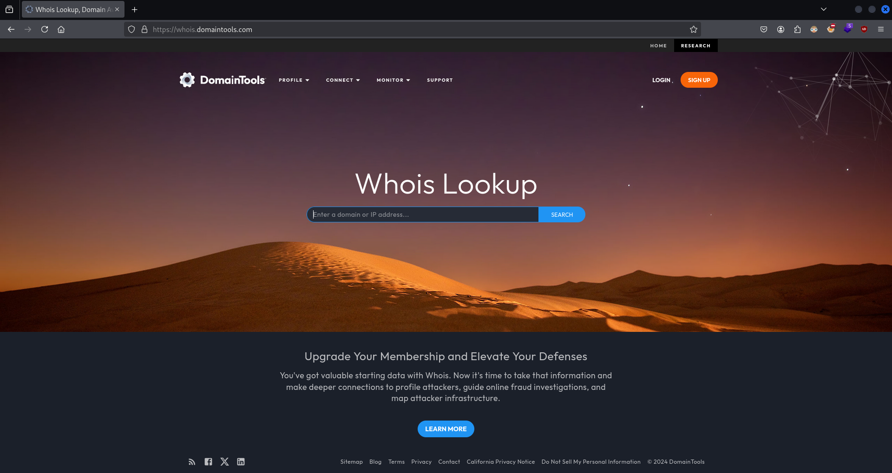
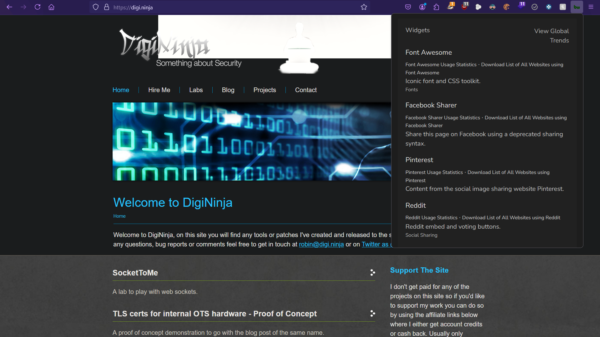

# Web Fingerprinting and Enumeration

Information gathering is the first step of any penetration test and is arguably the most important as all other phases rely on the information obtained about the target during the information gathering phase.

This course will introduce you to web enumeration and information gathering and will cover the process of performing both passive and active information gathering on websites and web applications by leveraging various tools and techniques to obtain as much information as possible from a target web application.

---

## Course Introduction

### Course Topic Overview

- Finding Website Ownership and IP Addresses
- Reviewing Webserver Metafiles for Information Leakage
- Search Engine Discovery
- Web App Fingerprinting
- Source Code Analysis
- Website Crawling and Spidering
- Web Server Fingerprinting
- DNS Enumeration
- Subdomain Enumeration
- Web App Vulnerability Scanning
- Automated Recon Frameworks (OWASP Amass)

### Prerequisites

- Basic familiarity with the Web (TCP/IP, UDP and HTTP)
- Familiarity with Windows and Linux

### Learning Objectives

- You will learn how to use the OWASP Web Security Testing Guide as a methodology for web app pentesting engagements.
- You will be able to perform passive web app information gathering.
- You will learn how to to perform passive and active DNS enumeration.
- You will learn how to detect web application firewalls (WAF).
- You will be able to utilize Google Dorks to find additional information on target websites/web applications.
- You will learn how to perform spidering and crawling to identify the content structure of websites.
- You will learn how to perform subdomain enumeration through publicly available sources and through subdomain brute-force attacks.
- You will learn how to perform file and directory enumeration.
- You will learn how to utilize automated recon frameworks like OWASP Amass.

---
---

## Finding Ownership and IP Addresses

### WHOIS

### Lab Solution

`whois ine.com`:
```

```

`host ine.com`:
```

```

https://whois.domaintools.com/



### Website Fingerprinting with Netcraft

### Lab Solution

Netcraft - Network


Netcraft - SSL/TLS (Protocol Version)


Netcraft - SSL/TLS (Hosting History)


Netcraft - SSL/TLS (Web Trackers)


Netcraft - SSL/TLS (Technology)


### Passive DNS Enumeration

### Lab Solution

`dnsrecon -d zonetransfer.me`:
```

```

DNSDumpster - DNS Servers


DNSDumpster - MX Records


DNSDumpster - A Records


DNSDumpster - Mapping the domain


---

## Reviewing Webserver Metafiles for Information Leakage

### Reviewing Webserver Metafiles

### Lab Solution

`curl http://ine.com/robots.txt`:
```

```

`curl http://ine.com/sitemap.xml`:
```

```

---

## Search Engine Discovery

###  Google Dorks

#### Lab Solution

`Operators`:
- `filetype`
- `inurl`
- `intitle`
- `intext`
- `site`
- `link`
- `cache`

*Examples*:
- `site:example.com`
- `site:*.example.com`
- `site:portal.example.com intitle:login`
- `site:example.com filetype:doc confidential`
- `site:*.edu filetype:pdf research`
- `cache:example.com filetype:pdf financial`
- `site:example.com intitle:'index of'`
- `inurl:admin.php`
- `inurl:db_backup.sql`
- `site:gov.* intitle:'index of' filetype:xls`
- `inurl:wp-config.php.bak`
- `site:*.org filetype:log error`
- `intitle:"Directory Listing" inurl:files`
- `site:*.gov filetype:xlsx budget`
- `inurl:ftp intitle:"index of"`

WayBack Machine


---

## Web App Fingerprinting

### Web App Technology Fingerprinting with BuiltWith/Wappalyzer/WhatWeb

#### Lab Solution

BuiltWith - Tech


Wappalyzer


`whatweb digi.ninja`:
```

```

`whatweb -v digi.ninja`:
```

```

### WAF Detection with WAFW00F

#### Lab Solution

`wafwoof -l`:
```

```

`wafwoof algoreducation.com`:
```

```

`wafwoof ine.com --findall`:
```

```

---

## Source Code Analysis

### Copying Websites with HTTRack

#### Lab Solution

`httrack`:
```

www.digi.ninja -O ./digi.ninja/

```

### Website Screenshots with EyeWitness

#### Lab Solution

`vim ./domains.txt`:
```
digi.ninja
```

`eyewitness --web -f ./domains.txt ./digi.ninja/`:
```

```

report


`tree ./digi.ninja/`:
```

```

---

## Website Crawling and Spidering

### Passive Crawling and Spidering with Burp Suite/OWASP ZAP

### Lab Solution

`ifconfig eth1`:
```

```

`sudo nmap -Pn -sSV -p80,443 ....3`:
```

```

`burpsuite` > `Target` > `Site map`


`burpsuite` > `Dashboard` > `New live task` > `Task Type: Live passive crawl`


`zaproxy` > `Sites: http://....3` > `Spider` = `Recurse: Enabled` > `Start Scan` > `Export` > `File Name: ~/zap_spidering.csv`


---

## Web Servers

### Web Server Fingerprinting with Nmap/Metasploit

#### Lab Solution

`ifconfig eth1`:
```

```

`sudo nmap -Pn -sSV -p80,443 ....3`:
```

```

`ls -al /usr/share/nmap/scripts | grep -E 'http|apache'`:
```

```

`sudo nmap -Pn -sSV --script=http-enum -p80 ....3`:
```

```

`curl -I ....3`:
```

```

`vim ./http-scanner.rc`:
```
use auxiliary/scanner/http/http_version
set PAYLOAD windows/meterpreter/reverse_tcp
set RHOSTS ...3
set RPORT 80
run
```

`msfconsole -r ./handler.rc`

---

## DNS Enumeration

### DNS Zone Transfers with DNSRecon/dnsenum/dnsdumpster/dig/Fierce

#### Lab Environment

**DNS: Zone Transfer Enabled**

<u>The target server as described below is running a DNS server. DNS zone transfer is enabled on the server</u>. You have to interact with this DNS server and answer the following questions.

**Note**: Please make sure to specify the target DNS server (`192.X.Y.3`) while making the DNS queries/requests. This server is NOT configured in the attacker machine. Hence, we need to specify it explicitly.

Questions:
1. How many A Records are present for `witrap.com` and its subdomains?
2. What is the IP address of machine which support LDAP over TCP on `witrap.com`?
3. Can you find the secret flag in `TXT` record of a subdomain of `witrap.com`?
4. What is the subdomain for which only reverse dns entry exists for `witrap.com`? `witrap.com` owns the ip address range: `192.168._._`.
5. How many records are present in reverse zone for `witrap.com` (excluding SOA)? `witrap.com` owns the ip address range: `192.168._._`.

Instructions: 
- This lab is dedicated to you! No other users are on this network :)
- Once you start the lab, you will have access to a root terminal of a Kali instance.
- Your Kali has an interface with IP address `192.X.Y.Z`. Run `ip addr` to know the values of X and Y.
- The target server should be located at the IP address `192.X.Y.3`.
- Do not attack the gateway located at IP address `192.X.Y.1`.
- `postgresql` is not running by default so Metasploit may give you an error about this when starting.

#### Lab Solution


`dnsrecon -d zonetransfer.me`:
```

```

`dnsenum zonetransfer.me`:
```

```

`dig axfr @nsztm1.digi.ninja`:
```

```

`fierce -dns zonetransfer.me`:
```

```

``:
```

```

``:
```

```

``:
```

```

---

## Subdomains

### Subdomain Enumeration with Sublist3r/Fierce

#### Lab Solution


`sublist3r -d ine.com`:
```

```

`sublist3r -d bbc.com -e google`:
```

```

`fierce -d ine.com --subdomain-file /usr/share/seclists/Discovery/DNS/fierce-hostlist.txt`:
```

```

`fierce -d bbc.com --subdomain-file /usr/share/seclists/Discovery/DNS/fierce-hostlist.txt`:
```

```

---

## Web Server Vulnerability Scanning

### Web Server Scanning with Nikto

#### Lab Solution

`ifconfig eth1`:
```

```

`sudo nmap -Pn -sSV -P80,443 ....3`:
```

```

`nikto -h http://....3`:
```


/etc/passwd ?
```

`nikto -h http://....3 -o ./nikto_output.html -Format html`:
```

```

---

## File and Directory Enumeration

### File and Directory Brute-Force

### Lab Solution

`ifconfig eth1`:
```

```

`sudo nmap -Pn -sSV -p80,443 ....3`:
```

```

`gobuster dir -u http://....3/ -w /usr/share/wordlists/dirb/common.txt`:
```

```

`gobuster dir -u http://....3/ -w /usr/share/wordlists/dirb/common.txt -b 403,404,500 -x .php,.txt,.xml -r`:
```

```

`gobuster dir -u http://....3/data/ -w /usr/share/wordlists/dirb/common.txt -b 403,404,500 -x .php,.txt,.xml -r`:
```

```

---

## Automated Recon Frameworks

### Automated Web Recon with OWASP Amass

### Lab Solution

`amass enum -d ine.com`:
```

```

`amass enum -d ine.com -passive -src -dir ./amass_enum_passive/`:
```

```

`amass enum -d ine.com -brute -src -ip -dir ./amass_enum_brute/`:
```

```

`amass intel -d ine.com -active -whois -dir ./amass_intel/`:
```

```

`amass viz -dir ./amass_... -gexf`:
```

```

report


---
---

## Tools and Frameworks

- [whois](https://github.com/rfc1036/whois)
	Intelligent WHOIS client.

- [DNSRecon](https://github.com/darkoperator/dnsrecon)
	DNSRecon is a Python port of a Ruby script that I wrote to learn the language and about DNS in early 2007. This time I wanted to learn about Python and extend the functionality of the original tool and in the process re-learn how DNS works and how could it be used in the process of a security assessment and network troubleshooting.
	This script provides the ability to perform:
	- Check all NS Records for Zone Transfers.
	- Enumerate General DNS Records for a given Domain (MX, SOA, NS, A, AAAA, SPF and TXT).
	- Perform common SRV Record Enumeration.
	- Top Level Domain (TLD) Expansion.
	- Check for Wildcard Resolution.
	- Brute Force subdomain and host A and AAAA records given a domain and a wordlist.
	- Perform a PTR Record lookup for a given IP Range or CIDR.
	- Check a DNS Server Cached records for A, AAAA and CNAME Records provided a list of host records in a text file to check.

- []()

- []()

- [BuiltWith](https://builtwith.com/)
	BuiltWith is a web site profiler tool. Upon looking up a page, BuiltWith returns a list all the technologies in use on that page that it can find.
	BuiltWith covers 108,425+ internet technologies which include analytics, advertising, hosting, CMS and many more. See how the internet technology usage changes on a weekly basis.

- [Wappalyzer](https://www.wappalyzer.com/)
	Identify technologies on websites.
	Find out the technology stack of any website. Create lists of websites that use certain technologies, with company and contact details. Use our tools for lead generation, market analysis and competitor research.

- [WhatWeb](https://github.com/urbanadventurer/WhatWeb)
	Next generation web scanner.
	WhatWeb identifies websites. Its goal is to answer the question, "What is that Website?". WhatWeb recognises web technologies including content management systems (CMS), blogging platforms, statistic/analytics packages, JavaScript libraries, web servers, and embedded devices. WhatWeb has over 1800 plugins, each to recognise something different. WhatWeb also identifies version numbers, email addresses, account IDs, web framework modules, SQL errors, and more.
	WhatWeb can be stealthy and fast, or thorough but slow. WhatWeb supports an aggression level to control the trade off between speed and reliability. When you visit a website in your browser, the transaction includes many hints of what web technologies are powering that website. Sometimes a single webpage visit contains enough information to identify a website but when it does not, WhatWeb can interrogate the website further. The default level of aggression, called 'stealthy', is the fastest and requires only one HTTP request of a website. This is suitable for scanning public websites. More aggressive modes were developed for use in penetration tests.
	Most WhatWeb plugins are thorough and recognise a range of cues from subtle to obvious. For example, most WordPress websites can be identified by the meta HTML tag, e.g. `<meta name="generator" content="WordPress X.Y.Z">`, but a minority of WordPress websites remove this identifying tag but this does not thwart WhatWeb. The WordPress WhatWeb plugin has over 15 tests, which include checking the favicon, default installation files, login pages, and checking for `/wp-content/` within relative links.

- [WAFW00F](https://github.com/EnableSecurity/wafw00f)
	WAFW00F allows one to identify and fingerprint Web Application Firewall (WAF) products protecting a website.
	To do its magic, WAFW00F does the following:
	- Sends a _normal_ HTTP request and analyses the response; this identifies a number of WAF solutions.
	- If that is not successful, it sends a number of (potentially malicious) HTTP requests and uses simple logic to deduce which WAF it is.
	- If that is also not successful, it analyses the responses previously returned and uses another simple algorithm to guess if a WAF or security solution is actively responding to our attacks.

- [HTTrack Website Copier](https://www.httrack.com/)
	HTTrack Website Copier, copy websites to your computer.
	_HTTrack_ is an _offline browser_ utility, allowing you to download a World Wide website from the Internet to a local directory, building recursively all directories, getting html, images, and other files from the server to your computer.
	_HTTrack_ arranges the original site's relative link-structure. Simply open a page of the "mirrored" website in your browser, and you can browse the site from link to link, as if you were viewing it online.

- [EyeWitness](https://github.com/RedSiege/EyeWitness)
	EyeWitness is designed to take screenshots of websites, provide some server header info, and identify default credentials if possible.

- [Burp Suite]()

- [OWASP ZAP]()

- [dnsenum](https://github.com/fwaeytens/dnsenum)
	dnsenum is a multithreaded perl script to enumerate DNS information of a domain and to discover non-contiguous IP blocks.

- [Sublist3r](https://github.com/aboul3la/Sublist3r)
	Fast subdomains enumeration tool for penetration testers.
	Sublist3r is a python tool designed to enumerate subdomains of websites using OSINT. It helps penetration testers and bug hunters collect and gather subdomains for the domain they are targeting. Sublist3r enumerates subdomains using many search engines such as Google, Yahoo, Bing, Baidu and Ask. Sublist3r also enumerates subdomains using Netcraft, Virustotal, ThreatCrowd, DNSdumpster and ReverseDNS. [subbrute](https://github.com/TheRook/subbrute) was integrated with Sublist3r to increase the possibility of finding more subdomains using bruteforce with an improved wordlist. The credit goes to TheRook who is the author of subbrute.

- [Fierce](https://github.com/mschwager/fierce)
	A DNS reconnaissance tool for locating non-contiguous IP space.
	Fierce is a semi-lightweight scanner that helps locate non-contiguous IP space and hostnames against specified domains. It's really meant as a pre-cursor to nmap, unicornscan, nessus, nikto, etc, since all of those require that you already know what IP space you are looking for. This does not perform exploitation and does not scan the whole internet indiscriminately. It is meant specifically to locate likely targets both inside and outside a corporate network. Because it uses DNS primarily you will often find mis-configured networks that leak internal address space. That's especially useful in targeted malware.

- [Nikto](https://github.com/sullo/nikto)
	Nikto web server scanner.
	Nikto is a free software command-line vulnerability scanner that scans web servers for dangerous files or CGIs, outdated server software and other problems.

- [Gobuster](https://github.com/OJ/gobuster)
	Directory/File, DNS and VHost busting tool written in Go.
	Gobuster is a tool used to brute-force:
	- URIs (directories and files) in web sites
	- DNS subdomains (with wildcard support)
	- Virtual Host names on target web servers
	- Open Amazon S3 buckets
	- Open Google Cloud buckets
	- TFTP servers.

- [OWASP Amass](https://github.com/owasp-amass/amass)
	In-depth attack surface mapping and asset discovery.
	The OWASP Amass Project performs network mapping of attack surfaces and external asset discovery using open source information gathering and active reconnaissance techniques.

---

## Resources and References

- [Whois Lookup](https://whois.domaintools.com/)
- [Netcraft](https://www.netcraft.com/)
- [DNSDumpster](https://dnsdumpster.com/)
- [Google Hacking Database (GHDB)](https://www.exploit-db.com/google-hacking-database)
- [Wayback Machine](https://web.archive.org/)

---
---
