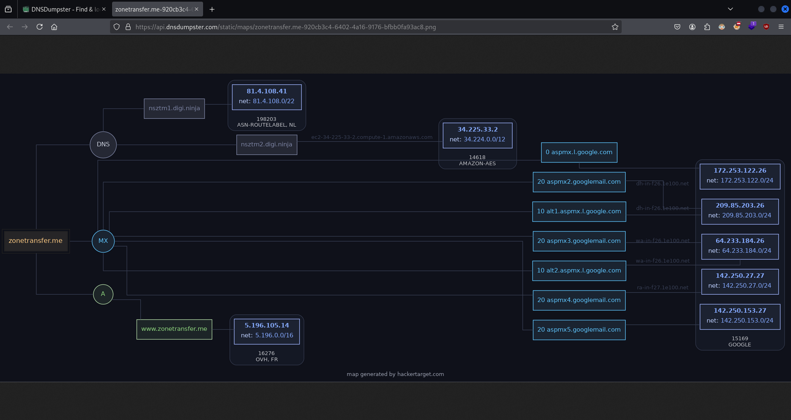

# Web Fingerprinting and Enumeration

Information gathering is the first step of any penetration test and is arguably the most important as all other phases rely on the information obtained about the target during the information gathering phase.

This course will introduce you to web enumeration and information gathering and will cover the process of performing both passive and active information gathering on websites and web applications by leveraging various tools and techniques to obtain as much information as possible from a target web application.

---

## Course Introduction

### Course Topic Overview

- Finding Ownership and IP Addresses (with WHOIS, Netcraft)
- Reviewing Webserver Metafiles for Information Leakage (Manual)
- Search Engine Discovery (with Google Dorks)
- Web App Fingerprinting: Web App Technology Fingerprinting (with BuiltWith/Wappalyzer/WhatWeb)
- Web App Fingerprinting: WAF Detection (with WAFW00F)
- Source Code Analysis: Copying Websites (with HTTRack)
- Source Code Analysis: Website Screenshots (with EyeWitness)
- Passive Crawling and Spidering (with Burp Suite/OWASP ZAP)
- Web Server Fingerprinting (with Nmap/Metasploit)
- DNS Enumeration (with DNSRecon/dnsenum/DiG/Fierce)
- Subdomain Enumeration (with Sublist3r/Fierce)
- Web Server Vulnerability Scanning (with Nikto)
- File and Directory Brute-Force (with Gobuster)
- Automated Web Reconnaissance (with OWASP Amass)

### Prerequisites

- Basic familiarity with the Web (TCP/IP, UDP and HTTP)
- Familiarity with Windows and Linux

### Learning Objectives

- You will learn how to use the OWASP Web Security Testing Guide as a methodology for web app pentesting engagements.
- You will be able to perform passive web app information gathering.
- You will learn how to to perform passive and active DNS enumeration.
- You will learn how to detect web application firewalls (WAF).
- You will be able to utilize Google Dorks to find additional information on target websites/web applications.
- You will learn how to perform spidering and crawling to identify the content structure of websites.
- You will learn how to perform subdomain enumeration through publicly available sources and through subdomain brute-force attacks.
- You will learn how to perform file and directory enumeration.
- You will learn how to utilize automated recon frameworks like OWASP Amass.

---
---

## Finding Ownership and IP Addresses

### Ownership and IP Addresses Discovery (with WHOIS)

### Lab Solution

`whois ine.com`:
```
   Domain Name: INE.COM
   Registry Domain ID: 361817_DOMAIN_COM-VRSN
   Registrar WHOIS Server: whois.godaddy.com
   Registrar URL: http://www.godaddy.com📌
   Updated Date: 2022-09-05T08:00:23Z
   Creation Date: 1995-03-27T05:00:00Z📌
   Registry Expiry Date: 2029-03-28T04:00:00Z
   Registrar: GoDaddy.com, LLC📌
   Registrar IANA ID: 146
   Registrar Abuse Contact Email: abuse@godaddy.com
   Registrar Abuse Contact Phone: 480-624-2505
   Domain Status: clientDeleteProhibited https://icann.org/epp#clientDeleteProhibited
   Domain Status: clientRenewProhibited https://icann.org/epp#clientRenewProhibited
   Domain Status: clientTransferProhibited https://icann.org/epp#clientTransferProhibited
   Domain Status: clientUpdateProhibited https://icann.org/epp#clientUpdateProhibited
   Name Server: NS-1155.AWSDNS-16.ORG
   Name Server: NS-1652.AWSDNS-14.CO.UK
   Name Server: NS-275.AWSDNS-34.COM
   Name Server: NS-950.AWSDNS-54.NET
   DNSSEC: unsigned
   URL of the ICANN Whois Inaccuracy Complaint Form: https://www.icann.org/wicf/

[...]
```

`host ine.com`:
```
ine.com has address 76.76.21.21📌
ine.com mail is handled by 5 alt1.aspmx.l.google.com.
ine.com mail is handled by 10 alt4.aspmx.l.google.com.
ine.com mail is handled by 1 aspmx.l.google.com.
ine.com mail is handled by 10 alt3.aspmx.l.google.com.
ine.com mail is handled by 5 alt2.aspmx.l.google.com.
```

`whois 76.76.21.21`:
```
#
# ARIN WHOIS data and services are subject to the Terms of Use
# available at: https://www.arin.net/resources/registry/whois/tou/
#
# If you see inaccuracies in the results, please report at
# https://www.arin.net/resources/registry/whois/inaccuracy_reporting/
#
# Copyright 1997-2024, American Registry for Internet Numbers, Ltd.
#


NetRange:       76.76.21.0 - 76.76.21.255
CIDR:           76.76.21.0/24
NetName:        VERCEL-01
NetHandle:      NET-76-76-21-0-1
Parent:         NET76 (NET-76-0-0-0-0)
NetType:        Direct Allocation
OriginAS:       
Organization:   Vercel, Inc (ZEITI)
RegDate:        2020-05-08
Updated:        2020-06-05
Comment:        -----BEGIN CERTIFICATE-----MIIDmzCCAoOgAwIBAgIUYqxVc6t5udbMz0Ys6xC4VTX4NDgwDQYJKoZIhvcNAQELBQAwXTELMAkGA1UEBhMCVVMxCzAJBgNVBAgMAkNBMQ8wDQYDVQQHDAZXYWxudXQxEzARBgNVBAoMClZlcmNlbCBJbmMxGzAZBgkqhkiG9w0BCQEWDG1AdmVyY2VsLmNvbTAeFw0yMDA1MTExMzIxMDJaFw0yMjA1MTExMzIxMDJaMF0xCzAJBgNVBAYTAlVTMQswCQYDVQQIDAJDQTEPMA0GA1UEBwwGV2FsbnV0MRMwEQYDVQQKDApWZXJjZWwgSW5jMRswGQYJKoZIhvcNAQkBFgxtQHZlcmNlbC5jb20wggEiMA0GCSqGSIb3DQEBAQUAA4IBDwAwggEKAoIBAQDGZNRvQYOIYbBJHiZAs3VUPlT9OxU3S+zg5gFgEogAM5sCuQC+jOAfTY/RLgy9RFyfqeqrAtggW7AcSxVbywKaoPUrSeO0leksfVIWnUUpvuZvZJeoArlzrw7CjZ2AZirHkbgZpkpoPDOyR6D9nt5pY1uWiP2CF1vV2XIX7lJEwrzgu1Ki0O4a9UXRCHx818OHEJzF9OJfg5iwGuHmSwAQ0tVfOtvHCKMuFRb6wQzzdcI+4GmKIkfYKSQsTEAndDXcI8nDVEJ3lEt1mFA0x/vrFm5u4fzos9nogPGLaoQ1cUqnwFcoTckM0ic2GAuEUUnhLLr3kC+remuVMGN1HuZ/AgMBAAGjUzBRMB0GA1UdDgQWBBS8RvrS4Dyk7FAMmz+ldKyIPsITGzAfBgNVHSMEGDAWgBS8RvrS4Dyk7FAMmz+ldKyIPsITGzAPBgNVHRMBAf8EBTADAQH/MA0GCSqGSIb3DQEBCwUAA4IBAQC5JPZscR5+q3YMgwLsjCAFY/AbUDJvavT3oy8fyO597Xa9fzBJFXY6qG7b+KYQ8TfEgNGY/AUNU3+h8YG5VyRgaIzC0FANQc2EpxnmBBW+grvLIn+BlKAaFH2LvpG+hc8fUUgGicCKUvKxCyuRZMYxzpnTn4A6PzojbALdVAG1CuicfYvD91yvsBzDimniUehSG7dyWJklwsssT6sHFjqOv/1PLej2NWcE92M1Il27IZwZfOV8urG6yd6FZlGBG+8KZP8IEsMf6OropTRKlikHSvKzsOhAnmE/1J45HDjVFNeco+bZW5iOZiHu2Ov1FMTENrMe0xgjPjI7Ri2rdcU8-----END CERTIFICATE-----
Ref:            https://rdap.arin.net/registry/ip/76.76.21.0


OrgName:        Vercel, Inc
OrgId:          ZEITI
Address:        340 S LEMON AVE #4133
City:           Walnut
StateProv:      CA
PostalCode:     91789
Country:        US
RegDate:        2020-03-26
Updated:        2024-11-25
Comment:        https://vercel.com
Ref:            https://rdap.arin.net/registry/entity/ZEITI

[...]
```


### Website Fingerprinting (with Netcraft)

### Lab Solution


### Passive DNS Enumeration (with DNSRecon/DNSDumpster)

### Lab Solution

`dnsrecon --domain zonetransfer.me`:
```
[*] std: Performing General Enumeration against: zonetransfer.me...
[-] DNSSEC is not configured for zonetransfer.me
[*]      SOA nsztm1.digi.ninja 81.4.108.41
[*]      NS nsztm1.digi.ninja 81.4.108.41📌
[*]      Bind Version for 81.4.108.41 secret"
[*]      NS nsztm2.digi.ninja 34.225.33.2📌
[*]      Bind Version for 34.225.33.2 you"
[*]      MX ASPMX2.GOOGLEMAIL.COM 142.250.153.27
[*]      MX ASPMX5.GOOGLEMAIL.COM 74.125.200.26
[*]      MX ALT2.ASPMX.L.GOOGLE.COM 142.251.9.26
[*]      MX ASPMX.L.GOOGLE.COM 108.177.15.26
[*]      MX ASPMX3.GOOGLEMAIL.COM 142.251.9.27
[*]      MX ASPMX4.GOOGLEMAIL.COM 142.250.150.26
[*]      MX ALT1.ASPMX.L.GOOGLE.COM 142.250.153.27
[*]      MX ASPMX2.GOOGLEMAIL.COM 2a00:1450:4013:c16::1a
[*]      MX ASPMX5.GOOGLEMAIL.COM 2404:6800:4003:c00::1a
[*]      MX ALT2.ASPMX.L.GOOGLE.COM 2a00:1450:4025:c03::1b
[*]      MX ASPMX.L.GOOGLE.COM 2a00:1450:400c:c1f::1b
[*]      MX ASPMX3.GOOGLEMAIL.COM 2a00:1450:4025:c03::1b
[*]      MX ASPMX4.GOOGLEMAIL.COM 2a00:1450:4010:c1c::1a
[*]      MX ALT1.ASPMX.L.GOOGLE.COM 2a00:1450:4013:c16::1b
[*]      A zonetransfer.me 5.196.105.14
[*]      TXT zonetransfer.me google-site-verification=tyP28J7JAUHA9fw2sHXMgcCC0I6XBmmoVi04VlMewxA
[*] Enumerating SRV Records
[+]      SRV _sip._tcp.zonetransfer.me www.zonetransfer.me 5.196.105.14 5060
[+] 1 Records Found
```




---

## Reviewing Webserver Metafiles for Information Leakage

### Reviewing Webserver Metafiles (Manual)

### Lab Solution

`curl -L http://ine.com/robots.txt`:
```
User-agent: *
Disallow: /admin
Disallow: /cart
Disallow: /orders
Disallow: /checkouts/
Disallow: /checkout
Disallow: /17217507/checkouts
Disallow: /17217507/orders
Disallow: /carts
Disallow: /account
Disallow: /collections/*sort_by*
Disallow: /*/collections/*sort_by*
Disallow: /collections/*+*
Disallow: /collections/*%2B*
Disallow: /collections/*%2b*
Disallow: /*/collections/*+*
Disallow: /*/collections/*%2B*
Disallow: /*/collections/*%2b*
Disallow: /blogs/*+*
Disallow: /blogs/*%2B*
Disallow: /blogs/*%2b*
Disallow: /*/blogs/*+*
Disallow: /*/blogs/*%2B*
Disallow: /*/blogs/*%2b*
Disallow: /*?*oseid=*
Disallow: /*preview_theme_id*
Disallow: /*preview_script_id*
Disallow: /policies/
Disallow: /*/*?*ls=*&amp;ls=*
Disallow: /*/*?*ls%3D*%3Fls%3D*
Disallow: /*/*?*ls%3d*%3fls%3d*
Disallow: /search
Disallow: /apple-app-site-association
Sitemap: https://ine.com/sitemap.xml📌

# Google adsbot ignores robots.txt unless specifically named!
User-agent: adsbot-google
Disallow: /checkouts/
Disallow: /checkout
Disallow: /carts
Disallow: /orders
Disallow: /17217507/checkouts
Disallow: /17217507/orders
Disallow: /*?*oseid=*
Disallow: /*preview_theme_id*
Disallow: /*preview_script_id*

User-agent: Nutch
Disallow: /

[...]
```

`curl https://ine.com/sitemap.xml`:
```xml
<?xml version="1.0" encoding="UTF-8"?>
<urlset xmlns="http://www.sitemaps.org/schemas/sitemap/0.9" xmlns:news="http://www.google.com/schemas/sitemap-news/0.9" xmlns:xhtml="http://www.w3.org/1999/xhtml" xmlns:mobile="http://www.google.com/schemas/sitemap-mobile/1.0" xmlns:image="http://www.google.com/schemas/sitemap-image/1.1" xmlns:video="http://www.google.com/schemas/sitemap-video/1.1">
<url><loc>https://ine.com</loc><changefreq>daily</changefreq><priority>0.7</priority><lastmod>2024-12-05T19:43:44.264Z</lastmod></url>
<url><loc>https://ine.com/500</loc><changefreq>daily</changefreq><priority>0.7</priority><lastmod>2024-12-05T19:43:44.264Z</lastmod></url>
<url><loc>https://ine.com/about-us</loc><changefreq>daily</changefreq><priority>0.7</priority><lastmod>2024-12-05T19:43:44.264Z</lastmod></url>
<url><loc>https://ine.com/about-us/components/ArticlesSection</loc><changefreq>daily</changefreq><priority>0.7</priority><lastmod>2024-12-05T19:43:44.264Z</lastmod></url>
<url><loc>https://ine.com/about-us/components/CompanyNumbers</loc><changefreq>daily</changefreq><priority>0.7</priority><lastmod>2024-12-05T19:43:44.264Z</lastmod></url>
<url><loc>https://ine.com/about-us/components/Hero</loc><changefreq>daily</changefreq><priority>0.7</priority><lastmod>2024-12-05T19:43:44.264Z</lastmod></url>
<url><loc>https://ine.com/about-us/components/InterestedBanner</loc><changefreq>daily</changefreq><priority>0.7</priority><lastmod>2024-12-05T19:43:44.264Z</lastmod></url>
<url><loc>https://ine.com/about-us/components/MissionValues</loc><changefreq>daily</changefreq><priority>0.7</priority><lastmod>2024-12-05T19:43:44.264Z</lastmod></url>
<url><loc>https://ine.com/about-us/components/WallOfFame</loc><changefreq>daily</changefreq><priority>0.7</priority><lastmod>2024-12-05T19:43:44.264Z</lastmod></url>
<url><loc>https://ine.com/by-industry/components/Certifying</loc><changefreq>daily</changefreq><priority>0.7</priority><lastmod>2024-12-05T19:43:44.264Z</lastmod></url>
<url><loc>https://ine.com/by-industry/components/DemoForm</loc><changefreq>daily</changefreq><priority>0.7</priority><lastmod>2024-12-05T19:43:44.264Z</lastmod></url>
<url><loc>https://ine.com/by-industry/components/Hero</loc><changefreq>daily</changefreq><priority>0.7</priority><lastmod>2024-12-05T19:43:44.264Z</lastmod></url>
<url><loc>https://ine.com/by-industry/components/InfoBanner</loc><changefreq>daily</changefreq><priority>0.7</priority><lastmod>2024-12-05T19:43:44.264Z</lastmod></url>
<url><loc>https://ine.com/by-industry/components/Security</loc><changefreq>daily</changefreq><priority>0.7</priority><lastmod>2024-12-05T19:43:44.264Z</lastmod></url>

[...]
```

---

## Search Engine Discovery (with Google Dorks)

### Google Dorks

#### Lab Solution

`Operators`:
- `filetype`
- `inurl`
- `intitle`
- `intext`
- `site`
- `link`
- `cache`

*Examples*:
- `site:example.com`
- `site:*.example.com`
- `site:portal.example.com intitle:login`
- `site:example.com filetype:doc confidential`
- `site:*.edu filetype:pdf research`
- `cache:example.com filetype:pdf financial`
- `site:example.com intitle:'index of'`
- `inurl:admin.php`
- `inurl:db_backup.sql`
- `site:gov.* intitle:'index of' filetype:xls`
- `inurl:wp-config.php.bak`
- `site:*.org filetype:log error`
- `intitle:"Directory Listing" inurl:files`
- `site:*.gov filetype:xlsx budget`
- `inurl:ftp intitle:"index of"`


---

## Web App Fingerprinting

### Web App Technology Fingerprinting (with BuiltWith/Wappalyzer/WhatWeb)

#### Lab Solution


`whatweb digi.ninja`:
```
http://digi.ninja [301 Moved Permanently] Apache, Country[GERMANY][DE], HTTPServer[Apache]📌, IP[5.196.105.14], RedirectLocation[https://digi.ninja/], Title[301 Moved Permanently], UncommonHeaders[do_not_hack_me], X-Powered-By[Sparkles]

https://digi.ninja/ [200 OK] Apache, Country[GERMANY][DE], Email[robin@digi.ninj,robin@digi.ninja], HTTPServer[Apache], IP[5.196.105.14], Meta-Author[Robin Wood - DigiNinja], Open-Graph-Protocol[website], Script[text/javascript], Strict-Transport-Security[max-age=63072000], Title[DigiNinja - DigiNinja], UncommonHeaders[do_not_hack_me,permissions-policy,upgrade,x-content-type-options,x-xss,referrer-policy,expect-ct,content-security-policy], X-Frame-Options[DENY], X-Powered-By[Rainbows and XSS<script>alert(1)</script>]
```

`whatweb -v digi.ninja`:
```
WhatWeb report for http://digi.ninja
Status    : 301 Moved Permanently
Title     : 301 Moved Permanently
IP        : 5.196.105.14
Country   : GERMANY, DE

Summary   : Apache, HTTPServer[Apache], RedirectLocation[https://digi.ninja/], UncommonHeaders[do_not_hack_me], X-Powered-By[Sparkles]

Detected Plugins:
[ Apache ]📌
        The Apache HTTP Server Project is an effort to develop and 
        maintain an open-source HTTP server for modern operating 
        systems including UNIX and Windows NT. The goal of this 
        project is to provide a secure, efficient and extensible 
        server that provides HTTP services in sync with the current 
        HTTP standards. 

        Google Dorks: (3)
        Website     : http://httpd.apache.org/

[ HTTPServer ]
        HTTP server header string. This plugin also attempts to 
        identify the operating system from the server header. 

        String       : Apache (from server string)

[ RedirectLocation ]
        HTTP Server string location. used with http-status 301 and 
        302 

        String       : https://digi.ninja/ (from location)

[ UncommonHeaders ]
        Uncommon HTTP server headers. The blacklist includes all 
        the standard headers and many non standard but common ones. 
        Interesting but fairly common headers should have their own 
        plugins, eg. x-powered-by, server and x-aspnet-version. 
        Info about headers can be found at www.http-stats.com 

        String       : do_not_hack_me (from headers)

[ X-Powered-By ]
        X-Powered-By HTTP header 

        String       : Sparkles (from x-powered-by string)

HTTP Headers:
        HTTP/1.1 301 Moved Permanently
        Date: Fri, 06 Dec 2024 14:52:59 GMT
        Server: Apache
        X-Powered-By: Sparkles
        Do_not_hack_me: Please
        Location: https://digi.ninja/
        Content-Length: 227
        Connection: close
        Content-Type: text/html; charset=iso-8859-1

[...]
```

### WAF Detection (with WAFW00F)

#### Lab Solution

`wafw00f -l`:
```
                   ______
                  /      \
                 (  Woof! )
                  \  ____/                      )
                  ,,                           ) (_
             .-. -    _______                 ( |__|
            ()``; |==|_______)                .)|__|
            / ('        /|\                  (  |__|
        (  /  )        / | \                  . |__|
         \(_)_))      /  |  \                   |__|

                    ~ WAFW00F : v2.2.0 ~
    The Web Application Firewall Fingerprinting Toolkit
    
[+] Can test for these WAFs:

  WAF Name                        Manufacturer
  --------                        ------------

  ACE XML Gateway                  Cisco                            
  aeSecure                         aeSecure                         
  AireeCDN                         Airee                            
  Airlock                          Phion/Ergon                      
  Alert Logic                      Alert Logic                      
  AliYunDun                        Alibaba Cloud Computing          
  Anquanbao                        Anquanbao                        
  AnYu                             AnYu Technologies                
  Approach                         Approach                         
  AppWall                          Radware                          
  Armor Defense                    Armor                            
  ArvanCloud                       ArvanCloud                       
  ASP.NET Generic                  Microsoft                        
  ASPA Firewall                    ASPA Engineering Co.             
  Astra                            Czar Securities                  
  AWS Elastic Load Balancer        Amazon                           
  AzionCDN                         AzionCDN                         
  Azure Front Door                 Microsoft                        
  Barikode                         Ethic Ninja                      
  Barracuda                        Barracuda Networks               
  Bekchy                           Faydata Technologies Inc.        
  Beluga CDN                       Beluga                           
  BIG-IP Local Traffic Manager     F5 Networks                      
  BinarySec                        BinarySec                        
  BitNinja                         BitNinja                         
  BlockDoS                         BlockDoS                         
  Bluedon                          Bluedon IST                      
  BulletProof Security Pro         AITpro Security                  
  CacheWall                        Varnish                          
  CacheFly CDN                     CacheFly                         
  Comodo cWatch                    Comodo CyberSecurity

[...]
```

`wafw00f ine.com --findall`:
```
                ______
               /      \
              (  W00f! )
               \  ____/
               ,,    __            404 Hack Not Found
           |`-.__   / /                      __     __
           /"  _/  /_/                       \ \   / /
          *===*    /                          \ \_/ /  405 Not Allowed
         /     )__//                           \   /
    /|  /     /---`                        403 Forbidden
    \\/`   \ |                                 / _ \
    `\    /_\\_              502 Bad Gateway  / / \ \  500 Internal Error
      `_____``-`                             /_/   \_\

                        ~ WAFW00F : v2.2.0 ~
        The Web Application Firewall Fingerprinting Toolkit
    
[*] Checking https://ine.com
[+] Generic Detection results:
[-] No WAF detected by the generic detection
[~] Number of requests: 7
```

---

## Source Code Analysis

### Copying Websites (with HTTRack)

#### Lab Solution

`httrack`:
```
Welcome to HTTrack Website Copier (Offline Browser) 3.49-5
Copyright (C) 1998-2017 Xavier Roche and other contributors
To see the option list, enter a blank line or try httrack --help

Enter project name :digi.ninja📌

Base path (return=/home/kali/websites/) :📌

Enter URLs (separated by commas or blank spaces) :www.digi.ninja📌

Action:
(enter) 1       Mirror Web Site(s)📌
        2       Mirror Web Site(s) with Wizard
        3       Just Get Files Indicated
        4       Mirror ALL links in URLs (Multiple Mirror)
        5       Test Links In URLs (Bookmark Test)
        0       Quit
: 1

Proxy (return=none) :

You can define wildcards, like: -*.gif +www.*.com/*.zip -*img_*.zip
Wildcards (return=none) :

You can define additional options, such as recurse level (-r<number>), separated by blank spaces
To see the option list, type help
Additional options (return=none) :

---> Wizard command line: httrack www.digi.ninja  -O "/home/kali/websites/digi.ninja"  -%v📌

Ready to launch the mirror? (Y/n) :Y

Mirror launched on Fri, 06 Dec 2024 16:07:20 by HTTrack Website Copier/3.49-5 [XR&CO'2014]
mirroring www.digi.ninja with the wizard help..
Done.
Thanks for using HTTrack!
* 
```

`tree ./websites/digi.ninja`:
```
./websites/digi.ninja
├── backblue.gif
├── fade.gif
├── hts-cache
│   ├── doit.log
│   ├── new.lst
│   ├── new.txt
│   └── new.zip
├── hts-log.txt
├── index.html
└── www.digi.ninja
    └── index.html

3 directories, 9 files
```

### Website Screenshots (with EyeWitness)

#### Lab Solution

`vim ./domains.txt`:
```
digi.ninja
```

`eyewitness --web -f ./domains.txt -d ./digi.ninja`:
```
################################################################################
#                                  EyeWitness                                  #
################################################################################
#           Red Siege Information Security - https://www.redsiege.com           #
################################################################################

Starting Web Requests (1 Hosts)
Attempting to screenshot http://digi.ninja
Finished in 9.781797170639038 seconds

[*] Done! Report written in the /home/kali/./digi.ninja folder!
```

`tree ./digi.ninja`:
```
./digi.ninja
├── ew.db
├── jquery-1.11.3.min.js
├── open_ports.csv
├── report.html📌
├── Requests.csv
├── screens
│   └── http.digi.ninja.png
├── source
│   └── http.digi.ninja.txt
└── style.css

3 directories, 8 files
```


---

## Website Crawling and Spidering

### Passive Crawling and Spidering (with Burp Suite/OWASP ZAP)

#### Lab Solution

`ifconfig eth1`:
```
eth1: flags=4163<UP,BROADCAST,RUNNING,MULTICAST>  mtu 1500
        inet 192.147.22.2📌 netmask 255.255.255.0  broadcast 192.147.22.255
        ether 02:42:c0:93:16:02  txqueuelen 0  (Ethernet)
        RX packets 16  bytes 1376 (1.3 KiB)
        RX errors 0  dropped 0  overruns 0  frame 0
        TX packets 0  bytes 0 (0.0 B)
        TX errors 0  dropped 0 overruns 0  carrier 0  collisions 0
```

`sudo nmap -Pn -sSV -p80,443 192.147.22.3`:
```
Starting Nmap 7.94SVN ( https://nmap.org ) at 2024-12-07 16:24 IST
Nmap scan report for demo.ine.local (192.147.22.3)
Host is up (0.000064s latency).

PORT    STATE  SERVICE VERSION
80/tcp  open   http    Apache httpd 2.4.7 ((Ubuntu))📌
443/tcp closed https
MAC Address: 02:42:C0:93:16:03 (Unknown)

Service detection performed. Please report any incorrect results at https://nmap.org/submit/ .
Nmap done: 1 IP address (1 host up) scanned in 6.43 seconds
```

`burpsuite` > `Target` > `Site map`


`burpsuite` > `Dashboard` > `New live task` > `Task Type: Live passive crawl`


`zaproxy` > `Sites: http://192.147.22.3` > `Spider` = `Recurse: Enabled` > `Start Scan` > `Export` > `File Name: ~/zap_spidering.csv`


`cat ~/zap_spidering.csv`:
```
Processed,Method,URI,Flags
true,GET,http://192.147.22.3,Seed
true,GET,http://192.147.22.3/robots.txt,Seed
true,GET,http://192.147.22.3/sitemap.xml,Seed
true,GET,http://192.147.22.3/,Seed
true,GET,http://192.147.22.3/images,Seed
true,GET,http://192.147.22.3/javascript,Seed
true,GET,http://192.147.22.3/javascript/bookmark-site.js,Seed
true,GET,http://192.147.22.3/javascript/ddsmoothmenu,Seed
true,GET,http://192.147.22.3/javascript/ddsmoothmenu/ddsmoothmenu.js,Seed

[...]
```

---

## Web Servers

### Web Server Fingerprinting (with Nmap/Metasploit)

#### Lab Solution

`ifconfig eth1`:
```
eth1: flags=4163<UP,BROADCAST,RUNNING,MULTICAST>  mtu 1500
        inet 192.141.60.2📌 netmask 255.255.255.0  broadcast 192.141.60.255
        ether 02:42:c0:8d:3c:02  txqueuelen 0  (Ethernet)
        RX packets 15  bytes 1306 (1.2 KiB)
        RX errors 0  dropped 0  overruns 0  frame 0
        TX packets 0  bytes 0 (0.0 B)
        TX errors 0  dropped 0 overruns 0  carrier 0  collisions 0
```

`sudo nmap -Pn -sSV -p80,443 192.141.60.3`:
```
Starting Nmap 7.94SVN ( https://nmap.org ) at 2024-12-07 16:38 IST
Nmap scan report for demo.ine.local (192.141.60.3)
Host is up (0.000077s latency).

PORT    STATE  SERVICE VERSION
80/tcp  open   http    Apache httpd 2.4.18 ((Ubuntu))📌
443/tcp closed https
MAC Address: 02:42:C0:8D:3C:03 (Unknown)

Service detection performed. Please report any incorrect results at https://nmap.org/submit/ .
Nmap done: 1 IP address (1 host up) scanned in 6.45 seconds
```

`ls -al /usr/share/nmap/scripts | grep -E 'http|apache'`:
```
-rw-r--r-- 1 root root  2153 Jun 20 23:57 http-adobe-coldfusion-apsa1301.nse
-rw-r--r-- 1 root root  5149 Jun 20 23:57 http-affiliate-id.nse
-rw-r--r-- 1 root root  1950 Jun 20 23:57 http-apache-negotiation.nse
-rw-r--r-- 1 root root  4499 Jun 20 23:57 http-apache-server-status.nse
-rw-r--r-- 1 root root  1805 Jun 20 23:57 http-aspnet-debug.nse
-rw-r--r-- 1 root root  3959 Jun 20 23:57 http-auth-finder.nse
-rw-r--r-- 1 root root  3187 Jun 20 23:57 http-auth.nse
-rw-r--r-- 1 root root  2865 Jun 20 23:57 http-avaya-ipoffice-users.nse
-rw-r--r-- 1 root root  4372 Jun 20 23:57 http-awstatstotals-exec.nse
-rw-r--r-- 1 root root  6872 Jun 20 23:57 http-axis2-dir-traversal.nse

[...]
```

`sudo nmap -Pn -sSV --script=http-enum -p80 192.141.60.3`:
```
Starting Nmap 7.94SVN ( https://nmap.org ) at 2024-12-07 16:39 IST
Nmap scan report for demo.ine.local (192.141.60.3)
Host is up (0.000046s latency).

PORT   STATE SERVICE VERSION
80/tcp open  http    Apache httpd 2.4.18 ((Ubuntu))
|_http-server-header: Apache/2.4.18 (Ubuntu)📌
| http-enum: 
|   /robots.txt: Robots file🔍
|   /data/: Potentially interesting directory w/ listing on 'apache/2.4.18 (ubuntu)'
|   /dir/: Potentially interesting directory w/ listing on 'apache/2.4.18 (ubuntu)'
|_  /src/: Potentially interesting directory w/ listing on 'apache/2.4.18 (ubuntu)'
MAC Address: 02:42:C0:8D:3C:03 (Unknown)

Service detection performed. Please report any incorrect results at https://nmap.org/submit/ .
Nmap done: 1 IP address (1 host up) scanned in 7.15 seconds
```

`curl -I 192.141.60.3`:
```
HTTP/1.1 200 OK
Date: Sat, 07 Dec 2024 11:10:29 GMT
Server: Apache/2.4.18 (Ubuntu)📌
Last-Modified: Sat, 24 Nov 2018 06:09:42 GMT
ETag: "2c39-57b62f2149580"
Accept-Ranges: bytes
Content-Length: 11321
Vary: Accept-Encoding
Content-Type: text/html
```

`vim ./http_scanner.rc`:
```
use auxiliary/scanner/http/http_version
set RHOSTS 192.141.60.3
set RPORT 80
run
```

`msfconsole -r ./handler.rc`:
```
[*] Processing ./http_scanner.rc for ERB directives.
resource (./http_scanner.rc)> use auxiliary/scanner/http/http_version
resource (./http_scanner.rc)> set RHOSTS 192.141.60.3
RHOSTS => 192.141.60.3
resource (./http_scanner.rc)> set RPORT 80
RPORT => 80
resource (./http_scanner.rc)> run
[+] 192.141.60.3:80 Apache/2.4.18 (Ubuntu)📌
[*] Scanned 1 of 1 hosts (100% complete)
[*] Auxiliary module execution completed
```

---

## DNS Enumeration

### DNS Zone Transfers (with DNSRecon/dnsenum/DiG/Fierce)

#### Lab Environment

**DNS: Zone Transfer Enabled**

<u>The target server as described below is running a DNS server. DNS zone transfer is enabled on the server</u>. You have to interact with this DNS server and answer the following questions.

Questions:
1. How many A Records are present for `witrap.com` and its subdomains?
2. What is the IP address of machine which support LDAP over TCP on `witrap.com`?
3. Can you find the secret flag in `TXT` record of a subdomain of `witrap.com`?
4. What is the subdomain for which only reverse DNS entry exists for `witrap.com`? `witrap.com` owns the IP address range: `192.168._._`.
5. How many records are present in reverse zone for `witrap.com` (excluding SOA)? `witrap.com` owns the IP address range: `192.168._._`.

**Note**: Please make sure to specify the target DNS server (`192.X.Y.3`) while making the DNS queries/requests. This server is NOT configured in the attacker machine. Hence, we need to specify it explicitly.

Instructions: 
- This lab is dedicated to you! No other users are on this network :)
- Once you start the lab, you will have access to a root terminal of a Kali instance.
- Your Kali has an interface with IP address `192.X.Y.Z`. Run `ip addr` to know the values of X and Y.
- The target server should be located at the IP address `192.X.Y.3`.
- Do not attack the gateway located at IP address `192.X.Y.1`.
- `postgresql` is not running by default so Metasploit may give you an error about this when starting.

#### Lab Solution

`dnsrecon --domain zonetransfer.me`:
```
[*] std: Performing General Enumeration against: zonetransfer.me...
[-] DNSSEC is not configured for zonetransfer.me
[*]      SOA nsztm1.digi.ninja 81.4.108.41
[*]      NS nsztm1.digi.ninja 81.4.108.41📌
[*]      Bind Version for 81.4.108.41 secret"
[*]      NS nsztm2.digi.ninja 34.225.33.2📌
[*]      Bind Version for 34.225.33.2 you"
[*]      MX ASPMX4.GOOGLEMAIL.COM 142.250.150.26
[*]      MX ALT2.ASPMX.L.GOOGLE.COM 142.251.9.27
[*]      MX ASPMX2.GOOGLEMAIL.COM 142.250.153.27
[*]      MX ASPMX3.GOOGLEMAIL.COM 142.251.9.27
[*]      MX ASPMX5.GOOGLEMAIL.COM 74.125.200.27
[*]      MX ASPMX.L.GOOGLE.COM 64.233.184.26
[*]      MX ALT1.ASPMX.L.GOOGLE.COM 142.250.153.27
[*]      MX ASPMX4.GOOGLEMAIL.COM 2a00:1450:4010:c1c::1b
[*]      MX ALT2.ASPMX.L.GOOGLE.COM 2a00:1450:4025:c03::1b
[*]      MX ASPMX2.GOOGLEMAIL.COM 2a00:1450:4013:c16::1a
[*]      MX ASPMX3.GOOGLEMAIL.COM 2a00:1450:4025:c03::1b
[*]      MX ASPMX5.GOOGLEMAIL.COM 2404:6800:4003:c00::1b
[*]      MX ASPMX.L.GOOGLE.COM 2a00:1450:400c:c0a::1a
[*]      MX ALT1.ASPMX.L.GOOGLE.COM 2a00:1450:4013:c16::1b
[*]      A zonetransfer.me 5.196.105.14
[*]      TXT zonetransfer.me google-site-verification=tyP28J7JAUHA9fw2sHXMgcCC0I6XBmmoVi04VlMewxA
[*] Enumerating SRV Records
[+]      SRV _sip._tcp.zonetransfer.me www.zonetransfer.me 5.196.105.14 5060
[+] 1 Records Found
```

`dnsenum zonetransfer.me`:
```
dnsenum VERSION:1.3.1

-----   zonetransfer.me   -----


Host's addresses:
__________________

zonetransfer.me.                         7200     IN    A        5.196.105.14


Name Servers:📌
______________

nsztm2.digi.ninja.                       10800    IN    A        34.225.33.2
nsztm1.digi.ninja.                       10800    IN    A        81.4.108.41


Mail (MX) Servers:
___________________                                                                

ASPMX3.GOOGLEMAIL.COM.                   293      IN    A        142.251.9.26
ALT1.ASPMX.L.GOOGLE.COM.                 237      IN    A        142.250.153.27
ASPMX5.GOOGLEMAIL.COM.                   293      IN    A        74.125.200.26
ASPMX4.GOOGLEMAIL.COM.                   293      IN    A        142.250.150.27
ASPMX2.GOOGLEMAIL.COM.                   293      IN    A        142.250.153.27
ALT2.ASPMX.L.GOOGLE.COM.                 293      IN    A        142.251.9.27
ASPMX.L.GOOGLE.COM.                      293      IN    A        74.125.206.27

Trying Zone Transfers and getting Bind Versions:
_________________________________________________

Trying Zone Transfer for zonetransfer.me on nsztm2.digi.ninja ...📌 
zonetransfer.me.                         7200     IN    SOA               (
zonetransfer.me.                         301      IN    TXT               (
zonetransfer.me.                         7200     IN    MX                0
zonetransfer.me.                         7200     IN    MX               10
zonetransfer.me.                         7200     IN    MX               10
zonetransfer.me.                         7200     IN    MX               20
zonetransfer.me.                         7200     IN    MX               20
zonetransfer.me.                         7200     IN    MX               20
zonetransfer.me.                         7200     IN    MX               20
zonetransfer.me.                         7200     IN    A        5.196.105.14
zonetransfer.me.                         7200     IN    NS       nsztm1.digi.ninja.
zonetransfer.me.                         7200     IN    NS       nsztm2.digi.ninja.
zonetransfer.me.                         300      IN    HINFO        "Casio

[...]

Brute forcing with /usr/share/dnsenum/dns.txt:📌
_______________________________________________ 

[...]
```

`dig axfr zonetransfer.me @nsztm1.digi.ninja`:
```
; <<>> DiG 9.20.2-1-Debian <<>> axfr @nsztm1.digi.ninja zonetransfer.me
; (1 server found)
;; global options: +cmd
zonetransfer.me.        7200    IN      SOA     nsztm1.digi.ninja. robin.digi.ninja. 2019100801 172800 900 1209600 3600
zonetransfer.me.        301     IN      TXT     "google-site-verification=tyP28J7JAUHA9fw2sHXMgcCC0I6XBmmoVi04VlMewxA"
zonetransfer.me.        7200    IN      MX      0 ASPMX.L.GOOGLE.COM.
zonetransfer.me.        7200    IN      MX      10 ALT1.ASPMX.L.GOOGLE.COM.
zonetransfer.me.        7200    IN      MX      10 ALT2.ASPMX.L.GOOGLE.COM.
zonetransfer.me.        7200    IN      MX      20 ASPMX2.GOOGLEMAIL.COM.
zonetransfer.me.        7200    IN      MX      20 ASPMX3.GOOGLEMAIL.COM.
zonetransfer.me.        7200    IN      MX      20 ASPMX4.GOOGLEMAIL.COM.
zonetransfer.me.        7200    IN      MX      20 ASPMX5.GOOGLEMAIL.COM.
zonetransfer.me.        7200    IN      A       5.196.105.14
zonetransfer.me.        7200    IN      NS      nsztm1.digi.ninja.
zonetransfer.me.        7200    IN      NS      nsztm2.digi.ninja.
zonetransfer.me.        300     IN      HINFO   "Casio fx-700G" "Windows XP"
_acme-challenge.zonetransfer.me. 301 IN TXT     "6Oa05hbUJ9xSsvYy7pApQvwCUSSGgxvrbdizjePEsZI"
_sip._tcp.zonetransfer.me. 14000 IN     SRV     0 0 5060 www.zonetransfer.me.
14.105.196.5.IN-ADDR.ARPA.zonetransfer.me. 7200 IN PTR www.zonetransfer.me.
asfdbauthdns.zonetransfer.me. 7900 IN   AFSDB   1 asfdbbox.zonetransfer.me.
asfdbbox.zonetransfer.me. 7200  IN      A       127.0.0.1
asfdbvolume.zonetransfer.me. 7800 IN    AFSDB   1 asfdbbox.zonetransfer.me.
canberra-office.zonetransfer.me. 7200 IN A      202.14.81.230
cmdexec.zonetransfer.me. 300    IN      TXT     "; ls"
contact.zonetransfer.me. 2592000 IN     TXT     "Remember to call or email Pippa on +44 123 4567890 or pippa@zonetransfer.me when making DNS changes"
dc-office.zonetransfer.me. 7200 IN      A       143.228.181.132
deadbeef.zonetransfer.me. 7201  IN      AAAA    dead:beaf::

[...]

;; Query time: 88 msec
;; SERVER: 81.4.108.41#53(nsztm1.digi.ninja) (TCP)
;; WHEN: Sat Dec 07 12:26:52 CET 2024
;; XFR size: 50 records (messages 1, bytes 2085)
```

`fierce --domain zonetransfer.me`:
```
NS: nsztm1.digi.ninja. nsztm2.digi.ninja.📌
SOA: nsztm1.digi.ninja. (81.4.108.41)
Zone: success
{<DNS name @>: '@ 7200 IN SOA nsztm1.digi.ninja. robin.digi.ninja. 2019100801 '
               '172800 900 1209600 3600\n'
               '@ 301 IN TXT '
               '"google-site-verification=tyP28J7JAUHA9fw2sHXMgcCC0I6XBmmoVi04VlMewxA"\n'
               '@ 7200 IN MX 0 ASPMX.L.GOOGLE.COM.\n'
               '@ 7200 IN MX 10 ALT1.ASPMX.L.GOOGLE.COM.\n'
               '@ 7200 IN MX 10 ALT2.ASPMX.L.GOOGLE.COM.\n'
               '@ 7200 IN MX 20 ASPMX2.GOOGLEMAIL.COM.\n'
               '@ 7200 IN MX 20 ASPMX3.GOOGLEMAIL.COM.\n'
               '@ 7200 IN MX 20 ASPMX4.GOOGLEMAIL.COM.\n'
               '@ 7200 IN MX 20 ASPMX5.GOOGLEMAIL.COM.\n'
               '@ 7200 IN A 5.196.105.14\n'
               '@ 7200 IN NS nsztm1.digi.ninja.\n'
               '@ 7200 IN NS nsztm2.digi.ninja.\n'
               '@ 300 IN HINFO "Casio fx-700G" "Windows XP"',
 <DNS name _acme-challenge>: '_acme-challenge 301 IN TXT '
                             '"6Oa05hbUJ9xSsvYy7pApQvwCUSSGgxvrbdizjePEsZI"',
 <DNS name _sip._tcp>: '_sip._tcp 14000 IN SRV 0 0 5060 www',
 <DNS name 14.105.196.5.IN-ADDR.ARPA>: '14.105.196.5.IN-ADDR.ARPA 7200 IN PTR '
                                       'www',
 <DNS name asfdbauthdns>: 'asfdbauthdns 7900 IN AFSDB 1 asfdbbox',
 <DNS name asfdbbox>: 'asfdbbox 7200 IN A 127.0.0.1',
 <DNS name asfdbvolume>: 'asfdbvolume 7800 IN AFSDB 1 asfdbbox',
 <DNS name canberra-office>: 'canberra-office 7200 IN A 202.14.81.230',
 <DNS name cmdexec>: 'cmdexec 300 IN TXT "; ls"',
 <DNS name contact>: 'contact 2592000 IN TXT "Remember to call or email Pippa '
                     'on +44 123 4567890 or pippa@zonetransfer.me when making '
                     'DNS changes"',
 <DNS name dc-office>: 'dc-office 7200 IN A 143.228.181.132',
 <DNS name deadbeef>: 'deadbeef 7201 IN AAAA dead:beaf::',
 <DNS name dr>: 'dr 300 IN LOC 53 20 56.558 N 1 38 33.526 W 0.00m',
 <DNS name DZC>: 'DZC 7200 IN TXT "AbCdEfG"',
 <DNS name email>: 'email 2222 IN NAPTR 1 1 "P" "E2U+email" "" '
                   'email.zonetransfer.me\n'
                   'email 7200 IN A 74.125.206.26',
 <DNS name Hello>: 'Hello 7200 IN TXT "Hi to Josh and all his class"',
 <DNS name home>: 'home 7200 IN A 127.0.0.1',
 <DNS name Info>: 'Info 7200 IN TXT "ZoneTransfer.me service provided by Robin '
                  'Wood - robin@digi.ninja. See '
                  'http://digi.ninja/projects/zonetransferme.php for more '
                  'information."',
 <DNS name internal>: 'internal 300 IN NS intns1\ninternal 300 IN NS intns2',
 <DNS name intns1>: 'intns1 300 IN A 81.4.108.41',
 <DNS name intns2>: 'intns2 300 IN A 167.88.42.94',
 <DNS name office>: 'office 7200 IN A 4.23.39.254',
 <DNS name ipv6actnow.org>: 'ipv6actnow.org 7200 IN AAAA '
                            '2001:67c:2e8:11::c100:1332',
 <DNS name owa>: 'owa 7200 IN A 207.46.197.32',
 <DNS name robinwood>: 'robinwood 302 IN TXT "Robin Wood"',
 <DNS name rp>: 'rp 321 IN RP robin robinwood',
 <DNS name sip>: 'sip 3333 IN NAPTR 2 3 "P" "E2U+sip" '
                 '"!^.*$!sip:customer-service@zonetransfer.me!" .',
 <DNS name sqli>: 'sqli 300 IN TXT "\' or 1=1 --"',
 <DNS name sshock>: 'sshock 7200 IN TXT "() { :]}; echo ShellShocked"',
 <DNS name staging>: 'staging 7200 IN CNAME www.sydneyoperahouse.com.',
 <DNS name alltcpportsopen.firewall.test>: 'alltcpportsopen.firewall.test 301 '
                                           'IN A 127.0.0.1',
 <DNS name testing>: 'testing 301 IN CNAME www',
 <DNS name vpn>: 'vpn 4000 IN A 174.36.59.154',
 <DNS name www>: 'www 7200 IN A 5.196.105.14',
 <DNS name xss>: 'xss 300 IN TXT "\'><script>alert(\'Boo\')</script>"'}
```

`ifconfig eth1`:
```
eth1: flags=4163<UP,BROADCAST,RUNNING,MULTICAST>  mtu 1500
        inet 192.204.55.2📌 netmask 255.255.255.0  broadcast 192.204.55.255
        ether 02:42:c0:cc:37:02  txqueuelen 0  (Ethernet)
        RX packets 15  bytes 1306 (1.2 KiB)
        RX errors 0  dropped 0  overruns 0  frame 0
        TX packets 0  bytes 0 (0.0 B)
        TX errors 0  dropped 0 overruns 0  carrier 0  collisions 0
```

`sudo nmap -Pn -sSV -p- -T4 192.204.55.3`:
```
Starting Nmap 7.70 ( https://nmap.org ) at 2024-12-09 14:33 UTC
Nmap scan report for target-1 (192.204.55.3)
Host is up (0.000024s latency).
Not shown: 65534 closed ports
PORT   STATE SERVICE VERSION
53/tcp open  domain  ISC BIND 9.10.3-P4 (Ubuntu Linux)📌
MAC Address: 02:42:C0:CC:37:03 (Unknown)
Service Info: OS: Linux; CPE: cpe:/o:linux:linux_kernel

Service detection performed. Please report any incorrect results at https://nmap.org/submit/ .
Nmap done: 1 IP address (1 host up) scanned in 8.55 seconds
```

`dnsrecon --domain witrap.com --name_server 192.204.55.3`:
```
[*] Performing General Enumeration of Domain: witrap.com
[-] DNSSEC is not configured for witrap.com
[*]      NS secondary.witrap.com 192.168.66.15📌
[*]      NS primary.witrap.com 192.168.60.14📌
[*]      MX mx2.witrap.com 192.168.65.150
[*]      MX mx.witrap.com 192.168.65.110
[*]      A witrap.com 192.168.60.5
[*]      AAAA witrap.com 2001:db8::11:0:0:11
[*] Enumerating SRV Records
[*]      SRV _ldap._tcp.witrap.com ldap.witrap.com 192.168.62.111 389 10📌
[+] 1 Records Found
```

`dnsenum witrap.com --dnsserver 192.204.55.3`:
```
Smartmatch is experimental at /usr/bin/dnsenum line 698.
Smartmatch is experimental at /usr/bin/dnsenum line 698.
dnsenum VERSION:1.2.4

-----   witrap.com   -----


Host's addresses:
__________________

witrap.com.                              86400    IN    A        192.168.60.5📌


Name Servers:
______________

primary.witrap.com.                      86400    IN    A        192.168.60.14📌
secondary.witrap.com.                    86400    IN    A        192.168.66.15📌


Mail (MX) Servers:
___________________

mx.witrap.com.                           86400    IN    A        192.168.65.110📌
mx2.witrap.com.                          86400    IN    A        192.168.65.150📌


Trying Zone Transfers and getting Bind Versions:
_________________________________________________

unresolvable name: primary.witrap.com at /usr/bin/dnsenum line 841.

Trying Zone Transfer for witrap.com on primary.witrap.com ... 
AXFR record query failed: no nameservers
unresolvable name: secondary.witrap.com at /usr/bin/dnsenum line 841.

Trying Zone Transfer for witrap.com on secondary.witrap.com ... 
AXFR record query failed: no nameservers

brute force file not specified, bay.
```

`dig axfr witrap.com @192.204.55.3`:
```
; <<>> DiG 9.11.5-P4-1-Debian <<>> axfr @192.204.55.3 witrap.com
; (1 server found)
;; global options: +cmd
witrap.com.             86400   IN      SOA     primary.witrap.com. root.witrap.com. 2011071001 3600 1800 604800 86400
witrap.com.             86400   IN      CAA     0 issue "witrapselfcert.com"
witrap.com.             86400   IN      LOC     37 46 29.744 N 122 25 9.904 W 32.00m 1m 10000m 10m
witrap.com.             86400   IN      A       192.168.60.5
witrap.com.             86400   IN      NS      primary.witrap.com.
witrap.com.             86400   IN      NS      secondary.witrap.com.
witrap.com.             86400   IN      MX      10 mx.witrap.com.
witrap.com.             86400   IN      MX      20 mx2.witrap.com.
witrap.com.             86400   IN      AAAA    2001:db8::11:0:0:11
_ldap._tcp.witrap.com.  3600    IN      SRV     10 10 389 ldap.witrap.com.
free.witrap.com.        86400   IN      A       192.168.60.100
ldap.witrap.com.        86400   IN      A       192.168.62.111
mx.witrap.com.          86400   IN      A       192.168.65.110
mx2.witrap.com.         86400   IN      A       192.168.65.150
open.witrap.com.        86400   IN      CNAME   free.witrap.com.
primary.witrap.com.     86400   IN      A       192.168.60.14
reserved.witrap.com.    86400   IN      A       192.168.62.81
secondary.witrap.com.   86400   IN      A       192.168.66.15
th3s3cr3tflag.witrap.com. 86400 IN      A       192.168.61.35
th3s3cr3tflag.witrap.com. 86400 IN      TXT     "Here is your secret flag: my_s3cr3t_fl4g"🚩
witrap.com.             86400   IN      SOA     primary.witrap.com. root.witrap.com. 2011071001 3600 1800 604800 86400
;; Query time: 0 msec
;; SERVER: 192.204.55.3#53(192.204.55.3)
;; WHEN: Mon Dec 09 14:41:44 UTC 2024
;; XFR size: 21 records (messages 1, bytes 584)
```

`fierce --domain witrap.com -dnsserver 192.204.55.3`:
```
Trying zone transfer first...

Unsuccessful in zone transfer (it was worth a shot)
Okay, trying the good old fashioned way... brute force

Checking for wildcard DNS...
Nope. Good.
Now performing 2280 test(s)...
192.168.62.111  ldap.witrap.com📌
192.168.65.110  mx.witrap.com
192.168.60.100  free.witrap.com
192.168.60.100  open.witrap.com
192.168.62.81   reserved.witrap.com

Subnets found (may want to probe here using nmap or unicornscan):
        192.168.60.0-255 : 2 hostnames found.
        192.168.62.0-255 : 2 hostnames found.
        192.168.65.0-255 : 1 hostnames found.

Done with Fierce scan: http://ha.ckers.org/fierce/
Found 5 entries.

Have a nice day.
```

`dig axfr -x 192.168 @192.204.55.3`:
```
; <<>> DiG 9.11.5-P4-1-Debian <<>> axfr -x 192.168 @192.204.55.3
;; global options: +cmd
168.192.in-addr.arpa.   86400   IN      SOA     primary.witrap.com. root.witrap.com. 2011071002 3600 1800 604800 86400
168.192.in-addr.arpa.   86400   IN      NS      primary.witrap.com.
168.192.in-addr.arpa.   86400   IN      NS      secondary.witrap.com.
100.60.168.192.in-addr.arpa. 86400 IN   PTR     free.witrap.com.
14.60.168.192.in-addr.arpa. 86400 IN    PTR     primary.witrap.com.
5.60.168.192.in-addr.arpa. 86400 IN     PTR     witrap.com.168.192.in-addr.arpa.
35.61.168.192.in-addr.arpa. 86400 IN    PTR     th3s3cr3tflag.witrap.com.
111.62.168.192.in-addr.arpa. 86400 IN   PTR     ldap.witrap.com.
118.62.168.192.in-addr.arpa. 86400 IN   PTR     temp.witrap.com.📌
81.62.168.192.in-addr.arpa. 86400 IN    PTR     reserved.witrap.com.
110.65.168.192.in-addr.arpa. 86400 IN   PTR     mx.witrap.com.
150.65.168.192.in-addr.arpa. 86400 IN   PTR     mx2.witrap.com.
15.66.168.192.in-addr.arpa. 86400 IN    PTR     secondary.witrap.com.
168.192.in-addr.arpa.   86400   IN      SOA     primary.witrap.com. root.witrap.com. 2011071002 3600 1800 604800 86400
;; Query time: 0 msec
;; SERVER: 192.204.55.3#53(192.204.55.3)
;; WHEN: Mon Dec 09 14:45:42 UTC 2024
;; XFR size: 14 records (messages 1, bytes 427)
```

---

## Subdomains

### Subdomain Enumeration (with Sublist3r/Fierce)

#### Lab Solution

`sublist3r -d bbc.com -e google,yahoo,netcraft`:
```
                 ____        _     _ _     _   _____
                / ___| _   _| |__ | (_)___| |_|___ / _ __
                \___ \| | | | '_ \| | / __| __| |_ \| '__|
                 ___) | |_| | |_) | | \__ \ |_ ___) | |
                |____/ \__,_|_.__/|_|_|___/\__|____/|_|

                # Coded By Ahmed Aboul-Ela - @aboul3la
    
[-] Enumerating subdomains now for ine.com
[-] Searching now in Google..
[-] Searching now in Yahoo..
[-] Searching now in Netcraft..
```
❌

`sublist3r -d ine.com`:
```
                 ____        _     _ _     _   _____
                / ___| _   _| |__ | (_)___| |_|___ / _ __
                \___ \| | | | '_ \| | / __| __| |_ \| '__|
                 ___) | |_| | |_) | | \__ \ |_ ___) | |
                |____/ \__,_|_.__/|_|_|___/\__|____/|_|

                # Coded By Ahmed Aboul-Ela - @aboul3la
    
[-] Enumerating subdomains now for ine.com
[-] Searching now in Baidu..
[-] Searching now in Yahoo..
[-] Searching now in Google..
[-] Searching now in Bing..
[-] Searching now in Ask..
[-] Searching now in Netcraft..
[-] Searching now in DNSdumpster..
[-] Searching now in Virustotal..
[-] Searching now in ThreatCrowd..
[-] Searching now in SSL Certificates..
[-] Searching now in PassiveDNS..
Process DNSdumpster-8:
[!] Error: Virustotal probably now is blocking our requests
[-] Total Unique Subdomains Found: 76
www.ine.com
1pass-scim.ine.com
admin.ine.com
www.admin.ine.com
apparel.ine.com
awsvpn.ine.com
b.ine.com
engage.b.ine.com
blog.ine.com
bootcamps.ine.com
www.bootcamps.ine.com
business2.ine.com
careers.ine.com

[...]
```

`fierce --domain zonetransfer.me --subdomain-file /usr/share/seclists/Discovery/DNS/fierce-hostlist.txt`:
```
NS: nsztm2.digi.ninja. nsztm1.digi.ninja.📌
SOA: nsztm1.digi.ninja. (81.4.108.41)
Zone: success📌
{<DNS name @>: '@ 7200 IN SOA nsztm1.digi.ninja. robin.digi.ninja. 2019100801 '
               '172800 900 1209600 3600\n'
               '@ 301 IN TXT '
               '"google-site-verification=tyP28J7JAUHA9fw2sHXMgcCC0I6XBmmoVi04VlMewxA"\n'
               '@ 7200 IN MX 0 ASPMX.L.GOOGLE.COM.\n'
               '@ 7200 IN MX 10 ALT1.ASPMX.L.GOOGLE.COM.\n'
               '@ 7200 IN MX 10 ALT2.ASPMX.L.GOOGLE.COM.\n'
               '@ 7200 IN MX 20 ASPMX2.GOOGLEMAIL.COM.\n'
               '@ 7200 IN MX 20 ASPMX3.GOOGLEMAIL.COM.\n'
               '@ 7200 IN MX 20 ASPMX4.GOOGLEMAIL.COM.\n'
               '@ 7200 IN MX 20 ASPMX5.GOOGLEMAIL.COM.\n'
               '@ 7200 IN A 5.196.105.14\n'
               '@ 7200 IN NS nsztm1.digi.ninja.\n'
               '@ 7200 IN NS nsztm2.digi.ninja.\n'
               '@ 300 IN HINFO "Casio fx-700G" "Windows XP"',
 <DNS name _acme-challenge>: '_acme-challenge 301 IN TXT '
                             '"6Oa05hbUJ9xSsvYy7pApQvwCUSSGgxvrbdizjePEsZI"',
 <DNS name _sip._tcp>: '_sip._tcp 14000 IN SRV 0 0 5060 www',
 <DNS name 14.105.196.5.IN-ADDR.ARPA>: '14.105.196.5.IN-ADDR.ARPA 7200 IN PTR '
                                       'www',
 <DNS name asfdbauthdns>: 'asfdbauthdns 7900 IN AFSDB 1 asfdbbox',
 <DNS name asfdbbox>: 'asfdbbox 7200 IN A 127.0.0.1',
 <DNS name asfdbvolume>: 'asfdbvolume 7800 IN AFSDB 1 asfdbbox',
 <DNS name canberra-office>: 'canberra-office 7200 IN A 202.14.81.230',
 <DNS name cmdexec>: 'cmdexec 300 IN TXT "; ls"',
 <DNS name contact>: 'contact 2592000 IN TXT "Remember to call or email Pippa '
                     'on +44 123 4567890 or pippa@zonetransfer.me when making '
                     'DNS changes"',
 <DNS name dc-office>: 'dc-office 7200 IN A 143.228.181.132',
 <DNS name deadbeef>: 'deadbeef 7201 IN AAAA dead:beaf::',
 <DNS name dr>: 'dr 300 IN LOC 53 20 56.558 N 1 38 33.526 W 0.00m',
 <DNS name DZC>: 'DZC 7200 IN TXT "AbCdEfG"',
 <DNS name email>: 'email 2222 IN NAPTR 1 1 "P" "E2U+email" "" '
                   'email.zonetransfer.me\n'
                   'email 7200 IN A 74.125.206.26',
 <DNS name Hello>: 'Hello 7200 IN TXT "Hi to Josh and all his class"',
 <DNS name home>: 'home 7200 IN A 127.0.0.1',
 <DNS name Info>: 'Info 7200 IN TXT "ZoneTransfer.me service provided by Robin '
                  'Wood - robin@digi.ninja. See '
                  'http://digi.ninja/projects/zonetransferme.php for more '
                  'information."',
 <DNS name internal>: 'internal 300 IN NS intns1\ninternal 300 IN NS intns2',
 <DNS name intns1>: 'intns1 300 IN A 81.4.108.41',
 <DNS name intns2>: 'intns2 300 IN A 167.88.42.94',
 <DNS name office>: 'office 7200 IN A 4.23.39.254',
 <DNS name ipv6actnow.org>: 'ipv6actnow.org 7200 IN AAAA '
                            '2001:67c:2e8:11::c100:1332',
 <DNS name owa>: 'owa 7200 IN A 207.46.197.32',
 <DNS name robinwood>: 'robinwood 302 IN TXT "Robin Wood"',
 <DNS name rp>: 'rp 321 IN RP robin robinwood',
 <DNS name sip>: 'sip 3333 IN NAPTR 2 3 "P" "E2U+sip" '
                 '"!^.*$!sip:customer-service@zonetransfer.me!" .',
 <DNS name sqli>: 'sqli 300 IN TXT "\' or 1=1 --"',
 <DNS name sshock>: 'sshock 7200 IN TXT "() { :]}; echo ShellShocked"',
 <DNS name staging>: 'staging 7200 IN CNAME www.sydneyoperahouse.com.',
 <DNS name alltcpportsopen.firewall.test>: 'alltcpportsopen.firewall.test 301 '
                                           'IN A 127.0.0.1',
 <DNS name testing>: 'testing 301 IN CNAME www',
 <DNS name vpn>: 'vpn 4000 IN A 174.36.59.154',
 <DNS name www>: 'www 7200 IN A 5.196.105.14',
 <DNS name xss>: 'xss 300 IN TXT "\'><script>alert(\'Boo\')</script>"'}
```

`fierce --domain bbc.com --subdomain-file /usr/share/seclists/Discovery/DNS/fierce-hostlist.txt`:
```
NS: dns0.bbc.com. ddns0.bbc.co.uk. dns1.bbc.com. ddns1.bbc.co.uk. dns0.bbc.co.uk. ddns1.bbc.com. ddns0.bbc.com. dns1.bbc.co.uk.
SOA: ns.bbc.co.uk. (132.185.161.100)
Zone: failure
Wildcard: failure
Found: as.bbc.com. (132.185.162.193)📌
Found: developer.bbc.com. (46.137.181.193)📌
Nearby:
{'46.137.181.188': 'ec2-46-137-181-188.eu-west-1.compute.amazonaws.com.',
 '46.137.181.189': 'ec2-46-137-181-189.eu-west-1.compute.amazonaws.com.',
 '46.137.181.190': 'ec2-46-137-181-190.eu-west-1.compute.amazonaws.com.',
 '46.137.181.191': 'ec2-46-137-181-191.eu-west-1.compute.amazonaws.com.',
 '46.137.181.192': 'ec2-46-137-181-192.eu-west-1.compute.amazonaws.com.',
 '46.137.181.193': 'ec2-46-137-181-193.eu-west-1.compute.amazonaws.com.',
 '46.137.181.194': 'ec2-46-137-181-194.eu-west-1.compute.amazonaws.com.',
 '46.137.181.195': 'ec2-46-137-181-195.eu-west-1.compute.amazonaws.com.',
 '46.137.181.196': 'gw4.codenomicon.com.',
 '46.137.181.197': 'mail.albumtuner.com.',
 '46.137.181.198': 'mailer.catwalkready.com.'}
Found: dns0.bbc.com. (198.51.44.73)📌
Nearby:
{'198.51.44.68': 'dns3.p04.nsone.net.',
 '198.51.44.69': 'dns3.p05.nsone.net.',
 '198.51.44.70': 'dns3.p06.nsone.net.',
 '198.51.44.71': 'dns3.p07.nsone.net.',
 '198.51.44.72': 'dns3.p08.nsone.net.',
 '198.51.44.73': 'ns6.demysdns.co.uk.',
 '198.51.44.74': 'dns3.comlaude-dns.co.uk.',
 '198.51.44.75': 'dns3.comlaude-dns.co.uk.',
 '198.51.44.76': 'dns3.p12.nsone.net.',
 '198.51.44.77': 'dns3.p13.nsone.net.',
 '198.51.44.78': 'dns3.p14.nsone.net.'}
Found: dns1.bbc.com. (198.51.45.73)📌

[...]
```

---

## Web Server Vulnerability Scanning

### Web Server Vulnerability Scanning (with Nikto)

#### Lab Solution

`ifconfig eth1`:
```
eth1: flags=4163<UP,BROADCAST,RUNNING,MULTICAST>  mtu 1500
        inet 192.47.141.2📌 netmask 255.255.255.0  broadcast 192.47.141.255
        ether 02:42:c0:2f:8d:02  txqueuelen 0  (Ethernet)
        RX packets 17  bytes 1446 (1.4 KiB)
        RX errors 0  dropped 0  overruns 0  frame 0
        TX packets 0  bytes 0 (0.0 B)
        TX errors 0  dropped 0 overruns 0  carrier 0  collisions 0
```

`sudo nmap -Pn -sSV -P80,443 192.47.141.3`:
```
Starting Nmap 7.70 ( https://nmap.org ) at 2024-12-09 17:40 IST
Nmap scan report for target-1 (192.47.141.3)
Host is up (0.000077s latency).

PORT    STATE  SERVICE VERSION
80/tcp  open   http    Apache httpd 2.4.7 ((Ubuntu))📌
443/tcp closed https
MAC Address: 02:42:C0:2F:8D:03 (Unknown)

Service detection performed. Please report any incorrect results at https://nmap.org/submit/ .
Nmap done: 1 IP address (1 host up) scanned in 6.55 seconds
```

`nikto -h http://192.47.141.3`:
```
- Nikto v2.1.6
---------------------------------------------------------------------------
+ Target IP:          192.47.141.3
+ Target Hostname:    192.47.141.3
+ Target Port:        80
+ Start Time:         2024-12-09 17:41:11 (GMT5.5)
---------------------------------------------------------------------------
+ Server: Apache/2.4.7 (Ubuntu)
+ Retrieved x-powered-by header: PHP/5.5.9-1ubuntu4.25
+ The anti-clickjacking X-Frame-Options header is not present.
+ X-XSS-Protection header has been set to disable XSS Protection. There is unlikely to be a good reason for this.
+ Uncommon header 'logged-in-user' found, with contents: 
+ The X-Content-Type-Options header is not set. This could allow the user agent to render the content of the site in a different fashion to the MIME type
+ Cookie PHPSESSID created without the httponly flag
+ Cookie showhints created without the httponly flag
+ "robots.txt" contains 8 entries which should be manually viewed.
+ Apache/2.4.7 appears to be outdated (current is at least Apache/2.4.37). Apache 2.2.34 is the EOL for the 2.x branch.
+ Web Server returns a valid response with junk HTTP methods, this may cause false positives.
+ DEBUG HTTP verb may show server debugging information. See http://msdn.microsoft.com/en-us/library/e8z01xdh%28VS.80%29.aspx for details.
+ /index.php?page=../../../../../../../../../../etc/passwd: The PHP-Nuke Rocket add-in is vulnerable to file traversal, allowing an attacker to view any file on the host. (probably Rocket, but could be any index.php)
+ /phpinfo.php: Output from the phpinfo() function was found.
+ OSVDB-3268: /config/: Directory indexing found.
+ /config/: Configuration information may be available remotely.
+ OSVDB-12184: /?=PHPB8B5F2A0-3C92-11d3-A3A9-4C7B08C10000: PHP reveals potentially sensitive information via certain HTTP requests that contain specific QUERY strings.
+ OSVDB-3268: /data/: Directory indexing found.
+ OSVDB-3092: /data/: This might be interesting...
+ OSVDB-3268: /includes/: Directory indexing found.
+ OSVDB-3092: /includes/: This might be interesting...
+ OSVDB-3268: /passwords/: Directory indexing found.
+ OSVDB-3092: /passwords/: This might be interesting...
+ OSVDB-3092: /phpmyadmin/changelog.php: phpMyAdmin is for managing MySQL databases, and should be protected or limited to authorized hosts.
+ OSVDB-3092: /phpmyadmin/ChangeLog: phpMyAdmin is for managing MySQL databases, and should be protected or limited to authorized hosts.
+ OSVDB-3268: /test/: Directory indexing found.
+ OSVDB-3092: /test/: This might be interesting...
+ OSVDB-3233: /phpinfo.php: PHP is installed, and a test script which runs phpinfo() was found. This gives a lot of system information.
+ OSVDB-3233: /index.php: PHP is installed, and a test script which runs phpinfo() was found. This gives a lot of system information.
+ OSVDB-3268: /images/: Directory indexing found.
+ OSVDB-3268: /styles/: Directory indexing found.
+ OSVDB-3233: /icons/README: Apache default file found.

[...]

+ /phpmyadmin/: phpMyAdmin directory found
+ OSVDB-3092: /.git/index: Git Index file may contain directory listing information.
+ /.git/HEAD: Git HEAD file found. Full repo details may be present.
+ OSVDB-3092: /phpmyadmin/Documentation.html: phpMyAdmin is for managing MySQL databases, and should be protected or limited to authorized hosts.
+ OSVDB-3268: /webservices/: Directory indexing found.
+ /webservices/: Webservices found
+ /.git/config: Git config file found. Infos about repo details may be present.
+ OSVDB-3092: /phpmyadmin/README: phpMyAdmin is for managing MySQL databases, and should be protected or limited to authorized hosts.
+ 8736 requests: 0 error(s) and 161 item(s) reported on remote host
+ End Time:           2024-12-09 17:42:00 (GMT5.5) (49 seconds)
---------------------------------------------------------------------------
+ 1 host(s) tested
```

`nikto -h http://192.47.141.3 -o ./nikto_output.html -Format html`:
```
[...]
```


---

## File and Directory Enumeration

### File and Directory Brute-Force (with Gobuster)

### Lab Solution

`ifconfig eth1`:
```
eth1: flags=4163<UP,BROADCAST,RUNNING,MULTICAST>  mtu 1500
        inet 192.90.185.2📌 netmask 255.255.255.0  broadcast 192.90.185.255
        ether 02:42:c0:5a:b9:02  txqueuelen 0  (Ethernet)
        RX packets 15  bytes 1306 (1.2 KiB)
        RX errors 0  dropped 0  overruns 0  frame 0
        TX packets 0  bytes 0 (0.0 B)
        TX errors 0  dropped 0 overruns 0  carrier 0  collisions 0
```

`sudo nmap -Pn -sSV -p80,443 192.90.185.3`:
```
Starting Nmap 7.70 ( https://nmap.org ) at 2024-12-09 17:30 IST
Nmap scan report for target-1 (192.90.185.3)
Host is up (0.000065s latency).

PORT    STATE  SERVICE VERSION
80/tcp  open   http    Apache httpd 2.4.7 ((Ubuntu))📌
443/tcp closed https
MAC Address: 02:42:C0:5A:B9:03 (Unknown)

Service detection performed. Please report any incorrect results at https://nmap.org/submit/ .
Nmap done: 1 IP address (1 host up) scanned in 6.71 seconds
```

`gobuster dir -u http://192.90.185.3/ -w /usr/share/wordlists/dirb/common.txt`:
```
===============================================================
Gobuster v3.0.1
by OJ Reeves (@TheColonial) & Christian Mehlmauer (@_FireFart_)
===============================================================
[+] Url:            http://192.90.185.3
[+] Threads:        10
[+] Wordlist:       /usr/share/wordlists/dirb/common.txt
[+] Status codes:   200,204,301,302,307,401,403
[+] User Agent:     gobuster/3.0.1
[+] Timeout:        10s
===============================================================
2024/12/09 17:32:23 Starting gobuster
===============================================================
/.git/HEAD (Status: 200)
/.htaccess (Status: 403)📌
/ajax (Status: 301)
/.hta (Status: 403)
/.htpasswd (Status: 403)📌
/cgi-bin/ (Status: 403)
/classes (Status: 301)
/config (Status: 301)📌
/data (Status: 301)📌
/documentation (Status: 301)
/images (Status: 301)
/includes (Status: 301)
/javascript (Status: 301)
/index.php (Status: 200)
/LICENSE (Status: 200)
/passwords (Status: 301)
/phpmyadmin (Status: 301)
/phpinfo.php (Status: 200)
/robots.txt (Status: 200)
/server-status (Status: 403)
/styles (Status: 301)
/test (Status: 301)
/webservices (Status: 301)
===============================================================
2024/12/09 17:32:25 Finished
===============================================================
```

`gobuster dir -u http://192.90.185.3/ -w /usr/share/wordlists/dirb/common.txt -b 403,404,500 -x .php,.txt,.xml -r`:
```
===============================================================
Gobuster v3.0.1
by OJ Reeves (@TheColonial) & Christian Mehlmauer (@_FireFart_)
===============================================================
[+] Url:                     http://192.90.185.3
[+] Threads:                 10
[+] Wordlist:                /usr/share/wordlists/dirb/common.txt
[+] Negative Status codes:   403,404,500
[+] User Agent:              gobuster/3.0.1
[+] Extensions:              php,txt,xml
[+] Follow Redir:            true
[+] Timeout:                 10s
===============================================================
2024/12/09 17:33:42 Starting gobuster
===============================================================
/.git/HEAD (Status: 200)
/ajax (Status: 200)
/classes (Status: 200)
/config (Status: 200)
/data (Status: 200)📌
/documentation (Status: 200)
/images (Status: 200)
/includes (Status: 200)
/installation.php (Status: 200)
/index.php (Status: 200)
/index.php (Status: 200)
/javascript (Status: 200)
/LICENSE (Status: 200)
/page-not-found.php (Status: 200)
/passwords (Status: 200)
/phpinfo.php (Status: 200)
/phpinfo.php (Status: 200)
/phpmyadmin (Status: 200)
/phpmyadmin.php (Status: 200)
/robots.txt (Status: 200)
/robots.txt (Status: 200)
/styles (Status: 200)
/test (Status: 200)
/webservices (Status: 200)
===============================================================
2024/12/09 17:33:49 Finished
===============================================================
```

`gobuster dir -u http://192.90.185.3/data/ -w /usr/share/wordlists/dirb/common.txt -b 403,404,500 -x .php,.txt,.xml -r`:
```
===============================================================
Gobuster v3.0.1
by OJ Reeves (@TheColonial) & Christian Mehlmauer (@_FireFart_)
===============================================================
[+] Url:                     http://192.90.185.3/data
[+] Threads:                 10
[+] Wordlist:                /usr/share/wordlists/dirb/common.txt
[+] Negative Status codes:   403,404,500
[+] User Agent:              gobuster/3.0.1
[+] Extensions:              php,txt,xml
[+] Follow Redir:            true
[+] Timeout:                 10s
===============================================================
2024/12/09 17:35:09 Starting gobuster
===============================================================
/accounts.xml (Status: 200)🚩
===============================================================
2024/12/09 17:35:17 Finished
===============================================================
```

---

## Automated Web Reconnaissance Frameworks

### Automated Web Reconnaissance (with OWASP Amass)

### Lab Solution

`amass enum -d ine.com`:
```
ine.com (FQDN) --> ns_record --> ns-1155.awsdns-16.org (FQDN)
ine.com (FQDN) --> ns_record --> ns-1652.awsdns-14.co.uk (FQDN)
ine.com (FQDN) --> ns_record --> ns-275.awsdns-34.com (FQDN)
ine.com (FQDN) --> ns_record --> ns-950.awsdns-54.net (FQDN)
ine.com (FQDN) --> mx_record --> alt4.aspmx.l.google.com (FQDN)
ine.com (FQDN) --> mx_record --> aspmx.l.google.com (FQDN)
ine.com (FQDN) --> mx_record --> alt3.aspmx.l.google.com (FQDN)
ine.com (FQDN) --> mx_record --> alt2.aspmx.l.google.com (FQDN)
ine.com (FQDN) --> mx_record --> alt1.aspmx.l.google.com (FQDN)
dashboard.development.ine.com (FQDN) --> cname_record --> cname.vercel-dns.com (FQDN)📌
api.ine.com (FQDN) --> cname_record --> api-ine-com-497843238.us-east-1.elb.amazonaws.com (FQDN)
www.ine.com (FQDN) --> cname_record --> cname.vercel-dns.com (FQDN)
api-ine-com-497843238.us-east-1.elb.amazonaws.com (FQDN) --> a_record --> 3.234.40.175 (IPAddress)
api-ine-com-497843238.us-east-1.elb.amazonaws.com (FQDN) --> a_record --> 23.20.15.24 (IPAddress)
api-ine-com-497843238.us-east-1.elb.amazonaws.com (FQDN) --> a_record --> 34.195.197.140 (IPAddress)
api-ine-com-497843238.us-east-1.elb.amazonaws.com (FQDN) --> a_record --> 52.204.49.221 (IPAddress)
23.20.0.0/14 (Netblock) --> contains --> 23.20.15.24 (IPAddress)
34.192.0.0/12 (Netblock) --> contains --> 34.195.197.140 (IPAddress)
14618 (ASN) --> managed_by --> AMAZON-AES - Amazon.com, Inc. (RIROrganization)
14618 (ASN) --> announces --> 23.20.0.0/14 (Netblock)
14618 (ASN) --> announces --> 34.192.0.0/12 (Netblock)
autodiscover.ine.com (FQDN) --> cname_record --> autodiscoverredirect.cloudopscenter.net (FQDN)
certs.ine.com (FQDN) --> cname_record --> www6.credential.net (FQDN)📌
learn.ine.com (FQDN) --> cname_record --> 45160067.group17.sites.hubspot.net (FQDN)📌
3.224.0.0/12 (Netblock) --> contains --> 3.234.40.175 (IPAddress)
52.200.0.0/13 (Netblock) --> contains --> 52.204.49.221 (IPAddress)
14618 (ASN) --> announces --> 3.224.0.0/12 (Netblock)
14618 (ASN) --> announces --> 52.200.0.0/13 (Netblock)
www6.credential.net (FQDN) --> cname_record --> accredible.netlifyglobalcdn.com (FQDN)
courses.ine.com (FQDN) --> a_record --> 3.225.249.117 (IPAddress)📌
courses.ine.com (FQDN) --> a_record --> 34.232.250.158 (IPAddress)
courses.ine.com (FQDN) --> a_record --> 44.213.37.6 (IPAddress)
courses.ine.com (FQDN) --> a_record --> 52.45.2.110 (IPAddress)
courses.ine.com (FQDN) --> a_record --> 3.211.167.136 (IPAddress)
courses.ine.com (FQDN) --> a_record --> 3.216.42.5 (IPAddress)
media1.ine.com (FQDN) --> cname_record --> s3.media1.ine.com (FQDN)📌
3.224.0.0/12 (Netblock) --> contains --> 3.225.249.117 (IPAddress)
34.224.0.0/12 (Netblock) --> contains --> 34.232.250.158 (IPAddress)
44.192.0.0/11 (Netblock) --> contains --> 44.213.37.6 (IPAddress)
52.44.0.0/15 (Netblock) --> contains --> 52.45.2.110 (IPAddress)
3.208.0.0/13 (Netblock) --> contains --> 3.211.167.136 (IPAddress)
14618 (ASN) --> announces --> 34.224.0.0/12 (Netblock)
14618 (ASN) --> announces --> 44.192.0.0/11 (Netblock)
14618 (ASN) --> announces --> 52.44.0.0/15 (Netblock)
14618 (ASN) --> announces --> 3.208.0.0/13 (Netblock)
my.development.ine.com (FQDN) --> a_record --> 108.156.2.20 (IPAddress)
my.development.ine.com (FQDN) --> a_record --> 108.156.2.37 (IPAddress)
my.development.ine.com (FQDN) --> a_record --> 108.156.2.120 (IPAddress)
my.development.ine.com (FQDN) --> a_record --> 108.156.2.63 (IPAddress)
my.development.ine.com (FQDN) --> aaaa_record --> 2600:9000:2249:b200:a:897f:a640:93a1 (IPAddress)
my.development.ine.com (FQDN) --> aaaa_record --> 2600:9000:2249:7000:a:897f:a640:93a1 (IPAddress)
my.development.ine.com (FQDN) --> aaaa_record --> 2600:9000:2249:3800:a:897f:a640:93a1 (IPAddress)
my.development.ine.com (FQDN) --> aaaa_record --> 2600:9000:2249:3a00:a:897f:a640:93a1 (IPAddress)
my.development.ine.com (FQDN) --> aaaa_record --> 2600:9000:2249:6400:a:897f:a640:93a1 (IPAddress)
my.development.ine.com (FQDN) --> aaaa_record --> 2600:9000:2249:1000:a:897f:a640:93a1 (IPAddress)
my.development.ine.com (FQDN) --> aaaa_record --> 2600:9000:2249:9200:a:897f:a640:93a1 (IPAddress)
my.development.ine.com (FQDN) --> aaaa_record --> 2600:9000:2249:aa00:a:897f:a640:93a1 (IPAddress)
assets.ine.com (FQDN) --> a_record --> 3.165.239.124 (IPAddress)
assets.ine.com (FQDN) --> a_record --> 3.165.239.8 (IPAddress)
assets.ine.com (FQDN) --> a_record --> 3.165.239.83 (IPAddress)
assets.ine.com (FQDN) --> a_record --> 3.165.239.67 (IPAddress)

[...]
```

`amass enum -d ine.com -passive -dir ./amass_enum_passive/`:
```
ine.com (FQDN) --> ns_record --> ns-275.awsdns-34.com (FQDN)
ine.com (FQDN) --> ns_record --> ns-950.awsdns-54.net (FQDN)
ine.com (FQDN) --> ns_record --> ns-1155.awsdns-16.org (FQDN)
ine.com (FQDN) --> ns_record --> ns-1652.awsdns-14.co.uk (FQDN)
ine.com (FQDN) --> mx_record --> alt1.aspmx.l.google.com (FQDN)
ine.com (FQDN) --> mx_record --> alt2.aspmx.l.google.com (FQDN)
ine.com (FQDN) --> mx_record --> aspmx.l.google.com (FQDN)
ine.com (FQDN) --> mx_record --> alt4.aspmx.l.google.com (FQDN)
ine.com (FQDN) --> mx_record --> alt3.aspmx.l.google.com (FQDN)
ine.com (FQDN) --> a_record --> 76.76.21.21 (IPAddress)
76.76.21.0/24 (Netblock) --> contains --> 76.76.21.21 (IPAddress)
16509 (ASN) --> managed_by --> AMAZON-02 - Amazon.com, Inc. (RIROrganization)
16509 (ASN) --> announces --> 76.76.21.0/24 (Netblock)
apparel.ine.com (FQDN) --> cname_record --> shops.myshopify.com (FQDN)

The enumeration has finished
```

`ls -l ./amass_enum_passive/`:
```
total 56
-rw-r--r-- 1 kali kali  7246 Dec  9 13:50 amass.log
-rw-r--r-- 1 kali kali 45056 Dec  9 13:50 amass.sqlite
-rw-r--r-- 1 kali kali  1771 Dec  9 13:50 amass.txt
```

`amass enum -d ine.com -brute -dir ./amass_enum_brute/`:
```
ine.com (FQDN) --> mx_record --> alt4.aspmx.l.google.com (FQDN)
ine.com (FQDN) --> mx_record --> aspmx.l.google.com (FQDN)
ine.com (FQDN) --> mx_record --> alt3.aspmx.l.google.com (FQDN)
ine.com (FQDN) --> mx_record --> alt1.aspmx.l.google.com (FQDN)
ine.com (FQDN) --> mx_record --> alt2.aspmx.l.google.com (FQDN)

The enumeration has finished
```

`amass intel -d ine.com -active -whois -dir ./amass_intel/`:
```
```
❌

---
---

## Tools and Frameworks

- [whois](https://github.com/rfc1036/whois)
	Intelligent WHOIS client.

- [DNSRecon](https://github.com/darkoperator/dnsrecon)
	DNSRecon is a Python port of a Ruby script that I wrote to learn the language and about DNS in early 2007. This time I wanted to learn about Python and extend the functionality of the original tool and in the process re-learn how DNS works and how could it be used in the process of a security assessment and network troubleshooting.
	This script provides the ability to perform:
	- Check all NS Records for Zone Transfers.
	- Enumerate General DNS Records for a given Domain (MX, SOA, NS, A, AAAA, SPF and TXT).
	- Perform common SRV Record Enumeration.
	- Top Level Domain (TLD) Expansion.
	- Check for Wildcard Resolution.
	- Brute Force subdomain and host A and AAAA records given a domain and a wordlist.
	- Perform a PTR Record lookup for a given IP Range or CIDR.
	- Check a DNS Server Cached records for A, AAAA and CNAME Records provided a list of host records in a text file to check.

- [BuiltWith](https://builtwith.com/)
	BuiltWith is a web site profiler tool. Upon looking up a page, BuiltWith returns a list all the technologies in use on that page that it can find.
	BuiltWith covers 108,425+ internet technologies which include analytics, advertising, hosting, CMS and many more. See how the internet technology usage changes on a weekly basis.

- [Wappalyzer](https://www.wappalyzer.com/)
	Identify technologies on websites.
	Find out the technology stack of any website. Create lists of websites that use certain technologies, with company and contact details. Use our tools for lead generation, market analysis and competitor research.

- [WhatWeb](https://github.com/urbanadventurer/WhatWeb)
	Next generation web scanner.
	WhatWeb identifies websites. Its goal is to answer the question, "What is that Website?". WhatWeb recognises web technologies including content management systems (CMS), blogging platforms, statistic/analytics packages, JavaScript libraries, web servers, and embedded devices. WhatWeb has over 1800 plugins, each to recognise something different. WhatWeb also identifies version numbers, email addresses, account IDs, web framework modules, SQL errors, and more.
	WhatWeb can be stealthy and fast, or thorough but slow. WhatWeb supports an aggression level to control the trade off between speed and reliability. When you visit a website in your browser, the transaction includes many hints of what web technologies are powering that website. Sometimes a single webpage visit contains enough information to identify a website but when it does not, WhatWeb can interrogate the website further. The default level of aggression, called 'stealthy', is the fastest and requires only one HTTP request of a website. This is suitable for scanning public websites. More aggressive modes were developed for use in penetration tests.
	Most WhatWeb plugins are thorough and recognise a range of cues from subtle to obvious. For example, most WordPress websites can be identified by the meta HTML tag, e.g. `<meta name="generator" content="WordPress X.Y.Z">`, but a minority of WordPress websites remove this identifying tag but this does not thwart WhatWeb. The WordPress WhatWeb plugin has over 15 tests, which include checking the favicon, default installation files, login pages, and checking for `/wp-content/` within relative links.

- [WAFW00F](https://github.com/EnableSecurity/wafw00f)
	WAFW00F allows one to identify and fingerprint Web Application Firewall (WAF) products protecting a website.
	To do its magic, WAFW00F does the following:
	- Sends a _normal_ HTTP request and analyses the response; this identifies a number of WAF solutions.
	- If that is not successful, it sends a number of (potentially malicious) HTTP requests and uses simple logic to deduce which WAF it is.
	- If that is also not successful, it analyses the responses previously returned and uses another simple algorithm to guess if a WAF or security solution is actively responding to our attacks.

- [HTTrack Website Copier](https://www.httrack.com/)
	HTTrack Website Copier, copy websites to your computer.
	_HTTrack_ is an _offline browser_ utility, allowing you to download a World Wide website from the Internet to a local directory, building recursively all directories, getting html, images, and other files from the server to your computer.
	_HTTrack_ arranges the original site's relative link-structure. Simply open a page of the "mirrored" website in your browser, and you can browse the site from link to link, as if you were viewing it online.

- [EyeWitness](https://github.com/RedSiege/EyeWitness)
	EyeWitness is designed to take screenshots of websites, provide some server header info, and identify default credentials if possible.

- [dnsenum](https://github.com/fwaeytens/dnsenum)
	dnsenum is a multithreaded perl script to enumerate DNS information of a domain and to discover non-contiguous IP blocks.

- [Sublist3r](https://github.com/aboul3la/Sublist3r)
	Fast subdomains enumeration tool for penetration testers.
	Sublist3r is a python tool designed to enumerate subdomains of websites using OSINT. It helps penetration testers and bug hunters collect and gather subdomains for the domain they are targeting. Sublist3r enumerates subdomains using many search engines such as Google, Yahoo, Bing, Baidu and Ask. Sublist3r also enumerates subdomains using Netcraft, Virustotal, ThreatCrowd, DNSdumpster and ReverseDNS. [subbrute](https://github.com/TheRook/subbrute) was integrated with Sublist3r to increase the possibility of finding more subdomains using bruteforce with an improved wordlist. The credit goes to TheRook who is the author of subbrute.

- [Fierce](https://github.com/mschwager/fierce)
	A DNS reconnaissance tool for locating non-contiguous IP space.
	Fierce is a semi-lightweight scanner that helps locate non-contiguous IP space and hostnames against specified domains. It's really meant as a pre-cursor to nmap, unicornscan, nessus, nikto, etc, since all of those require that you already know what IP space you are looking for. This does not perform exploitation and does not scan the whole internet indiscriminately. It is meant specifically to locate likely targets both inside and outside a corporate network. Because it uses DNS primarily you will often find mis-configured networks that leak internal address space. That's especially useful in targeted malware.

- [Nikto](https://github.com/sullo/nikto)
	Nikto web server scanner.
	Nikto is a free software command-line vulnerability scanner that scans web servers for dangerous files or CGIs, outdated server software and other problems.

- [Gobuster](https://github.com/OJ/gobuster)
	Directory/File, DNS and VHost busting tool written in Go.
	Gobuster is a tool used to brute-force:
	- URIs (directories and files) in web sites
	- DNS subdomains (with wildcard support)
	- Virtual Host names on target web servers
	- Open Amazon S3 buckets
	- Open Google Cloud buckets
	- TFTP servers.

- [OWASP Amass](https://github.com/owasp-amass/amass)
	In-depth attack surface mapping and asset discovery.
	The OWASP Amass Project performs network mapping of attack surfaces and external asset discovery using open source information gathering and active reconnaissance techniques.

---
---

## Resources and References

- [Whois Lookup](https://whois.domaintools.com/)
- [Netcraft](https://www.netcraft.com/)
- [DNSDumpster](https://dnsdumpster.com/)
- [Google Hacking Database (GHDB)](https://www.exploit-db.com/google-hacking-database)
- [Wayback Machine](https://web.archive.org/)

---
---
